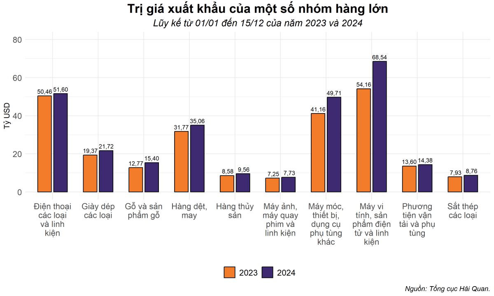
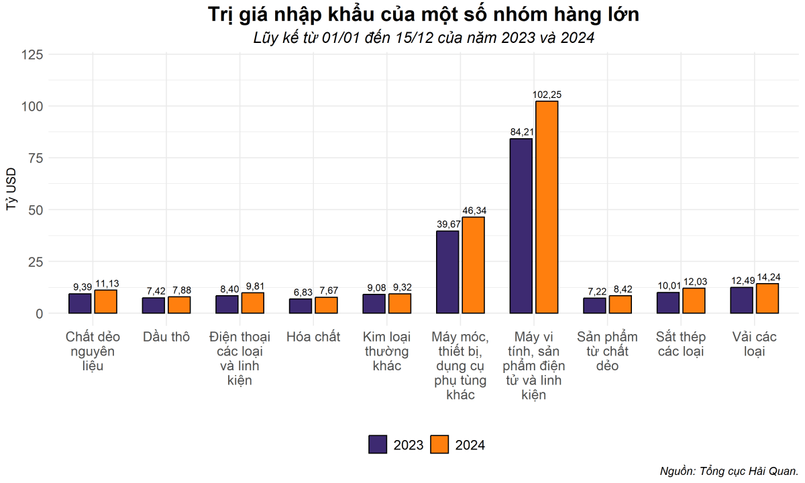
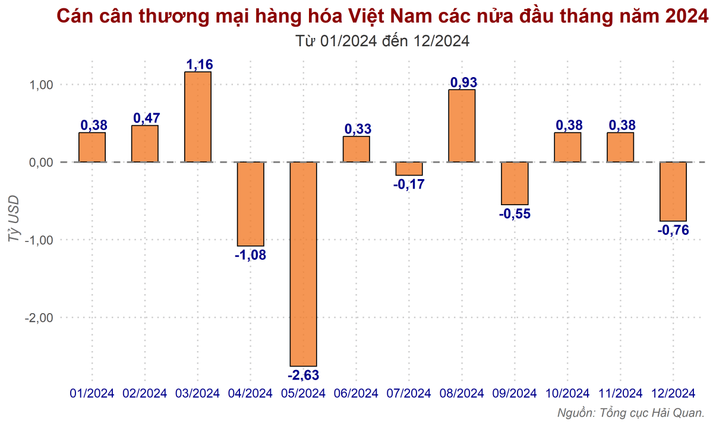
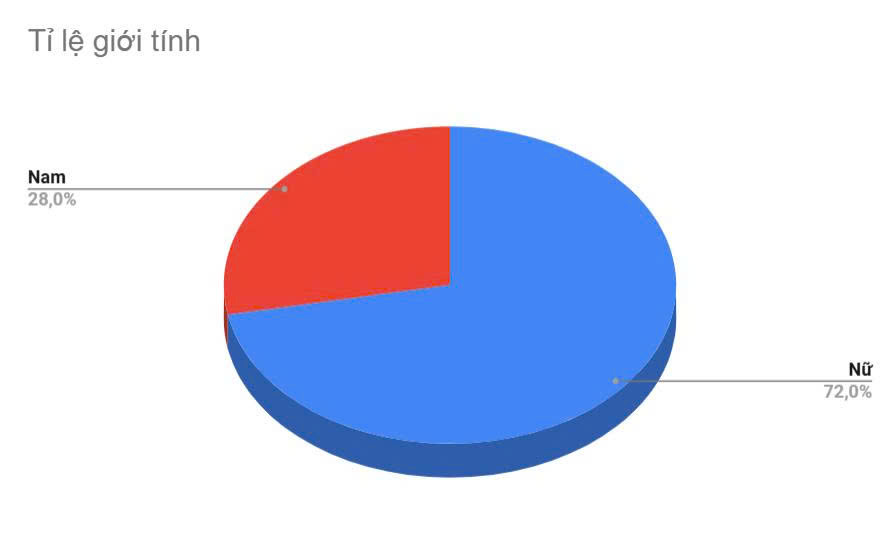
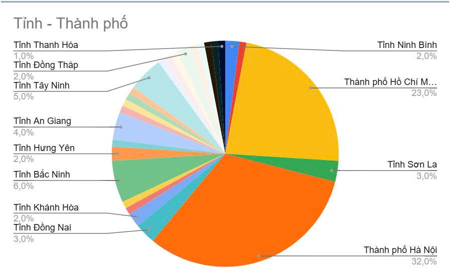
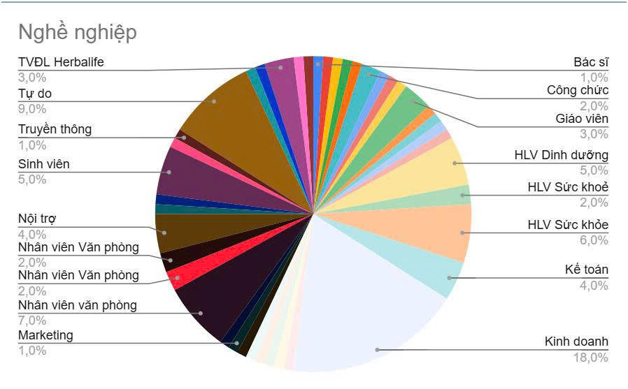

# 05 — Ví dụ chuẩn end-to-end

Hai document thật (lấy nguyên trạng từ báo, không chỉnh sửa số liệu), gán nhãn đầy đủ theo đúng taxonomy ở [docs/02](02-dataset-design.md) — dùng để annotator hiểu cụ thể dự án muốn gì trước khi bắt đầu, không phải tài liệu tham chiếu suy luận trừu tượng.

## Cách đọc file này

- Mỗi document trình bày: nguồn, `body_text` với placeholder `[CHART N]` đúng vị trí (y hệt format sẽ nhập vào công cụ), ảnh chart thật.
- Sau đó là các câu hỏi ví dụ — mỗi câu có khối thông tin đúng field của công cụ (`question_type`, `hop_type`, `answer`, `evidence`...) kèm dòng **Vì sao** giải thích lý do gán nhãn, đặc biệt ở `hop_type` (chiều dễ gán sai nhất).
- **Không phủ hết 28 tổ hợp** (7 `question_type` × 4 `hop_type`) — mỗi document chỉ có 7-8 câu đại diện, đủ để thấy cách áp dụng, không phải checklist bắt buộc.
- 2 document này **không có** chart loại `combo`/`subplot` (chỉ tình cờ 2 bài chọn đều dùng bar/pie đơn) — xem [docs/02 §Phạm vi](02-dataset-design.md#phạm-vi) cho định nghĩa 2 loại đó.

---

## Document 1 — Kinh tế: Xuất nhập khẩu

```
title: "Nửa đầu tháng 12/2024: Xu hướng nào đang định hình thị trường xuất nhập khẩu?"
source:
  provider: "Người quan sát (nguoiquansat.vn)"
  domain: "economics"
  url: "https://nguoiquansat.vn/nua-dau-thang-12-2024-xu-huong-nao-dang-dinh-hinh-thi-truong-xuat-nhap-khau-186771.html"
  accessed_date: "2026-07-15"
```

### body_text (nguyên văn, đã chèn placeholder)

> Dữ liệu từ Tổng cục Hải quan Việt Nam cho thấy những chuyển động phức tạp và đáng chú ý trong hoạt động xuất nhập khẩu hàng hóa.
>
> Trong nửa đầu tháng 12/2024, tổng kim ngạch xuất nhập khẩu đạt 31,48 tỷ USD, giảm 3,5% so với nửa cuối tháng 11/2024. Đây là mức giảm tương đối lớn, tương ứng giảm 1,16 tỷ USD.
>
> Dù vậy, tính từ đầu năm đến ngày 15/12/2024, tổng kim ngạch đã tăng 14,7% so với cùng kỳ năm trước, đạt mức 747,13 tỷ USD. Trong đó, doanh nghiệp có vốn đầu tư trực tiếp nước ngoài (FDI) đóng góp 504,43 tỷ USD, chiếm 67,5% tổng kim ngạch, tăng 13% so với năm trước.
>
> Những con số này phản ánh sự bền vững của nền kinh tế mở, nhưng cũng chỉ ra các điểm yếu cần khắc phục trong ngắn hạn.
>
> Ở khía cạnh xuất khẩu, tổng trị giá đạt 15,36 tỷ USD trong kỳ 1 tháng 12/2024, giảm 9,1% so với kỳ 2 tháng 11/2024, tương đương giảm 1,54 tỷ USD.
>
> Trong đó, nhiều nhóm hàng chủ lực sụt giảm mạnh. Máy móc thiết bị dụng cụ và phụ tùng giảm 19,8%, tương ứng 469 triệu USD. Điện thoại và linh kiện giảm 14,9%, tương ứng 238 triệu USD. Hàng dệt may, một ngành thế mạnh của Việt Nam, cũng giảm 12,4%, tương ứng 198 triệu USD. Nguyên nhân chính đến từ sự sụt giảm nhu cầu ở các thị trường lớn như Hoa Kỳ và EU, kết hợp với áp lực cạnh tranh từ các nước khác trong khu vực. 
> 
> **[CHART 1]**
>
> Dù vậy, xét về dài hạn, xuất khẩu vẫn duy trì tăng trưởng tích cực. Tổng kim ngạch xuất khẩu từ đầu năm đến ngày 15/12/2024 đạt 385,35 tỷ USD, tăng 13,9% so với cùng kỳ năm 2023. Một số ngành ghi nhận mức tăng trưởng ấn tượng. Máy vi tính và linh kiện tăng 26,6%, tương ứng tăng 14,38 tỷ USD. Máy móc thiết bị dụng cụ và phụ tùng tăng 20,8%, tương ứng tăng 8,54 tỷ USD. Hàng dệt may cũng tăng trưởng ổn định với mức tăng 10,4%, tương ứng tăng 3,29 tỷ USD. Đây là minh chứng cho thấy nỗ lực đa dạng hóa thị trường và cải tiến công nghệ của doanh nghiệp Việt Nam trong thời gian qua.
>
> Ở chiều ngược lại, nhập khẩu trong kỳ 1 tháng 12/2024 đạt 16,12 tỷ USD, tăng nhẹ 2,4%, tương ứng tăng 385 triệu USD. Một số nhóm hàng ghi nhận mức tăng đáng chú ý, như than các loại tăng 68,4%, tương ứng 105 triệu USD, và máy vi tính cùng linh kiện tăng 1,5%, tương ứng 65 triệu USD. Tính từ đầu năm đến ngày 15/12/2024, kim ngạch nhập khẩu đạt 361,78 tỷ USD, tăng 15,7% so với cùng kỳ năm trước. Đáng chú ý, các nhóm hàng phục vụ sản xuất công nghiệp như máy vi tính và linh kiện tăng 21,4%, tương ứng tăng 18,05 tỷ USD. Máy móc thiết bị dụng cụ và phụ tùng tăng 16,8%, tương ứng tăng 6,67 tỷ USD. Điều này phản ánh sự phục hồi mạnh mẽ trong nhu cầu sản xuất và đầu tư. 
> 
> **[CHART 2]**
>
> Tuy nhiên, cán cân thương mại lại ghi nhận mức thâm hụt 760 triệu USD trong kỳ 1 tháng 12/2024. Đây là kết quả của việc nhập khẩu tăng trong khi xuất khẩu giảm. Tuy vậy, tính từ đầu năm đến giữa tháng 12, Việt Nam vẫn duy trì thặng dư 23,57 tỷ USD, cho thấy năng lực cạnh tranh quốc tế vẫn được đảm bảo. Các dữ liệu thâm hụt và thặng dư hàng tháng cũng phản ánh sự biến động lớn của dòng thương mại, với mức thặng dư cao nhất đạt 1,16 tỷ USD vào tháng 6, trong khi tháng 5 ghi nhận thâm hụt kỷ lục 2,63 tỷ USD. 
> 
> **[CHART 3]**
>
> Các xu hướng này chịu tác động từ nhiều yếu tố quốc tế, bao gồm sự thay đổi của tỷ giá hối đoái, chi phí vận tải toàn cầu và giá năng lượng. Việc giá nguyên liệu thô, đặc biệt là than và sắt thép, tăng cao có thể ảnh hưởng đến chi phí sản xuất, trong khi các rào cản thương mại phi thuế quan ở các thị trường nhập khẩu lớn như Hoa Kỳ và EU tiếp tục là thách thức lớn.
>
> Triển vọng thị trường xuất nhập khẩu của Việt Nam sẽ phụ thuộc nhiều vào chiến lược tận dụng các hiệp định thương mại tự do (FTAs), mở rộng thị trường xuất khẩu và thúc đẩy sản xuất nội địa. Chính phủ cần duy trì các chính sách hỗ trợ, như cải cách thủ tục hành chính, đầu tư vào cơ sở hạ tầng logistics, và nâng cao chất lượng nguồn nhân lực. Những biện pháp này sẽ giúp doanh nghiệp trong nước tăng cường khả năng cạnh tranh, đồng thời giảm thiểu rủi ro từ sự phụ thuộc vào khối FDI.

*(Bỏ dòng tên tác giả cuối bài — không thuộc `body_text`, giống quy ước tại intake.)*

### Chart

**fig1 — `chart_type: combo`** (grouped bar, 2 cột/nhóm hàng = so sánh 2023 vs 2024, vẫn tính "đơn" theo [docs/02](02-dataset-design.md#phạm-vi))



**fig2 — `chart_type: combo`**



**fig3 — `chart_type: bar`**



### Câu hỏi ví dụ

**1. `data_retrieval` / `hop_type: chart`**

```
question: "Theo biểu đồ, trị giá xuất khẩu nhóm hàng Máy vi tính, sản phẩm điện tử và linh kiện lũy kế đến 15/12/2024 là bao nhiêu?"
answer: "68,54 tỷ USD"
answer_type: numeric
evidence: [{ hop: 1, source: chart, chart_id: fig1,
  description: "1. Tìm cột \"Máy vi tính, sản phẩm điện tử và linh kiện\". 2. Đọc giá trị cột 2024 (tím)." }]
```

Vì sao `chart`: bỏ hết body_text, câu hỏi vẫn trả lời đủ từ fig1 — số liệu không xuất hiện trong text (text chỉ nói *tăng 26,6%, tương ứng tăng 14,38 tỷ USD*, không nói giá trị tuyệt đối 2024).

**2. `visual` / `hop_type: chart`**

```
question: "Trong biểu đồ xuất khẩu, nhóm hàng nào có cột năm 2024 (màu tím) cao nhất?"
answer: "Máy vi tính, sản phẩm điện tử và linh kiện"
answer_type: text
evidence: [{ hop: 1, source: chart, chart_id: fig1,
  description: "1. So sánh chiều cao các cột màu tím (2024) giữa 10 nhóm hàng. 2. Xác định cột cao nhất (68,54)." }]
```

Vì sao `visual`: phải tham chiếu thuộc tính thị giác (màu, chiều cao) để xác định đối tượng — không phải đọc trực tiếp 1 giá trị đã biết trục.

**3. `compositional` / `hop_type: charts`**

```
question: "Nhóm hàng Máy móc thiết bị dụng cụ và phụ tùng khác, trị giá xuất khẩu năm 2024 (lũy kế đến 15/12) cao hơn trị giá nhập khẩu cùng nhóm bao nhiêu tỷ USD?"
answer: "3.37"
answer_type: numeric
derivation: "49.71 - 46.34"
evidence: [
  { hop: 1, source: chart, chart_id: fig1, description: "1. Tìm cột \"Máy móc thiết bị dụng cụ và phụ tùng khác\". 2. Đọc giá trị cột 2024 (tím) = 49,71." },
  { hop: 2, source: chart, chart_id: fig2, description: "1. Tìm cột \"Máy móc thiết bị dụng cụ và phụ tùng khác\". 2. Đọc giá trị cột 2024 (cam) = 46,34." }
]
```

Vì sao `charts` (không phải `chart`): cần đối chiếu **2 chart khác nhau** (fig1 xuất khẩu + fig2 nhập khẩu) cho cùng 1 nhóm hàng — thiếu 1 trong 2 là không tính được chênh lệch. body_text không nêu 2 số 2024 để so sánh trực tiếp.

**4. `visual_compositional` / `hop_type: chart`**

```
question: "Trong biểu đồ nhập khẩu, chênh lệch giữa nhóm hàng có cột 2024 (màu cam) cao nhất và nhóm có cột 2024 thấp nhất là bao nhiêu tỷ USD?"
answer: "94.37"
answer_type: numeric
derivation: "102.25 - 7.88"
evidence: [{ hop: 1, source: chart, chart_id: fig2,
  description: "1. So sánh chiều cao 10 cột màu cam (2024). 2. Cao nhất: Máy vi tính, sản phẩm điện tử và linh kiện = 102,25. 3. Thấp nhất: Dầu thô = 7,88. 4. Tính chênh lệch." }]
```

Vì sao `visual_compositional`: xác định 2 đối tượng bằng đặc điểm thị giác (cột cao nhất/thấp nhất theo màu) *trước*, rồi mới tính toán — đúng 2 bước của loại này.

**5. `multiple_choice` / `hop_type: text`**

```
question: "Theo bài viết, tổng kim ngạch xuất nhập khẩu từ đầu năm đến 15/12/2024 so với cùng kỳ năm trước tăng bao nhiêu %?"
choices: ["9,1%", "13,9%", "14,7%", "15,7%"]
answer: "14,7%"
answer_type: text
evidence: [{ hop: 1, source: text,
  quote: "tính từ đầu năm đến ngày 15/12/2024, tổng kim ngạch đã tăng 14,7% so với cùng kỳ năm trước" }]
```

Vì sao `text`: số liệu chỉ nêu trong body_text, không chart nào vẽ con số tăng-trưởng-tổng-kim-ngạch này. Bài viết có tới 4 số %/tăng-trưởng gần nhau (9,1% giảm xuất khẩu kỳ 1; 13,9% xuất khẩu luỹ kế; 14,7% tổng kim ngạch; 15,7% nhập khẩu luỹ kế) — 4 lựa chọn dùng chính các số dễ nhầm này để bài trắc nghiệm "gần đúng" đúng chuẩn (không phải 3 lựa chọn bịa ngẫu nhiên).

**6. `fact_check` / `hop_type: text_and_chart`**

```
question: "Đúng hay sai: mức thâm hụt thương mại 760 triệu USD trong kỳ 1 tháng 12/2024 mà bài viết đề cập khớp với giá trị thể hiện trên biểu đồ cán cân thương mại cho tháng 12/2024?"
answer: "Đúng"
answer_type: boolean
evidence: [
  { hop: 1, source: text, quote: "cán cân thương mại lại ghi nhận mức thâm hụt 760 triệu USD trong kỳ 1 tháng 12/2024" },
  { hop: 2, source: chart, chart_id: fig3, description: "1. Tìm cột tháng 12/2024. 2. Đọc giá trị = -0,76 (tỷ USD) = -760 triệu USD, khớp với số liệu trong text." }
]
```

Vì sao `text_and_chart`: bỏ chart thì không biết con số trên biểu đồ có thật sự khớp không (không tự kiểm chứng được); bỏ text thì không biết cần kiểm tra tháng nào/con số nào. Cả 2 bước đều cần thiết để trả lời đầy đủ.

**7. `unanswerable`**

```
question: "Chi phí vận tải toàn cầu trong giai đoạn này đã tăng cụ thể bao nhiêu phần trăm?"
answer: "unanswerable"
answer_type: unanswerable
evidence: [{ hop: 1, source: text,
  quote: "Các xu hướng này chịu tác động từ nhiều yếu tố quốc tế, bao gồm sự thay đổi của tỷ giá hối đoái, chi phí vận tải toàn cầu và giá năng lượng." }]
```

Vì sao `unanswerable`: bài viết chỉ liệt kê "chi phí vận tải toàn cầu" là 1 yếu tố ảnh hưởng, không đưa ra con số % cụ thể nào — không chart nào vẽ dữ liệu này. `evidence` ở đây trỏ tới đoạn gần nhất liên quan để chứng minh annotator đã tìm và xác nhận không có số liệu, không phải "chứng cứ trả lời".

**8. [Bonus] `compositional` / `hop_type: text`** — minh hoạ multi-hop vẫn có thể **toàn text**, không nhất thiết phải đụng chart

```
question: "Theo bài viết, doanh nghiệp FDI đóng góp 504,43 tỷ USD trong tổng kim ngạch xuất nhập khẩu 747,13 tỷ USD (lũy kế đến 15/12/2024). Phần đóng góp của khối doanh nghiệp trong nước là bao nhiêu tỷ USD?"
answer: "242.70"
answer_type: numeric
derivation: "747.13 - 504.43"
evidence: [
  { hop: 1, source: text, quote: "doanh nghiệp có vốn đầu tư trực tiếp nước ngoài (FDI) đóng góp 504,43 tỷ USD" },
  { hop: 2, source: text, quote: "đạt mức 747,13 tỷ USD" }
]
```

Vì sao vẫn là `text` (không phải `text_and_chart`): cả 2 hop đều nguồn `text`, không đụng tới chart nào — `hop_type` phân theo **nguồn cần đọc**, không phải theo "có compositional/multi-hop hay không". `text` vẫn có thể multi-hop nội bộ (nhiều quote khác nhau).

### ⚠️ Lưu ý rút ra từ document thật này

Bài viết tự mâu thuẫn với chính chart nó đính kèm: text viết *"mức thặng dư cao nhất đạt 1,16 tỷ USD vào **tháng 6**"*, nhưng fig3 cho thấy **tháng 3/2024** mới là +1,16 (tháng 6 chỉ +0,33). Đây là lỗi thật của bài báo gốc, không phải lỗi trích dẫn. Bài học: khi soạn evidence cho `chart`, luôn đọc trực tiếp trên ảnh — **không suy ra từ những gì text mô tả về chart**, vì 2 nguồn có thể lệch nhau như ở đây.

---

## Document 2 — Sức khỏe: Cuộc thi "TÔI KHỎE ĐẸP HƠN" Lần 4

```
title: "Con số ấn tượng: Hàng chục nghìn người Việt hưởng ứng Cuộc thi 'TÔI KHỎE ĐẸP HƠN' Lần 4"
source:
  provider: "Sức khỏe & Đời sống (suckhoedoisong.vn)"
  domain: "health"
  url: "https://suckhoedoisong.vn/con-so-an-tuong-hang-chuc-nghin-nguoi-viet-huong-ung-cuoc-thi-toi-khoe-dep-hon-lan-4-169251022134752228.htm"
  accessed_date: "2026-07-15"
```

### body_text (nguyên văn, đã chèn placeholder)

> Sự thành công của Cuộc thi "TÔI KHỎE ĐẸP HƠN" Lần 4 không chỉ được đo bằng những kết quả thay đổi vóc dáng mà còn được khẳng định qua những con số thống kê ấn tượng về đối tượng tham gia. Các biểu đồ đã vẽ nên một bức tranh đa chiều, phản ánh khát khao cải thiện sức khỏe lan tỏa sâu rộng trong mọi mặt đời sống xã hội Việt Nam.
>
> Nhìn vào tỉ lệ giới tính, phụ nữ đã khẳng định vai trò là "người tiên phong" với tỉ lệ áp đảo: Nữ giới chiếm 72,0%, trong khi Nam giới chiếm 28,0%. Điều này cho thấy phụ nữ Việt Nam ngày càng chủ động và ý thức cao trong việc tìm kiếm giải pháp khoa học, cân bằng giữa trách nhiệm gia đình, công việc và chăm sóc bản thân. Họ không chỉ thay đổi cho riêng mình mà còn là nguồn cảm hứng và động lực lớn nhất để lan tỏa lối sống khỏe mạnh đến toàn bộ gia đình. **[CHART 1]**
>
> Sức nóng của phong trào không chỉ dừng lại ở giới tính mà còn lan tỏa mạnh mẽ trên bản đồ địa lý. Thành phố Hà Nội (32,0%) và Thành phố Hồ Chí Minh (23,0%) tiếp tục là hai trung tâm lớn nhất, thể hiện nhu cầu chăm sóc sức khỏe cấp thiết tại các đô thị lớn, nơi áp lực cuộc sống cao.
>
> Tuy nhiên, sự hưởng ứng tích cực còn trải đều khắp các khu vực từ các tỉnh công nghiệp như Bắc Ninh (6,0%) và Đồng Nai (3,0%) cho đến các tỉnh miền Tây như Tây Ninh (5,0%) và Đồng Tháp (2,0%), hay miền núi phía Bắc như Sơn La (3,0%). Điều này chứng minh Cuộc thi đã thực sự kết nối, tạo nên một cộng đồng sức khỏe không khoảng cách trên quy mô toàn quốc. **[CHART 2]**
>
> Sự đa dạng còn được thể hiện rõ nét qua cơ cấu nghề nghiệp. Đây là minh chứng cho thấy mong muốn khỏe đẹp là nhu cầu chung của mọi ngành nghề, mọi tầng lớp xã hội.
>
> Đáng chú ý, nhóm làm Kinh doanh (18,0%) và Lao động Tự do (9,0%) chiếm tỉ lệ lớn nhất. Đây là những nhóm thường xuyên phải đối mặt với giờ giấc thất thường và áp lực hiệu suất cao, phản ánh một thực tế: Sức khỏe chính là nền tảng quan trọng nhất để duy trì sự nghiệp và chất lượng cuộc sống.
>
> Bên cạnh đó, các nhóm Nhân viên Văn phòng (tổng cộng 11,0%), kế toán (4,0%), và nội trợ (4,0%) cũng tham gia tích cực. Sự hiện diện của các Huấn luyện viên Sức khỏe (6,0%) và Huấn luyện viên Dinh dưỡng (5,0%) càng khẳng định tính chuyên môn và uy tín của sân chơi, thu hút cả những người trong ngành cùng tham gia và chia sẻ kiến thức. **[CHART 3]**
>
> Sự kết hợp đa dạng này không chỉ làm phong phú thêm nội dung các câu chuyện thay đổi, mà còn tạo điều kiện để các ứng viên học hỏi kinh nghiệm lẫn nhau, từ cách một doanh nhân cân bằng dinh dưỡng khi đi công tác, đến cách một bà nội trợ sắp xếp thời gian luyện tập.
>
> Một trong những yếu tố làm nên sự thành công và hứa hẹn bùng nổ của Cuộc thi năm nay chính là tinh thần hỗ trợ lẫn nhau của các ứng viên. Các số liệu thống kê đã thúc đẩy các ứng viên, dù ở các tỉnh thành hay nghề nghiệp khác nhau, cùng nhau tạo thành các hội nhóm, câu lạc bộ.
>
> Trong các hội nhóm này, họ không chỉ chia sẻ kinh nghiệm về chế độ dinh dưỡng khoa học, bài tập luyện hợp lý, mà còn cùng nhau cổ vũ, giữ vững tinh thần tích cực khi đối mặt với những khó khăn trên hành trình thay đổi. Việc có một cộng đồng hỗ trợ đã giúp các ứng viên duy trì kỷ luật tốt hơn và đạt được những kết quả ấn tượng ngay từ Vòng 1.
>
> Chính sự bùng nổ về số lượng và chất lượng, cùng với tinh thần đoàn kết của các hội nhóm, đã đưa Cuộc thi "TÔI KHỎE ĐẸP HƠN" Lần 4 vượt qua khỏi khuôn khổ một sự kiện để trở thành một phong trào thay đổi lối sống toàn diện, hứa hẹn sẽ lan tỏa mạnh mẽ hơn nữa khi TOP 100 chính thức bước vào Vòng 2 đầy thách thức và cam go.
>
> Độc giả quan tâm có thể tiếp tục theo dõi thông tin chi tiết về Cuộc thi và các ứng viên trên Báo Sức khỏe & Đời sống và các kênh truyền thông chính thức của Cuộc thi.

*(Bài gốc có 1 ảnh thứ 4 — ảnh nhóm chụp sự kiện — không đưa vào `charts[]` vì không phải ảnh biểu đồ dữ liệu, giống quy tắc "không nhận... ảnh minh hoạ" ở [docs/02 §Phạm vi](02-dataset-design.md#phạm-vi).)*

### Chart

**fig1 — `chart_type: pie`**



**fig2 — `chart_type: pie`**



**fig3 — `chart_type: pie`**



### Câu hỏi ví dụ

**1. `data_retrieval` / `hop_type: chart`**

```
question: "Theo biểu đồ, tỉ lệ nữ giới tham gia Cuộc thi là bao nhiêu phần trăm?"
answer: "72,0%"
answer_type: numeric
evidence: [{ hop: 1, source: chart, chart_id: fig1,
  description: "1. Tìm lát cắt \"Nữ\" (màu xanh dương). 2. Đọc tỉ lệ ghi trên lát cắt." }]
```

Vì sao `chart` (không phải `text`, dù số liệu 72,0% cũng có trong body_text): câu hỏi ghi rõ "theo biểu đồ" — khi 1 số liệu xuất hiện ở cả 2 nguồn, ưu tiên gán theo nguồn được hỏi tới tường minh trong câu hỏi; nếu câu hỏi không chỉ rõ, mặc định ưu tiên `chart` vì đây là dataset chart-QA.

**2. `visual` / `hop_type: chart`**

```
question: "Trong biểu đồ Tỉnh - Thành phố, lát cắt màu cam lớn nhất tương ứng với tỉnh/thành nào?"
answer: "Thành phố Hà Nội"
answer_type: text
evidence: [{ hop: 1, source: chart, chart_id: fig2,
  description: "1. Tìm lát cắt màu cam lớn nhất trong biểu đồ tròn. 2. Đọc nhãn: \"Thành phố Hà Nội — 32,0%\"." }]
```

**3. `compositional` / `hop_type: chart`**

```
question: "Theo biểu đồ, tổng tỉ lệ ứng viên đến từ Hà Nội và TP. Hồ Chí Minh là bao nhiêu phần trăm?"
answer: "55"
answer_type: numeric
derivation: "32 + 23"
evidence: [{ hop: 1, source: chart, chart_id: fig2,
  description: "1. Đọc tỉ lệ lát \"Thành phố Hà Nội\" = 32,0%. 2. Đọc tỉ lệ lát \"Thành phố Hồ Chí M...\" (TP.HCM) = 23,0%. 3. Cộng 2 giá trị." }]
```

**4. `visual_compositional` / `hop_type: chart`**

```
question: "Trong biểu đồ nghề nghiệp, nhóm có tỉ lệ cao nhất hơn nhóm Lao động Tự do bao nhiêu điểm phần trăm?"
answer: "9"
answer_type: numeric
derivation: "18 - 9"
evidence: [{ hop: 1, source: chart, chart_id: fig3,
  description: "1. Tìm lát cắt lớn nhất trong biểu đồ tròn: \"Kinh doanh\" = 18,0%. 2. Tìm lát \"Tự do\" = 9,0%. 3. Tính chênh lệch." }]
```

**5. `multiple_choice` / `hop_type: text`**

```
question: "Theo bài viết, tỉ lệ nam giới tham gia Cuộc thi là bao nhiêu?"
choices: ["18,0%", "23,0%", "28,0%", "32,0%"]
answer: "28,0%"
answer_type: text
evidence: [{ hop: 1, source: text, quote: "Nam giới chiếm 28,0%" }]
```

Vì sao `text`: câu hỏi ghi rõ "theo bài viết" — ưu tiên nguồn text dù số liệu cũng có trên fig1. 3 lựa chọn nhiễu (18%, 23%, 32%) đều là tỉ lệ thật của các nhóm khác trong cùng document (Kinh doanh, TP.HCM, Hà Nội) — nhiễu "gần đúng" thay vì số bịa ngẫu nhiên.

**6. `fact_check` / `hop_type: charts`**

```
question: "Đúng hay sai: tỉ lệ ứng viên đến từ Hà Nội (biểu đồ Tỉnh-Thành phố) cao hơn tổng tỉ lệ nhóm Kinh doanh và Lao động Tự do cộng lại (biểu đồ Nghề nghiệp)?"
answer: "Đúng"
answer_type: boolean
evidence: [
  { hop: 1, source: chart, chart_id: fig2, description: "1. Tìm lát \"Thành phố Hà Nội\". 2. Đọc tỉ lệ = 32,0%." },
  { hop: 2, source: chart, chart_id: fig3, description: "1. Tìm lát \"Kinh doanh\" (18,0%) và \"Tự do\" (9,0%). 2. Cộng = 27,0%. 3. So sánh: 32,0% > 27,0%." }
]
```

Vì sao `charts`: 2 lát cắt cần so sánh nằm ở **2 chart khác nhau** (fig2 và fig3) — không phải text+chart, không phải 1 chart duy nhất.

**7. `unanswerable`**

```
question: "Độ tuổi trung bình của các ứng viên tham gia Cuộc thi Lần 4 là bao nhiêu?"
answer: "unanswerable"
answer_type: unanswerable
evidence: [{ hop: 1, source: text,
  quote: "những con số thống kê ấn tượng về đối tượng tham gia" }]
```

Vì sao `unanswerable`: cả 3 chart (giới tính, tỉnh/thành, nghề nghiệp) lẫn body_text đều không đề cập độ tuổi ứng viên dưới bất kỳ hình thức nào.

### Nhận xét thêm về document này

Không có ví dụ `text_and_chart` cho document này — **cố tình**, không phải thiếu sót. Mọi số liệu trong text đều trùng khớp 1:1 với số trên chart tương ứng (không có claim nào trong text mà chart không tự thể hiện được, và ngược lại), nên ép ra 1 câu multi-hop text+chart sẽ chỉ là gượng ép (xem cảnh báo ❌ ở [docs/03](03-annotation-guidelines.md#hop-type-phạm-vi-bằng-chứng-mới)). Không phải document nào cũng cần đủ 4 loại hop_type.

---

## Tổng kết 2 bài học chính rút ra khi làm ví dụ này

1. **"Xuất hiện ở cả text lẫn chart" không phải lỗi, nhưng cần chọn 1 `hop_type`** — ưu tiên theo cách câu hỏi diễn đạt ("theo biểu đồ" → `chart`, "theo bài viết" → `text`); nếu câu hỏi không chỉ rõ nguồn, mặc định `chart` vì đây là dataset chart-QA.
2. **Không suy ra evidence từ lời văn mô tả chart — luôn đọc trực tiếp trên ảnh.** Document 1 có 1 lỗi thật của bài báo gốc (text nói tháng 6, chart cho thấy tháng 3) — nếu chỉ tin lời văn, evidence sẽ sai dù câu hỏi "nghe hợp lý".
