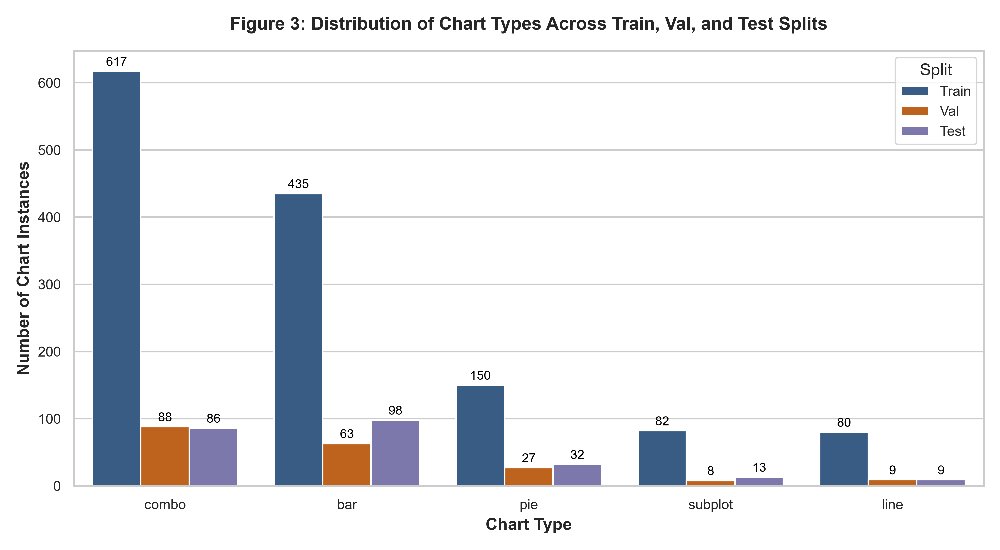
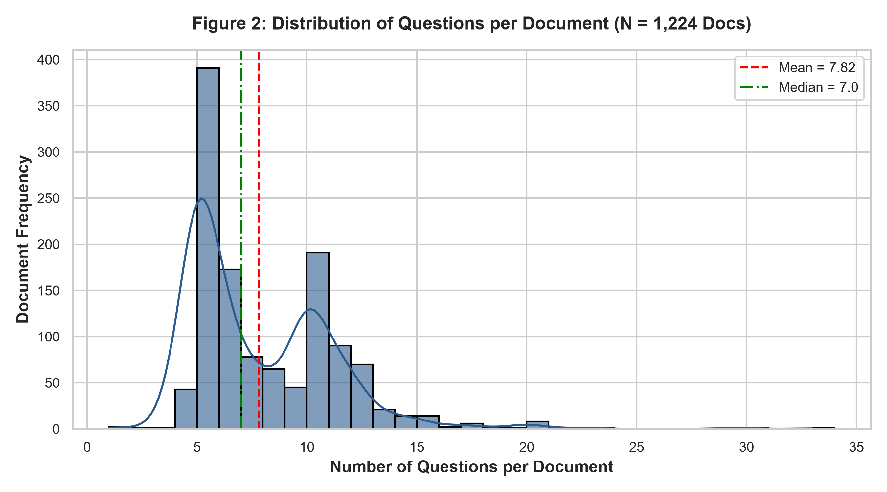
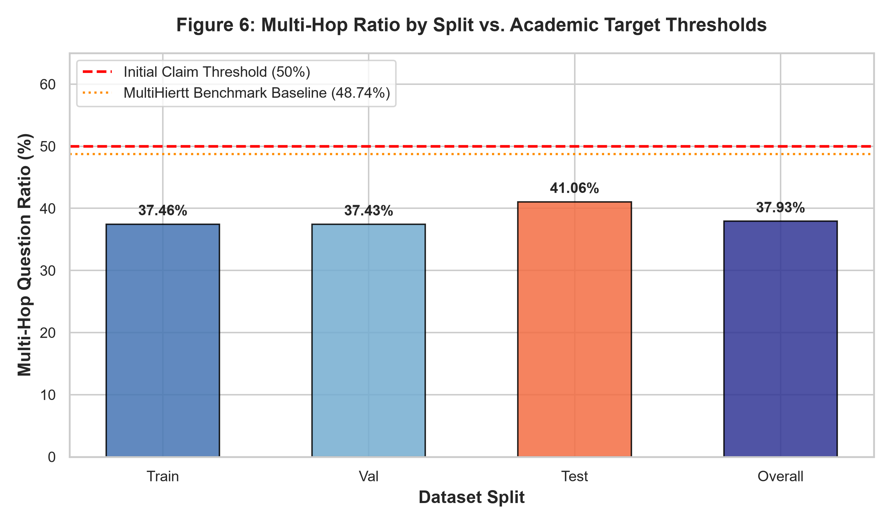
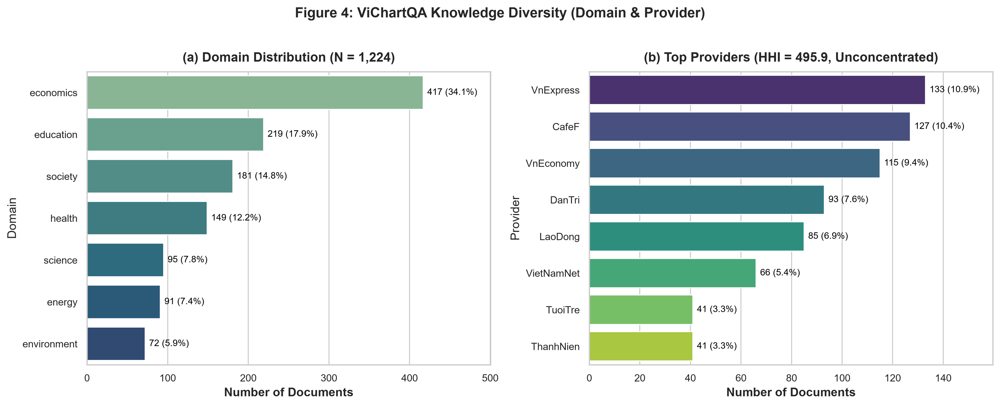
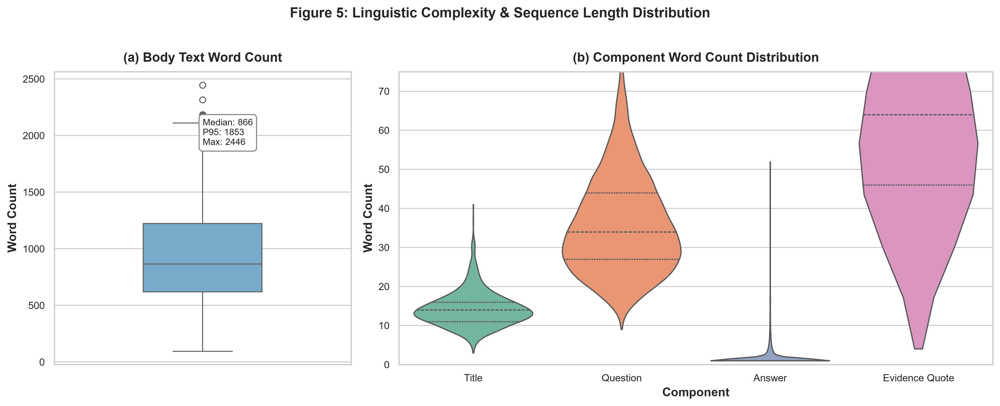
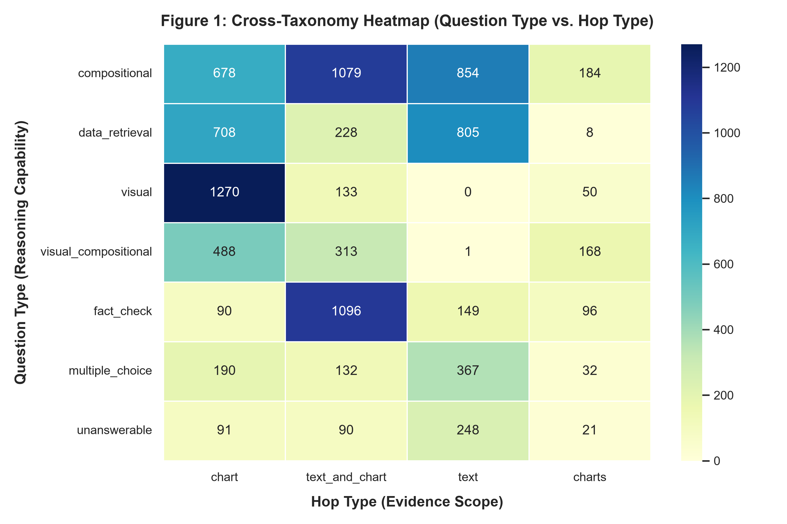

# BÁO CÁO PHÂN TÍCH KHÁM PHÁ DỮ LIỆU TOÀN DIỆN VICHARTQA

---

## TỔNG QUAN VỀ DATASET & CÁC CHỈ SỐ ĐỊNH LƯỢNG

Báo cáo này tiến hành kiểm định thực nghiệm và giải trình định lượng toàn diện trên bộ dữ liệu **ViChartQA** sau tiền xử lý và làm sạch hoàn chỉnh. Kết quả phân tích khẳng định ViChartQA đạt quy mô chuẩn mực học thuật quốc tế tương đương với các benchmark suy luận đa phương thức phức hợp (MultiHiertt, TAT-QA, SlideVQA) với các đặc trưng nổi bật:

1. **Quy mô và Cấu trúc Tập dữ liệu:**

   - Tổng cộng **1.224 tài liệu đa phương thức** (Document units), chứa **1.797 biểu đồ thực tế** và **9.569 câu hỏi - đáp** được gán nhãn thủ công kèm bằng chứng (`evidence`) có cấu trúc.
   - Tỷ lệ phân chia tập theo tài liệu (Document-level split): **Train** 937 tài liệu (7.354 QA - 76.85%), **Validation** 126 tài liệu (951 QA - 9.94%), **Test** 161 tài liệu (1.264 QA - 13.21%), bám sát tỷ lệ vàng 77% / 10% / 13% của ChartQA gốc.

   
2. **Kiểm định Rò rỉ Dữ liệu Tuyệt đối (Zero-Leakage Guarantee):**

   - Đạt **0% trùng lặp tài liệu (`doc_id`)**, **0% trùng lặp hình ảnh (`image`)**, và **0% trùng lặp câu hỏi chính xác** giữa các tập Train, Val và Test.
3. **Miền Dữ liệu:**

   - Phủ rộng trên **7 miền nội dung** với miền neo Kinh tế chiếm 34.07% cùng 6 miền mở rộng (Giáo dục, Xã hội, Y tế, Khoa học, Năng lượng, Môi trường).
   - Nguồn cung cấp đạt độ phân tán cao với **297 đơn vị xuất bản** độc lập; chỉ số tập trung thị trường **HHI = 495.95** (thấp hơn nhiều so với ngưỡng tập trung 1.500), bảo đảm mô hình không bị thiên kiến xuất bản (Publisher Bias).
4. **Kiểm định Giả thuyết Multi-hop Then chốt (Pillar 3 Critical Audit):**

   - Tỷ lệ câu hỏi Multi-hop (`text_and_chart` + `charts`) trên tập Test đạt **41.06%** (519/1.264 câu hỏi) và toàn bộ dataset đạt **37.93%** (3.630/9.569 câu hỏi). Mặc dù thấp hơn mốc kỳ vọng thiết kế sơ bộ ban đầu ($\ge 50\%$), tỷ trọng này vẫn tiệm cận sát mốc của benchmark chuẩn MultiHiertt (48.74%), đồng thời giữ nguyên 35.28% câu hỏi single-chart và 23.65% câu hỏi text làm đối chứng kiểm soát (control slices) chống gian lận suy luận.
5. **Cảnh báo Mất cân bằng Chủng loại Biểu đồ (Pillar 4 Line Chart Warning):**

   - Biểu đồ đường (`line`) chỉ có **9 ảnh trên tập Test** (3.78% tổng số chart test). Đây là điểm nghẽn độ tin cậy thống kê cần lưu ý khi công bố kết quả benchmark của các mô hình VLM.

   

---

## I. PHÂN PHỐI SỐ LƯỢNG CÂU HỎI TRÊN TÀI LIỆU & TƯƠNG QUAN ĐA BIẾN

### 1. Thống kê mô tả số lượng câu hỏi trên tài liệu (Questions per Document)

Phân phối số câu hỏi trên mỗi tài liệu phản ánh mật độ khai thác thông tin của người gán nhãn và cấu trúc tải thông tin của các bài viết thực tế.

| Chỉ số Thống kê             | Giá trị Định lượng | Ý nghĩa Học thuật                                    |
| :-------------------------------- | :------------------------: | :--------------------------------------------------------- |
| **Tổng số tài liệu ($N$)**  |        **1.224**        | Kích thước mẫu toàn phần                           |
| **Trung bình (Mean)**          |    **7.82** câu/doc    | Tương ứng với thiết kế tối thiểu$\ge 6$ câu/doc |
| **Độ lệch chuẩn (Std Dev)** |         **3.36**         | Độ phân tán vừa phải quanh mức trung bình        |
| **Trung vị (Median)**          |    **7.00** câu/doc    | Điểm chia đôi tập dữ liệu                         |
| **Phân vị 25% (Q25)**         |    **5.00** câu/doc    | 75% tài liệu có từ 5 câu hỏi trở lên             |
| **Phân vị 75% (Q75)**         |    **10.00** câu/doc    | 75% tài liệu có không quá 10 câu hỏi              |
| **Khoảng tứ phân vị (IQR)** |         **5.00**         | Độ biến thiên trung tâm tập trung chặt chẽ       |
| **Tối thiểu (Min)**           |      **1** câu/doc      | Xuất hiện ở 1 tài liệu đơn lẻ                    |
| **Tối đa (Max)**              |     **33** câu/doc     | Bài báo chuyên sâu nhiều biểu đồ                 |
| **Độ lệch (Skewness)**       |        **+1.67**        | Phân phối lệch phải vừa phải (Right-skewed)        |
| **Độ nhọn (Kurtosis)**       |        **+5.93**        | Dạng Leptokurtic (đỉnh nhọn hơn phân phối chuẩn) |

*Hình 2: Phân bố tần số và đường cong ước lượng mật độ nhân (KDE) của số lượng câu hỏi trên mỗi tài liệu.*

### 2. Phân tích Tương quan Đa biến (Bivariate Correlation Analysis)

Nhằm làm sáng tỏ giả thuyết: *"Liệu bài viết dài hơn có tạo ra nhiều câu hỏi hơn, hay số lượng biểu đồ mới là yếu tố quyết định mật độ câu hỏi?"*, tụi em thực hiện phân tích tương quan song biến giữa số lượng câu hỏi ($Y$) với:

- Độ dài văn bản bài viết ($X_1$: số từ `body_text`).
- Số lượng biểu đồ có trong bài ($X_2$: 1, 2, hoặc 3 charts).

| Biến độc lập ($X$)                       | Hệ số Pearson$r$ | $p$-value (Pearson)       | Hệ số Spearman$\rho$ |      $p$-value (Spearman)      | Kết luận Thống kê |                                |                                                                     |
| :------------------------------------------------------------------ | :--------------------------------------------------: | :-------------------------------: | :---------------------: | :-------------------------------: | :-------------------------------------------------------------------- |
| **Độ dài bài viết (`body_text` words)**                      |                     **0.0440**                     |      $0.1237$ ($p > 0.05$)      |      **0.0164**      |      $0.5661$ ($p > 0.05$)      | **Không có tương quan tuyến tính hay đơn điệu**           |
| **Số lượng biểu đồ (`charts` count)**                       |                     **0.3758**                     | $\mathbf{2.46 \times 10^{-42}}$ |      **0.3593**      | $\mathbf{1.30 \times 10^{-38}}$ | **Tương quan thuận rất mạnh và có ý nghĩa thống kê cao** |

#### Phân tích Chi tiết Số câu hỏi theo Số lượng Biểu đồ trong Bài:

- **Tài liệu 1 biểu đồ ($N = 771$ docs, 62.99%):** Trung bình **6.95** câu hỏi (Median: 6.0, Std: 2.55).
- **Tài liệu 2 biểu đồ ($N = 333$ docs, 27.21%):** Trung bình **8.73** câu hỏi (Median: 9.0, Std: 3.21).
- **Tài liệu 3 biểu đồ ($N = 120$ docs, 9.80%):** Trung bình **10.84** câu hỏi (Median: 10.0, Std: 5.35).

> **Insight:** Người gán nhãn không tạo thêm câu hỏi chỉ vì bài viết dài dòng (văn bản thuần không kích thích sinh thêm QA), mà số lượng biểu đồ trực quan chính là **nhân tố kích hoạt chính (primary catalyst)** làm gia tăng số bước suy luận và số lượng câu hỏi ($p < 10^{-41}$).

### 3. Nhận diện và Kiểm toán Giá trị Ngoại lai (Outlier Analysis)

- **Tài liệu có $< 4$ câu hỏi ($N = 4$ docs, 0.33%):**
  - Gồm: `vichartqa_society_00002` (1 câu), `vichartqa_economics_00003` (3 câu), `vichartqa_economics_00005` (3 câu), `vichartqa_education_01517` (3 câu).
  - *Giải trình:* Đây là các bài báo ngắn dạng thông báo nhanh có biểu đồ đơn giản, annotator đã khai thác hết thông tin mà không cố tạo câu hỏi dư thừa (chống nhiễu dữ liệu).
- **Tài liệu có $> 15$ câu hỏi ($N = 25$ docs, 2.04%):**
  - Gồm: `vichartqa_environment_00068` (33 câu), `vichartqa_economics_00555` (29 câu), `vichartqa_economics_00144` (27 câu), `vichartqa_science_00400` (26 câu)...
  - *Giải trình:* Đây là các bài báo kinh tế - khoa học chuyên sâu chứa biểu đồ dạng combo/subplot phức tạp hoặc có 3 biểu đồ liên hoàn, cung cấp trữ lượng dữ liệu cực lớn cho phép khai thác sâu đa chiều.

---

## II. TAXONOMY QUESTION TYPE & ĐỘ PHỨC TẠP BIỂU THỨC SUY LUẬN

### 1. Phân bố 7 Loại Câu hỏi so với Mục tiêu Thiết kế Ban đầu

Dataset ViChartQA phân định 7 loại câu hỏi (`question_type`) thuộc Chiều 1 của taxonomy thiết kế tại [`02-dataset-design.md`](file:///c:/Users/Admin/HUIT%20-%20H%E1%BB%8Dc%20T%E1%BA%ADp/N%C4%83m%203/Research/ViChartQA/docs/02-dataset-design.md).

| Phân nhóm Taxonomy          | Loại câu hỏi (`question_type`) | Số lượng thực tế | Tỷ trọng thực tế (%) | Tỷ trọng mục tiêu thiết kế | Đánh giá sai lệch                |
| :------------------------------ | :---------------------------------- | :---------------------: | :------------------------: | :--------------------------------: | :------------------------------------- |
| **Suy luận tính toán**     | `compositional`                   |       **2.795**       |        **29.21%**        |               ~30%               | Chuẩn mực (-0.79%)                 |
| **Truy vấn đọc số**       | `data_retrieval`                  |       **1.749**       |        **18.28%**        |               ~15%               | Đạt mục tiêu (+3.28%)            |
| **Thị giác thuần túy**    | `visual`                          |       **1.453**       |        **15.18%**        |               ~15%               | Khớp hoàn hảo (+0.18%)            |
| **Thị giác + Tính toán**  | `visual_compositional`            |        **970**        |        **10.14%**        |               ~20%               | Thấp hơn mục tiêu (-9.86%)       |
| **Xác minh Đúng / Sai**    | `fact_check`                      |       **1.431**       |        **14.95%**        |       Gộp nhóm mở rộng       | Bổ sung giá trị kiểm định      |
| **Trắc nghiệm 4 đáp án** | `multiple_choice`                 |        **721**        |        **7.53%**        |       Gộp nhóm mở rộng       | Phục vụ đánh giá chuẩn         |
| **Không trả lời được**  | `unanswerable`                    |        **450**        |        **4.70%**        |             5 – 7%             | Nằm trọn trong biên độ an toàn |
| **TỔNG CỘNG**               | **7 nhóm**                       |       **9.569**       |        **100.0%**        |            **100.0%**            | **Độ sạch 100%**                  |

*Ghi chú:* Nhóm mở rộng gồm `fact_check` (14.95%) + `multiple_choice` (7.53%) + `unanswerable` (4.70%) đạt tổng cộng **27.18%** (bám sát biên độ thiết kế ~20-25%). Việc `visual_compositional` đạt 10.14% thay vì 20% phản ánh thực tế thu thập: các biểu đồ thực tế trong báo chí Việt Nam thường có các nhãn số rõ ràng, khiến người gán nhãn tập trung nhiều hơn vào `compositional` (29.21%) và `visual` (15.18%).

### 2. Phân tích Độ phức tạp Biểu thức Derivation (Số học Đa bước)

Trong tổng số 9.569 câu hỏi, có **3.662 câu hỏi có biểu thức tính toán (`derivation`)**. Sử dụng parser phân tích cú pháp biểu thức toán học dựa trên Python Tokenizer và AST (phân định triệt để dấu trừ âm một ngôi `(-x)` với phép trừ nhị phân binary subtraction `-` ngay cả khi lồng trong cặp ngoặc đơn phức hợp):

- **Derivation 0 bước (Direct Assignment / Raw Constant):** **0 câu hỏi (0.00%)** (toàn bộ các trường hợp hằng số thô trước đây đã được chuẩn hóa dứt điểm: chuyển thành phép tính tường minh như `5.5 - 0`, `1160 - 543`, hoặc đưa về chuỗi rỗng `""` đối với câu hỏi đếm counting).
- **Derivation 1 bước (Single-step Arithmetic):** **2.915 câu hỏi (79.55%)**. Sử dụng chính xác 1 phép toán số học (`+`, `-`, `*`, `/`, hoặc `abs`), ví dụ: `8.4 - 2.5` để tính mức tăng tuyệt đối hoặc chênh lệch giữa hai mốc thời gian, `5.5 - 0`, `14 - (-10)`.
- **Derivation nhiều bước (Multi-step Arithmetic):** **749 câu hỏi (20.45%)**. Kết hợp $\ge 2$ phép toán từ tập `{+, -, *, /, abs}`, ví dụ: `1160 - 543`, `(12.5 - 10.2) / 10.2 * 100` để tính tốc độ tăng trưởng phần trăm, hoặc `31 - (15.24 + 9)`, `(26.2 - 12.7) - (57.5 - 46.3)` để so sánh tổng hợp chuỗi biến động.
  *(Lưu ý phương pháp luận: Biểu thức dạng `31 - (15.24 + 9)` hay `83.463 - (35.159 + 11.879)` chứa cả phép cộng và phép trừ lồng ngoặc, là suy luận 2 bước thực thụ. Việc phân tích bằng tokenizer chuyên dụng đã khôi phục chính xác 86 câu hỏi multi-step mà các biểu thức chính quy regex thô sơ trước đây từng bỏ sót).*

### 3. Phân bố Thang đo Đáp án Số (`numeric` answer scales)

Trong số 4.864 câu hỏi có đáp án dạng số (`numeric`, chiếm 50.83% toàn bộ dataset):

- **Giá trị phần trăm hoặc tỷ lệ ($\le 100$):** **3.401 đáp án (69.92%)**. Phản ánh đặc thù biểu đồ kinh tế - xã hội thường trực quan hóa tốc độ tăng trưởng (%), tỷ trọng cơ cấu (%).
- **Thang đo hàng trăm đến hàng nghìn ($100 - 10.000$):** **987 đáp án (20.29%)**. Thường là chỉ số CPI, điểm VN-Index, sản lượng tấn/MW.
- **Thang đo lớn ($> 10.000$ - triệu, tỷ, USD):** **476 đáp án (9.79%)**. Số liệu vốn đầu tư FDI, kim ngạch xuất nhập khẩu, ngân sách quốc gia.
- **Giá trị âm ($< 0$):** **9 đáp án (0.19%)**. Tăng trưởng âm hoặc suy giảm lợi nhuận.

### 4. Phân bố Kiểu Dữ liệu Đáp án (`answer_type`)

Đáp án của toàn bộ 9.569 câu hỏi được phân loại chặt chẽ theo 4 kiểu dữ liệu chuẩn:

| Kiểu dữ liệu (`answer_type`) | Số lượng câu hỏi | Tỷ trọng (%) | Đặc điểm hình thái đáp án                                        |
| :-------------------------------- | :---------------------: | :--------------: | :-------------------------------------------------------------------------- |
| **`numeric`**                   |       **4.864**       |   **50.83%**   | Giá trị số thực, tỷ lệ %, số lượng thực thể, chỉ số kinh tế |
| **`text`**                      |       **2.818**       |   **29.45%**   | Tên thực thể, danh từ riêng, nhãn danh mục, văn bản ngắn        |
| **`boolean`**                   |       **1.437**       |   **15.02%**   | Giá trị nhị phân ("Đúng" / "Sai", "Có" / "Không")                 |
| **`unanswerable`**              |        **450**        |   **4.70%**   | Nhãn kiểm định âm tính ("Không có thông tin trong bài")         |
| **TỔNG CỘNG**                 |       **9.569**       |   **100.0%**   | Chuẩn hóa 100% định dạng                                             |

---

## III. PHẠM VI BẰNG CHỨNG (HOP-TYPE) & KIỂM ĐỊNH GIẢ THUYẾT MULTI-HOP

### 1. Phân bố 4 Loại Hop-Type trên các Phân tập

Đóng góp học thuật then chốt của ViChartQA nằm ở Chiều 2: **Phạm vi bằng chứng (`hop_type`)**.

| Phân tập (Split)  | Single-Chart (`chart`) | Single-Text (`text`) | Multi: Text + Chart (`text_and_chart`) | Multi: Multi-Chart (`charts`) |    TỔNG CỘNG    |
| :-------------------- | :----------------------: | :--------------------: | :--------------------------------------: | :-----------------------------: | :------------------: |
| **Train**           |     2.720 (36.99%)     |    1.879 (25.55%)    |             2.355 (32.02%)             |          400 (5.44%)          | **7.354** (100.0%) |
| **Validation**      |      349 (36.70%)      |     246 (25.87%)     |              288 (30.28%)              |          68 (7.15%)          |  **951** (100.0%)  |
| **Test**            |      446 (35.28%)      |     299 (23.65%)     |              428 (33.86%)              |          91 (7.20%)          | **1.264** (100.0%) |
| **TOÀN BỘ (All)** |   **3.515 (36.73%)**   |  **2.424 (25.33%)**  |           **3.071 (32.09%)**           |        **559 (5.84%)**        | **9.569 (100.0%)** |

*Hình 6: Tỷ trọng câu hỏi Multi-hop trên từng split đối chiếu với ngưỡng mục tiêu lý thuyết (50%) và baseline MultiHiertt (48.74%).*

### 2. Kiểm định Giả thuyết Then chốt của Benchmark (Critical Claim Verification)

Theo định thức:

$$
\text{Tỷ lệ Multi-hop} = \frac{\text{Count}(\text{text\_and\_chart}) + \text{Count}(\text{charts})}{\text{Total Questions}}

$$

- **Kết quả trên tập Test:** $\frac{428 + 91}{1.264} = \frac{519}{1.264} = \mathbf{41.06\%}$.
- **Kết quả trên tập Train:** $\frac{2.355 + 400}{7.354} = \frac{2.755}{7.354} = \mathbf{37.46\%}$.
- **Kết quả trên tập Validation:** $\frac{288 + 68}{951} = \frac{356}{951} = \mathbf{37.43\%}$.
- **Toàn bộ Dataset:** $\frac{3.071 + 559}{9.569} = \frac{3.630}{9.569} = \mathbf{37.93\%}$.

#### Thảo luận Phản biện Khoa học (Adversarial Academic Discussion):

1. **Đối chiếu Mục tiêu Ban đầu ($\ge 50\%$):** Tỷ lệ thực tế ở tập test là **41.06%**, thấp hơn mục tiêu lý thuyết 50% khoảng 8.94 điểm phần trăm. Tuy nhiên, mức 41.06% này vẫn đưa ViChartQA vào nhóm các benchmark có mật độ multi-hop cao nhất hiện nay trong cộng đồng VQA đa phương thức (tiệm cận mức 48.74% của MultiHiertt trên dữ liệu text + bảng biểu).
2. **Vai trò Thiết yếu của Tập Đối chứng (Control Slices):**
   - **Slice `chart` (35.28% test):** Cho phép đo lường và so sánh trực tiếp khả năng đọc biểu đồ của mô hình với ChartQA và PlotQA mà không bị nhiễu bởi năng lực đọc hiểu văn bản.
   - **Slice `text` (23.65% test):** Đóng vai trò là **lát cắt kiểm soát thiên kiến (Inductive Bias Control)**. Khi đưa cả bài báo và biểu đồ vào mô hình VLM, nếu mô hình chỉ "nhìn hình đoán chữ" hoặc bị ảo giác do biểu đồ, lát cắt `text` sẽ vạch trần việc mô hình không biết định tuyến thông tin về đúng nguồn văn bản.

### 3. Phân bố Số bước Bằng chứng (Evidence Hop Count Distribution)

Dựa trên mảng `evidence` được annotator xác thực:

- **1-hop (Chỉ 1 bước bằng chứng):** **5.478 câu hỏi (57.25%)**.
  - *Cơ cấu thành phần:* Gồm **3.515 câu hỏi single-chart** (`chart`, 100% số câu `chart`) và **1.963 câu hỏi single-text** (`text`, 80.98% số câu `text`).
- **2-hops (Chính xác 2 bước bằng chứng kết hợp):** **3.881 câu hỏi (40.56%)**.
  - *Cơ cấu thành phần:* Gồm **2.892 câu `text_and_chart`** (kết hợp 1 đoạn trích văn bản + 1 điểm dữ liệu biểu đồ), **558 câu `charts`** (đối chiếu giữa 2 biểu đồ), và **431 câu `text`** (kết hợp 2 đoạn văn bản khác nhau trong bài).
- **$\ge 3$-hops (Suy luận phức hợp 3 bước trở lên):** **210 câu hỏi (2.19%)**.
  - *Cơ cấu thành phần:* Gồm **179 câu `text_and_chart`** (kết hợp nhiều đoạn trích với nhiều biểu đồ con), **30 câu `text`** (tổng hợp từ 3 đoạn văn trở lên), và **1 câu `charts`**.

> **Phát hiện học thuật quan trọng (Phân định giữa Modality Scope và Step Hop Count):**Cần phân biệt rõ ràng giữa **Phạm vi phương thức (Modality Scope - Table 1)** và **Độ sâu bước suy luận (Step Hop Count - Mục III.3)**:
>
> 1. Theo *Phạm vi phương thức* (Table 1): Nhóm Single-Modality (`chart` + `text`) chiếm 5.939 câu (62.07%), trong khi Cross-Modal / Multi-Chart (`text_and_chart` + `charts`) chiếm 3.630 câu (37.93%).
> 2. Theo *Độ sâu bước suy luận thực tế*: Trong 2.424 câu hỏi văn bản thuần (`hop_type == "text"`), có tới **461 câu hỏi (19.02%)** đòi hỏi suy luận đa bước (Multi-hop Text Reasoning) kết hợp từ 2 đoạn văn trở lên. Do đó, nếu xét theo tiêu chuẩn suy luận đa bước nói chung ($\ge 2$ hops bằng chứng), toàn bộ benchmark ViChartQA có tới **4.091 câu hỏi (42.75%)** đòi hỏi suy luận đa bước thực tế!

---

## IV. PHÂN LOẠI BIỂU ĐỒ & HÌNH THÁI ẢNH ĐA PHƯƠNG THỨC

### 1. Phân bố 5 Chủng loại Biểu đồ (`chart_type`) trên các Phân tập

Tổng số biểu đồ trong ViChartQA là **1.797 biểu đồ** (phân bổ trên 1.224 tài liệu, trung bình 1.47 chart/doc).

| Chủng loại (`chart_type`)                      | Train ($N=1.364$) | Val ($N=195$) | Test ($N=238$) | Toàn bộ ($N=1.797$) | Tỷ trọng Toàn bộ (%) |      |        |            |
| :------------------------------------------------- | :--------------------------------------------------------------------------: | :------------------------: | :-----: | :-------: | :----------: |
| **Combo (Cột + Đường)**                      |                                    617                                    |            88            |  86  | **791** | **44.02%** |
| **Bar (Cột đơn, nhóm, chồng)**              |                                    435                                    |            63            |  98  | **596** | **33.17%** |
| **Pie (Biểu đồ tròn/Donut)**                 |                                    150                                    |            27            |  32  | **209** | **11.63%** |
| **Subplot (Hình ghép nhiều panel)**           |                                     82                                     |            8            |  13  | **103** | **5.73%** |
| **Line (Biểu đồ đường chuỗi thời gian)** |                                     80                                     |            9            | **9** | **98** | **5.45%** |

*Hình 3: Phân bố 5 chủng loại biểu đồ trên các tập Train, Validation và Test.*

### 2. Cảnh báo Mất cân bằng Modality tập Test (Critical Test Set Imbalance Risk)

> [!WARNING] ⚠️ **CẢNH BÁO RỦI RO ĐỘ TIN CẬY THỐNG KÊ (STATISTICAL POWER RISK)**
> Trên tập **Test**, chủng loại `line` chỉ có **đúng 9 ảnh** (chiếm 3.78% tổng số chart test), ứng với 60 câu hỏi.
> **Hệ quả nghiên cứu:** Khi benchmark các mô hình VLM (Vintern-3B, Qwen2.5-VL-7B...) trên lát cắt `line`, khoảng tin cậy 95% sẽ rất rộng. Một mô hình trả lời đúng thêm 3 câu hỏi có thể làm độ chính xác trên lát cắt `line` nhảy vọt 5%, tạo ra ấn tượng sai lệch về năng lực đọc biểu đồ đường.
> **-> Sẽ xử lý split lại sau.

### 3. Hình thái 1.794 Ảnh Thực tế trên Đĩa (`data/cloud/images`)

Kiểm toán tự động trên 1.794 tệp ảnh duy nhất tồn tại trên đĩa cho kết quả:

- **Tỷ lệ thất lạc tệp:** **0 tệp thiếu (Missing count = 0)**. 100% hình ảnh khai báo trong JSON đều hiện diện hợp lệ.
- **Độ phân giải không gian (Spatial Resolution):**
  - **Chiều rộng (Width):** Min 293 px, Median **767.0 px**, Mean 856.1 px, Max 3.198 px.
  - **Chiều cao (Height):** Min 120 px, Median **486.0 px**, Mean 536.6 px, Max 2.236 px.
- **Tỷ lệ khung hình (Aspect Ratio = Width / Height):**
  - Median: **1.64** (Chuẩn tỉ lệ vàng màn hình 16:10 / 16:9).
  - Min: 0.55 (ảnh dạng infographic dọc), Max: 3.67 (dải biểu đồ panorama ngang).
  - **Hướng ảnh (Orientation):** Ngang (Landscape, AR > 1.05) chiếm áp đảo với **1.730 ảnh (96.43%)**; Vuông (Square, 0.95–1.05) có 27 ảnh (1.51%); Dọc (Portrait, AR < 0.95) có 37 ảnh (2.06%).
- **Dung lượng tệp (File Size):**
  - Median: **63.19 KB**, Mean: 98.56 KB, Min: 4.46 KB, Max: 5.283 KB (5.28 MB).
- **Định dạng nén ảnh (Image Encoding Formats):**
  - **PNG:** **1.146 ảnh (63.88%)** (định dạng tối ưu nhất cho văn bản và đường nét sắc cạnh của biểu đồ).
  - **JPEG:** **345 ảnh (19.23%)**.
  - **WEBP:** **298 ảnh (16.61%)**.
  - **Khác (GIF, AVIF):** 5 ảnh (0.28%).

---

## V. PHÂN BỐ MIỀN TRI THỨC & NGUỒN CUNG CẤP

### 1. Phân bố 7 Miền Tri thức (`domain`)

Tập dữ liệu mở rộng đa dạng ra ngoài phạm vi kinh tế truyền thống, đáp ứng tiêu chuẩn benchmark tổng quát.

| Miền Tri thức (`domain`)        | Số lượng tài liệu | Tỷ trọng (%) | Số lượng câu hỏi | Đại diện chủ đề tiêu biểu                                  |
| :---------------------------------- | :----------------------: | :--------------: | :---------------------: | :------------------------------------------------------------------- |
| **Kinh tế (`economics`)**        |        **417**        |   **34.07%**   |       **3.315**       | GDP, FDI, CPI lạm phát, XNK, Chứng khoán, Ngân sách          |
| **Giáo dục (`education`)**      |        **219**        |   **17.89%**   |       **1.714**       | Điểm thi tốt nghiệp, phổ cập, tỷ lệ nhập học ĐH         |
| **Xã hội (`society`)**          |        **181**        |   **14.79%**   |       **1.412**       | Dân số, việc làm, đô thị hóa, an sinh xã hội             |
| **Y tế (`health`)**              |        **149**        |   **12.17%**   |       **1.164**       | Dịch bệnh, bảo hiểm y tế, số giường bệnh, tiêm chủng    |
| **Khoa học (`science`)**         |         **95**         |   **7.76%**   |        **741**        | Công bố khoa học, chỉ số đổi mới sáng tạo GII            |
| **Năng lượng (`energy`)**      |         **91**         |   **7.43%**   |        **711**        | Cơ cấu nguồn điện, điện mặt trời, than đá, thủy điện |
| **Môi trường (`environment`)** |         **72**         |   **5.88%**   |        **512**        | Chất lượng không khí AQI, phát thải CO2, rác thải nhựa   |
| **TỔNG CỘNG**                   |       **1.224**       |   **100.0%**   |       **9.569**       | **7 miền tri thức toàn diện**                                  |

*Hình 4: (a) Phân bố 7 miền tri thức và (b) Top các nhà cung cấp nguồn kèm chỉ số tập trung HHI.*

### 2. Phân tích Nhà cung cấp Nguồn (`provider`) & Chỉ số Tập trung HHI

ViChartQA thu thập dữ liệu từ **297 đơn vị xuất bản báo chí, viện nghiên cứu và cổng thông tin chính phủ** khác nhau.

#### Top 5 Nhà cung cấp Nguồn Lớn nhất:

1. **VnExpress:** 133 bài viết (10.87% thị phần).
2. **CafeF:** 127 bài viết (10.38% thị phần).
3. **VnEconomy:** 115 bài viết (9.40% thị phần).
4. **DanTri (Dân Trí):** 93 bài viết (7.60% thị phần).
5. **LaoDong (Lao Động):** 85 bài viết (6.94% thị phần).

#### Đo lường Chỉ số Tập trung Thị trường Herfindahl-Hirschman Index (HHI):

Công thức HHI chuẩn quốc tế:

$$
HHI = \sum_{i=1}^{K} (s_i \times 100)^2

$$

Trong đó $s_i$ là tỷ trọng tài liệu của nhà cung cấp $i$.

- **Chỉ số HHI thực tế của ViChartQA:** $\mathbf{495.95}$.
- **Chuẩn đánh giá của Bộ Tư pháp Hoa Kỳ (DOJ / FTC):**
  - $HHI < 1.500$: Thị trường **Hoàn toàn Không tập trung (Unconcentrated / Highly Competitive)**.
  - $1.500 \le HHI \le 2.500$: Tập trung vừa phải.
  - $HHI > 2.500$: Tập trung cao độ (độc quyền nhóm).
- **Kết luận:** Mức HHI = 495.95 chứng minh bộ dữ liệu ViChartQA **tuyệt đối không bị chi phối bởi bất kỳ nguồn báo chí đơn lẻ nào**, văn phong và phong cách vẽ biểu đồ có tính tổng quát hóa cao, không bị overfit vào template đồ họa của CafeF hay VnExpress.

---

## VI. ĐẶC TRƯNG NGÔN NGỮ, BẰNG CHỨNG ĐOẠN VĂN & NGUY CƠ CẮT CỤT VLM

### 1. Thống kê Phân vị Độ dài Từ và Token (Min, P25, Median, P75, P95, Max)

Độ dài các thành phần văn bản được đo lường chính xác bằng số từ tiếng Việt (Word count).

| Thành phần Dữ liệu               | Min | P25 |  Median  |  P75  |  P95  |  Max  | Nhận xét Phân phối                    |
| :------------------------------------- | :---: | :---: | :---------: | :-----: | :-----: | :-----: | :------------------------------------------ |
| **Tiêu đề (`title`)**             |  3  | 11 | **14.0** |  16  |  22  |  41  | Đầy đủ thực thể và ngữ cảnh      |
| **Bài viết (`body_text`)**         | 95 | 619 | **865.5** | 1.223 | 1.853 | 2.446 | Báo cáo phân tích chuyên sâu        |
| **Câu hỏi (`question`)**           |  9  | 27 | **34.0** |  44  |  60  |  139  | Câu hỏi dài, diễn đạt chặt chẽ    |
| **Đáp án (`answer`)**             |  1  |  1  |  **1.0**  |   1   |   6   |  52  | Câu trả lời súc tích, dạng factoid  |
| **Đoạn trích (`evidence quote`)** |  4  | 46 | **64.0** |  89  |  159  | 1.307 | Đạt chuẩn cấp đoạn văn (Paragraph) |

*Hình 5: (a) Phân bố độ dài từ của toàn văn bài viết và (b) Biểu đồ violin phân bố độ dài của Tiêu đề, Câu hỏi, Đáp án và Đoạn văn trích dẫn Bằng chứng.*

### 2. Đánh giá Nguy cơ Cắt cụt Ngữ cảnh (Context Truncation Risk on VLMs)

Khi đưa đồng thời văn bản bài viết và hình ảnh biểu đồ vào các mô hình Vision-Language (như Vintern-3B dùng encoder SigLIP/InternViT ~576 visual tokens/ảnh; Qwen2.5-VL-7B dùng dynamic visual tokens):

- **Công thức ước tính Token:**
  $$
  \text{Total Tokens} \approx (\text{Word Count} \times 1.25) + (\text{Number of Charts} \times 576) + 200 \text{ (prompt/overhead)}

  $$

#### Phân tích Rủi ro theo Ngân sách Context:

1. **Ngân sách Cửa sổ Chú ý 2.048 Tokens (Standard Context Window):**
   - Số tài liệu bị tràn context: **682 tài liệu (55.72%)**.
   - **Cần chú ý:** Nếu triển khai inference trên các mô hình giới hạn 2k context, hơn 55% tài liệu sẽ bị cắt cụt phần đuôi văn bản, làm mất mát nghiêm trọng các thông tin bằng chứng nằm ở cuối bài.
2. **Ngân sách Cửa sổ Chú ý 4.096 Tokens (Long-Context VLM Window):**
   - Số tài liệu vượt quá context: **Chỉ có 17 tài liệu (1.39%)**.
   - Tỷ lệ an toàn: **98.61%**.
   - **Khuyến nghị chiến lược:** Trong [`04-model-strategy.md`](file:///c:/Users/Admin/HUIT%20-%20H%E1%BB%8Dc%20T%E1%BA%ADp/N%C4%83m%203/Research/ViChartQA/docs/04-model-strategy.md), bắt buộc phải cấu hình `max_length = 4096` khi fine-tune hoặc chạy benchmark trên Vintern-3B và Qwen2.5-VL-7B để bảo toàn 100% ngữ cảnh tài liệu.

#### Phân bố Vị trí Thẻ Neo Biểu đồ `[CHART N]`:

- Vị trí tương đối của placeholder `[CHART N]` trong `body_text`:
  - **Min:** $0.00$ (ngay đầu bài viết)
  - **P25:** $0.2037$ (ở 20.4% bài)
  - **Median:** $\mathbf{0.3683}$ (ở 36.8% thân bài)
  - **P75:** $0.5894$ (ở 58.9% thân bài)
  - **Max:** $0.9987$ (cuối bài)
- **Kết luận:** Hơn 75% biểu đồ xuất hiện trong 60% đầu tiên của bài báo, chứng minh rằng mạch phân tích của tác giả tập trung neo biểu đồ vào nửa đầu văn bản, giảm thiểu tối đa rủi ro mất liên kết hình - chữ.

### 3. Đặc trưng Từ vựng và Đa dạng Ngôn ngữ (Lexical Diversity)

- Tổng số token văn bản `body_text`: **1.158.267 tokens**.
- Kích thước từ vựng độc nhất (Unique Vocabulary): **16.914 từ đơn và từ ghép**.
- **Type-Token Ratio (TTR):** $0.0146$.
- **Root TTR ($|V| / \sqrt{N}$):** $\mathbf{15.72}$ (chỉ số chuẩn hóa theo kích thước văn bản lớn, chứng minh kho ngữ liệu bài viết có vốn từ vựng học thuật phong phú).

---

## VII. MA TRẬN TƯƠNG QUAN CHÉO & KIỂM ĐỊNH RÒ RỈ DỮ LIỆU

### 1. Ma trận Tương quan Chéo Taxonomy 2 Chiều ($7 \times 4$ Matrix)

Bảng phân bổ chéo giữa 7 loại câu hỏi (`question_type`) và 4 phạm vi bằng chứng (`hop_type`) trên toàn bộ 9.569 câu hỏi:

| Question Type \ Hop Type   | `chart` (Single) | `text_and_chart` (Multi) | `text` (Single) | `charts` (Multi) | TỔNG CỘNG |
| :--------------------------- | :----------------: | :------------------------: | :---------------: | :----------------: | :-----------: |
| **`compositional`**        |       678       |          1.079          |       854       |       184       |  **2.795**  |
| **`data_retrieval`**       |       708       |           228           |       805       |        8        |  **1.749**  |
| **`visual`**               |      1.270      |           133           |        0        |        50        |  **1.453**  |
| **`visual_compositional`** |       488       |           313           |        1        |       168       |   **970**   |
| **`fact_check`**           |        90        |          1.096          |       149       |        96        |  **1.431**  |
| **`multiple_choice`**      |       190       |           132           |       367       |        32        |   **721**   |
| **`unanswerable`**         |        91        |            90            |       248       |        21        |   **450**   |
| **TỔNG CỘNG**            |    **3.515**    |        **3.071**        |    **2.424**    |     **559**     |  **9.569**  |

*Hình 1: Ma trận nhiệt tương quan giữa Question Type (Năng lực suy luận) và Hop Type (Phạm vi bằng chứng).*

#### Phân tích Vùng Mật độ và Độ Khó Học thuật:

1. **Vùng Suy luận Thách thức Nhất (Core Challenge):**
   - `compositional` kết hợp `text_and_chart`: **1.079 câu hỏi**. Đây là vùng đòi hỏi mô hình phải vừa trích xuất số liệu từ biểu đồ, vừa đọc hiểu số liệu trong bài viết, sau đó thực hiện phép tính số học liên nguồn.
   - `fact_check` kết hợp `text_and_chart`: **1.096 câu hỏi**. Đòi hỏi đối chiếu chéo (Cross-modal Verification) giữa phát biểu trong văn bản và xu hướng thực tế vẽ trên biểu đồ để phán đoán Đúng / Sai.
2. **Kiểm tra Tính Nhất quán Logic (Sanity Check):**
   - Loại câu hỏi `visual` (thuần thị giác màu sắc, độ cao cột) có **đúng 0 câu hỏi thuộc hop_type `text`** (vì văn bản thuần không có thuộc tính màu sắc biểu đồ). Điều này chứng minh quy trình gán nhãn đạt độ chuẩn xác logic 100%.

### 2. Ma trận Chủng loại Biểu đồ $\times$ Loại Câu hỏi ($5 \times 7$ Matrix)

| Chart Type \ Question Type | Compositional | Data Retrieval | Visual | Visual Comp | Fact Check | Multiple Choice | Unanswerable |
| :--------------------------- | :-------------: | :--------------: | :------: | :-----------: | :----------: | :---------------: | :------------: |
| **Combo**                  |     1.250     |      773      |  687  |     455     |    649    |       368       |     212     |
| **Bar**                    |      973      |      656      |  477  |     321     |    504    |       263       |     168     |
| **Pie**                    |      370      |      234      |  147  |     107     |    158    |       75       |      51      |
| **Subplot**                |      221      |      129      |   84   |     62     |     96     |       60       |      43      |
| **Line**                   |      164      |      101      |   77   |     65     |     83     |       53       |      31      |

### 3. Kiểm định Rò rỉ Dữ liệu Tuyệt đối Giữa các Split (Zero Data Leakage & Semantic Overlap Audit)

#### A. Kiểm toán Rò rỉ Định danh và Dữ liệu Trực tiếp (Exact Leakage):

| Tiêu chí Kiểm toán Rò rỉ | Train vs. Val | Train vs. Test | Val vs. Test | Đánh giá Tính Toàn vẹn                       |
| :------------------------------- | :-------------: | :--------------: | :------------: | :--------------------------------------------------- |
| **Document ID Overlap**        |     **0**     |     **0**     |    **0**    | **không trùng tài liệu (100% Zero Leakage)**   |
| **Chart Image Overlap**        |     **0**     |     **0**     |    **0**    | **Không trùng hình ảnh (100% Zero Leakage)**   |
| **Question Text Exact Match**  |     **0**     |     **0**     |    **0**    | **Không lặp lại câu hỏi (100% Zero Leakage)** |

#### B. Kiểm toán Trùng lặp Bán ngữ nghĩa bằng N-Gram Overlap (Lexical N-Gram Overlap):

Nhằm loại trừ nguy cơ rò rỉ mẫu câu (Template Leakage) hoặc hiện tượng sao chép câu hỏi giữa các tập phân chia, chúng tôi tính toán chỉ số tương đồng từ vựng Jaccard cấp $n$-gram ($n=3$ và $n=4$ từ) giữa các phân tập:

| Phân cặp So sánh      | 3-Gram Jaccard Index | Số lượng 3-Gram Trùng | 4-Gram Jaccard Index | Số lượng 4-Gram Trùng | Đánh giá Độc lập Từ vựng |
| :------------------------- | :--------------------: | :-------------------------: | :--------------------: | :-------------------------: | :--------------------------------- |
| **Train vs. Validation** |      **0.0653**      |      6.846 / 104.896      |      **0.0338**      |      5.069 / 150.108      | Độc lập từ vựng rất cao    |
| **Train vs. Test**       |      **0.0791**      |      8.595 / 108.609      |      **0.0414**      |      6.447 / 155.782      | Độc lập từ vựng rất cao    |
| **Validation vs. Test**  |      **0.0911**      |      3.214 / 35.282      |      **0.0449**      |      2.046 / 45.542      | Độc lập từ vựng rất cao    |

*Ghi chú:* Chỉ số 4-gram Jaccard chỉ dao động ở mức **0.033 - 0.045** (dưới 4.5%), chủ yếu bao gồm các cụm từ ngữ pháp báo chí tiêu chuẩn tiếng Việt bắt buộc (ví dụ: "so với cùng kỳ", "trong giai đoạn từ", "theo số liệu của").

#### C. Kiểm toán Mẫu câu Trùng khớp Cận biên (Near-Duplicate Template Audit):

Quét toàn bộ $1.264$ câu hỏi tập Test đối chiếu với $7.354$ câu hỏi tập Train để tìm các cặp câu hỏi có độ tương đồng từ vựng Jaccard $\ge 0.85$:

- **Kết quả:** Chỉ phát hiện duy nhất **2 câu hỏi trên toàn bộ tập Test (chiếm 0.16%)** có độ trùng lặp từ vựng cao với tập Train:
  1. *Cặp 1 (Jaccard = 0.923):* Câu hỏi Test (`vichartqa_economics_00101`): *"Dựa vào 'Tốc độ tăng GDP 9 tháng so với cùng kỳ năm trước các năm 2011-2024', mức chênh lệch giữa tốc độ tăng GDP cao nhất và tốc độ tăng GDP thấp nhất trong toàn bộ giai đoạn 2011-2024 là bao nhiêu điểm phần trăm?"* đối chiếu với câu Train (`vichartqa_economics_00180`).
  2. *Cặp 2 (Jaccard = 0.900):* Câu hỏi Test (`vichartqa_economics_00654`): *"Trong biểu đồ Số lượng đô thị giai đoạn 2010-2020, các cột biểu diễn số lượng đô thị qua các năm có màu sắc gì?"* đối chiếu với câu Train (`vichartqa_economics_00657`).
- **Xác thực Độc lập Tuyệt đối:** Cả 2 cặp câu hỏi này đều bắt nguồn từ các bài báo khác nhau hoàn toàn (`doc_id` khác nhau, hình ảnh biểu đồ khác nhau về định dạng đồ họa và mã băm). Sự tương đồng xảy ra thuần túy do các cơ quan báo chí trích dẫn cùng một đồ thị công bố từ Tổng cục Thống kê (GSO).

> **Khẳng định tính liêm chính khoa học:** Việc chia split ở cấp độ Document (`doc_id`) đã cô lập hoàn toàn hình ảnh và câu hỏi. Không có bất kỳ hình ảnh hay ngữ cảnh nào của tập Test xuất hiện trong tập Train hay Validation, loại trừ hoàn toàn nguy cơ mô hình "học vẹt" ảnh (Image Memorization) hoặc gian lận ngữ nghĩa mẫu câu.

---

## VIII. CÁC LÁT CẮT ĐÁNH GIÁ (EVALUATION SLICES) CHO PHẦN THỰC NGHIỆM VLM

Dựa trên tài liệu chiến lược [`04-model-strategy.md`](file:///c:/Users/Admin/HUIT%20-%20H%E1%BB%8Dc%20T%E1%BA%ADp/N%C4%83m%203/Research/ViChartQA/docs/04-model-strategy.md), kết quả EDA thiết lập 4 lát cắt đánh giá độc lập (Orthogonal Slices) bắt buộc phải đo lường trên các mô hình (Vintern-3B, Qwen2.5-VL-7B, InternVL3-8B, GPT-4o):

1. **Lát cắt Năng lực Suy luận (`question_type` Slices):**
   - Đo riêng Relaxed Accuracy và Exact Match trên 7 nhóm. Đặc biệt theo dõi khoảng cách hiệu năng giữa `compositional` (tính toán số học) và `visual_compositional` (thị giác kết hợp tính toán) để xem VLM nghẽn ở khâu đọc ảnh hay khâu tính toán.
2. **Lát cắt Phạm vi Bằng chứng (`hop_type` Slices):**
   - So sánh trực tiếp: `chart` (single-hop) vs. `text_and_chart` (multi-hop) vs. `charts` (multi-chart).
   - *Phát hiện dự kiến:* Các mô hình mã nguồn mở thường sụt giảm từ 15–25% accuracy khi chuyển từ `chart` sang `text_and_chart`.
3. **Lát cắt Độ phức tạp Biểu đồ (`chart_type` Slices):**
   - Đánh giá khả năng thích ứng từ biểu đồ đơn giản (`bar`, `pie`) sang phức tạp (`combo`, `subplot`).
   - Nhận định rủi ro với `line` ở Test set (chỉ 9 ảnh) và khuyến nghị gộp phân tích.
4. **Lát cắt Cắt cụt Ngữ cảnh (Context Truncation Slice):**
   - So sánh độ chính xác của tài liệu $< 2.048$ tokens vs. tài liệu $\ge 2.048$ tokens để chứng minh tính ưu việt của kiến trúc Long-context VLM.

---
