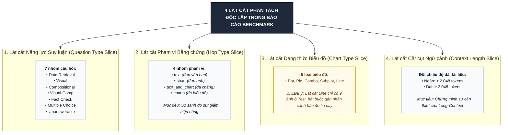
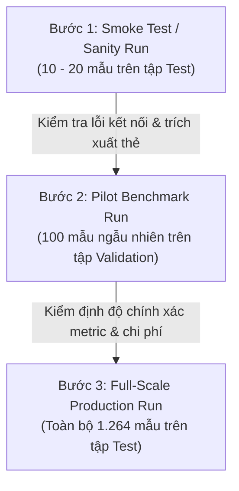

# ĐỀ XUẤT CHIẾN LƯỢC THỰC NGHIỆM VICHARTQA: ZERO-SHOT BASELINE & ĐƯỜNG ỐNG FINE-TUNING ĐỘT PHÁ

> **Tài liệu Kỹ thuật Thực nghiệm & Khung Phản biện Học thuật****Căn cứ thực nghiệm:** Báo cáo Khám phá Dữ liệu Toàn diện (`docs/05_EDA_REPORT.md`) & Kế hoạch Chiến lược Mô hình (`ViChartQA/docs/model_strategy_and_finetune_plan.md`)**Nền tảng lý thuyết tích hợp:**
>
> 1. *Generative Self-Refinement (GSR)* — Wang et al., ICLR / arXiv:2509.00084: *Learning to Refine: Self-Refinement of Parallel Reasoning in LLMs*.
> 2. *Dynamic Reward Scaling (DRS)* — Cheng et al., ICLR / arXiv:2503.18991: *Inverse Reinforcement Learning with Dynamic Reward Scaling for LLM Alignment*.

---

## MỤC LỤC

1. [Phân Tích Phản Biện Cố Vấn (Critical Advisory & Trap Auditing)](#1-phân-tích-phản-biện-cố-vấn-critical-advisory--trap-auditing)
2. [Chiến Lược Đo Lường Zero-Shot Baseline (Proprietary & Open-Source)](#2-chiến-lược-đo-lường-zero-shot-baseline-proprietary--open-source)
3. [Ý Tưởng Đột Phá Cho Đường Ống Fine-Tuning SLM (Không Toán Học Rườm Rà)](#3-ý-tưởng-đột-phá-cho-đường-ống-fine-tuning-slm-không-toán-học-rườm-rà)
4. [Hệ Thống Thang Đo Đánh Giá & Các Lát Cắt Phân Tách Độc Lập](#4-hệ-thống-thang-đo-đánh-giá--các-lát-cắt-phân-tách-độc-lập)
5. [Quy Chuẩn Kỹ Thuật Thực Thi Thực Nghiệm (4 Bắt Buộc Kỹ Thuật)](#5-quy-chuẩn-kỹ-thuật-thực-thi-thực-nghiệm-4-bắt-buộc-kỹ-thuật)
6. [Kế Hoạch Kiểm Thử Phân Tầng (Staged Rollout Plan)](#6-kế-hoạch-kiểm-thử-phân-tầng-staged-rollout-plan)

---


## 2. CHIẾN LƯỢC ĐO LƯỜNG ZERO-SHOT BASELINE (PROPRIETARY & OPEN-SOURCE)

### 2.1. Danh Mục Mô Hình Tham Gia Đánh Giá

Bản kế hoạch phân chia hệ thống mô hình thành 2 nhóm đối chuẩn rõ ràng:


| Nhóm Phân Loại                            | Tên Mô Hình                        | Định Danh Gọi / Endpoint                | Đặc Trưng Kỹ Thuật & Vai Trò Trong Bài Báo                                             |
| :--------------------------------------------- | :-------------------------------------- | :------------------------------------------- | :----------------------------------------------------------------------------------------------- |
| **Thương Mại (Proprietary)**              | **`GPT-4o`**                          | OpenRouter:`openai/gpt-4o`                 | Đo lường trần năng lực (Upper-bound) của thị giác AI đa phương thức toàn cầu.   |
|                                              | **`Gemini 2.5 Pro`**                  | OpenRouter:`google/gemini-2.5-pro`         | Đánh giá năng lực xử lý cửa sổ ngữ cảnh siêu dài và đối chiếu đa biểu đồ. |
|                                              | **`Gemini 2.5 Flash`**                | OpenRouter:`google/gemini-2.5-flash`       | Đo lường tỷ lệ Hiệu năng / Chi phí và tốc độ suy luận nhanh.                      |
|                                              | **`Claude 3.5 Sonnet`**               | OpenRouter:`anthropic/claude-3.5-sonnet`   | Kiểm chứng khả năng bám sát định dạng suy luận logic chặt chẽ.                     |
|                                              | **`Qwen2.5-VL-72B-Instruct`**         | OpenRouter:`qwen/qwen-2.5-vl-72b-instruct` | Đại diện VLM mã nguồn mở quy mô cực lớn (Frontier Open-Weight Model).                 |
| **Mã Nguồn Mở (Open-Source / Local SLM)** | **`Vintern-3B`**                      | Local GPU (RTX 5090 32GB)                  | **Baseline hạt nhân then chốt**: VLM tiếng Việt gốc (InternViT-300M + Qwen2-2.7B).       |
|                                              | **`Vintern-1B-v2`**                   | Local GPU (RTX 5090 32GB)                  | Baseline cạnh biên (Edge computing) cho các thiết bị tài nguyên thấp.                  |
|                                              | **`InternVL3-8B` / `InternVL2.5-8B`** | Local GPU (RTX 5090 32GB)                  | Backbone VLM đa ảnh mã nguồn mở hàng đầu ở phân khúc 8B tham số.                   |
|                                              | **`Qwen2.5-VL-7B-Instruct`**          | Local GPU (RTX 5090 32GB)                  | Baseline so sánh quốc tế phổ biến nhất hiện nay ở phân khúc 7B tham số.             |

---

### 2.2. Thiết Kế Chuẩn Hóa Input Prompt (Born-Digital Context + Interleaved Image Anchors)

Nhằm bảo đảm tính công bằng tuyệt đối giữa các mô hình, toàn bộ bài báo tiếng Việt được giữ nguyên vẹn ở định dạng số hóa (Born-Digital Unicode). Không chạy OCR lại để tránh làm biến dạng văn bản gốc. Các thẻ neo biểu đồ `[CHART 1]`, `[CHART 2]`, `[CHART 3]` được chèn vào đúng vị trí xuất hiện tự nhiên trong bài viết.

#### Cấu Trúc Prompt Zero-Shot:

```text
[SYSTEM PROMPT]
Bạn là chuyên gia phân tích dữ liệu tài liệu và biểu đồ đa phương thức tiếng Việt.
Nhiệm vụ của bạn là đọc hiểu toàn diện bài báo và các biểu đồ đính kèm để trả lời câu hỏi của người dùng.

Yêu cầu định dạng bắt buộc:
1. Trả lời trực tiếp, không sử dụng chuỗi suy luận dài dòng.
2. Đặt đáp án cuối cùng, ngắn gọn và súc tích nhất vào trong cặp thẻ <answer>...</answer>.
3. Với câu hỏi số học: chỉ ghi giá trị số (hoặc kèm đơn vị nếu câu hỏi yêu cầu rõ ràng).
4. Với câu hỏi trắc nghiệm: ghi ký tự phương án lựa chọn (A, B, C hoặc D) kèm nội dung phương án.
5. Với câu hỏi kiểm tra Đúng/Sai: ghi rõ "Đúng" hoặc "Sai".
6. Nếu bài báo và biểu đồ không chứa đủ thông tin để khẳng định, ghi chính xác "unanswerable" vào thẻ <answer>.

[USER PROMPT]
=== TIÊU ĐỀ BÀI VIẾT ===
{title}

=== NỘI DUNG BÀI BÁO (BORN-DIGITAL TEXT VỚI THẺ NEO BIỂU ĐỒ) ===
{body_text_with_chart_anchors}

=== DANH SÁCH BIỂU ĐỒ ĐÍNH KÈM ===
[CHART 1]: {image_1_input}
[CHART 2]: {image_2_input} (nếu bài có 2-3 biểu đồ)
[CHART 3]: {image_3_input} (nếu bài có 3 biểu đồ)

=== CÂU HỎI ===
{question}
```

---

## 3. Ý TƯỞNG CHO PIPELINE FINE-TUNING SLM

Thay vì sa đà vào các công thức giải tích hay chứng minh hội tụ xác suất, chiến lược fine-tuning tập trung vào **3 cơ chế kỹ thuật thực tế** giải quyết trúng 3 điểm nghẽn lớn nhất mà EDA đã chỉ ra:

```mermaid
flowchart LR
    subgraph DataEngine ["1. Động Cơ Mở Rộng Dữ Liệu"]
        D1["ViChartQA Derivation"] --> D2["Teacher LLM sinh mã Python PoT"]
        D2 --> D3["Thực thi Sandbox Đối Chiếu Ground Truth"]
        D3 -->|Khớp 100%| D4["Tập SFT Rẻ 0đ"]
    end

    subgraph GSR_Engine ["2. Khung Tự Phản Tư Song Song (GSR)"]
        D4 --> G1["Sinh K Quỹ Đạo Độc Lập"]
        G1 --> G2["Self-Refiner Tổng Hợp & Đối Chiếu Bằng Chứng"]
        G2 --> G3["Phát hiện Lệch Số Liệu Giữa Text & Chart"]
    end

    subgraph DRS_Engine ["3. Điều Chỉnh Thưởng Động (DRS / DR-IRL)"]
        G3 --> R1["Đánh Giá Độ Khó Tác Vụ: Multi-hop > Single-hop"]
        R1 --> R2["Tăng Thưởng Cho Phép Tính Phức Tạp"]
        R2 --> R3["Cập Nhật Trọng Số Policy SLM"]
    end

    R3 --> Final["ViChart-SLM Vượt Trội"]
```



---

### 3.1. Giai Đoạn 1: Mở Rộng Dữ Liệu Suy Luận Số Học (Program-of-Thought) Với Chi Phí 0đ

- **Vấn đề thực tế:** 3.662 câu hỏi trong ViChartQA có công thức tính toán (`derivation`), nhưng nếu chỉ huấn luyện mô hình dự đoán ra đáp án cuối cùng, SLM sẽ học vẹt kết quả thay vì học tư duy logic.
- **Giải pháp chi phí 0đ:**
  1. Sử dụng Teacher Model chuyển đổi công thức `derivation` gốc thành một đoạn mã lập trình Python ngắn có cấu trúc (Program-of-Thought). Đoạn mã này diễn giải rõ ràng biến số nào lấy từ bài báo, biến số nào lấy từ biểu đồ nào (`[CHART 1]` hay `[CHART 2]`).
  2. Đưa đoạn mã vào một môi trường Sandbox Python độc lập để chạy thực thi tự động.
  3. **Bộ lọc nghiêm ngặt:** Chỉ những mẫu nào có kết quả thực thi của mã Python khớp chính xác với đáp án `answer` trong dataset thì mới được chấp nhận đưa vào tập dữ liệu huấn luyện giám sát (SFT). Những mẫu không khớp hoặc lỗi thời gian chạy sẽ bị hủy bỏ ngay.
  4. Quá trình này tạo ra hàng nghìn mẫu huấn luyện suy luận đa bước chất lượng cao mà không tốn một đồng chi phí gán nhãn thủ công.

---

### 3.2. Giai Đoạn 2: Tự Phản Tư Trên Suy Luận Song Song (Generative Self-Refinement - GSR)

Kế thừa phát kiến từ nghiên cứu tại ICLR (Wang et al. - *Learning to Refine: Self-Refinement of Parallel Reasoning in LLMs*):

- **Tại sao suy luận tuần tự hay bỏ phiếu số đông (Majority Voting) thất bại trên biểu đồ?**
  - Nếu mô hình đọc sai một số liệu trên trục tọa độ ngay từ bước đầu tiên (ví dụ: nhìn nhầm 14.5 thành 15.4), toàn bộ chuỗi suy luận phía sau sẽ sai. Bỏ phiếu số đông hoàn toàn vô dụng nếu tất cả các lần sinh mẫu đều bị nhầm lẫn ở cùng một vị trí thị giác khó.
- **Cơ chế Generative Self-Refinement (GSR) cho ViChartQA:**
  1. **Sinh nhánh song song:** Cho mô hình sinh ra đồng thời $K$ phương án giải quyết độc lập ($K=3$ hoặc $K=5$). Một nhánh có thể ưu tiên bám sát văn bản, một nhánh ưu tiên trích xuất biểu đồ, một nhánh tập trung vào các mốc thời gian.
  2. **Bộ tự phản tư (Self-Refiner Module):** Thay vì chọn phương án xuất hiện nhiều nhất, mô hình đưa toàn bộ $K$ phương án vào một bước phản tư tổng hợp:
     - So sánh đối chiếu: *"Nhánh 1 đọc số liệu là 12%, nhưng Nhánh 2 đọc là 15%. Nhìn lại thẻ [CHART 1], cột năm 2023 nằm dưới đường lưới 15%, do đó 12% là giá trị chính xác."*
     - Sửa lỗi chéo giữa hình và chữ: Nếu bài viết ghi một số liệu khác với biểu đồ, mô hình sẽ phân tích xem câu hỏi hỏi về nội dung bài báo (`hop_type: text`) hay số liệu thực tế trên biểu đồ (`hop_type: chart`).
  3. Huấn luyện một SLM (như Vintern-3B) vừa có năng lực đề xuất phương án, vừa có kỹ năng đóng vai trò "người thẩm định" để chốt đáp án cuối cùng.

---

### 3.3. Giai Đoạn 3: Căn Chỉnh Hậu Huấn Luyện Với Điều Chỉnh Thưởng Động (Dynamic Reward Scaling - DRS)

Kế thừa cơ chế cốt lõi từ công trình ICLR (Cheng et al. - *Inverse Reinforcement Learning with Dynamic Reward Scaling*):

- **Điểm yếu của hàm thưởng tĩnh (Static Rewards):**
  - Trong các thuật toán căn chỉnh như GRPO truyền thống, một câu hỏi dễ (chỉ cần đọc một chữ trong bài) và một câu hỏi cực khó (phải đối chiếu 2 biểu đồ phức tạp rồi làm phép tính 3 bước) đều nhận về cùng một mức thưởng khi trả lời đúng (ví dụ: +1.0 điểm).
  - Hậu quả: Mô hình bị "lười biếng", dồn năng lực tối ưu hóa vào các câu hỏi đơn giản để gom thưởng nhanh, bỏ quên các mẫu suy luận đa chặng khó (`text_and_chart` và `charts`).
- **Cơ chế Thưởng Động (Dynamic Reward Scaling):**
  - **Tự động tăng tỷ trọng thưởng theo độ khó của mẫu:**
    - Mẫu đa biểu đồ (`charts`) và đa chặng (`text_and_chart`) được nhân hệ số thưởng cao gấp 1.5 đến 2.0 lần so với mẫu đơn nguồn (`text` hoặc `chart`).
    - Các bài toán có phép tính nhiều bước (multi-step derivation) được cộng điểm thưởng phụ nếu trích xuất đúng toàn bộ các toán hạng trung gian.
  - **Độ co giãn thưởng theo độ phân hóa nhóm:** Khi mô hình sinh ra một nhóm phản hồi mà các nhánh có sự bất đồng lớn (độ khó cao đối với mô hình), nếu có một nhánh tìm ra được đáp án đúng, nhánh đó sẽ nhận được lợi thế phần thưởng vượt bậc để kéo trọng số của mô hình theo hướng tư duy đúng đắn đó.

---

## 4. HỆ THỐNG THANG ĐO ĐÁNH GIÁ & CÁC LÁT CẮT PHÂN TÁCH ĐỘC LẬP

### 4.1. Bộ Chỉ Số Đánh Giá Toàn Diện (Không Sử Dụng Công Thức Toán Rườm Rà)

1. **Relaxed Accuracy ($\pm 5\%$ dung sai):** Thước đo tiêu chuẩn vàng cho các câu hỏi tính toán số học. Đáp án dự đoán được coi là đúng nếu sai lệch không quá 5% so với nhãn thực tế, giúp loại bỏ các bất công do sai số ước lượng thị giác nhỏ bằng mắt thường.
2. **Exact Match (EM):** Độ chính xác tuyệt đối sau khi chuẩn hóa văn bản (xóa khoảng trắng thừa, đưa về chữ thường, bỏ dấu câu thừa) áp dụng cho các câu hỏi trích xuất tên riêng, địa danh, nhãn danh mục.
3. **Multiple-Choice Accuracy:** Tỷ lệ chọn chính xác phương án (A, B, C, D) trên tập câu hỏi trắc nghiệm.
4. **Unanswerable Detection F1-score:** Đo lường khả năng nhận biết ranh giới tri thức của mô hình—tự tin từ chối trả lời ("unanswerable") khi tài liệu không cung cấp đủ thông tin, thay vì bịa đặt số liệu (hallucination).
5. **Chỉ số Cải thiện Phản tư (Refinement Gap):** Đo lường mức tăng phần trăm độ chính xác của cơ chế GSR so với phương pháp bỏ phiếu số đông thông thường, chứng minh mô hình thực sự biết "tự sửa sai" chứ không chỉ dựa vào may rủi thống kê.

---

### 4.2. Bốn Lát Cắt Phân Tách Độc Lập Bắt Buộc Trong Báo Cáo (Ablation Slices)

Dựa trên kết quả từ `docs/05_EDA_REPORT.md`, mọi bảng kết quả đánh giá bắt buộc phải phân rã thành 4 lát cắt trực giao:



---

## 5. QUY CHUẨN KỸ THUẬT THỰC THI THỰC NGHIỆM (4 BẮT BUỘC KỸ THUẬT)

Nhằm đảm bảo tính minh bạch học thuật, khả năng tái lập 100% và an toàn tối đa cho dữ liệu trong quá trình chạy hàng nghìn lượt gọi API và suy luận GPU nặng, toàn bộ mã nguồn thực thi bắt buộc tuân thủ 4 quy chuẩn sau:

### 5.1. Bắt Buộc 1: Thống Nhất Giao Diện Điều Khiển Bằng `argparse` & Khả Năng Khôi Phục (Resume)

Mọi tệp script chạy thực nghiệm (cả API OpenRouter lẫn Local GPU) phải sử dụng module chuẩn `argparse` của Python để nhận tham số. Tuyệt đối không hard-code đường dẫn hay tên mô hình vào sâu trong mã nguồn.

#### Khung Code Tiêu Chuẩn Cho CLI Arguments:

```python
import argparse
import os

def parse_arguments():
    parser = argparse.ArgumentParser(
        description="ViChartQA Evaluation Engine - Standardized Evaluation CLI with Atomic Resume Capability"
    )
    # Cấu hình mô hình và provider
    parser.add_argument("--model", type=str, required=True, 
                        help="Định danh mô hình (vd: openai/gpt-4o, google/gemini-2.5-pro, vintern-3b)")
    parser.add_argument("--provider", type=str, choices=["openrouter", "local_gpu"], default="openrouter",
                        help="Hạ tầng thực thi: 'openrouter' qua API hoặc 'local_gpu' cho mô hình nguồn mở")
  
    # Đường dẫn dữ liệu và thư mục lưu trữ
    parser.add_argument("--data_path", type=str, default="data/processed/test_set.json",
                        help="Đường dẫn tới tệp dữ liệu kiểm thử JSON")
    parser.add_argument("--image_dir", type=str, default="data/cloud/images",
                        help="Thư mục chứa toàn bộ hình ảnh biểu đồ gốc")
    parser.add_argument("--output_file", type=str, required=True,
                        help="Đường dẫn tệp JSONL lưu toàn bộ log và kết quả đánh giá")
  
    # Cấu hình kiểm soát thực nghiệm
    parser.add_argument("--subset", type=int, default=None,
                        help="Chỉ định số lượng mẫu chạy thử nghiệm (None để chạy toàn bộ dataset)")
    parser.add_argument("--temperature", type=float, default=0.0,
                        help="Nhiệt độ sinh mẫu (mặc định 0.0 bảo đảm tính tái lập cho benchmark)")
    parser.add_argument("--resume", action="store_true", default=True,
                        help="Tự động kiểm tra và chạy tiếp từ mẫu chưa hoàn thành, bỏ qua các mẫu đã có trong cache")
    parser.add_argument("--mode", type=str, choices=["direct", "cot"], default="direct",
                        help="Chế độ đánh giá: 'direct' (trích xuất tức thì) hoặc 'cot' (kèm chuỗi nháp)")

    return parser.parse_args()
```

#### Thuật Toán Resume Tự Động:

- Trước khi duyệt qua danh sách mẫu, chương trình quét tệp `output_file` (nếu đã tồn tại).
- Đọc toàn bộ các giá trị `sample_id` đã được ghi thành công vào một `set()` trong bộ nhớ.
- Khi lặp qua dataset, nếu `sample["id"] in completed_ids`, lập tức bỏ qua và in thông báo tiến độ, không tốn chi phí gọi lại API hoặc tính toán GPU trùng lặp.

---

### 5.2. Bắt Buộc 2: Ghi Log Tức Thời Sau Từng Mẫu (Immediate / Per-Sample Atomic Logging)

> [!CAUTION]
> **CẢNH BÁO MẤT MÁT DỮ LIỆU**
> Tuyệt đối không gom toàn bộ kết quả vào một danh sách lớn trong RAM rồi chờ đến cuối chương trình mới lưu một lượt. Nếu xảy ra mất mạng, chạm hạn ngạch (Rate Limit), hoặc máy chủ bị tắt đột ngột, toàn bộ chi phí API và hàng giờ chạy GPU sẽ bị mất trắng.

#### Quy Trình Ghi Đĩa Chuẩn Hóa:

```python
import json

def append_sample_log(output_path: str, record_data: dict):
    """
    Ghi ngay lập tức một bản ghi kết quả của 1 sample xuống đĩa cứng.
    Sử dụng chế độ mở 'append' (a) kết hợp f.flush() và os.fsync() 
    để ép dữ liệu ghi xuống đĩa ngay lập tức, chống mất mát khi có sự cố.
    """
    with open(output_path, mode="a", encoding="utf-8") as f:
        f.write(json.dumps(record_data, ensure_ascii=False) + "\n")
        f.flush()
        os.fsync(f.fileno())  # Bảo đảm dữ liệu được ghi vật lý vào ổ đĩa cứng
```

---

### 5.3. Bắt Buộc 3: Lưu Trữ Đầy Đủ Bằng Chứng & Artifacts (Reviewer-Proof Evidentiary Logging)

Mỗi dòng trong tệp kết quả `output_file` (định dạng JSON Lines) phải là một bản chứng thực hoàn chỉnh, cho phép người thẩm định (Reviewer) kiểm tra chéo từng chi tiết mà không cần chạy lại mô hình:

```json
{
  "sample_id": "vichartqa_economics_00101_q03",
  "doc_id": "vichartqa_economics_00101",
  "timestamp": "2026-09-09T14:32:10.125Z",
  "model": "openai/gpt-4o",
  "evaluation_mode": "direct",
  "hop_type": "text_and_chart",
  "question_type": "compositional",
  "chart_type": "combo",
  "domain": "economics",
  "question": "Chênh lệch giữa tốc độ tăng trưởng năm 2021 và 2023 là bao nhiêu điểm phần trăm?",
  "image_files": ["001e192b9f6693de.png"],
  "prompt_sent": "... [Toàn văn prompt gửi đi, bao gồm cả nội dung bài báo và thẻ [CHART 1]] ...",
  "raw_response": "Dựa trên bài báo và biểu đồ cột kết hợp đường, ta thấy... <answer>4.5</answer>",
  "extracted_answer": "4.5",
  "ground_truth": "4.52",
  "metrics": {
    "exact_match": false,
    "relaxed_accuracy_5pct": true,
    "absolute_error": 0.02,
    "relative_error": 0.0044
  },
  "latency_seconds": 2.45,
  "usage": {
    "prompt_tokens": 1420,
    "completion_tokens": 48,
    "total_tokens": 1468
  },
  "error_flag": null
}
```

---

### 5.4. Bắt Buộc 4: Kế Hoạch Kiểm Thử Phân Tầng (Staged Rollout Plan)

Tuyệt đối không khởi động chạy hàng loạt toàn bộ tập kiểm thử (1.264 câu hỏi) ngay từ lần đầu tiên. Quy trình phải tuân thủ nghiêm ngặt 3 bước phân tầng:



1. **Bước 1 — Smoke Test (10 đến 20 mẫu):**
   - Chạy lệnh với cờ `--subset 20`.
   - *Mục tiêu xác thực:* Kiểm tra tính thông suốt của API token OpenRouter, kiểm tra hàm nạp hình ảnh đa biểu đồ không bị lỗi đường dẫn (Path Not Found), kiểm tra parser trích xuất thẻ `<answer>` hoạt động chuẩn xác trên các dạng câu trả lời khác nhau, và xác nhận tệp log JSONL được tạo ra với cơ chế ghi tức thời.
2. **Bước 2 — Pilot Benchmark Run (100 mẫu trên tập Validation):**
   - Chạy trên một lát cắt đại diện gồm 100 mẫu của tập Validation.
   - *Mục tiêu xác thực:* Đo lường chính xác độ trễ trung bình trên mỗi mẫu (latency), ước tính chi phí tài chính (nếu dùng API thương mại) hoặc thời gian chiếm dụng GPU (nếu dùng local), phát hiện các edge cases hiếm gặp (ví dụ: mô hình từ chối trả lời, sinh chuỗi lặp vô tận, hoặc trả về mã lỗi 429).
3. **Bước 3 — Full-Scale Production Run (Toàn bộ 1.264 mẫu Test Set):**
   - Kích hoạt chạy toàn bộ khi và chỉ khi Bước 1 và Bước 2 hoàn thành với tỷ lệ lỗi kỹ thuật là $0\%$.
   - Quá trình chạy có thể tạm dừng hoặc chạy qua đêm nhờ cơ chế `--resume` bảo vệ an toàn từng sample.

---

## 6. KẾ HOẠCH KIỂM THỬ PHÂN TẦNG (STAGED ROLLOUT PLAN)

### 6.1. Ma Trận Chạy Thực Nghiệm Chi Tiết


| Pha Triển Khai              | Tập Dữ Liệu   | Số Lượng Mẫu | Mục Tiêu Kỹ Thuật                                                                    | Tiêu Chí Đạt Chuẩn Để Bước Tiếp                                                                           |
| :----------------------------- | :----------------- | :----------------- | :----------------------------------------------------------------------------------------- | :-------------------------------------------------------------------------------------------------------------------- |
| **Pha 1: Smoke Test**        | `test_set.json`  | 20 mẫu          | Xác thực CLI, I/O ảnh, Prompt template, Regex`<answer>`.                              | 100% mẫu trích xuất thành công, log JSONL đầy đủ các trường.                                            |
| **Pha 2: Pilot Test**        | `val_set.json`   | 100 mẫu         | Thẩm định các metric tính toán (EM, Relaxed Acc), đo lường chi phí/thời gian. | Không phát sinh lỗi Unhandled Exception, cơ chế Resume hoạt động trơn tru khi cố tình ngắt đột ngột. |
| **Pha 3: Zero-Shot Full**    | `test_set.json`  | 1.264 mẫu       | Đo baseline hoàn chỉnh cho 9 mô hình (4 Thương mại + 5 Mã nguồn mở).          | Thu thập đầy đủ 1.264 artifacts log trên mỗi mô hình, sẵn sàng tạo bảng so sánh cho bài báo.        |
| **Pha 4: SFT + GSR Tuning**  | `train_set.json` | 7.354 mẫu       | Huấn luyện LoRA trên Vintern-3B với dữ liệu PoT sandbox và bộ tự phản tư GSR. | Loss hội tụ ổn định, điểm Relaxed Acc trên tập Val tăng tối thiểu 10% so với baseline.                 |
| **Pha 5: Post-Training DRS** | `train_set.json` | 7.354 mẫu       | Áp dụng GRPO với Dynamic Reward Scaling tập trung vào các lát cắt khó.          | Đạt SOTA trên lát cắt`text_and_chart` và cải thiện chỉ số Refinement Gap.                                 |

---
