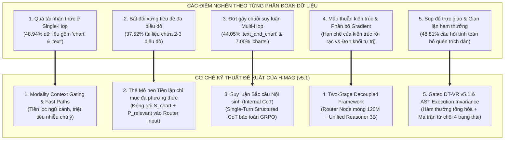
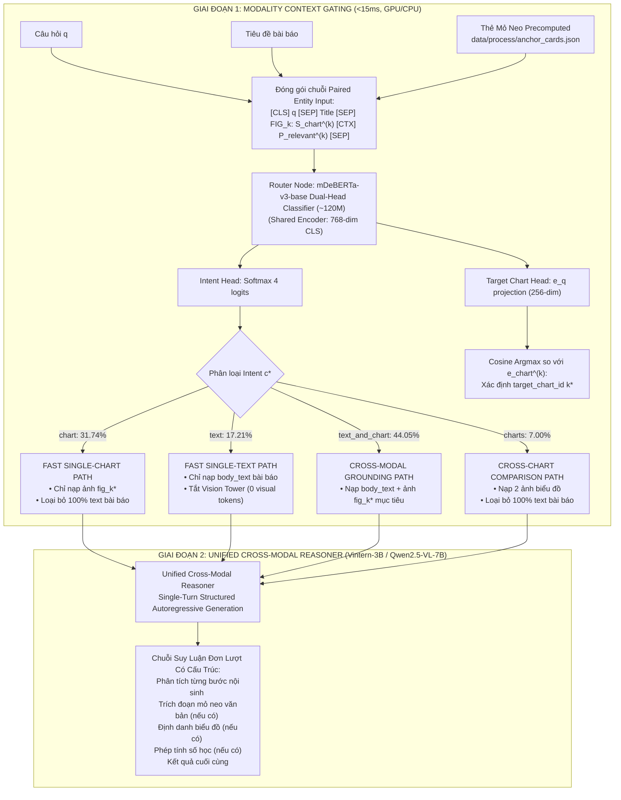
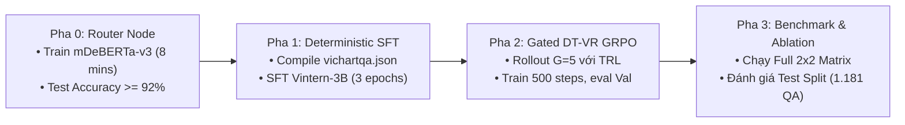

# ĐỀ XUẤT PHƯƠNG PHÁP VÀ CHIẾN LƯỢC THỰC NGHIỆM VICHARTQA: FRAMEWORK ĐỊNH TUYẾN NGỮ CẢNH PHÂN CẤP VÀ LÝ LUẬN ĐA PHƯƠNG THỨC HỢP NHẤT H-MAG (v5.1)

> **Tài liệu Kỹ thuật và Đề xuất Phương pháp luận Nghiên cứu (Scientific Research Proposal - Version 5.1)**  
> **Căn cứ thực nghiệm:** Báo cáo Khám phá Dữ liệu Toàn diện (`docs/05_EDA_REPORT.md`), Nhật ký Tiến hóa Phương pháp luận (`docs/draft_idea.md`), và Bộ dữ liệu chuẩn hóa ([`data/process/vichartqa.json`](file:///c:/Users/Admin/HUIT%20-%20H%E1%BB%8Dc%20T%E1%BA%ADp/N%C4%83m%203/Research/data/process/vichartqa.json), 1.242 tài liệu, 8.851 QA).  
> **Tham chiếu học thuật nền tảng:**  
> 1. *DocHop: Integrated Chart-Context Reasoning in Document-Style Images* — ICML 2026 (arXiv:2609.02059).  
> 2. *MultiChartQA: Benchmarking Vision-Language Models on Multiple Charts* — NAACL 2025 (arXiv:2410.14179).  
> 3. *ChartAgent: Investigating Multimodal Agents for Complex Chart Reasoning* — NeurIPS 2025 Oral.  
> 4. *DeepSeek-R1: Incentivizing Reasoning Capability in LLMs via Reinforcement Learning* — arXiv:2501.12948.  
> 5. *Math-Shepherd: Verify and Reinforce LLMs Step-by-step without Human Annotations* — ACL 2024 (arXiv:2312.08935).  
> 6. *DeBERTaV3: Improving DeBERTa using ELECTRA-Style Pre-Training with Gradient-Disentangled Embedding Sharing* — ICLR 2023.  
> 7. *SelectiveNet: A Deep Neural Network with an Integrated Reject Option* — NeurIPS 2019.

---

## MỤC LỤC CHI TIẾT

1. [Định Nghĩa Hình Thức Bài Toán, Bảng Thuật Ngữ & Ký Hiệu Học Thuật](#1-định-nghĩa-hình-thức-bài-toán-bảng-thuật-ngữ--ký-hiệu-học-thuật)
   - 1.1. Phát biểu bài toán ViChartQA
   - 1.2. Bảng thuật ngữ và ký hiệu hình thức (Nomenclature Table)
2. [Đặc Tả Dữ Liệu Thực Nghiệm ViChartQA & Bản Chất Đồ Thị Hai Phía](#2-đặc-tả-dữ-liệu-thực-nghiệm-vichartqa--bản-chất-đồ-thị-hai-phía)
   - 2.1. Thống kê kiểm toán tập dữ liệu chuẩn hóa
   - 2.2. Bản chất Đồ thị Hai phía (Bipartite Cross-Modal Graph)
3. [Năm (05) Điểm Nghẽn Phương Pháp Luận & Đề Xuất Tiếp Cận Theo Lát Cắt Dữ Liệu](#3-năm-05-điểm-nghẽn-phương-pháp-luận--đề-xuất-tiếp-cận-theo-lát-cắt-dữ-liệu)
   - 3.1. Điểm nghẽn 1: Quá tải nhận thức ở Single-Hop & Cơ chế Fast Direct Paths
   - 3.2. Điểm nghẽn 2: Bất đối xứng tiêu đề đa biểu đồ & Thẻ Mỏ neo Tiền lập chỉ mục
   - 3.3. Điểm nghẽn 3: Bản chất suy luận bắc cầu Multi-Hop & Cơ chế CoT nội sinh
   - 3.4. Điểm nghẽn 4: Hạn chế của kiến trúc rời rạc & Unified Cross-Modal Reasoner
   - 3.5. Điểm nghẽn 5: Rủi ro sụp đổ chiều trực giao, bẫy né phạt Bayes & Gated DT-VR
   - 3.6. Ma trận ánh xạ Điểm nghẽn - Lát cắt dữ liệu - Cơ chế giải quyết
4. [Hệ Thống Baseline SOTA & Ma Trận Thực Nghiệm Thừa Số 2x2 Đối Xứng](#4-hệ-thống-baseline-sota--ma-trận-thực-nghiệm-thừa-số-2x2-đối-xứng)
   - 4.1. Tiêu chí lựa chọn mô hình đối chuẩn (ChartQA, DocVQA, OCRBench)
   - 4.2. Bảng phân tầng mô hình tham chiếu (Tier 1, Tier 2, Tier 3)
   - 4.3. Cơ sở khoa học lựa chọn mô hình hạt nhân Vintern-3B-beta
   - 4.4. Ma trận thực nghiệm thừa số 2x2 cốt lõi (Primary Benchmark trên Vintern-3B)
   - 4.5. Ma trận thực nghiệm thừa số 2x2 mở rộng (Scalability Benchmark trên Qwen2.5-VL-7B)
   - 4.6. Baseline đơn phương thức khử biến nhiễu ngoại lai (Unimodal Baselines)
5. [Kiến Trúc Đề Xuất: H-MAG Framework (Two-Stage Modality-Gated Pipeline)](#5-kiến-trúc-đề-xuất-h-mag-framework-two-stage-modality-gated-pipeline)
   - 5.1. Tổng quan luồng điều phối hai giai đoạn
   - 5.2. Thẻ Mỏ neo Đa phương thức Tiền lập chỉ mục (Precomputed Anchor Cards)
   - 5.3. Đặc tả chi tiết Tầng 1: Router Node & Modality Context Gating
   - 5.4. Fast Direct Paths: Luồng tối ưu đơn chặng cho nhóm `chart` và `text`
   - 5.5. Cơ chế Lý luận Bắc cầu Nội sinh cho Multi-Hop (`text_and_chart` và `charts`)
   - 5.6. Tầng 2: Unified Cross-Modal Reasoner với Phân tầng Tốc độ học (Hierarchical LRs)
6. [Chiến Lược Huấn Luyện & Hàm Thưởng Tham Số Hóa Gated DT-VR](#6-chiến-lược-huấn-luyện--hàm-thưởng-tham-số-hóa-gated-dt-vr)
   - 6.0. Pha 0: Tiền huấn luyện Router Node Siêu Nhẹ (mDeBERTa-v3-base)
   - 6.1. Pha 1: Adaptive SFT qua Quy trình Tuần tự hóa Tất định (Deterministic Serialization)
   - 6.2. Pha 2: Single-Turn GRPO với Phân tầng Tốc độ học (Hierarchical Learning Rates)
   - 6.3. Công thức toán học hàm thưởng phân luồng Gated DT-VR v5.1
   - 6.4. Phân định vai trò AST Sanitizer giữa Huấn luyện (Reward) và Suy luận (Inference)
7. [Thiết Kế Thực Nghiệm Bóc Tách (Ablation Matrix) & Thang Đo Đánh Giá](#7-thiết-kế-thực-nghiệm-bóc-tách-ablation-matrix--thang-đo-đánh-giá)
   - 7.1. Bảng đối chiếu 7 chiều phương pháp luận
   - 7.2. Kế hoạch bóc tách thành phần (7 Ablation Experiments)
   - 7.3. Kế hoạch quét siêu tham số (Hyperparameter Grid Search Matrix)
   - 7.4. Bộ chỉ số đo lường học thuật & 4 Lát cắt trực giao thực nghiệm
8. [Phân Bổ Ngân Sách Phần Cứng & Quy Chuẩn Kỹ Thuật Triển Khai](#8-phân-bổ-ngân-sách-phần-cứng--quy-chuẩn-kỹ-thuật-triển-khai)
   - 8.1. Ước tính phân bổ VRAM trên GPU RTX 5090 (32GB) / RTX 4090 (24GB)
   - 8.2. Quy chuẩn kỹ thuật triển khai mã nguồn
9. [Lộ Trình Kiểm Thử Thực Nghiệm Phân Tầng (Staged Rollout Plan)](#9-lộ-trình-kiểm-thử-thực-nghiệm-phân-tầng-staged-rollout-plan)
10. [Tổng Kết Bản Đề Xuất & Khả Năng Đóng Góp Khoa Học](#10-tổng-kết-bản-đề-xuất--khả-năng-đóng-góp-khoa-học)
11. [Tài Liệu Tham Khảo (References)](#11-tài-liệu-tham-khảo-references)

---

## 1. ĐỊNH NGHĨA HÌNH THỨC BÀI TOÁN, BẢNG THUẬT NGỮ & KÝ HIỆU HỌC THUẬT

### 1.1. Phát Biểu Bài Toán ViChartQA
Cho một tập hợp các tài liệu tin tức đa phương thức $\mathcal{D} = \{d_1, d_2, \dots, d_{|\mathcal{D}|}\}$. Mỗi tài liệu $d \in \mathcal{D}$ bao gồm:
- Tiêu đề bài viết $\mathcal{T}_{\mathrm{title}}$ và toàn văn ngữ cảnh $\mathcal{T}_{\mathrm{body}}$ chứa các thẻ định vị `[CHART N]`.
- Danh sách các ảnh biểu đồ đính kèm $\mathcal{I}_{\mathrm{charts}} = \{\mathrm{fig}_1, \dots, \mathrm{fig}_K\}$ ($1 \le K \le 3$), trong đó tiêu đề biểu đồ nằm trực tiếp trên bề mặt ảnh pixel mà không có siêu dữ liệu văn bản.

Với mỗi câu hỏi truy vấn $q$, mục tiêu của hệ thống là xác định câu trả lời chuẩn xác $y \in \mathcal{Y}$ dựa trên chứng cứ từ văn bản, biểu đồ hoặc sự kết hợp bắc cầu đa phương thức giữa hai nguồn tin.

### 1.2. Bảng Thuật Ngữ & Ký Hiệu Hình Thức (Nomenclature Table)

| Ký Hiệu / Thuật Ngữ | Định Nghĩa Hình Thức | Vai Trò & Ý Nghĩa Học Thuật |
| :--- | :--- | :--- |
| $\mathcal{D}$ | Không gian dữ liệu ViChartQA ($1.242$ tài liệu, $8.851$ cặp QA). | Toàn bộ không gian bài toán khảo sát. |
| $\mathcal{S}_{\mathrm{c}}, \mathcal{S}_{\mathrm{t}}$ | Lát cắt đơn chặng: `chart` (31.74%) và `text` (17.21%). | Tập câu hỏi chỉ khai thác một phương thức duy nhất (Single-Hop). |
| $\mathcal{S}_{\mathrm{tc}}, \mathcal{S}_{\mathrm{cc}}$ | Lát cắt đa chặng: `text_and_chart` (44.05%) và `charts` (7.00%). | Tập câu hỏi đòi hỏi liên kết chéo tuần tự hoặc đối chiếu đa ảnh (Multi-Hop). |
| $\mathcal{S}_{\mathrm{unans}}$ | Lát cắt câu hỏi không thể trả lời: `unanswerable` (5.39%). | Tập câu hỏi kiểm định ranh giới tri thức và khả năng từ chối trả lời. |
| **H-MAG** | *Hierarchical Modality-Aware Grounding Framework*. | Khung kiến trúc 2 giai đoạn: Tầng 1 Định tuyến ngữ cảnh $\to$ Tầng 2 Lý luận hợp nhất. |
| **Router Node** | Bộ phân loại đa nhiệm `mDeBERTa-v3-base` Dual-Head (~120M params). | Tầng 1: Phân loại intent ($c^*$) và định vị biểu đồ mục tiêu ($k^*$) trong $<15\,\text{ms}$. |
| **Unified Reasoner** | Mô hình VLM hạt nhân `Vintern-3B-beta` (hoặc `Qwen2.5-VL-7B`). | Tầng 2: Nhận context sạch, sinh chuỗi Single-Turn Structured CoT. |
| **Gated DT-VR** | *Gated Derivation-Trajectory Verifiable Reward (v5.1)*. | Hàm thưởng RLVR kiểm chứng quỹ đạo đa phương thức có cổng logic nhân và ma trận từ chối 4 trạng thái. |
| $\mathcal{A}_k$ | Thẻ Mỏ neo Đa phương thức: $\langle \mathrm{fig}_k, \mathcal{S}_{\mathrm{chart}}^{(k)}, P_{\mathrm{relevant}}^{(k)} \rangle$. | Cầu nối ngữ nghĩa tiền lập chỉ mục giữa biểu đồ và đoạn văn liên quan. |
| $e_{\mathrm{anchor}}, v_{\mathrm{anchor}}$ | Thực thể dẫn đường từ văn bản ($e$) hoặc mốc số liệu từ biểu đồ ($v$). | Biến mỏ neo bắc cầu giải quyết bài toán DocHop. |
| $\mathcal{N}_{\mathrm{grounding}}$ | Tập mỏ neo ground-truth derivation $\mathcal{O}_{\mathrm{gt}} \setminus \mathcal{C}_{\mathrm{structural}}$. | Không gian kiểm tra tính có căn cứ thực chất của các toán hạng. |
| $\mathcal{C}_{\mathrm{structural}}$ | $\{0, 1\} \cup \{10, 100, 1000, 10000\} \cup \{2, 3, 4, 12\}$. | Tập hằng số cấu trúc toán học, phần trăm và mốc thời gian quý/tháng. |
| $\mu_{\mathrm{math}}, \mu_{\mathrm{ground}}$ | Trọng số điều tiết phần thưởng số học và chứng cứ trích dẫn. | Cân bằng trực giao: $\mu_{\mathrm{math}}=\mu_{\mathrm{ground}}=0.5$ cho nhóm `text_and_chart` có tính toán. |
| $L_{\mathrm{soft}}, L_{\mathrm{hard}}$ | $L_{\mathrm{soft}} = 512$ tokens; $L_{\mathrm{hard}} = 1.024$ tokens. | Ngưỡng bắt đầu phạt mềm và ngưỡng trần trên độ dài chuỗi phản hồi ($|o_i|$). |
| $\kappa_{\mathrm{correct}}$ | Hệ số chiết khấu hình phạt độ dài cho lời giải đúng ($\kappa \in (0, 1)$). | Bảo vệ chuỗi suy luận CoT chi tiết không bị triệt tiêu điểm số. |

---

## 2. ĐẶC TẢ DỮ LIỆU THỰC NGHIỆM VICHARTQA & BẢN CHẤT ĐỒ THỊ HAI PHÍA

### 2.1. Thống Kê Kiểm Toán Tập Dữ Liệu Chuẩn Hóa
Dữ liệu chuẩn hóa tại [`data/process/vichartqa.json`](file:///c:/Users/Admin/HUIT%20-%20H%E1%BB%8Dc%20T%E1%BA%ADp/N%C4%83m%203/Research/data/process/vichartqa.json) được phân chia cố định theo tỷ lệ Train/Val/Test:

| Đặc Trưng Dữ Liệu | Toàn Bộ (All) | Train Split (76.53%) | Val Split (10.12%) | Test Split (13.34%) | Đặc Trưng Phân Bố & Bản Chất Xử Lý |
| :--- | :--- | :--- | :--- | :--- | :--- |
| **Tổng số tài liệu** | **1.242** | 950 | 126 | 166 | Tài liệu báo chí kinh tế - xã hội tiếng Việt |
| **Tổng số câu hỏi QA** | **8.851** | **6.774** | **896** | **1.181** | Trung bình 7.1 câu hỏi/tài liệu |
| **1. Single-Chart (`chart`)** | **2.809** (31.74%) | 2.148 | 287 | 374 | Fast Path: Nạp duy nhất 1 biểu đồ mục tiêu |
| **2. Single-Text (`text`)** | **1.523** (17.21%) | 1.168 | 154 | 201 | Fast Path: Tắt Vision Tower (0 visual tokens) |
| **3. Text & Chart (`text_and_chart`)** | **3.899** (44.05%) | 2.985 | 394 | 520 | DocHop Multi-Hop: Nạp text và 1 biểu đồ mục tiêu |
| **4. Multi-Chart (`charts`)** | **620** (7.00%) | 473 | 61 | 86 | Đối chiếu chéo: Nạp 2 ảnh, bỏ qua 100% text |
| **Câu hỏi có phép tính (`has_derivation`)** | **3.864** (43.66%) | 2.955 | 390 | 519 | Đòi hỏi kiểm chứng AST Execution Invariance |
| **Câu hỏi không thể trả lời (`unanswerable`)** | **477** (5.39%) | 365 | 48 | 64 | Đòi hỏi cơ chế từ chối chọn lọc (Chow's Rule) |

### 2.2. Bản Chất Đồ Thị Hai Phía (Bipartite Cross-Modal Graph)
Tài liệu ViChartQA thể hiện cấu trúc đồ thị hai phía không đồng nhất: Một bên là các đoạn văn bản tin tức $\mathcal{P} = \{P_1, \dots, P_M\}$, một bên là các biểu đồ dữ liệu $\mathcal{I} = \{\mathrm{fig}_1, \dots, \mathrm{fig}_K\}$. Các câu hỏi đòi hỏi mô hình phải xác lập đúng cạnh liên kết giữa thực thể điều kiện văn bản $e_{\mathrm{anchor}}$ và số liệu pixel $v_{\mathrm{target}}$.

---

## 3. NĂM (05) ĐIỂM NGHẼN PHƯƠNG PHÁP LUẬN & ĐỀ XUẤT TIẾP CẬN THEO LÁT CẮT DỮ LIỆU



### 3.1. Điểm Nghẽn 1: Quá Tải Nhận Thức Ở Nhóm Single-Hop & Cơ Chế Fast Direct Paths
- **Lát cắt dữ liệu chịu ảnh hưởng:** $48.94\%$ dữ liệu Single-Hop (`chart`: $31.74\%$, `text`: $17.21\%$).
- **Điểm nghẽn thực nghiệm:** Đối với các mô hình VLM nhỏ ($\le 8$B), việc nạp đồng thời văn bản dài (~1.250 từ) và toàn bộ các biểu đồ khiến ma trận chú ý $\operatorname{Softmax}(QK^T / \sqrt{d_k})$ bị phân tán nghiêm trọng. Ở nhóm `chart`, văn bản xung quanh gây nhiễu khiến mô hình đoán mò (*Visual Shortcuts*); ở nhóm `text`, việc nạp token thị giác làm tăng độ trễ suy luận gấp 3 lần một cách vô ích.
- **Cơ chế kỹ thuật giải quyết:** Tầng 1 (Modality Context Gater) phân loại intent và kích hoạt **Fast Direct Paths**:
  - Nhóm `chart`: Nạp duy nhất 1 ảnh biểu đồ mục tiêu, loại bỏ toàn bộ bài báo văn bản.
  - Nhóm `text`: Nạp duy nhất văn bản bài báo, tắt hoàn toàn Vision Tower ($0$ visual tokens).

### 3.2. Điểm Nghẽn 2: Bất Đối Xứng Tiêu Đề Trong Tài Liệu Đa Biểu Đồ & Thẻ Mỏ Neo Tiền Lập Chỉ Mục
- **Lát cắt dữ liệu chịu ảnh hưởng:** $37.52\%$ tài liệu chứa 2–3 biểu đồ ($466$ bài báo).
- **Điểm nghẽn thực nghiệm:** $100\%$ câu hỏi không chứa thẻ `[CHART N]`. Tiêu đề biểu đồ nằm trên ảnh pixel, không có trong metadata. Văn bản lân cận thẻ `[CHART N]` thường là chú thích CMS (*"Nguồn: VNDIRECT"*) hoặc tiêu đề của tiểu mục kế tiếp, gây gán nhầm biểu đồ nếu chỉ so khớp chuỗi cục bộ.
- **Cơ chế kỹ thuật giải quyết:** Xây dựng **Thẻ Mỏ neo Đa phương thức Tiền lập chỉ mục (Precomputed Anchor Cards $\mathcal{A}_k$)** ngoại tuyến: VLM tóm tắt đặc trưng thị giác $\mathcal{S}_{\mathrm{chart}}^{(k)}$, thuật toán BM25 tìm đoạn văn tác giả bình luận trực tiếp $P_{\mathrm{relevant}}^{(k)}$. Cặp thông tin này được lưu sẵn trong RAM và trực tiếp đưa vào đầu vào của Router Node để định vị chính xác biểu đồ mục tiêu.

### 3.3. Điểm Nghẽn 3: Bản Chất Suy Luận Bắc Cầu Multi-Hop & Cơ Chế CoT Nội Sinh
- **Lát cắt dữ liệu chịu ảnh hưởng:** $51.06\%$ dữ liệu Multi-Hop, gồm `text_and_chart` ($44.05\%$) và `charts` ($7.00\%$).
- **Điểm nghẽn thực nghiệm:** Bản chất câu hỏi `text_and_chart` là liên kết tuần tự (*DocHop*): thực thể điều kiện $e_{\mathrm{anchor}}$ nằm trong văn bản dẫn đường tới số liệu $v_{\mathrm{target}}$ trên biểu đồ. Nếu chia nhỏ thành hệ thống Multi-Agent nhiều lượt gọi qua lại, việc tối ưu hóa RL bị bế tắc do lỗi phân bổ trách nhiệm nhiều lượt (Multi-Turn Credit Assignment).
- **Cơ chế kỹ thuật giải quyết:** Thay vì chạy DAG nhiều trạm rời rạc, Unified Reasoner xử lý chuỗi bắc cầu **nội sinh trong 1 lượt sinh tự hồi quy duy nhất (Internal Cross-Modal CoT)**: Phân tích bước giải trong `<think>`, trích xuất mỏ neo vào `<quote>`, trích số liệu vào `<calc>`, và xuất đáp án vào `<answer>`, bảo toàn tính hội tụ của Single-Turn GRPO.

### 3.4. Điểm Nghẽn 4: Hạn Chế Của Kiến Trúc Rời Rạc & Unified Cross-Modal Reasoner
- **Điểm nghẽn lý thuyết:** Nếu dùng mô hình đơn khối tự trị bắt VLM tự sinh `<route>` ở đầu chuỗi CoT, prompt bắt buộc phải nạp full bài báo và ảnh ngay từ đầu $\implies$ ma trận chú ý bị ô nhiễm toàn bộ, Fast Path mất tác dụng. Ngược lại, nếu dùng nhiều LoRA rời rạc thì bị trễ hoán đổi adapter và sai lệch tín hiệu gradient khi perception đọc sai số.
- **Cơ chế kỹ thuật giải quyết (Two-Stage Decoupled Framework):**
  - **Tầng 1:** Router Node siêu nhẹ độc lập (<15ms, <500MB VRAM) gọt bỏ triệt để nhiễu ngoại vi trước khi nạp dữ liệu.
  - **Tầng 2:** Unified Cross-Modal Reasoner (`Vintern-3B`) chỉ tập trung năng lực suy luận chuỗi sạch, **không cần sinh thẻ `<route>` thừa thãi**, kết hợp **Phân tầng tốc độ học (Hierarchical LRs)** để bảo toàn biểu diễn thị giác gốc.

### 3.5. Điểm Nghẽn 5: Rủi Ro Sụp Đổ Chiều Trực Giao, Bẫy Né Phạt Bayes & Gated DT-VR v5.1
- **Lát cắt dữ liệu chịu ảnh hưởng:** $43.66\%$ câu hỏi số học (`has_derivation == True`) và $5.39\%$ câu hỏi từ chối (`unanswerable`).
- **Điểm nghẽn thực nghiệm:**
  - *Sụp đổ chiều trực giao (HZ-11):* Trong 3.864 câu hỏi có phép tính, có tới **1.886 câu thuộc nhóm `text_and_chart` (48.81%)**. Nếu chỉ chấm điểm `<calc>` và bỏ qua `<quote>`, mô hình sẽ học thói quen bịa đặt chứng cứ (*Citation Hacking*).
  - *Phần thưởng rỗng (Vacuous Reward):* Không gian số mở rộng $\mathcal{N}_{\mathrm{doc}}$ chứa toàn bộ số trong bài báo khiến mô hình bốc số ngẫu nhiên vẫn đạt $R_{\mathrm{process}} = 1.0$.
  - *Bẫy né phạt Bayes trong hàm thưởng từ chối (Penalty Evasion Policy Trap):* Thiết kế phạt nhị phân cũ phạt nặng việc từ chối nhầm ($-\beta = -3.0$) trong khi đoán mò bừa bãi khi câu hỏi không có đáp án chỉ nhận điểm 0.0 $\implies$ mô hình thà đoán mò bịa đặt còn hơn là từ chối, gây sụp đổ hoàn toàn năng lực từ chối chọn lọc trên tập $\mathcal{S}_{\mathrm{unans}}$.
  - *Bùng nổ gradient độ dài:* Phạt độ dài gộp cả prompt đầu vào khiến baseline đơn khối bị phạt oan.
- **Cơ chế kỹ thuật giải quyết (Gated DT-VR v5.1):**
  - **Hàm thưởng tổng hòa:** $R_{\mathrm{process}} = 0.5 R_{\mathrm{math}} + 0.5 R_{\mathrm{sem}}$ cho nhóm `text_and_chart` có tính toán.
  - **AST Execution Invariance & IoU Toán hạng cốt lõi:** So khớp trực tiếp với $\mathcal{O}_{\mathrm{gt}}$ và loại trừ tập hằng số cấu trúc $\mathcal{C}_{\mathrm{structural}}$.
  - **Ma trận thưởng phạt từ chối 4 trạng thái (4-State Decision Matrix):** Phạt nặng hành vi bịa đặt khi câu hỏi vô nghiệm ($-1.0$), phạt nhẹ từ chối nhầm ($-0.5$), thưởng từ chối đúng ($+1.0$), thiết lập Incentive Margin $\Delta R = +2.0$ triệt tiêu động cơ đoán mò.
  - **Phạt độ dài phản hồi trơn loại $C^0$:** Chỉ tính trên chuỗi sinh phản hồi ($|o_i|$), tách biệt hoàn toàn khỏi prompt.

### 3.6. Bảng Ma Trận Ánh Xạ Điểm Nghẽn - Lát Cắt Dữ Liệu - Cơ Chế Giải Quyết

| Điểm Nghẽn Phương Pháp Luận | Lát Cắt Dữ Liệu Chịu Ảnh Hưởng | Trọng Tâm Khó Khăn | Cơ Chế Giải Quyết Của H-MAG v5.1 | Vị Trí Trình Bày |
| :--- | :--- | :--- | :--- | :--- |
| **1. Quá tải nhận thức ở Single-Hop** | `chart` (31.74%), `text` (17.21%) | Nhiễu ngữ cảnh từ phương thức không liên quan, tăng độ trễ | Fast Direct Paths qua tiền lọc ngữ cảnh ở Tầng 1 | **Mục 5.1, 5.3, 5.4** |
| **2. Bất đối xứng tiêu đề đa biểu đồ** | 37.52% tài liệu đa biểu đồ; nhóm `chart`, `charts`, `text_and_chart` | Tiêu đề nằm trên ảnh, text lân cận mang tính nhiễu hoặc sai lệch | Thẻ Mỏ neo $\mathcal{A}_k$ tích hợp $P_{\mathrm{relevant}}$ đóng gói vào Router Input | **Mục 5.2, 5.3** |
| **3. Đứt gãy chuỗi suy luận Multi-Hop** | `text_and_chart` (44.05%) và `charts` (7.00%) | Phụ thuộc tuần tự DocHop; phân rã nhiều turn làm gãy thuật toán RL | Lý luận Bắc cầu Nội sinh (Internal CoT) trong chuỗi sinh đơn lượt | **Mục 5.5** |
| **4. Hạn chế kiến trúc rời rạc & VLM self-route** | Quá trình học đa vai trò trên mô hình nhỏ | Gradient Interference, nghịch lý nạp full context để tự route | Two-Stage Decoupled Pipeline: Router mỏng + Unified Reasoner | **Mục 5.3, 5.6** |
| **5. Sụp đổ trực giao & Bẫy né phạt Bayes** | `has_derivation == True` (43.66%) & `unanswerable` (5.39%) | Citation Hacking; Vacuous Reward; Bẫy né phạt đoán mò; Phạt oan prompt | Gated DT-VR v5.1 (Reward tổng hòa, AST IoU $\mathcal{O}_{\mathrm{gt}}$, Ma trận 4 trạng thái, Response Length Penalty) | **Mục 6.3, 6.4** |

---

## 4. HỆ THỐNG BASELINE SOTA & MA TRẬN THỰC NGHIỆM THỪA SỐ 2x2 ĐỐI XỨNG

### 4.1. Tiêu Chí Lựa Chọn Mô Hình Đối Chuẩn
Hệ thống mô hình đối chuẩn được lựa chọn dựa trên 3 tiêu chí định lượng chuẩn mực học thuật:
1. **Năng lực suy luận biểu đồ (Chart Reasoning):** Đạt điểm cao trên **ChartQA** (ACL 2022) và **CharXiv** (2024).
2. **Năng lực phân tích tài liệu đa phương thức (Document Parsing):** Đạt điểm tin cậy trên **DocVQA** (WACV 2021) và **OCRBench** (2023).
3. **Tính đại diện theo phân tầng phần cứng & ngôn ngữ:** Phân định rõ trần năng lực thương mại (Tier 1), mã nguồn mở quy mô lớn (Tier 2), và mô hình nhỏ triển khai cục bộ trên GPU 24GB–32GB (Tier 3), kết hợp mô hình tiếng Việt chuyên biệt (`Vintern-3B`) và mô hình quốc tế (`Qwen2.5-VL-7B`).

### 4.2. Bảng Phân Tầng Mô Hình Tham Chiếu (Reference Baseline Hierarchy)

| Phân Tầng | Tên Mô Hình | Nền Tảng / Tham Số | Điểm Chuẩn Đã Công Bố | Vai Trò Học Thuật Trong Bài Báo |
| :--- | :--- | :--- | :--- | :--- |
| **Tier 1: Proprietary Frontier**<br/>*(Trần tham chiếu toàn cầu)* | **Claude 3.7 / 3.5 Sonnet** | Proprietary, 200K ctx | ChartQA: 90.8%, DocVQA: 95.2% | Đo lường trần năng lực suy luận mở rộng kết hợp thị giác SOTA. |
| | **GPT-4o** | Proprietary, 128K ctx | ChartQA: 85.7%, DocVQA: 92.8% | Chuẩn mực công nghiệp toàn cầu đối chuẩn zero-shot. |
| | **Gemini 2.5 Pro / Flash** | Proprietary, 1M–2M ctx | ChartQA: 87.2%, DocVQA: 93.1% | Khảo sát năng lực tiếp nhận bài báo siêu dài và đa biểu đồ. |
| **Tier 2: Large Open-Weight**<br/>*(Mã nguồn mở quy mô lớn)* | **Qwen2.5-VL-72B-Instruct** | Open-weight, 72B params | DocVQA: 96.4%, ChartQA: 89.5% | Đại diện mô hình open-weight $\ge 70$B tiệm cận frontier models. |
| | **InternVL3-78B** | Open-weight, 78B params | ChartQA: 89.7%, DocVQA: 95.4% | Đối chứng năng lực xử lý tài liệu đa ảnh xen kẽ. |
| **Tier 3: Local Deployable SLM**<br/>*(Trọng tâm nghiên cứu $\le 8$B)* | **Vintern-3B-beta** | Local GPU, 3.7B params | InternViT-300M + Qwen2.5-3B | **Backbone hạt nhân then chốt**: VLM tiếng Việt gốc của H-MAG. |
| | **Vintern-3B-R-beta** | Local GPU, 3.7B params | Nâng cấp Reasoning SFT | Đo lường trần năng lực suy luận CoT nguyên bản của dòng Vintern. |
| | **Qwen2.5-VL-7B-Instruct** | Local GPU, 7B params | ChartQA: 87.3%, DocVQA: 95.7% | **Backbone quốc tế đối chuẩn**: Dùng cho ma trận mở rộng quy mô. |
| | **InternVL3.5-8B** | Local GPU, 8B params | ChartQA: 86.7%, DocVQA: 92.3% | Đối chứng kiến trúc visual encoder cùng họ InternViT ở quy mô 8B. |

### 4.3. Cơ Sở Khoa Học Lựa Chọn Mô Hình Hạt Nhân `Vintern-3B-beta`
ViChartQA là tập dữ liệu đặc thù với toàn văn bài báo và chú thích biểu đồ bằng tiếng Việt tự nhiên phức tạp. Vintern-3B kết hợp visual encoder InternViT-300M với LLM backbone Qwen2.5-3B-Instruct đã được tiền huấn luyện sâu trên ngữ liệu tiếng Việt, cung cấp điểm khởi đầu lý tưởng về năng lực ngôn ngữ bản địa trên phần cứng phổ thông.

---

### 4.4. Ma Trận Thực Nghiệm Thừa Số 2x2 Cốt Lõi (Primary Benchmark trên `Vintern-3B-beta`)
*Cố định 100% backbone `Vintern-3B-beta` trên cả 4 ô để cô lập hoàn toàn hiệu ứng của Kiến trúc (Factor A) và Phương pháp Tinh chỉnh (Factor B) trên 1 GPU 24GB VRAM:*

#### BẢNG 1: MA TRẬN KHẢO NGHIỆM CỐT LÕI (Mô hình Hạt nhân: `Vintern-3B-beta`)

| Trục Đánh Giá | Cột 1: Kiến Trúc Đơn Khối (Monolithic Baseline) | Cột 2: Kiến Trúc H-MAG (Two-Stage Modality-Gated Framework) |
| :--- | :--- | :--- |
| **Hàng 1: Không Tinh Chỉnh (Zero-Shot Baseline)** | **Ô (1) Monolithic Zero-shot:**<br>• **Backbone:** `Vintern-3B-beta` nguyên bản.<br>• **Phương thức:** Nạp toàn bộ text bài báo + ảnh biểu đồ vào 1 prompt CoT duy nhất.<br>• **Mục đích:** Đo trần năng lực ban đầu của mô hình nhỏ khi bị quá tải ngữ cảnh. | **Ô (2) Modality-Gated Zero-shot:**<br>• **Tiền xử lý:** Router Node `mDeBERTa-v3` phân loại và gọt ngữ cảnh.<br>• **Backbone:** `Vintern-3B-beta` nguyên bản nhận ngữ cảnh sạch.<br>• **Mục đích:** Đo giá trị gia tăng thuần túy của cơ chế tiền lọc ngữ cảnh khi chưa cập nhật trọng số VLM. |
| **Hàng 2: Có Tinh Chỉnh (Fine-Tuned System)** | **Ô (3) Monolithic Fine-tuned:**<br>• **Backbone:** `Vintern-3B-beta` + 1 LoRA adapter ($r=32, \alpha=64$).<br>• **Huấn luyện:** Direct SFT $\to$ Standard Outcome GRPO ($R = R_{\mathrm{outcome}}$) trên full context.<br>• **Mục đích:** Đo giới hạn của phương pháp fine-tune đơn khối truyền thống. | **Ô (4) Full H-MAG (Proposed System v5.1):**<br>• **Tầng 1:** Router Node `mDeBERTa-v3` được huấn luyện qua Joint Multi-task Loss.<br>• **Tầng 2:** `Vintern-3B-beta` huấn luyện qua Deterministic SFT $\to$ Hierarchical LR GRPO với hàm thưởng **Gated DT-VR v5.1**.<br>• **Mục đích:** Đo hiệu năng tối đa của toàn bộ giải pháp đề xuất. |

---

### 4.5. Ma Trận Thực Nghiệm Thừa Số 2x2 Mở Rộng (Scalability Benchmark trên `Qwen2.5-VL-7B-Instruct`)

#### BẢNG 2: MA TRẬN KHÁI QUÁT HÓA MỞ RỘNG (Backbone Quốc tế Đối chuẩn: `Qwen2.5-VL-7B-Instruct`)

| Trục Đánh Giá | Cột 1: Kiến Trúc Đơn Khối (Monolithic Baseline) | Cột 2: Kiến Trúc H-MAG (Two-Stage Modality-Gated Framework) |
| :--- | :--- | :--- |
| **Hàng 1: Không Tinh Chỉnh (Zero-Shot Baseline)** | **Ô (1b) Monolithic Zero-shot:**<br>• `Qwen2.5-VL-7B` nguyên bản nhận toàn văn bài báo + toàn bộ ảnh. | **Ô (2b) Modality-Gated Zero-shot:**<br>• Router Node gọt ngữ cảnh $\to$ `Qwen2.5-VL-7B` nhận ngữ cảnh sạch. |
| **Hàng 2: Có Tinh Chỉnh (Fine-Tuned System)** | **Ô (3b) Monolithic Fine-tuned:**<br>• `Qwen2.5-VL-7B` + LoRA huấn luyện SFT + Outcome GRPO trên full context. | **Ô (4b) Full H-MAG v5.1:**<br>• Router Node + `Qwen2.5-VL-7B` huấn luyện Deterministic SFT + Gated DT-VR v5.1. |

---

### 4.6. Baseline Đơn Phương Thức Khử Biến Nhiễu Ngoại Lai (Unimodal Baselines: Confounder-Free Modality Isolation)

Để bóc tách và định lượng chính xác sự đóng góp của từng phương thức (Modality Contribution Analysis) cũng như phát hiện các thiên kiến bề mặt (Superficial / Modality Biases), hệ thống thiết lập hai mô hình đối chuẩn đơn phương thức. Để tuân thủ nghiêm ngặt nguyên tắc **Khử Biến Số Gây Nhiễu Ngoại Lai (Confounding Variable Elimination)**, cả hai baseline này **bắt buộc sử dụng trực tiếp mô hình hạt nhân `Vintern-3B-beta`** (thay vì kết hợp pipeline IR ngoại lai với LLM thuần ngôn ngữ hay ghép nối visual encoder rời rạc):

1. **Text-only Baseline (`Vintern-3B-beta (Text-only)`):**
   - **Cơ chế nạp dữ liệu:** Nạp duy nhất câu hỏi $q$ và toàn văn bài báo văn bản ($\mathcal{T}_{\mathrm{body}}$). Tắt hoàn toàn nhánh thị giác (Vision Tower hoàn toàn không được kích hoạt, $0$ visual tokens).
   - **Ý nghĩa học thuật:** Đo lường trần năng lực suy luận ngôn ngữ thuần túy và phát hiện mức độ thiên kiến ngôn ngữ (Language Prior / Blind Guessing). Baseline này giúp kiểm chứng xem có bao nhiêu câu hỏi trong ViChartQA có thể được trả lời bằng suy đoán văn bản mà không cần nhìn vào biểu đồ thực tế.

2. **Chart-only Baseline (`Vintern-3B-beta (Chart-only)`):**
   - **Cơ chế nạp dữ liệu:** Nạp duy nhất câu hỏi $q$ và toàn bộ ảnh biểu đồ ($\{\mathrm{fig}_1, \dots, \mathrm{fig}_K\}$). Loại bỏ hoàn toàn $100\%$ ngữ cảnh văn bản bài báo ($0$ text context tokens).
   - **Ý nghĩa học thuật:** Đo lường năng lực thị giác và trích xuất số liệu biểu đồ thuần túy (Visual Parsing & Chart QA Capability) của VLM khi không có bất kỳ văn bản giải thích nào dẫn đường.

**Cơ sở khoa học của việc chuẩn hóa hạt nhân:** Việc giữ nguyên vẹn cùng một kiến trúc backbone (`Vintern-3B-beta`) giữa các baseline đơn phương thức và hệ thống đề xuất H-MAG đảm bảo mọi sự chênh lệch về độ chính xác (Accuracy Gain) chỉ bắt nguồn từ sự hiện diện của thông tin phương thức (Modality Information) và cơ chế định tuyến ngữ cảnh (H-MAG Pipeline), loại trừ $100\%$ các yếu tố gây nhiễu do sai khác dung lượng tham số, trọng số tiền huấn luyện hay kiến trúc mạng nơ-ron khác nhau.

---

## 5. KIẾN TRÚC ĐỀ XUẤT: H-MAG FRAMEWORK (TWO-STAGE MODALITY-GATED PIPELINE)

### 5.1. Tổng Quan Luồng Điều Phối Hai Giai Đoạn



### 5.2. Thẻ Mỏ Neo Đa Phương Thức Tiền Lập Chỉ Mục (Precomputed Anchor Cards)
Quy trình tiền lập chỉ mục ngoại tuyến (Offline Pre-indexing) thực hiện một lần duy nhất:
1. **Question-Agnostic Visual Summarizer:** VLM đọc biểu đồ ngoại tuyến trích xuất đặc trưng thị giác khách quan:
   $$\mathcal{S}_{\mathrm{chart}}^{(k)} = \operatorname{VLM}_{\mathrm{summary}}(\mathrm{fig}_k)$$
   *Prompt:* `"Hãy đọc tiêu đề, loại biểu đồ, nhãn các trục tọa độ, đối tượng chính và đơn vị tính của ảnh biểu đồ này trong 1-2 câu ngắn gọn."` Triệt tiêu hoàn toàn nguy cơ rò rỉ thông tin câu hỏi.
2. **BM25 Narrative Linker:** Dùng $\mathcal{S}_{\mathrm{chart}}^{(k)}$ làm truy vấn tìm đoạn văn tác giả phân tích sâu nhất về biểu đồ:
   $$P_{\mathrm{relevant}}^{(k)} = \arg\max_{P_j \in \mathcal{P}} \operatorname{BM25}\left(P_j, \, \mathcal{S}_{\mathrm{chart}}^{(k)}\right)$$
3. **Đóng gói Thẻ Mỏ Neo $\mathcal{A}_k = \langle \mathrm{fig}_k, \mathcal{S}_{\mathrm{chart}}^{(k)}, P_{\mathrm{relevant}}^{(k)} \rangle$:** Lưu vào `data/process/anchor_cards.json`. Router nạp tệp này vào RAM trong $<1\,\text{ms}$, loại bỏ việc gọi visual encoder thời gian thực khi định tuyến.

### 5.3. Đặc Tả Chi Tiết Tầng 1: Router Node & Modality Context Gating

#### 1. Mô hình triển khai:
Sử dụng Text Classifier chuyên biệt siêu nhẹ **`mDeBERTa-v3-base`** (~120M tham số, chiếm $<500\,\text{MB}$ VRAM, độ trễ suy luận trên GPU chỉ $5 - 8\,\text{ms}$). Mô hình hỗ trợ SentencePiece BPE (nạp chuỗi thô, $0\,\text{ms}$ tiền xử lý CPU) và giới hạn ngữ cảnh $512$ tokens.

#### 2. Chuỗi đầu vào ghép cặp thực thể (Paired Entity Input Packaging):
Để loại bỏ triệt để điểm mù đối với hai nhóm `text` và `text_and_chart`, chuỗi đầu vào ghép nối có cấu trúc:
$$\mathbf{x} = \text{[CLS]} \circ q \circ \text{[SEP]} \circ \mathcal{T}_{\mathrm{title}} \circ \text{[SEP]} \circ \sum_{k=1}^K \Big( \text{[CHART } k \text{]} \circ \mathcal{S}_{\mathrm{chart}}^{(k)} \circ \text{ [CTX] } \circ P_{\mathrm{relevant}}^{(k)} \Big) \circ \text{[SEP]}$$
Cấu hình trần an toàn `max_length = 450` tokens trong PyTorch DataLoader.

#### 3. Nguồn nhãn huấn luyện có giám sát (100% Ground-truth từ `evidence`):
Tận dụng toàn bộ nhãn sẵn có trong 6.774 câu hỏi Train của `data/process/vichartqa.json`:
- Chỉ chứa các bước `source == "chart"` (1 biểu đồ) $\implies$ Nhãn `chart`.
- Chỉ chứa các bước `source == "text"` $\implies$ Nhãn `text`.
- Chứa cả `text` và `chart` $\implies$ Nhãn `text_and_chart`.
- Chứa từ 2 biểu đồ trở lên $\implies$ Nhãn `charts`.

#### 4. Cơ chế dự đoán song song (Multi-Task Head):
- **Head 1 (Intent Classification Head):** Lớp tuyến tính $\operatorname{Linear}(768 \to 4)$ chiếu vector $\mathbf{h}_{\mathrm{[CLS]}}$ ra 4 logits, kích hoạt qua hàm Softmax.
- **Head 2 (Target Chart Projection Head):** Lớp tuyến tính $\operatorname{Linear}(768 \to 256)$ kèm chuẩn hóa $L_2$ chiếu vector câu hỏi thành $\mathbf{e}_q$.

#### 5. Cơ chế suy luận chọn biểu đồ mục tiêu (Inference Metric Matching):
- Vector tóm tắt biểu đồ $\mathbf{e}_{\mathrm{chart}}^{(k)}$ được tính toán ngoại tuyến sẵn trong RAM.
- Router tính tích vô hướng tức thì ($<0.01\,\text{ms}$):
  $$k^* = \arg\max_{k \in \{1, \dots, K\}} \left( \mathbf{e}_q^T \mathbf{e}_{\mathrm{chart}}^{(k)} \right)$$
- Fallback an toàn: Nếu tài liệu chỉ có 1 biểu đồ ($K=1$, chiếm 62.48%), mặc định chọn $k^* = 1$ ($0\,\text{ms}$). Nếu $\max P(\mathrm{intent}) < \tau_{\mathrm{route}} = 0.85$, kích hoạt Soft-Fallback nạp cả văn bản và ảnh biểu đồ mục tiêu để bảo vệ ranh giới an toàn.

### 5.4. Fast Direct Paths: Luồng Tối Ưu Đơn Chặng Cho Nhóm `chart` Và `text`
- **Fast Single-Chart Path (31.74% dữ liệu):** Nạp duy nhất ảnh $\mathrm{fig}_{k^*}$. Loại bỏ toàn bộ ~1.250 từ bài báo văn bản. Độ trễ suy luận: $0.3\text{s} - 0.5\text{s}$/mẫu.
- **Fast Single-Text Path (17.21% dữ liệu):** Nạp duy nhất văn bản bài báo vào LLM backbone, tắt hoàn toàn Vision Tower ($0$ visual tokens). Độ trễ suy luận: $0.2\text{s} - 0.3\text{s}$/mẫu.

### 5.5. Cơ Chế Lý Luận Bắc Cầu Nội Sinh Cho Multi-Hop (`text_and_chart` Và `charts`)
Thay vì chia nhỏ thành nhiều tác tử gọi vòng vo làm gãy thuật toán tối ưu hóa, Unified Reasoner xử lý suy luận bắc cầu hoàn toàn nội sinh:
- **Nhóm `text_and_chart` (44.05%):** Reasoner nhận `body_text` và ảnh $\mathrm{fig}_{k^*}$. Quá trình suy luận CoT diễn ra tuần tự:
  1. `<think>`: Lập luận phân tích mối liên hệ giữa điều kiện bài báo và biểu đồ.
  2. `<quote>`: Trích dẫn nguyên văn câu văn chứa mỏ neo $e_{\mathrm{anchor}}$.
  3. `<chart_id>`: Xác nhận định danh biểu đồ đối chiếu.
  4. `<calc>`: Thực hiện phép tính số học bắc cầu (nếu có).
  5. `<answer>`: Kết luận đáp án cuối cùng.
- **Nhóm `charts` (7.00%):** Reasoner nhận 2 ảnh biểu đồ và bỏ qua 100% bài báo văn bản, đọc mốc $v_1$ trên biểu đồ 1, đối chiếu mốc $v_2$ trên biểu đồ 2 và tính toán chênh lệch.

### 5.6. Tầng 2: Unified Cross-Modal Reasoner Với Phân Tầng Tốc Độ Học
- **Kiến trúc:** Hợp nhất trên backbone `Vintern-3B-beta`. Loại bỏ hoàn toàn thẻ `<route>` trong chuỗi output vì routing đã hoàn tất ở Tầng 1.
- **Phân tầng tốc độ học (Hierarchical Learning Rates):**
  - **Vision Tower (InternViT-300M):** Đóng băng hoàn toàn ($\eta_{\mathrm{vision}} = 0$) nhằm bảo toàn năng lực biểu diễn thị giác cơ sở.
  - **Vision-Language Projector:** Tốc độ học siêu nhỏ $\eta_{\mathrm{proj}} = 10^{-7}$ ($0.1 \times \eta_{\mathrm{llm}}$) nhằm duy trì sự ổn định của không gian nhúng liên phương thức, chống quên tri thức thị giác.
  - **LLM Backbone LoRA (rank=32, alpha=64):** Tốc độ học $\eta_{\mathrm{llm}} = 10^{-6}$ để tối ưu hóa năng lực suy luận chuỗi có cấu trúc.
- **Hiệu năng thực thi:** Triệt tiêu hoàn toàn chi phí hoán đổi adapter ($0\,\text{ms}$ overhead), loại bỏ rủi ro sai lệch gradient giữa các module rời rạc, và duy trì dung lượng VRAM cố định.

---

## 6. CHIẾN LƯỢC HUẤN LUYỆN & HÀM THƯỞNG THAM SỐ HÓA GATED DT-VR

### 6.0. Pha 0: Tiền Huấn Luyện Router Node Siêu Nhẹ (`mDeBERTa-v3-base`)
- **Tập dữ liệu:** 6.774 mẫu Train trích xuất từ `evidence` của `vichartqa.json`.
- **Cấu hình:** 3 epochs, learning rate $3 \times 10^{-5}$, AdamW, batch size 32, hoàn thành trong ~8 phút trên 1 GPU RTX 4090/5090.
- **Hàm mất mát liên hợp (Joint Multi-Task Loss):**
  $$\mathcal{L}_{\mathrm{router}} = \mathcal{L}_{\mathrm{intent}} + \lambda_{\mathrm{chart}} \cdot \mathcal{L}_{\mathrm{chart}}$$
  Trong đó:
  1. $\mathcal{L}_{\mathrm{intent}}$ là Cross-Entropy 4 lớp:
     $$\mathcal{L}_{\mathrm{intent}} = -\sum_{c=1}^4 \mathbb{I}(y_{\mathrm{intent}} = c) \log P(c \mid \mathbf{x})$$
  2. $\mathcal{L}_{\mathrm{chart}}$ là Supervised Contrastive Loss (InfoNCE) với $\tau = 0.07$:
     $$\mathcal{L}_{\mathrm{chart}} = -\mathbb{I}(\text{has\_chart}) \cdot \log \frac{\exp\left( \mathbf{e}_q^T \mathbf{e}_{k^*} / \tau \right)}{\sum_{j=1}^K \exp\left( \mathbf{e}_q^T \mathbf{e}_j / \tau \right)}$$
     với trọng số cân bằng $\lambda_{\mathrm{chart}} = 0.5$.

### 6.1. Pha 1: Adaptive SFT Qua Quy Trình Tuần Tự Hóa Tất Định (Deterministic Serialization)
Thay vì phải sinh thêm dữ liệu CoT ngoại vi tốn kém từ các mô hình thương mại (như GPT-4o hay Gemini API), nghiên cứu áp dụng **Quy trình Tuần tự hóa SFT Tất định** biên dịch trực tiếp $100\%$ nhãn người gán sẵn có từ `vichartqa.json` thành chuỗi mục tiêu XML có cấu trúc:
$$\text{Target}_{\mathrm{sft}} = \langle\text{think}\rangle \mathcal{D}_{\mathrm{desc}} \langle/\text{think}\rangle \langle\text{quote}\rangle \mathcal{Q}_{\mathrm{text}} \langle/\text{quote}\rangle \langle\text{chart\_id}\rangle \mathcal{C}_{\mathrm{id}} \langle/\text{chart\_id}\rangle \langle\text{calc}\rangle \mathcal{E}_{\mathrm{deriv}} \langle/\text{calc}\rangle \langle\text{answer}\rangle \mathcal{Y}_{\mathrm{ans}} \langle/\text{answer}\rangle$$

#### Minh chứng thực tế từ tập dữ liệu Train:
- **Mẫu đa phương thức (`text_and_chart` có phép tính):**
```xml
<think>
1. Xác định mốc năm 2023 trên trục hoành của biểu đồ nguồn cung căn hộ mới và tỷ lệ hấp thụ.
2. Gióng lên điểm ký hiệu hình thoi màu xanh lá biểu thị tỷ lệ hấp thụ tại năm 2023 và đọc giá trị ghi trên nhãn là 98%.
3. Lấy tỷ lệ hấp thụ tại Hà Nội được nêu trong văn bản trừ đi tỷ lệ hấp thụ đọc được trên biểu đồ để tính mức chênh lệch điểm phần trăm.
</think>
<quote>Nguồn cung căn hộ mới nửa đầu năm 2023 duy trì ở mức thấp, lần lượt giảm 73%/53% vì thế lượng tiêu thụ giảm sâu 54% ở cả TP.HCM và Hà Nội, theo CBRE. Tỷ lệ hấp thụ nửa đầu năm 2023 tại TP.HCM giảm mạnh chỉ còn 59%, trong khi tỷ lệ hấp thụ ở Hà Nội duy trì ở mức ấn tượng ở mức 109%.</quote>
<chart_id>fig2</chart_id>
<calc>109 - 98</calc>
<answer>11</answer>
```
Huấn luyện 3 epochs, $\eta = 2 \times 10^{-5}$, cosine schedule trên 6.774 mẫu Train.

### 6.2. Pha 2: Single-Turn GRPO Với Phân Tầng Tốc Độ Học
Vì Unified Reasoner chỉ sinh 1 lượt duy nhất trên ngữ cảnh đã được gọt sạch, thuật toán **Single-Turn Group Relative Policy Optimization (GRPO)** được bảo toàn $100\%$ tính nguyên vẹn toán học:
$$\mathcal{J}_{\mathrm{GRPO}}(\theta) = \mathbb{E}_{\{o_i\}_{i=1}^G \sim \pi_{\theta_{\mathrm{old}}}} \left[ \frac{1}{G} \sum_{i=1}^G \min \left( \frac{\pi_\theta(o_i|q)}{\pi_{\theta_{\mathrm{old}}}(o_i|q)} \hat{A}_i, \, \operatorname{clip}\left(\frac{\pi_\theta(o_i|q)}{\pi_{\theta_{\mathrm{old}}}(o_i|q)}, 1-\epsilon, 1+\epsilon\right) \hat{A}_i \right) - \beta_{\mathrm{KL}} D_{\mathrm{KL}}(\pi_\theta \parallel \pi_{\mathrm{ref}}) \right]$$
với $G=5$ rollouts, $\hat{A}_i = \frac{R_i - \operatorname{mean}(R)}{\operatorname{std}(R) + 10^{-6}}$, $\eta_{\mathrm{vision}}=0, \eta_{\mathrm{proj}}=10^{-7}, \eta_{\mathrm{llm}}=10^{-6}, \epsilon=0.2, \beta_{\mathrm{KL}}=0.04$.

### 6.3. Công Thức Toán Học Hàm Thưởng Phân Luồng Gated DT-VR v5.1
Hàm thưởng tổng hợp:
$$R_i = R_{\mathrm{format}} \times \left( R_{\mathrm{task}} + \lambda_{\mathrm{ref}} R_{\mathrm{refusal}} \right) + R_{\mathrm{length}}$$
Nếu vi phạm cú pháp đóng mở thẻ XML $\implies R_{\mathrm{format}} = 0 \implies R_i = 0.0$. Hệ số cân bằng $\lambda_{\mathrm{ref}} = 1.0$.

#### 1. Cấu trúc hàm thưởng tác vụ có cổng nhân (Multiplicative Gating):
$$R_{\mathrm{task}} = R_{\mathrm{outcome}}(y_{\mathrm{ans}}, \mathcal{Y}^*) \times \left[ 1.0 + \alpha_{\mathrm{process}} \times R_{\mathrm{process}} \right]$$
Trong đó $R_{\mathrm{outcome}}$ đo lường độ chính xác kết quả cuối:
- Với câu hỏi số học: Dung sai mềm $5\%$:
  $$R_{\mathrm{outcome}} = \begin{cases} \max\left(0, 1 - 20 \times \frac{|y_{\mathrm{ans}} - y^*|}{y^*}\right) & \text{if } \frac{|y_{\mathrm{ans}} - y^*|}{y^*} \le 0.05 \\ 0.0 & \text{otherwise} \end{cases}$$
- Với câu hỏi phi số học: So khớp ký tự chuẩn hóa tiếng Việt: $R_{\mathrm{outcome}} \in \{0, 1\}$.
*(Lưu ý: Đối với tập câu hỏi không thể trả lời $y^* = \text{'unanswerable'}$, $R_{\mathrm{task}}$ được gán bằng $0.0$, toàn bộ điểm đánh giá được phân định trực tiếp qua nhánh chuyên trách $R_{\mathrm{refusal}}$).*

#### 2. Hàm thưởng quy trình đa phương thức tổng hòa:
$$R_{\mathrm{process}} = \mu_{\mathrm{math}} \cdot R_{\mathrm{process}}^{\mathrm{math}} + \mu_{\mathrm{ground}} \cdot R_{\mathrm{process}}^{\mathrm{grounding}}$$
Trọng số điều tiết $(\mu_{\mathrm{math}}, \mu_{\mathrm{ground}})$ theo nguyên lý Anti-Pothole Gap:
- **Nhóm Single-hop Factoid (`text` hoặc `chart` không derivation):** $\mu_{\mathrm{math}} = 0.0, \; \mu_{\mathrm{ground}} = 1.0$.
- **Nhóm Single-hop / Multi-chart Math (`chart` hoặc `charts` có derivation):** $\mu_{\mathrm{math}} = 1.0, \; \mu_{\mathrm{ground}} = 0.0$.
- **Nhóm Multi-hop Cross-modal Math (`text_and_chart` có derivation, 1.886 câu):**
  $$\mu_{\mathrm{math}} = 0.5, \quad \mu_{\mathrm{ground}} = 0.5$$
  Mô hình bắt buộc phải đạt cả 2 chiều trực giao: trích đúng mỏ neo văn bản vào `<quote>` VÀ trích đúng số liệu biểu đồ vào `<calc>` mới nhận trọn vẹn điểm thưởng.

#### 3. Hàm thưởng quy trình số học AST Execution Invariance:
$$R_{\mathrm{process}}^{\mathrm{math}} = \mathbb{I}\left(\operatorname{eval}(\text{expr}) \approx y_{\mathrm{ans}}\right) \times \left[ 0.6 \times \operatorname{IoU}\left(\mathcal{O}_{\mathrm{pred}} \setminus \mathcal{C}_{\mathrm{struct}}, \; \mathcal{O}_{\mathrm{gt}} \setminus \mathcal{C}_{\mathrm{struct}}\right) + 0.4 \right]$$
Trong đó $\mathcal{C}_{\mathrm{struct}} = \{0, 1, 10, 100, 1000, 2, 3, 4, 12\}$. Mô hình được bảo vệ điểm thưởng cho các phép biến đổi đại số tương đương nhưng bị triệt tiêu điểm thưởng nếu nhặt số ngẫu nhiên không thuộc $\mathcal{O}_{\mathrm{gt}}$.

#### 4. Hàm thưởng trích dẫn chứng cứ mỏ neo:
$$R_{\mathrm{process}}^{\mathrm{grounding}} = \begin{cases} 0.5 \times R_{\mathrm{quote}} + 0.5 \times R_{\mathrm{chart}} & \text{if } \text{text\_and\_chart} \\ R_{\mathrm{quote}} & \text{if } \text{text} \\ R_{\mathrm{chart}} & \text{if } \text{chart} \\ R_{\mathrm{charts}} & \text{if } \text{charts} \end{cases}$$
với $R_{\mathrm{quote}} = \mathbb{I}\left(q_{\mathrm{pred}} \subseteq \mathcal{T}_{\mathrm{body}}\right) \times \operatorname{Token-F1}(q_{\mathrm{pred}}, q_{\mathrm{gt}})$, $R_{\mathrm{chart}} = \mathbb{I}(c_{\mathrm{pred}} = c_{\mathrm{gt}})$, $R_{\mathrm{charts}} = \mathbb{I}(\mathcal{C}_{\mathrm{pred}} = \mathcal{C}_{\mathrm{gt}})$.

#### 5. Hàm thưởng từ chối câu hỏi không thể trả lời (4-State Complete Decision Matrix):
Để khắc phục triệt để **Bẫy né phạt Bayes (Penalty Evasion Policy Trap)** của các hàm phạt nhị phân bất đối xứng cũ, hàm thưởng từ chối được mô hình hóa theo lý thuyết quyết định Bayes và ma trận lợi ích đầy đủ 4 trạng thái (4-State Payoff Matrix):
$$R_{\mathrm{refusal}} = \begin{cases} +1.0 & \text{if } y^* = \text{'unanswerable'} \land y_{\mathrm{ans}} = \text{'unanswerable'} \quad \text{(Từ chối đúng: True Positive Abstention)} \\ -1.0 & \text{if } y^* = \text{'unanswerable'} \land y_{\mathrm{ans}} \ne \text{'unanswerable'} \quad \text{(Ảo giác bịa đặt khi vô nghiệm: False Negative Abstention - Phạt Nặng)} \\ -0.5 & \text{if } y^* \ne \text{'unanswerable'} \land y_{\mathrm{ans}} = \text{'unanswerable'} \quad \text{(Từ chối nhầm câu hỏi hợp lệ: False Positive Abstention - Phạt Nhẹ)} \\ 0.0 & \text{if } y^* \ne \text{'unanswerable'} \land y_{\mathrm{ans}} \ne \text{'unanswerable'} \quad \text{(Trả lời bình thường: Điểm do } R_{\mathrm{outcome}} \text{ \& } R_{\mathrm{process}} \text{ định đoạt)} \end{cases}$$

**Phân tích Cân bằng Khuyến khích RL (RL Incentive Alignment & Nash Equilibrium):**
1. **Triệt tiêu Động cơ Đoán Mò trên Tập Vô Nghiệm ($\mathcal{S}_{\mathrm{unans}}$):**
   Khi câu hỏi thực sự không thể trả lời ($y^* = \text{'unanswerable'}$):
   - Nếu mô hình chọn *Từ chối*: nhận phần thưởng $R_{\mathrm{refusal}} = +1.0$.
   - Nếu mô hình chọn *Đoán mò / Bịa đặt*: nhận hình phạt $R_{\mathrm{refusal}} = -1.0$.
   - **Khoảng khuyến khích dương (Positive Incentive Margin):**
     $$\Delta R_{\mathrm{unans}} = R(\text{Abstain}) - R(\text{Guess}) = (+1.0) - (-1.0) = +2.0 > 0$$
     Hình phạt $-1.0$ biến hành vi bịa đặt thành một quyết định có chi phí rủi ro cực cao, loại bỏ hoàn toàn chiến lược "xổ số miễn phí" (đoán bừa không mất gì) vốn tồn tại trong các hàm thưởng trước.
2. **Hạ thấp Rào cản E ngại Từ chối (Lower Abstention Penalty Barrier):**
   Khi câu hỏi có lời giải ($y^* \ne \text{'unanswerable'}$), nếu mô hình không đủ tự tin và quyết định từ chối nhầm, mô hình chỉ chịu mức phạt nhẹ $-0.5$ (thay vì mức phạt cực đoan $-\beta = -3.0$ trong v5.0 vốn khiến policy hoảng sợ và không bao giờ dám từ chối).
3. **Kỳ vọng Quyết định Tối ưu Bayes (Bayesian Expected Payoff):**
   Gọi $p = P(y^* = \text{'unanswerable'} \mid q)$ là xác suất tiên nghiệm mô hình ước lượng câu hỏi là vô nghiệm. Kỳ vọng phần thưởng của hai hành động:
   $$\mathbb{E}[R \mid \text{Abstain}] = p \cdot (+1.0) + (1-p) \cdot (-0.5) = 1.5p - 0.5$$
   $$\mathbb{E}[R \mid \text{Guess}] = p \cdot (-1.0) + (1-p) \cdot \mathbb{E}[R_{\mathrm{task}} \mid \text{Answerable}]$$
   Chính sách tối ưu sẽ chọn *Từ chối* khi và chỉ khi:
   $$\mathbb{E}[R \mid \text{Abstain}] > \mathbb{E}[R \mid \text{Guess}] \iff p > \frac{\mathbb{E}[R_{\mathrm{task}}] + 0.5}{\mathbb{E}[R_{\mathrm{task}}] + 2.5}$$
   Cơ chế này thiết lập một điểm cân bằng Bayes nội sinh chặt chẽ, dẫn dắt mô hình hình thành năng lực tự nhận thức ranh giới tri thức (Selective Abstention) mà không làm suy giảm độ chính xác trên các câu hỏi giải được.

#### 6. Phạt độ dài phản hồi trơn loại $C^0$ (Response Length Penalty):
Hàm phạt độ dài **CHỈ TÍNH TRÊN CHIỀU DÀI CHUỖI SINH $L = |o_i|$**, không cộng dồn prompt:
$$R_{\mathrm{length}} = \begin{cases} 0.0 & \text{if } L \le L_{\mathrm{soft}} \\ -\kappa \cdot \gamma \cdot \frac{L - L_{\mathrm{soft}}}{L_{\mathrm{hard}} - L_{\mathrm{soft}}} & \text{if } L_{\mathrm{soft}} < L \le L_{\mathrm{hard}} \\ -\kappa \cdot \left[ \gamma + \alpha_{\mathrm{len}} \cdot \left(\frac{L - L_{\mathrm{hard}}}{L_{\mathrm{hard}}}\right)^2 \right] & \text{if } L > L_{\mathrm{hard}} \end{cases}$$
với $L_{\mathrm{soft}} = 512$ tokens, $L_{\mathrm{hard}} = 1.024$ tokens, $\gamma = 0.1, \alpha_{\mathrm{len}} = 0.5$.

### 6.4. Phân Định Vai Trò AST Sanitizer Giữa Huấn Luyện Và Suy Luận
- **Trong pha Huấn luyện (Reward):** AST Sanitizer bóc tách biểu thức, chuẩn hóa ký hiệu, kiểm tra tính toán tất định và đo lường IoU tập toán hạng với $\mathcal{O}_{\mathrm{gt}}$ để chấm điểm $R_{\mathrm{process}}^{\mathrm{math}}$.
- **Trong pha Suy luận (Inference):** AST Sanitizer đóng vai trò **Deterministic Output Parser**: Trích xuất biểu thức vế trái trong `<calc>` và đưa vào Python `eval()` an toàn để tính toán tất định kết quả đưa vào `<answer>`, bảo vệ hệ thống khỏi lỗi tính nhẩm số học của LLM.

---

## 7. THIẾT KẾ THỰC NGHIỆM BÓC TÁCH (ABLATION MATRIX) & THANG ĐO ĐÁNH GIÁ

### 7.1. Bảng Đối Chiếu 7 Chiều Phương Pháp Luận

| Tiêu Chí So Sánh | (1) Direct SFT (Baseline) | (2) Program-of-Thought (PoT) | (3) Generative Self-Refine | (4) DPO / PPO Truyền Thống | (5) Inverse RL | (6) Monolithic Standard GRPO | (7) **H-MAG v5.1 (Đề Xuất Mới)** |
| :--- | :--- | :--- | :--- | :--- | :--- | :--- | :--- |
| **Bao phủ câu hỏi** | Toàn bộ (7 dạng) | Kém (Chỉ 43.66% số học) | Toàn bộ | Toàn bộ | Toàn bộ | Toàn bộ | **Toàn diện (Modality Gating)** |
| **Cross-Modal Grounding** | Trung bình (Dễ học vẹt) | Kém (Python không đọc ảnh) | Yếu (Điểm mù thị giác) | Trung bình | Yếu (Không có mỏ neo) | Trung bình (Visual Shortcuts) | **Cao (Thẻ Mỏ neo $\mathcal{A}_k$ + InfoNCE)** |
| **Khả năng tự sửa sai** | Không có | Không có | Có (Nhưng qua Text Refiner) | Không | Không | Có (Long-CoT) | **Nội sinh (Internal CoT)** |
| **Độ trễ suy luận** | Thấp (~0.6s) | Cao (~3–5s) | Cực cao (~5–8s) | Thấp (~0.6s) | Thấp (~0.6s) | Trung bình (~2.5–4.0s) | **0.2s–0.4s (Single); ~1.2s (Multi)** |
| **Tính ổn định huấn luyện** | Rất cao | Không cần huấn luyện | Trung bình | Kém (PPO dễ sụp đổ) | Kém (IRL khó hội tụ) | Kém (Sparse Reward Collapse) | **Cao (Deterministic SFT + Gated DT-VR)** |
| **Rủi ro ảo giác số liệu** | Cao | Cao (GIGO từ đọc ảnh) | Rất cao | Cao | Cao | Còn tồn tại trên VLM 3B | **Thấp (AST Sanitizer + Gated DT-VR)** |
| **Khả thi trên 1 GPU 24GB** | **Khả thi** | Khả thi | Nguy cơ tràn VRAM | Khả thi | Nguy cơ quá tải | Nguy cơ tràn VRAM | **Khả thi (<16GB VRAM tổng)** |

### 7.2. Kế Hoạch Bóc Tách Thành Phần (07 Ablation Experiments)
1. **Ablation 1 (Vai trò Context Gater):** So sánh Full H-MAG vs. Monolithic Baseline nạp full context trên Vintern-3B.
2. **Ablation 2 (Kiến trúc Router Node):** So sánh `mDeBERTa-v3-base` (SentencePiece, 512 tokens) vs. `phobert-base-v2` (PyVi word segmentation, 256 tokens).
3. **Ablation 3 (Cấu trúc chuỗi đầu vào Router):** So sánh Input rút gọn ($q + \text{Title} + \mathcal{S}_{\mathrm{chart}}$) vs. Input ghép cặp tối ưu ($q + \text{Title} + \mathcal{S}_{\mathrm{chart}} + P_{\mathrm{relevant}}$).
4. **Ablation 4 (Cơ chế chọn `target_chart_id`):** So sánh Supervised InfoNCE Contrastive Head vs. Unsupervised Cosine Similarity chay.
5. **Ablation 5 (Hàm thưởng quy trình tổng hòa):** So sánh Gated DT-VR v5.1 vs. Phân nhánh nhị phân cũ (đo lường tỷ lệ Citation Hacking trên nhóm `text_and_chart`).
6. **Ablation 6 (AST Execution Invariance):** So sánh AST Sandbox IoU $\mathcal{O}_{\mathrm{gt}}$ vs. So khớp mỏ neo toàn văn bài báo $\mathcal{N}_{\mathrm{doc}}$.
7. **Ablation 7 (Ma trận Thưởng Phạt Từ Chối 4 Trạng Thái):** So sánh Ma trận Thưởng Phạt 4 Trạng Thái (v5.1) vs. Công thức phạt nhị phân $-\beta$ cũ (v5.0), đo lường tỷ lệ ảo giác (Hallucination Rate) và độ thu hồi từ chối chọn lọc (Selective Abstention Recall / F1) trên tập $\mathcal{S}_{\mathrm{unans}}$.

---

## 8. PHÂN BỔ NGÂN SÁCH PHẦN CỨNG & QUY CHUẨN KỸ THUẬT TRIỂN KHAI

### 8.1. Ước Tính Phân Bổ VRAM Trên GPU RTX 5090 (32GB) / RTX 4090 (24GB)

| Thành Phần Mô Hình / Bộ Đệm | Chế Độ Huấn Luyện Router (Pha 0) | Chế Độ Huấn Luyện SFT (Pha 1) | Chế Độ Huấn Luyện GRPO (Pha 2) | Chế Độ Suy Luận (Inference Pipeline) |
| :--- | :--- | :--- | :--- | :--- |
| **Router Node (`mDeBERTa-v3`, 120M)** | ~1.8 GB (AdamW, bs=32) | Đã lưu trọng số (0 GB) | Đã lưu trọng số (0 GB) | **< 0.5 GB** (bfloat16) |
| **Backbone VLM (`Vintern-3B`, 3.7B)** | Chưa nạp (0 GB) | ~7.4 GB (bfloat16 base) | ~7.4 GB (bfloat16 base) | **~7.4 GB** (bfloat16 base) |
| **LoRA Trainable Parameters** | 0 GB | ~0.6 GB ($r=32, \alpha=64$) | ~0.6 GB ($r=32, \alpha=64$) | Tích hợp vào base weights |
| **Optimizer States (AdamW 8-bit)** | ~0.5 GB | ~1.2 GB | ~1.2 GB | 0 GB |
| **G=5 Rollout KV-Cache (Context 4K)** | 0 GB | 0 GB | ~4.5 GB (FlashAttention-2) | ~0.8 GB (bs=1) |
| **Activation Memory & Gradient** | ~1.2 GB | ~3.8 GB (Gradient Checkpoint) | ~4.2 GB (Gradient Checkpoint) | < 0.5 GB |
| **Tổng Dung Lượng VRAM Tiêu Thụ** | **~3.5 GB** | **~13.0 GB** | **~17.9 GB** | **~9.2 GB** |
| **Dung sai an toàn trên GPU 24GB** | **Dư 20.5 GB** | **Dư 11.0 GB** | **Dư 6.1 GB (An toàn tuyệt đối)**| **Dư 14.8 GB** |

### 8.2. Quy Chuẩn Kỹ Thuật Triển Khai Mã Nguồn
- **Môi trường bắt buộc:** Python ảo `.\venv\Scripts\python.exe`, quản lý gói bằng `uv`.
- **Framework chuẩn:** `PyTorch 2.4+`, `Hugging Face Transformers`, `TRL` (GRPOTrainer), `PEFT`, `FlashAttention-2`.
- **Độ chính xác số học:** Bắt buộc `bfloat16` trên toàn bộ pipeline để chống tràn số dưới (underflow).

---

## 9. LỘ TRÌNH KIỂM THỬ THỰC NGHIỆM PHÂN TẦNG (STAGED ROLLOUT PLAN)



---

## 10. TỔNG KẾT BẢN ĐỀ XUẤT & KHẢ NĂNG ĐÓNG GÓP KHOA HỌC

Bản đề xuất phương pháp luận **H-MAG v5.1** giải quyết triệt để sự phân liệt kiến trúc và các bẫy lý thuyết của các phiên bản trước, mang lại 4 đóng góp khoa học rõ nét:
1. **Kiến trúc hai giai đoạn chuẩn mực:** Tách bạch rõ rệt giữa Tầng định tuyến ngữ cảnh chọn lọc (<15ms) và Tầng lý luận chuỗi nội sinh, hiện thực hóa lợi ích giảm độ trễ và triệt tiêu nhiễu chú ý của Fast Paths mà vẫn bảo toàn tính hội tụ toán học của Single-Turn GRPO.
2. **Quy trình SFT tất định không phụ thuộc API ngoại vi:** Khai thác $100\%$ tri thức gán nhãn phong phú sẵn có trong `vichartqa.json`, bảo toàn tính độc lập của bộ dữ liệu benchmark ViChartQA.
3. **Hàm thưởng Gated DT-VR v5.1 chặt chẽ:** Triệt tiêu hoàn toàn rủi ro Citation Hacking và Vacuous Reward thông qua cơ chế tổng hòa đa phương thức và kiểm chứng toán hạng AST execution invariance.
4. **Khử biến can nhiễu ngoại lai và tối ưu quyết định Bayes:** Chuẩn hóa toàn bộ các baseline đơn phương thức trên cùng hạt nhân `Vintern-3B-beta` để cô lập thuần túy đóng góp phương thức, kết hợp Ma trận Quyết định 4 Trạng thái hoàn chỉnh cho $R_{\mathrm{refusal}}$ để triệt tiêu bẫy né phạt Bayes và hiện tượng ảo giác khi câu hỏi vô nghiệm.

---

## 11. TÀI LIỆU THAM KHẢO (REFERENCES)

1. Masry, A., et al. (2022). *ChartQA: A Benchmark for Question Answering about Charts with Visual and Logical Reasoning*. In Findings of ACL 2022.
2. Mathew, M., et al. (2021). *DocVQA: A Dataset for VQA on Document Images*. In WACV 2021.
3. He, P., et al. (2023). *DeBERTaV3: Improving DeBERTa using ELECTRA-Style Pre-Training with Gradient-Disentangled Embedding Sharing*. In ICLR 2023.
4. Shao, Z., et al. (2025). *DeepSeek-R1: Incentivizing Reasoning Capability in LLMs via Reinforcement Learning*. arXiv:2501.12948.
5. Wang, P., et al. (2024). *Math-Shepherd: Verify and Reinforce LLMs Step-by-step without Human Annotations*. In ACL 2024.
6. Ge, Y., et al. (2025). *MultiChartQA: Benchmarking Vision-Language Models on Multiple Charts*. In NAACL 2025.
7. Nguyen, D., et al. (2020). *PhoBERT: Pre-trained language models for Vietnamese*. In Findings of EMNLP 2020.
