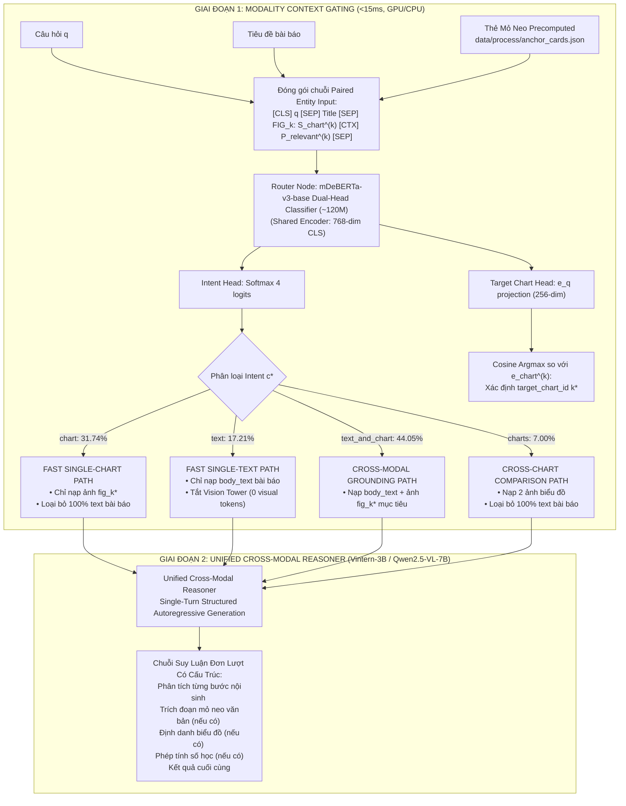
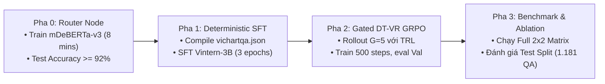

# ĐỀ XUẤT PHƯƠNG PHÁP VÀ CHIẾN LƯỢC THỰC NGHIỆM VICHARTQA: FRAMEWORK ĐỊNH TUYẾN NGỮ CẢNH PHÂN CẤP VÀ LÝ LUẬN ĐA PHƯƠNG THỨC HỢP NHẤT H-MAG (v5.2)

> **Tài liệu Kỹ thuật và Đề xuất Phương pháp luận Nghiên cứu (Scientific Research Proposal - Version 5.2)**  
> **Căn cứ thực nghiệm:** Báo cáo Khám phá Dữ liệu Toàn diện (`docs/05_EDA_REPORT.md`), Nhật ký Tiến hóa Phương pháp luận (`docs/draft_idea.md`), và Bộ dữ liệu chuẩn hóa ([`data/process/vichartqa.json`](file:///c:/Users/Admin/HUIT%20-%20H%E1%BB%8Dc%20T%E1%BA%ADp/N%C4%83m%203/Research/data/process/vichartqa.json), 1.242 tài liệu, 8.851 QA).  
> **Tham chiếu học thuật nền tảng:**
>
> 1. *DocHop: Integrated Chart-Context Reasoning in Document-Style Images* — ICML 2026 (arXiv:2609.02059).
> 2. *MultiChartQA: Benchmarking Vision-Language Models on Multiple Charts* — NAACL 2025 (arXiv:2410.14179).
> 3. *ChartAgent: Investigating Multimodal Agents for Complex Chart Reasoning* — NeurIPS 2025 Oral.
> 4. *DeepSeek-R1: Incentivizing Reasoning Capability in LLMs via Reinforcement Learning* — arXiv:2501.12948.
> 5. *Math-Shepherd: Verify and Reinforce LLMs Step-by-step without Human Annotations* — ACL 2024 (arXiv:2312.08935).
> 6. *DeBERTaV3: Improving DeBERTa using ELECTRA-Style Pre-Training with Gradient-Disentangled Embedding Sharing* — ICLR 2023.
> 7. *SelectiveNet: A Deep Neural Network with an Integrated Reject Option* — NeurIPS 2019.

---

## MỤC LỤC CHI TIẾT

1. [Định Nghĩa Hình Thức Bài Toán, Bảng Thuật Ngữ & Ký Hiệu Học Thuật](#1-định-nghĩa-hình-thức-bài-toán-bảng-thuật-ngữ--ký-hiệu-học-thuật)
   - 1.1. Phát biểu bài toán ViChartQA
   - 1.2. Bảng thuật ngữ và ký hiệu hình thức & Lược đồ dữ liệu thực nghiệm (Nomenclature & Schema Grounding Table)
2. [Đặc Tả Dữ Liệu Thực Nghiệm ViChartQA & Bản Chất Đồ Thị Hai Phía](#2-đặc-tả-dữ-liệu-thực-nghiệm-vichartqa--bản-chất-đồ-thị-hai-phía)
   - 2.1. Thống kê kiểm toán tập dữ liệu chuẩn hóa
   - 2.2. Bản chất Đồ thị Hai phía (Bipartite Cross-Modal Graph)
3. [Năm (05) Điểm Nghẽn Phương Pháp Luận & Đề Xuất Tiếp Cận Theo Lát Cắt Dữ Liệu](#3-năm-05-điểm-nghẽn-phương-pháp-luận--đề-xuất-tiếp-cận-theo-lát-cắt-dữ-liệu)
   - 3.1. Điểm nghẽn 1: Quá tải nhận thức ở Single-Hop & Cơ chế Fast Direct Paths
   - 3.2. Điểm nghẽn 2: Bất đối xứng tiêu đề đa biểu đồ & Thẻ Mỏ neo Tiền lập chỉ mục
   - 3.3. Điểm nghẽn 3: Bản chất suy luận bắc cầu Multi-Hop & Cơ chế CoT nội sinh
   - 3.4. Điểm nghẽn 4: Hạn chế của kiến trúc rời rạc & Unified Cross-Modal Reasoner
   - 3.5. Điểm nghẽn 5: Rủi ro sụp đổ chiều trực giao, bẫy né phạt Bayes & Gated DT-VR
   - 3.6. Ma trận ánh xạ Điểm nghẽn - Lát cắt dữ liệu - Cơ chế giải quyết
4. [Hệ Thống Baseline SOTA & Ma Trận Thực Nghiệm Thừa Số 2x2 Đối Xứng](#4-hệ-thống-baseline-sota--ma-trận-thực-nghiệm-thừa-số-2x2-đối-xứng)
   - 4.1. Tiêu chí lựa chọn mô hình đối chuẩn (ChartQA, DocVQA, OCRBench)
   - 4.2. Bảng phân tầng mô hình tham chiếu (Tier 1, Tier 2, Tier 3)
   - 4.3. Cơ sở khoa học lựa chọn mô hình hạt nhân Vintern-3B-beta
   - 4.4. Ma trận thực nghiệm thừa số 2x2 cốt lõi (Primary Benchmark trên Vintern-3B)
   - 4.5. Ma trận thực nghiệm thừa số 2x2 mở rộng (Scalability Benchmark trên Qwen2.5-VL-7B)
   - 4.6. Baseline đơn phương thức khử biến nhiễu ngoại lai (Unimodal Baselines)
5. [Kiến Trúc Đề Xuất: H-MAG Framework (Two-Stage Modality-Gated Pipeline)](#5-kiến-trúc-đề-xuất-h-mag-framework-two-stage-modality-gated-pipeline)
   - 5.1. Tổng quan luồng điều phối hai giai đoạn
   - 5.2. Thẻ Mỏ neo Đa phương thức Tiền lập chỉ mục (Precomputed Anchor Cards)
   - 5.3. Đặc tả chi tiết Tầng 1: Router Node & Modality Context Gating
   - 5.4. Fast Direct Paths: Luồng tối ưu đơn chặng cho nhóm `chart` và `text`
   - 5.5. Cơ chế Lý luận Bắc cầu Nội sinh cho Multi-Hop (`text_and_chart` và `charts`)
   - 5.6. Tầng 2: Unified Cross-Modal Reasoner với Phân tầng Tốc độ học (Hierarchical LRs)
6. [Chiến Lược Huấn Luyện & Hàm Thưởng Tham Số Hóa Gated DT-VR (v5.2)](#6-chiến-lược-huấn-luyện--hàm-thưởng-tham-số-hóa-gated-dt-vr-v52)
   - 6.0. Pha 0: Tiền huấn luyện Router Node Siêu Nhẹ (mDeBERTa-v3-base với In-Batch Negatives)
   - 6.1. Pha 1: Adaptive SFT qua Quy trình Tuần tự hóa Tất định (Deterministic Serialization)
   - 6.2. Pha 2: Single-Turn GRPO với FP32 Accumulation & Phân tầng Tốc độ học
   - 6.3. Công thức toán học hàm thưởng phân luồng Gated DT-VR v5.2 (Chuẩn hóa 4 Thành phần Sư phạm)
   - 6.4. Phân định vai trò AST Sanitizer giữa Huấn luyện (Reward) và Suy luận (Inference)
7. [Thiết Kế Thực Nghiệm Bóc Tách (Ablation Matrix) & Thang Đo Đánh Giá](#7-thiết-kế-thực-nghiệm-bóc-tách-ablation-matrix--thang-đo-đánh-giá)
   - 7.1. Bảng đối chiếu 7 chiều phương pháp luận
   - 7.2. Kế hoạch bóc tách thành phần (7 Ablation Experiments)
   - 7.3. Kế hoạch quét siêu tham số (Hyperparameter Grid Search Matrix)
   - 7.4. Bộ chỉ số đo lường học thuật & 4 Lát cắt trực giao thực nghiệm
8. [Phân Bổ Ngân Sách Phần Cứng & Quy Chuẩn Kỹ Thuật Triển Khai](#8-phân-bổ-ngân-sách-phần-cứng--quy-chuẩn-kỹ-thuật-triển-khai)
   - 8.1. Ước tính phân bổ VRAM trên GPU RTX 5090 (32GB) / RTX 4090 (24GB)
   - 8.2. Quy chuẩn kỹ thuật triển khai mã nguồn
9. [Lộ Trình Kiểm Thử Thực Nghiệm Phân Tầng (Staged Rollout Plan)](#9-lộ-trình-kiểm-thử-thực-nghiệm-phân-tầng-staged-rollout-plan)
10. [Tổng Kết Bản Đề Xuất & Khả Năng Đóng Góp Khoa Học](#10-tổng-kết-bản-đề-xuất--khả-năng-đóng-góp-khoa-học)
11. [Tài Liệu Tham Khảo (References)](#11-tài-liệu-tham-khảo-references)

---

## 1. ĐỊNH NGHĨA HÌNH THỨC BÀI TOÁN, BẢNG THUẬT NGỮ & KÝ HIỆU HỌC THUẬT

### 1.1. Phát Biểu Bài Toán ViChartQA

Cho một tập hợp các tài liệu tin tức đa phương thức $\mathcal{D} = \{d_1, d_2, \dots, d_{|\mathcal{D}|}\}$. Mỗi tài liệu $d \in \mathcal{D}$ bao gồm:

- Tiêu đề bài viết $\mathcal{T}_{\mathrm{title}}$ và toàn văn ngữ cảnh $\mathcal{T}_{\mathrm{body}}$ chứa các thẻ định vị `[CHART N]`.
- Danh sách các ảnh biểu đồ đính kèm $\mathcal{I}_{\mathrm{charts}} = \{\mathrm{fig}_1, \dots, \mathrm{fig}_K\}$ ($1 \le K \le 3$), trong đó tiêu đề biểu đồ nằm trực tiếp trên bề mặt ảnh pixel mà không có siêu dữ liệu văn bản.

Với mỗi câu hỏi truy vấn $q$, mục tiêu của hệ thống là xác định câu trả lời chuẩn xác $y \in \mathcal{Y}$ dựa trên chứng cứ từ văn bản, biểu đồ hoặc sự kết hợp bắc cầu đa phương thức giữa hai nguồn tin.

### 1.2. Bảng Thuật Ngữ & Ký Hiệu Hình Thức (Nomenclature & Schema Grounding Table)

Nhằm triệt tiêu tình trạng "ngắt kết nối ký hiệu" và giúp người đọc nắm bắt ngay nguồn gốc của từng biến số trong bộ dữ liệu thực tế, bảng dưới đây ánh xạ trực tiếp các ký hiệu toán học hình thức sang cấu trúc trường dữ liệu của [`data/process/vichartqa.json`](file:///c:/Users/Admin/HUIT%20-%20H%E1%BB%8Dc%20T%E1%BA%ADp/N%C4%83m%203/Research/data/process/vichartqa.json):

| Ký Hiệu / Biến Số | Định Nghĩa Hình Thức | Trường Dữ Liệu Trong `vichartqa.json` & Minh Họa Thực Tế | Vai Trò & Ý Nghĩa Học Thuật |
| :--- | :--- | :--- | :--- |
| $\mathcal{D}$ | Toàn bộ không gian bài toán | File `vichartqa.json` ($1.242$ tài liệu, $8.851$ cặp QA). | Không gian nghiên cứu chuẩn hóa độc lập. |
| $\mathcal{T}_{\mathrm{title}}$ | Tiêu đề văn bản bài viết | Trường `title` (ví dụ: *"Thị trường căn hộ Hà Nội và TP.HCM..."*). | Cung cấp ngữ cảnh thực thể cấp cao cho Router Tầng 1. |
| $\mathcal{T}_{\mathrm{body}}$ | Toàn văn bài viết chứa `[CHART N]` | Trường `body_text` (~1.250 từ tiếng Việt). | Ngữ cảnh văn bản đầy đủ chứa các mỏ neo điều kiện. |
| $q$ | Câu hỏi truy vấn đa phương thức | Trường `question` (ví dụ: *"Tỷ lệ hấp thụ ở Hà Nội cao hơn biểu đồ bao nhiêu %?"*). | Đầu vào truy vấn chính cho cả Router và Reasoner. |
| $y^*, \mathcal{Y}^*$ | **Đáp án chuẩn (Ground-truth Answer)** | Trường `answer` (ví dụ: `"11"`, `"-3.5%"`, `"0%"`, `"Hà Nội"`, `"unanswerable"`). | Mốc tham chiếu tối hậu để tính phần thưởng $R_{\mathrm{outcome}}$ và $R_{\mathrm{refusal}}$. |
| $y_{\mathrm{ans}}$ | **Đáp án mô hình dự đoán** | Chuỗi nội dung trích xuất bên trong cặp thẻ `<answer>...</answer>`. | Đầu ra kết luận của Unified Reasoner được đưa vào hàm thưởng. |
| $q_{\mathrm{gt}}$ | Chuỗi trích dẫn mỏ neo chuẩn | Trường `quote` trong `evidence` (ví dụ: *"Tỷ lệ hấp thụ nửa đầu năm 2023..."*). | Căn cứ văn bản ground-truth để tính $R_{\mathrm{quote}}$ (Token-F1). |
| $q_{\mathrm{pred}}$ | Chuỗi trích dẫn mô hình đưa ra | Chuỗi trích xuất bên trong cặp thẻ `<quote>...</quote>`. | Bằng chứng mỏ neo do mô hình tự trích dẫn từ $\mathcal{T}_{\mathrm{body}}$. |
| $k^*, \mathrm{fig}_{k^*}$ | Biểu đồ mục tiêu chuẩn | Trường `chart_id` (ví dụ: `"fig2"`). | Nhãn giám sát mục tiêu của Router Head 2 và thẻ `<chart_id>`. |
| $\mathcal{E}_{\mathrm{gt}}$ | Biểu thức tính toán chuẩn | Trường `derivation` (ví dụ: `"109 - 98"`). | Tập toán hạng ground-truth $\mathcal{O}_{\mathrm{gt}}$ để đo $R_{\mathrm{process}}^{\mathrm{math}}$ qua AST IoU. |
| $\text{expr}_{\mathrm{pred}}$ | Biểu thức tính toán mô hình sinh | Chuỗi biểu thức bên trong cặp thẻ `<calc>...</calc>`. | Được nạp vào AST Evaluator để kiểm tra tính bảo toàn kết quả. |
| $o_i$ | Chuỗi phản hồi hoàn chỉnh | Chuỗi sinh từ `<think>` đến `</answer>` ở rollout $i$. | Toàn bộ quỹ đạo lời giải của chính sách $\pi_\theta(o \mid q)$. |
| $L = \vert o_i\vert$ | Độ dài chuỗi phản hồi sinh ra | Số lượng tokens của $o_i$ do tokenizer của mô hình đo lường. | Biến đầu vào duy nhất của hàm phạt độ dài $R_{\mathrm{length}}$. |
| $\mathcal{S}_{\mathrm{c}}, \mathcal{S}_{\mathrm{t}}$ | Lát cắt đơn chặng: `chart` (31.74%) và `text` (17.21%) | Suy ra từ trường `evidence` (chỉ chứa `chart` hoặc chỉ chứa `text`). | Kích hoạt Fast Direct Paths, triệt tiêu 100% nhiễu phương thức thừa. |
| $\mathcal{S}_{\mathrm{tc}}, \mathcal{S}_{\mathrm{cc}}$ | Lát cắt đa chặng: `text_and_chart` (44.05%) và `charts` (7.00%) | Suy ra từ trường `evidence` (chứa cả hai nguồn tin hoặc chứa $\ge 2$ biểu đồ). | Kích hoạt chuỗi suy luận CoT nội sinh bắc cầu đa phương thức. |
| $\mathcal{S}_{\mathrm{unans}}$ | Lát cắt câu hỏi vô nghiệm (5.39%) | Trường `answer` mang giá trị `"unanswerable"`. | Kiểm định ranh giới tri thức và kích hoạt $R_{\mathrm{refusal}}$ 4 trạng thái. |
| **H-MAG** | *Hierarchical Modality-Aware Grounding* | Framework 2 giai đoạn đề xuất: Tầng 1 Router $\to$ Tầng 2 Reasoner. | Khung kiến trúc tổng thể phiên bản v5.2. |
| **Router Node** | Bộ phân loại đa nhiệm `mDeBERTa-v3` | Mô hình phân loại intent và định vị biểu đồ mục tiêu trong $< 15\,\text{ms}$. | Tầng 1 tiền lọc ngữ cảnh, triệt tiêu ô nhiễm token chú ý. |
| **Unified Reasoner** | VLM hạt nhân `Vintern-3B-beta` | Mô hình sinh chuỗi Structured CoT 1 lượt duy nhất trên context sạch. | Tầng 2 hợp nhất thị giác và ngôn ngữ không cần hoán đổi LoRA. |
| **Gated DT-VR** | *Gated Derivation-Trajectory Verifiable Reward* | Hàm thưởng tổng hợp RLVR v5.2 có cổng nhân và ma trận 4 trạng thái. | Cung cấp tín hiệu gradient kiểm chứng quỹ đạo toán học và trích dẫn. |
| $\mathcal{C}_{\mathrm{struct}}$ | Tập hằng số cấu trúc toán học | $\{0, 1\} \cup \{10, 100, 1000, 10000\} \cup \{2, 3, 4, 12\}$. | Loại trừ khỏi phép so khớp IoU để bảo vệ các phép biến đổi tương đương. |
| $\delta_{\mathrm{tol}}(y^*)$ | **Dung sai kết hợp tự thích ứng** | $\max\left(10^{-3}, \; 0.05 \times \vert y^* \vert\right)$. | Chuẩn hóa số học: Xử lý trọn vẹn cả $y^* = 0$, $y^* < 0$ và số nhỏ. |
| $L_{\mathrm{soft}}, L_{\mathrm{hard}}$ | Ngưỡng phạt mềm và trần phạt cứng | $L_{\mathrm{soft}} = 512$ tokens; $L_{\mathrm{hard}} = 1.024$ tokens. | Kiểm soát độ súc tích của chuỗi CoT, bảo vệ VRAM GPU. |
| $\kappa_{\mathrm{correct}}$ | Hệ số chiết khấu phạt độ dài | $\kappa \in (0, 1)$ (mặc định $1.0$). | Giảm nhẹ hình phạt cho các lời giải CoT chi tiết nhưng chính xác. |

---

## 2. ĐẶC TẢ DỮ LIỆU THỰC NGHIỆM VICHARTQA & BẢN CHẤT ĐỒ THỊ HAI PHÍA

### 2.1. Thống Kê Kiểm Toán Tập Dữ Liệu Chuẩn Hóa

Dữ liệu chuẩn hóa tại [`data/process/vichartqa.json`](file:///c:/Users/Admin/HUIT%20-%20H%E1%BB%8Dc%20T%E1%BA%ADp/N%C4%83m%203/Research/data/process/vichartqa.json) được phân chia cố định theo tỷ lệ Train/Val/Test:

| Đặc Trưng Dữ Liệu                               | Toàn Bộ (All)    | Train Split (76.53%) | Val Split (10.12%) | Test Split (13.34%) | Đặc Trưng Phân Bố & Bản Chất Xử Lý             |
| :----------------------------------------------------- | :------------------- | :--------------------- | :------------------- | :-------------------- | :-------------------------------------------------------- |
| **Tổng số tài liệu**                             | **1.242**          | 950                  | 126                | 166                 | Tài liệu báo chí kinh tế - xã hội tiếng Việt   |
| **Tổng số câu hỏi QA**                           | **8.851**          | **6.774**            | **896**            | **1.181**           | Trung bình 7.1 câu hỏi/tài liệu                    |
| **1. Single-Chart (`chart`)**                        | **2.809** (31.74%) | 2.148                | 287                | 374                 | Fast Path: Nạp duy nhất 1 biểu đồ mục tiêu       |
| **2. Single-Text (`text`)**                          | **1.523** (17.21%) | 1.168                | 154                | 201                 | Fast Path: Tắt Vision Tower (0 visual tokens)          |
| **3. Text & Chart (`text_and_chart`)**               | **3.899** (44.05%) | 2.985                | 394                | 520                 | DocHop Multi-Hop: Nạp text và 1 biểu đồ mục tiêu |
| **4. Multi-Chart (`charts`)**                        | **620** (7.00%)    | 473                  | 61                 | 86                  | Đối chiếu chéo: Nạp 2 ảnh, bỏ qua 100% text      |
| **Câu hỏi có phép tính (`has_derivation`)**     | **3.864** (43.66%) | 2.955                | 390                | 519                 | Đòi hỏi kiểm chứng AST Execution Invariance        |
| **Câu hỏi không thể trả lời (`unanswerable`)** | **477** (5.39%)    | 365                  | 48                 | 64                  | Đòi hỏi cơ chế từ chối chọn lọc (Chow's Rule)  |

### 2.2. Bản Chất Đồ Thị Hai Phía (Bipartite Cross-Modal Graph)

Tài liệu ViChartQA thể hiện cấu trúc đồ thị hai phía không đồng nhất: Một bên là các đoạn văn bản tin tức $\mathcal{P} = \{P_1, \dots, P_M\}$, một bên là các biểu đồ dữ liệu $\mathcal{I} = \{\mathrm{fig}_1, \dots, \mathrm{fig}_K\}$. Các câu hỏi đòi hỏi mô hình phải xác lập đúng cạnh liên kết giữa thực thể điều kiện văn bản $e_{\mathrm{anchor}}$ và số liệu pixel $v_{\mathrm{target}}$.

---

## 3. NĂM (05) ĐIỂM NGHẼN PHƯƠNG PHÁP LUẬN & ĐỀ XUẤT TIẾP CẬN THEO LÁT CẮT DỮ LIỆU


### 3.1. Điểm Nghẽn 1: Quá Tải Nhận Thức Ở Nhóm Single-Hop & Cơ Chế Fast Direct Paths

- **Lát cắt dữ liệu chịu ảnh hưởng:** $48.94\%$ dữ liệu Single-Hop (`chart`: $31.74\%$, `text`: $17.21\%$).
- **Điểm nghẽn thực nghiệm:** Đối với các mô hình VLM nhỏ ($\le 8$B), việc nạp đồng thời văn bản dài (~1.250 từ) và toàn bộ các biểu đồ khiến ma trận chú ý $\mathrm{Softmax}(QK^T / \sqrt{d_k})$ bị phân tán nghiêm trọng. Ở nhóm `chart`, văn bản xung quanh gây nhiễu khiến mô hình đoán mò (*Visual Shortcuts*); ở nhóm `text`, việc nạp token thị giác làm tăng độ trễ suy luận gấp 3 lần một cách vô ích.
- **Cơ chế kỹ thuật giải quyết:** Tầng 1 (Modality Context Gater) phân loại intent và kích hoạt **Fast Direct Paths**:
  - Nhóm `chart`: Nạp duy nhất 1 ảnh biểu đồ mục tiêu, loại bỏ toàn bộ bài báo văn bản.
  - Nhóm `text`: Nạp duy nhất văn bản bài báo, tắt hoàn toàn Vision Tower ($0$ visual tokens).

### 3.2. Điểm Nghẽn 2: Bất Đối Xứng Tiêu Đề Trong Tài Liệu Đa Biểu Đồ & Thẻ Mỏ Neo Tiền Lập Chỉ Mục

- **Lát cắt dữ liệu chịu ảnh hưởng:** $37.52\%$ tài liệu chứa 2–3 biểu đồ ($466$ bài báo).
- **Điểm nghẽn thực nghiệm:** $100\%$ câu hỏi không chứa thẻ `[CHART N]`. Tiêu đề biểu đồ nằm trên ảnh pixel, không có trong metadata. Văn bản lân cận thẻ `[CHART N]` thường là chú thích CMS (*"Nguồn: VNDIRECT"*) hoặc tiêu đề của tiểu mục kế tiếp, gây gán nhầm biểu đồ nếu chỉ so khớp chuỗi cục bộ.
- **Cơ chế kỹ thuật giải quyết:** Xây dựng **Thẻ Mỏ neo Đa phương thức Tiền lập chỉ mục (Precomputed Anchor Cards $\mathcal{A}_k$)** ngoại tuyến: VLM tóm tắt đặc trưng thị giác $\mathcal{S}_{\mathrm{chart}}^{(k)}$, thuật toán BM25 tìm đoạn văn tác giả bình luận trực tiếp $P_{\mathrm{relevant}}^{(k)}$. Cặp thông tin này được lưu sẵn trong RAM và trực tiếp đưa vào đầu vào của Router Node để định vị chính xác biểu đồ mục tiêu.

### 3.3. Điểm Nghẽn 3: Bản Chất Suy Luận Bắc Cầu Multi-Hop & Cơ Chế CoT Nội Sinh

- **Lát cắt dữ liệu chịu ảnh hưởng:** $51.06\%$ dữ liệu Multi-Hop, gồm `text_and_chart` ($44.05\%$) và `charts` ($7.00\%$).
- **Điểm nghẽn thực nghiệm:** Bản chất câu hỏi `text_and_chart` là liên kết tuần tự (*DocHop*): thực thể điều kiện $e_{\mathrm{anchor}}$ nằm trong văn bản dẫn đường tới số liệu $v_{\mathrm{target}}$ trên biểu đồ. Nếu chia nhỏ thành hệ thống Multi-Agent nhiều lượt gọi qua lại, việc tối ưu hóa RL bị bế tắc do lỗi phân bổ trách nhiệm nhiều lượt (Multi-Turn Credit Assignment).
- **Cơ chế kỹ thuật giải quyết:** Thay vì chạy DAG nhiều trạm rời rạc, Unified Reasoner xử lý chuỗi bắc cầu **nội sinh trong 1 lượt sinh tự hồi quy duy nhất (Internal Cross-Modal CoT)**: Phân tích bước giải trong `<think>`, trích xuất mỏ neo vào `<quote>`, trích số liệu vào `<calc>`, và xuất đáp án vào `<answer>`, bảo toàn tính hội tụ của Single-Turn GRPO.

### 3.4. Điểm Nghẽn 4: Hạn Chế Của Kiến Trúc Rời Rạc & Unified Cross-Modal Reasoner

- **Điểm nghẽn lý thuyết:** Nếu dùng mô hình đơn khối tự trị bắt VLM tự sinh `<route>` ở đầu chuỗi CoT, prompt bắt buộc phải nạp full bài báo và ảnh ngay từ đầu $\implies$ ma trận chú ý bị ô nhiễm toàn bộ, Fast Path mất tác dụng. Ngược lại, nếu dùng nhiều LoRA rời rạc thì bị trễ hoán đổi adapter và sai lệch tín hiệu gradient khi perception đọc sai số.
- **Cơ chế kỹ thuật giải quyết (Two-Stage Decoupled Framework):**
  - **Tầng 1:** Router Node siêu nhẹ độc lập (<15ms, <500MB VRAM) gọt bỏ triệt để nhiễu ngoại vi trước khi nạp dữ liệu.
  - **Tầng 2:** Unified Cross-Modal Reasoner (`Vintern-3B`) chỉ tập trung năng lực suy luận chuỗi sạch, **không cần sinh thẻ `<route>` thừa thãi**, kết hợp **Phân tầng tốc độ học (Hierarchical LRs)** để bảo toàn biểu diễn thị giác gốc.

### 3.5. Điểm Nghẽn 5: Rủi Ro Sụp Đổ Chiều Trực Giao, Bẫy Né Phạt Bayes & Gated DT-VR v5.2

- **Lát cắt dữ liệu chịu ảnh hưởng:** $43.66\%$ câu hỏi số học (`has_derivation == True`) và $5.39\%$ câu hỏi từ chối (`unanswerable`).
- **Điểm nghẽn thực nghiệm:**
  - *Sụp đổ chiều trực giao (HZ-11):* Trong 3.864 câu hỏi có phép tính, có tới **1.886 câu thuộc nhóm `text_and_chart` (48.81%)**. Nếu chỉ chấm điểm `<calc>` và bỏ qua `<quote>`, mô hình sẽ học thói quen bịa đặt chứng cứ (*Citation Hacking*).
  - *Phần thưởng rỗng (Vacuous Reward):* Không gian số mở rộng $\mathcal{N}_{\mathrm{doc}}$ chứa toàn bộ số trong bài báo khiến mô hình bốc số ngẫu nhiên vẫn đạt $R_{\mathrm{process}} = 1.0$.
  - *Bẫy né phạt Bayes trong hàm thưởng từ chối (Penalty Evasion Policy Trap):* Thiết kế phạt nhị phân cũ phạt nặng việc từ chối nhầm ($-\beta = -3.0$) trong khi đoán mò bừa bãi khi câu hỏi không có đáp án chỉ nhận điểm 0.0 $\implies$ mô hình thà đoán mò bịa đặt còn hơn là từ chối, gây sụp đổ hoàn toàn năng lực từ chối chọn lọc trên tập $\mathcal{S}_{\mathrm{unans}}$.
  - *Bùng nổ gradient độ dài:* Phạt độ dài gộp cả prompt đầu vào khiến baseline đơn khối bị phạt oan.
- **Cơ chế kỹ thuật giải quyết (Gated DT-VR v5.2):**
  - **Hàm thưởng tổng hòa:** $R_{\mathrm{process}} = 0.5 R_{\mathrm{math}} + 0.5 R_{\mathrm{sem}}$ cho nhóm `text_and_chart` có tính toán.
  - **AST Execution Invariance & Safe Grounding IoU:** So khớp trực tiếp với $\mathcal{O}_{\mathrm{gt}}$, loại trừ tập hằng số cấu trúc $\mathcal{C}_{\mathrm{struct}}$, an toàn chuỗi rỗng.
  - **Ma trận thưởng phạt từ chối 4 trạng thái (4-State Decision Matrix):** Phạt nặng hành vi bịa đặt khi câu hỏi vô nghiệm ($-1.0$), phạt nhẹ từ chối nhầm ($-0.5$), thưởng từ chối đúng ($+1.0$), thiết lập Incentive Margin $\Delta R = +2.0$ triệt tiêu động cơ đoán mò.
  - **Phạt độ dài phản hồi trơn loại $C^0$ có sàn bảo vệ:** Chỉ tính trên chuỗi sinh phản hồi ($\vert o_i \vert$), tách biệt hoàn toàn khỏi prompt, chặn sàn tại $-1.0$.

### 3.6. Bảng Ma Trận Ánh Xạ Điểm Nghẽn - Lát Cắt Dữ Liệu - Cơ Chế Giải Quyết

| Điểm Nghẽn Phương Pháp Luận                      | Lát Cắt Dữ Liệu Chịu Ảnh Hưởng                                     | Trọng Tâm Khó Khăn                                                        | Cơ Chế Giải Quyết Của H-MAG v5.2                                                                                      | Vị Trí Trình Bày   |
| :-------------------------------------------------------- | :--------------------------------------------------------------------------- | :------------------------------------------------------------------------------ | :--------------------------------------------------------------------------------------------------------------------------- | :----------------------- |
| **1. Quá tải nhận thức ở Single-Hop**              | `chart` (31.74%), `text` (17.21%)                                          | Nhiễu ngữ cảnh từ phương thức không liên quan, tăng độ trễ       | Fast Direct Paths qua tiền lọc ngữ cảnh ở Tầng 1                                                                     | **Mục 5.1, 5.3, 5.4** |
| **2. Bất đối xứng tiêu đề đa biểu đồ**       | 37.52% tài liệu đa biểu đồ; nhóm`chart`, `charts`, `text_and_chart` | Tiêu đề nằm trên ảnh, text lân cận mang tính nhiễu hoặc sai lệch  | Thẻ Mỏ neo$\mathcal{A}_k$ tích hợp $P_{\mathrm{relevant}}$ đóng gói vào Router Input                               | **Mục 5.2, 5.3**      |
| **3. Đứt gãy chuỗi suy luận Multi-Hop**            | `text_and_chart` (44.05%) và `charts` (7.00%)                             | Phụ thuộc tuần tự DocHop; phân rã nhiều turn làm gãy thuật toán RL | Lý luận Bắc cầu Nội sinh (Internal CoT) trong chuỗi sinh đơn lượt                                                | **Mục 5.5**           |
| **4. Hạn chế kiến trúc rời rạc & VLM self-route** | Quá trình học đa vai trò trên mô hình nhỏ                         | Gradient Interference, nghịch lý nạp full context để tự route           | Two-Stage Decoupled Pipeline: Router mỏng + Unified Reasoner                                                              | **Mục 5.3, 5.6**      |
| **5. Sụp đổ trực giao & Bẫy né phạt Bayes**      | `has_derivation == True` (43.66%) & `unanswerable` (5.39%)                 | Citation Hacking; Vacuous Reward; Bẫy né phạt đoán mò; Phạt oan prompt | Gated DT-VR v5.2 (Reward tổng hòa, Safe IoU $\mathcal{O}_{\mathrm{gt}}$, Ma trận 4 trạng thái, Clipped Length Penalty) | **Mục 6.3, 6.4**      |

---

## 4. HỆ THỐNG BASELINE SOTA & MA TRẬN THỰC NGHIỆM THỪA SỐ 2x2 ĐỐI XỨNG

### 4.1. Tiêu Chí Lựa Chọn Mô Hình Đối Chuẩn

Hệ thống mô hình đối chuẩn được lựa chọn dựa trên 3 tiêu chí định lượng chuẩn mực học thuật:

1. **Năng lực suy luận biểu đồ (Chart Reasoning):** Đạt điểm cao trên **ChartQA** (ACL 2022) và **CharXiv** (2024).
2. **Năng lực phân tích tài liệu đa phương thức (Document Parsing):** Đạt điểm tin cậy trên **DocVQA** (WACV 2021) và **OCRBench** (2023).
3. **Tính đại diện theo phân tầng phần cứng & kiến trúc (5 Phân Tầng):** Phân định rạch ròi giữa trần năng lực thương mại toàn cầu (Tier 1), mã nguồn mở quy mô lớn $\ge 70$B (Tier 2), kiến trúc thưa Vision-MoE (Tier 3), các mô hình cùng hạng cân hạt nhân $\le 4$B đối đầu trực tiếp với Vintern-3B (Tier 4), và các mô hình triển khai cục bộ 5B–8B trên 1 GPU 24GB (Tier 5).
   *(Tiêu chí loại trừ ngôn ngữ: Các mô hình chuyên biệt tiếng Anh như PaliGemma 2 bị loại khỏi benchmark chính thức do tokenizer và tập dữ liệu tiền huấn luyện không có khả năng đọc hiểu tiếng Việt tự nhiên phức tạp trong bài báo ViChartQA).*

### 4.2. Bảng Phân Tầng Mô Hình Tham Chiếu (Reference Baseline Hierarchy)

| Phân Tầng (Tier)                                                              | Tên Mô Hình                        | Nền Tảng / Tham Số                               | Điểm Chuẩn Đã Công Bố (DocVQA / ChartQA) | Vai Trò Học Thuật & Giả Thuyết Khảo Nghiệm                                                                                                             |
| :-------------------------------------------------------------------------------- | :-------------------------------------- | :---------------------------------------------------- | :------------------------------------------------ | :-------------------------------------------------------------------------------------------------------------------------------------------------------------- |
| **Tier 1: Proprietary Frontier***(Trần tham chiếu toàn cầu)*                | **Claude 3.7 / 3.5 Sonnet**           | Proprietary API, 200K ctx, Hybrid CoT               | DocVQA:**95.2%**ChartQA: **90.8%**              | Đo lường trần năng lực suy luận thị giác mở rộng và khả năng xử lý ngữ cảnh tài liệu siêu dài.                                          |
|                                                                                 | **GPT-4o (Omni)**                     | Proprietary API, 128K ctx                           | DocVQA:**92.8%**ChartQA: **85.7%**              | Chuẩn mực công nghiệp toàn cầu, đại diện cho năng lực zero-shot thương mại phổ biến nhất.                                                    |
|                                                                                 | **Gemini 2.0 / 2.5 Pro**              | Proprietary API, 1M–2M ctx                         | DocVQA:**93.1%**ChartQA: **87.2%**              | Khảo sát khả năng tiếp nhận toàn văn bài báo kinh tế tiếng Việt siêu dài cùng đa biểu đồ phân giải cao.                                 |
| **Tier 2: Large Open-Weight***(Mã nguồn mở quy mô lớn $\ge 70$B)*          | **Qwen2.5-VL-72B-Instruct**           | Open-weight, 72B dense, Dynamic Res                 | DocVQA:**96.4%** (SOTA)ChartQA: **89.5%**       | Đại diện mã nguồn mở cờ đầu thế giới, tiệm cận và vượt frontier models ở tác vụ phân tích tài liệu.                                    |
|                                                                                 | **InternVL2.5-78B**                   | Open-weight, 78B (InternViT-6B + InternLM2.5)       | DocVQA:**95.4%**ChartQA: **89.7%**              | Đối chứng năng lực kiến trúc InternViT ở quy mô tối đa với khả năng liên kết nhiều ảnh biểu đồ.                                          |
|                                                                                 | **Llama-3.2-90B-Vision**              | Open-weight, 90B, Cross-Attention Adapter           | DocVQA:**90.1%**ChartQA: **83.4%**              | Đại diện cho trường phái kiến trúc gắn visual adapter vào LLM nền tảng của phương Tây.                                                        |
| **Tier 3: Sparse MoE Architecture***(Kiến trúc thưa chuyên biệt 10B–30B)* | **DeepSeek-VL2**                      | Open-weight, Vision-MoE (4.5B active / 27.5B total) | DocVQA:**93.3%**ChartQA: **86.0%**              | **Đại diện kiến trúc Vision-MoE:** Kiểm chứng hiệu quả tính toán của MoE trên bài toán OCR, biểu đồ và văn bản đa ngôn ngữ.           |
| **Tier 4: Parameter-Matched SLMs***(Cùng hạng cân hạt nhân $\le 4$B)*      | **Vintern-3B-beta (Proposed Kernel)** | Local GPU, 3.7B (InternViT-300M + Qwen2.5-3B)       | Base Vietnamese Multimodal VQA                  | **Hạt nhân nghiên cứu trung tâm**: VLM tiếng Việt gốc của H-MAG, đối tượng trực tiếp của quy trình SFT và RLVR.                             |
|                                                                                 | **Vintern-3B-R-beta**                 | Local GPU, 3.7B (Reasoning SFT qua LLaVA-CoT)       | Base Vietnamese CoT VQA                         | Đối chứng năng lực suy luận CoT nội sinh sẵn có của dòng Vintern khi chưa có H-MAG và GRPO.                                                     |
|                                                                                 | **Qwen2.5-VL-3B-Instruct**            | Local GPU, 3.4B dense, Dynamic Res                  | DocVQA & ChartQA SOTA ở phân khúc 3B         | **Đối thủ cùng hạng cân trực tiếp**: Đánh giá hiệu năng của Vintern-3B bản địa tiếng Việt so với mô hình quốc tế cùng kích thước. |
|                                                                                 | **DeepSeek-VL2-Tiny**                 | Local GPU, MoE (1.0B active / 3.0B total)           | DocVQA & ChartQA optimized                      | Đối chứng mô hình MoE siêu nhẹ (chi phí suy luận chỉ tương đương 1B tham số hoạt động).                                                    |
|                                                                                 | **Vintern-1B-v3_5**                   | Local GPU, 1.2B (InternVL2.5-1B base)               | Lightweight Vietnamese VLM                      | Khảo sát cận dưới của mô hình VLM chạy được trên phần cứng edge/mobile (<4GB VRAM).                                                            |
| **Tier 5: Mid-Sized Deployable SLMs***(Phân khúc thực tế 5B–8B, GPU 24GB)* | **Qwen2.5-VL-7B-Instruct**            | Local GPU, 7.6B dense, 128K context                 | DocVQA:**95.7%**ChartQA: **87.8%**              | **Backbone quốc tế đối chuẩn**: Dùng cho ma trận mở rộng quy mô (Scalability 2x2 Matrix ở Mục 4.5).                                               |
|                                                                                 | **InternVL2.5-8B**                    | Local GPU, 8.1B (InternViT-300M + InternLM2.5-7B)   | DocVQA:**79.1%**ChartQA: **84.8%**              | Đối chứng kiến trúc visual encoder cùng họ InternViT ở quy mô 8B nhưng với LLM 7B.                                                                 |
|                                                                                 | **Phi-4-multimodal-instruct**         | Microsoft, 5.6B, Mixture-of-LoRAs                   | DocVQA:**93.2%**ChartQA: **81.4%**              | Đại diện cho mô hình compact mới nhất của Microsoft với năng lực reasoning cao.                                                                    |
|                                                                                 | **MiniCPM-V 2.6**                     | OpenBMB, 8B (SigLIP-400M + Qwen2-7B)                | DocVQA:**85.2%**ChartQA: **82.6%**              | Đại diện cho dòng mô hình nén token thị giác hiệu năng cao trên tài liệu dày đặc.                                                            |

### 4.3. Cơ Sở Khoa Học Lựa Chọn Mô Hình Hạt Nhân `Vintern-3B-beta`

ViChartQA là tập dữ liệu đặc thù với toàn văn bài báo và chú thích biểu đồ bằng tiếng Việt tự nhiên phức tạp. Vintern-3B kết hợp visual encoder InternViT-300M với LLM backbone Qwen2.5-3B-Instruct đã được tiền huấn luyện sâu trên ngữ liệu tiếng Việt, cung cấp điểm khởi đầu lý tưởng về năng lực ngôn ngữ bản địa trên phần cứng phổ thông.

---

### 4.4. Ma Trận Thực Nghiệm Thừa Số 2x2 Cốt Lõi (Primary Benchmark trên `Vintern-3B-beta`)

*Cố định 100% backbone `Vintern-3B-beta` trên cả 4 ô để cô lập hoàn toàn hiệu ứng của Kiến trúc (Factor A) và Phương pháp Tinh chỉnh (Factor B) trên 1 GPU 24GB VRAM:*

#### BẢNG 1: MA TRẬN KHẢO NGHIỆM CỐT LÕI (Mô hình Hạt nhân: `Vintern-3B-beta`)

| Trục Đánh Giá                                    | Cột 1: Kiến Trúc Đơn Khối (Monolithic Baseline)                                                                                                                                                                                                                                                             | Cột 2: Kiến Trúc H-MAG (Two-Stage Modality-Gated Framework)                                                                                                                                                                                                                                                                                                    |
| :----------------------------------------------------- | :------------------------------------------------------------------------------------------------------------------------------------------------------------------------------------------------------------------------------------------------------------------------------------------------------------------ | :------------------------------------------------------------------------------------------------------------------------------------------------------------------------------------------------------------------------------------------------------------------------------------------------------------------------------------------------------------------ |
| **Hàng 1: Không Tinh Chỉnh (Zero-Shot Baseline)** | **Ô (1) Monolithic Zero-shot:**• **Backbone:** `Vintern-3B-beta` nguyên bản.• **Phương thức:** Nạp toàn bộ text bài báo + ảnh biểu đồ vào 1 prompt CoT duy nhất.• **Mục đích:** Đo trần năng lực ban đầu của mô hình nhỏ khi bị quá tải ngữ cảnh.                           | **Ô (2) Modality-Gated Zero-shot:**• **Tiền xử lý:** Router Node `mDeBERTa-v3` phân loại và gọt ngữ cảnh.• **Backbone:** `Vintern-3B-beta` nguyên bản nhận ngữ cảnh sạch.• **Mục đích:** Đo giá trị gia tăng thuần túy của cơ chế tiền lọc ngữ cảnh khi chưa cập nhật trọng số VLM.                                       |
| **Hàng 2: Có Tinh Chỉnh (Fine-Tuned System)**     | **Ô (3) Monolithic Fine-tuned:**• **Backbone:** `Vintern-3B-beta` + 1 LoRA adapter ($r=32, \alpha=64$).• **Huấn luyện:** Direct SFT $\to$ Standard Outcome GRPO ($R = R_{\mathrm{outcome}}$) trên full context.• **Mục đích:** Đo giới hạn của phương pháp fine-tune đơn khối truyền thống. | **Ô (4) Full H-MAG (Proposed System v5.2):**• **Tầng 1:** Router Node `mDeBERTa-v3` được huấn luyện qua Joint Multi-task Loss.• **Tầng 2:** `Vintern-3B-beta` huấn luyện qua Deterministic SFT $\to$ Hierarchical LR GRPO với hàm thưởng **Gated DT-VR v5.2**.• **Mục đích:** Đo hiệu năng tối đa của toàn bộ giải pháp đề xuất. |

---

### 4.5. Ma Trận Thực Nghiệm Thừa Số 2x2 Mở Rộng (Scalability Benchmark trên `Qwen2.5-VL-7B-Instruct`)

#### BẢNG 2: MA TRẬN KHÁI QUÁT HÓA MỞ RỘNG (Backbone Quốc tế Đối chuẩn: `Qwen2.5-VL-7B-Instruct`)

| Trục Đánh Giá                                    | Cột 1: Kiến Trúc Đơn Khối (Monolithic Baseline)                                                           | Cột 2: Kiến Trúc H-MAG (Two-Stage Modality-Gated Framework)                                                    |
| :----------------------------------------------------- | :---------------------------------------------------------------------------------------------------------------- | :------------------------------------------------------------------------------------------------------------------ |
| **Hàng 1: Không Tinh Chỉnh (Zero-Shot Baseline)** | **Ô (1b) Monolithic Zero-shot:**• `Qwen2.5-VL-7B` nguyên bản nhận toàn văn bài báo + toàn bộ ảnh.   | **Ô (2b) Modality-Gated Zero-shot:**• Router Node gọt ngữ cảnh $\to$ `Qwen2.5-VL-7B` nhận ngữ cảnh sạch. |
| **Hàng 2: Có Tinh Chỉnh (Fine-Tuned System)**     | **Ô (3b) Monolithic Fine-tuned:**• `Qwen2.5-VL-7B` + LoRA huấn luyện SFT + Outcome GRPO trên full context. | **Ô (4b) Full H-MAG v5.2:**• Router Node + `Qwen2.5-VL-7B` huấn luyện Deterministic SFT + Gated DT-VR v5.2.   |

---

### 4.6. Baseline Đơn Phương Thức Khử Biến Nhiễu Ngoại Lai (Unimodal Baselines: Confounder-Free Modality Isolation)

Để bóc tách và định lượng chính xác sự đóng góp của từng phương thức (Modality Contribution Analysis) cũng như phát hiện các thiên kiến bề mặt (Superficial / Modality Biases), hệ thống thiết lập hai mô hình đối chuẩn đơn phương thức. Để tuân thủ nghiêm ngặt nguyên tắc **Khử Biến Số Gây Nhiễu Ngoại Lai (Confounding Variable Elimination)**, cả hai baseline này **bắt buộc sử dụng trực tiếp mô hình hạt nhân `Vintern-3B-beta`** (thay vì kết hợp pipeline IR ngoại lai với LLM thuần ngôn ngữ hay ghép nối visual encoder rời rạc):

1. **Text-only Baseline (`Vintern-3B-beta (Text-only)`):**

   - **Cơ chế nạp dữ liệu:** Nạp duy nhất câu hỏi $q$ và toàn văn bài báo văn bản ($\mathcal{T}_{\mathrm{body}}$). Tắt hoàn toàn nhánh thị giác (Vision Tower hoàn toàn không được kích hoạt, $0$ visual tokens).
   - **Ý nghĩa học thuật:** Đo lường trần năng lực suy luận ngôn ngữ thuần túy và phát hiện mức độ thiên kiến ngôn ngữ (Language Prior / Blind Guessing). Baseline này giúp kiểm chứng xem có bao nhiêu câu hỏi trong ViChartQA có thể được trả lời bằng suy đoán văn bản mà không cần nhìn vào biểu đồ thực tế.
2. **Chart-only Baseline (`Vintern-3B-beta (Chart-only)`):**

   - **Cơ chế nạp dữ liệu:** Nạp duy nhất câu hỏi $q$ và toàn bộ ảnh biểu đồ ($\{\mathrm{fig}_1, \dots, \mathrm{fig}_K\}$). Loại bỏ hoàn toàn $100\%$ ngữ cảnh văn bản bài báo ($0$ text context tokens).
   - **Ý nghĩa học thuật:** Đo lường năng lực thị giác và trích xuất số liệu biểu đồ thuần túy (Visual Parsing & Chart QA Capability) của VLM khi không có bất kỳ văn bản giải thích nào dẫn đường.

**Cơ sở khoa học của việc chuẩn hóa hạt nhân:** Việc giữ nguyên vẹn cùng một kiến trúc backbone (`Vintern-3B-beta`) giữa các baseline đơn phương thức và hệ thống đề xuất H-MAG đảm bảo mọi sự chênh lệch về độ chính xác (Accuracy Gain) chỉ bắt nguồn từ sự hiện diện của thông tin phương thức (Modality Information) và cơ chế định tuyến ngữ cảnh (H-MAG Pipeline), loại trừ $100\%$ các yếu tố gây nhiễu do sai khác dung lượng tham số, trọng số tiền huấn luyện hay kiến trúc mạng nơ-ron khác nhau.

---

## 5. KIẾN TRÚC ĐỀ XUẤT: H-MAG FRAMEWORK (TWO-STAGE MODALITY-GATED PIPELINE)

### 5.1. Tổng Quan Luồng Điều Phối Hai Giai Đoạn



### 5.2. Thẻ Mỏ Neo Đa Phương Thức Tiền Lập Chỉ Mục (Precomputed Anchor Cards)

Quy trình tiền lập chỉ mục ngoại tuyến (Offline Pre-indexing) thực hiện một lần duy nhất:

1. **Question-Agnostic Visual Summarizer:** VLM đọc biểu đồ ngoại tuyến trích xuất đặc trưng thị giác khách quan: $\mathcal{S}_{\mathrm{chart}}^{(k)} = \mathrm{VLM}_{\mathrm{summary}}(\mathrm{fig}_k)$.
   *Prompt:* `"Hãy đọc tiêu đề, loại biểu đồ, nhãn các trục tọa độ, đối tượng chính và đơn vị tính của ảnh biểu đồ này trong 1-2 câu ngắn gọn."` Triệt tiêu hoàn toàn nguy cơ rò rỉ thông tin câu hỏi.
2. **BM25 Narrative Linker:** Dùng $\mathcal{S}_{\mathrm{chart}}^{(k)}$ làm truy vấn tìm đoạn văn tác giả phân tích sâu nhất về biểu đồ: $P_{\mathrm{relevant}}^{(k)} = \arg\max_{P_j \in \mathcal{P}} \mathrm{BM25}\left(P_j, \, \mathcal{S}_{\mathrm{chart}}^{(k)}\right)$.
3. **Đóng gói Thẻ Mỏ Neo $\mathcal{A}_k = \langle \mathrm{fig}_k, \, \mathcal{S}_{\mathrm{chart}}^{(k)}, \, P_{\mathrm{relevant}}^{(k)} \rangle$:** Lưu vào `data/process/anchor_cards.json`. Router nạp tệp này vào RAM trong $< 1\,\text{ms}$, loại bỏ việc gọi visual encoder thời gian thực khi định tuyến.

### 5.3. Đặc Tả Chi Tiết Tầng 1: Router Node & Modality Context Gating

#### 1. Mô hình triển khai:

Sử dụng Text Classifier chuyên biệt siêu nhẹ **`mDeBERTa-v3-base`** (~120M tham số, chiếm $< 500\,\text{MB}$ VRAM, độ trễ suy luận trên GPU chỉ $5 - 8\,\text{ms}$). Mô hình hỗ trợ SentencePiece BPE (nạp chuỗi thô, $0\,\text{ms}$ tiền xử lý CPU) và giới hạn ngữ cảnh $512$ tokens.

#### 2. Chuỗi đầu vào ghép cặp thực thể (Paired Entity Input Packaging):

Để loại bỏ triệt để điểm mù đối với hai nhóm `text` và `text_and_chart`, chuỗi đầu vào ghép nối có cấu trúc:

$$
\mathbf{x} = \text{[CLS]} \circ q \circ \text{[SEP]} \circ \mathcal{T}_{\mathrm{title}} \circ \text{[SEP]} \circ \sum_{k=1}^K \Big( \text{[CHART } k \text{]} \circ \mathcal{S}_{\mathrm{chart}}^{(k)} \circ \text{ [CTX] } \circ P_{\mathrm{relevant}}^{(k)} \Big) \circ \text{[SEP]}

$$

Cấu hình trần an toàn `max_length = 450` tokens trong PyTorch DataLoader.

#### 3. Nguồn nhãn huấn luyện có giám sát (100% Ground-truth từ `evidence`):

Tận dụng toàn bộ nhãn sẵn có trong 6.774 câu hỏi Train của `data/process/vichartqa.json`:

- Chỉ chứa các bước `source == "chart"` (1 biểu đồ) $\implies$ Nhãn `chart`.
- Chỉ chứa các bước `source == "text"` $\implies$ Nhãn `text`.
- Chứa cả `text` và `chart` $\implies$ Nhãn `text_and_chart`.
- Chứa từ 2 biểu đồ trở lên $\implies$ Nhãn `charts`.

#### 4. Cơ chế dự đoán song song (Multi-Task Head):

- **Head 1 (Intent Classification Head):** Lớp tuyến tính $\mathrm{Linear}(768 \to 4)$ chiếu vector $\mathbf{h}_{\mathrm{[CLS]}}$ ra 4 logits, kích hoạt qua hàm Softmax.
- **Head 2 (Target Chart Projection Head):** Lớp tuyến tính $\mathrm{Linear}(768 \to 256)$ kèm chuẩn hóa $L_2$ chiếu vector câu hỏi thành $\mathbf{e}_q$.

#### 5. Cơ chế suy luận chọn biểu đồ mục tiêu (Inference Metric Matching):

- Vector tóm tắt biểu đồ $\mathbf{e}_{\mathrm{chart}}^{(k)}$ được tính toán ngoại tuyến sẵn trong RAM.
- Router tính tích vô hướng tức thì ($< 0.01\,\text{ms}$):

$$
k^* = \arg\max_{k \in \{1, \dots, K\}} \left( \mathbf{e}_q^T \mathbf{e}_{\mathrm{chart}}^{(k)} \right)

$$

- Fallback an toàn: Nếu tài liệu chỉ có 1 biểu đồ ($K=1$, chiếm 62.48%), mặc định chọn $k^* = 1$ ($0\,\text{ms}$). Nếu $\max P(\mathrm{intent}) < \tau_{\mathrm{route}} = 0.85$, kích hoạt Soft-Fallback nạp cả văn bản và ảnh biểu đồ mục tiêu để bảo vệ ranh giới an toàn.

### 5.4. Fast Direct Paths: Luồng Tối Ưu Đơn Chặng Cho Nhóm `chart` Và `text`

- **Fast Single-Chart Path (31.74% dữ liệu):** Nạp duy nhất ảnh $\mathrm{fig}_{k^*}$. Loại bỏ toàn bộ ~1.250 từ bài báo văn bản. Độ trễ suy luận: $0.3\text{s} - 0.5\text{s}$/mẫu.
- **Fast Single-Text Path (17.21% dữ liệu):** Nạp duy nhất văn bản bài báo vào LLM backbone, tắt hoàn toàn Vision Tower ($0$ visual tokens). Độ trễ suy luận: $0.2\text{s} - 0.3\text{s}$/mẫu.

### 5.5. Cơ Chế Lý Luận Bắc Cầu Nội Sinh Cho Multi-Hop (`text_and_chart` Và `charts`)

Thay vì chia nhỏ thành nhiều tác tử gọi vòng vo làm gãy thuật toán tối ưu hóa, Unified Reasoner xử lý suy luận bắc cầu hoàn toàn nội sinh:

- **Nhóm `text_and_chart` (44.05%):** Reasoner nhận `body_text` và ảnh $\mathrm{fig}_{k^*}$. Quá trình suy luận CoT diễn ra tuần tự:
  1. `<think>`: Lập luận phân tích mối liên hệ giữa điều kiện bài báo và biểu đồ.
  2. `<quote>`: Trích dẫn nguyên văn câu văn chứa mỏ neo $e_{\mathrm{anchor}}$.
  3. `<chart_id>`: Xác nhận định danh biểu đồ đối chiếu.
  4. `<calc>`: Thực hiện phép tính số học bắc cầu (nếu có).
  5. `<answer>`: Kết luận đáp án cuối cùng.
- **Nhóm `charts` (7.00%):** Reasoner nhận 2 ảnh biểu đồ và bỏ qua 100% bài báo văn bản, đọc mốc $v_1$ trên biểu đồ 1, đối chiếu mốc $v_2$ trên biểu đồ 2 và tính toán chênh lệch.

### 5.6. Tầng 2: Unified Cross-Modal Reasoner Với Phân Tầng Tốc Độ Học

- **Kiến trúc:** Hợp nhất trên backbone `Vintern-3B-beta`. Loại bỏ hoàn toàn thẻ `<route>` trong chuỗi output vì routing đã hoàn tất ở Tầng 1.
- **Phân tầng tốc độ học (Hierarchical Learning Rates):**
  - **Vision Tower (InternViT-300M):** Đóng băng hoàn toàn ($\eta_{\mathrm{vision}} = 0$) nhằm bảo toàn năng lực biểu diễn thị giác cơ sở.
  - **Vision-Language Projector:** Tốc độ học siêu nhỏ $\eta_{\mathrm{proj}} = 10^{-7}$ ($0.1 \times \eta_{\mathrm{llm}}$) nhằm duy trì sự ổn định của không gian nhúng liên phương thức, chống quên tri thức thị giác.
  - **LLM Backbone LoRA (rank=32, alpha=64):** Tốc độ học $\eta_{\mathrm{llm}} = 10^{-6}$ để tối ưu hóa năng lực suy luận chuỗi có cấu trúc.
- **Hiệu năng thực thi:** Triệt tiêu hoàn toàn chi phí hoán đổi adapter ($0\,\text{ms}$ overhead), loại bỏ rủi ro sai lệch gradient giữa các module rời rạc, và duy trì dung lượng VRAM cố định.

---

## 6. CHIẾN LƯỢC HUẤN LUYỆN & HÀM THƯỞNG THAM SỐ HÓA GATED DT-VR (v5.2)

### 6.0. Pha 0: Tiền Huấn Luyện Router Node Siêu Nhẹ (`mDeBERTa-v3-base` Với In-Batch Negatives)

- **Tập dữ liệu:** 6.774 mẫu Train trích xuất từ trường `evidence` của [`data/process/vichartqa.json`](file:///c:/Users/Admin/HUIT%20-%20H%E1%BB%8Dc%20T%E1%BA%ADp/N%C4%83m%203/Research/data/process/vichartqa.json).
- **Cấu hình:** 3 epochs, learning rate $3 \times 10^{-5}$, AdamW, batch size 32, hoàn thành trong ~8 phút trên 1 GPU RTX 4090/5090.

#### 1. Động Lực Thực Tế & Điểm Nghẽn Cần Giải Quyết:
Router Node cần học song song hai tác vụ: (1) Phân loại ý định dữ liệu (`intent`), và (2) Định vị biểu đồ mục tiêu (`chart_id`). Trong đó, tác vụ định vị biểu đồ được tối ưu qua hàm Supervised Contrastive Loss (InfoNCE).  
Tuy nhiên, kiểm toán dữ liệu cho thấy có tới **$62.48\%$ tài liệu trong ViChartQA chỉ chứa duy nhất $1$ biểu đồ ($K=1$)**. Nếu chỉ tính InfoNCE nội bộ từng bài báo, khi $K=1$, phân số trong hàm mất mát chỉ có 1 số hạng ở mẫu số $\implies \mathcal{L}_{\mathrm{chart}} = -\log(1) = 0.0 \implies \nabla = 0$. Hậu quả là Target Chart Head bị đóng băng gradient trên gần hai phần ba dữ liệu!  
Để giải quyết triệt để điểm nghẽn này mà không làm lãng phí dữ liệu, nghiên cứu áp dụng cơ chế **In-Batch Cross-Document Negatives** (chuẩn SimCLR/CLIP).

#### 2. Công Thức Toán Học Chuẩn Xác:
Hàm mất mát liên hợp (Joint Multi-Task Loss):

$$
\mathcal{L}_{\mathrm{router}} = \mathcal{L}_{\mathrm{intent}} + \lambda_{\mathrm{chart}} \cdot \mathcal{L}_{\mathrm{chart}}
$$

Trong đó:

1. $\mathcal{L}_{\mathrm{intent}}$ là Cross-Entropy 4 lớp:

$$
\mathcal{L}_{\mathrm{intent}} = -\sum_{c=1}^4 \mathbb{I}(y_{\mathrm{intent}} = c) \log P(c \mid \mathbf{x})
$$

2. $\mathcal{L}_{\mathrm{chart}}$ là Contrastive Loss với In-Batch Cross-Document Negatives:

$$
\mathcal{L}_{\mathrm{chart}} = -\frac{1}{|\mathcal{B}_{\mathrm{chart}}|} \sum_{b \in \mathcal{B}_{\mathrm{chart}}} \left[ \frac{\mathbf{e}_{q, b}^T \mathbf{e}_{k^*, b}}{\tau} - \log \sum_{j \in \mathcal{N}_{\mathrm{in\_batch}}(b)} \exp\left( \frac{\mathbf{e}_{q, b}^T \mathbf{e}_j}{\tau} \right) \right]
$$

với $\tau = 0.07$, $\lambda_{\mathrm{chart}} = 0.5$, và $\mathcal{B}_{\mathrm{chart}}$ là tập các mẫu trong mini-batch có nhãn biểu đồ mục tiêu. Cả vector truy vấn $\mathbf{e}_q$ và vector biểu đồ $\mathbf{e}_j$ đều được chuẩn hóa $L_2$ ($\|\mathbf{e}\|_2 = 1$). Biểu thức được tính toán qua `torch.log_softmax` (Log-Sum-Exp trick) để bảo đảm ổn định số học.

#### 3. Cơ Chế Vận Hành Trực Quan:
Tập mẫu âm $\mathcal{N}_{\mathrm{in\_batch}}(b)$ bao gồm biểu đồ mục tiêu của câu hỏi $b$, các biểu đồ khác trong cùng bài báo $b$, và **toàn bộ biểu đồ của các bài báo khác trong cùng mini-batch**. Ngay cả khi bài báo chỉ có 1 biểu đồ ($K=1$), biểu đồ này vẫn được đối chiếu phân biệt với các biểu đồ của các bài báo khác. Target Chart Head liên tục nhận tín hiệu gradient để học không gian nhúng phân tách biểu đồ.

#### 4. Minh Họa Thực Tế Bằng Dữ Kiện ViChartQA:
Xét mini-batch kích thước $B=2$:
- Tài liệu 1 (Báo cáo CBRE, $K=2$): $\text{fig}_1$ (Cơ cấu nguồn cung), $\text{fig}_2$ (Tỷ lệ hấp thụ). Câu hỏi: *"Tỷ lệ hấp thụ tại Hà Nội..."* $\implies$ Cặp dương là $(\mathbf{e}_q, \mathbf{e}_{\text{fig}_2})$. Mẫu âm nội bộ là $\text{fig}_1$.
- Tài liệu 2 (Báo cáo VCSC, $K=1$): $\text{fig}_1$ (Thị phần môi giới).
- Theo cơ chế In-batch, mẫu số của câu hỏi 1 chứa cả $\text{fig}_1$ của VCSC làm mẫu âm. Ngược lại, câu hỏi của VCSC ($K=1$) lấy cả 2 biểu đồ của CBRE làm mẫu âm. Cả 2 tài liệu đều được cập nhật gradient hoàn hảo.

---

### 6.1. Pha 1: Adaptive SFT Qua Quy Trình Tuần Tự Hóa Tất Định (Deterministic Serialization)

Thay vì phải sinh thêm dữ liệu CoT ngoại vi tốn kém từ các mô hình thương mại (như GPT-4o hay Gemini API), nghiên cứu áp dụng **Quy trình Tuần tự hóa SFT Tất định** biên dịch trực tiếp $100\%$ nhãn người gán sẵn có từ `vichartqa.json` thành chuỗi mục tiêu XML có cấu trúc:

$$
\text{Target}_{\mathrm{sft}} = \langle\text{think}\rangle \mathcal{D}_{\mathrm{desc}} \langle/\text{think}\rangle \langle\text{quote}\rangle \mathcal{Q}_{\mathrm{text}} \langle/\text{quote}\rangle \langle\text{chart-id}\rangle \mathcal{C}_{\mathrm{id}} \langle/\text{chart-id}\rangle \langle\text{calc}\rangle \mathcal{E}_{\mathrm{deriv}} \langle/\text{calc}\rangle \langle\text{answer}\rangle \mathcal{Y}_{\mathrm{ans}} \langle/\text{answer}\rangle
$$

#### Minh chứng thực tế từ tập dữ liệu Train:

- **Mẫu đa phương thức (`text_and_chart` có phép tính):**

```xml
<think>
1. Xác định mốc năm 2023 trên trục hoành của biểu đồ nguồn cung căn hộ mới và tỷ lệ hấp thụ.
2. Gióng lên điểm ký hiệu hình thoi màu xanh lá biểu thị tỷ lệ hấp thụ tại năm 2023 và đọc giá trị ghi trên nhãn là 98%.
3. Lấy tỷ lệ hấp thụ tại Hà Nội được nêu trong văn bản trừ đi tỷ lệ hấp thụ đọc được trên biểu đồ để tính mức chênh lệch điểm phần trăm.
</think>
<quote>Nguồn cung căn hộ mới nửa đầu năm 2023 duy trì ở mức thấp, lần lượt giảm 73%/53% vì thế lượng tiêu thụ giảm sâu 54% ở cả TP.HCM và Hà Nội, theo CBRE. Tỷ lệ hấp thụ nửa đầu năm 2023 tại TP.HCM giảm mạnh chỉ còn 59%, trong khi tỷ lệ hấp thụ ở Hà Nội duy trì ở mức ấn tượng ở mức 109%.</quote>
<chart_id>fig2</chart_id>
<calc>109 - 98</calc>
<answer>11</answer>
```

Huấn luyện 3 epochs, $\eta = 2 \times 10^{-5}$, cosine schedule trên 6.774 mẫu Train.

---

### 6.2. Pha 2: Single-Turn GRPO Với FP32 Accumulation & Phân Tầng Tốc Độ Học

#### 1. Động Lực Thực Tế & Điểm Nghẽn Cần Giải Quyết:
Thuật toán **Group Relative Policy Optimization (GRPO)** loại bỏ hoàn toàn mạng Critic/Value Network của PPO (tiết kiệm hơn 3 tỷ tham số và $> 6\,\text{GB}$ VRAM trên GPU). Thay vào đó, GRPO lấy giá trị trung bình phần thưởng của một nhóm $G=5$ câu trả lời cùng sinh ra từ một câu hỏi làm baseline tự thân.  
Tuy nhiên, trong triển khai thực tế trên GPU với định dạng `bfloat16`, hằng số điều hòa $\epsilon = 10^{-6}$ rất dễ bị **underflow về $0.0$** do BF16 chỉ có 7-8 bit mantissa. Khi độ lệch chuẩn nhóm bằng $0$, phép chia sẽ văng `NaN`. Hơn nữa, nếu mô hình chưa qua SFT Warmup, cả 5 rollouts ban đầu đều sinh sai XML và nhận $0$ điểm ($\mathrm{std}(R) = 0$), gây hiện tượng triệt tiêu gradient (Cold-Start Gradient Starvation).

#### 2. Công Thức Toán Học Chuẩn Xác:
Hàm mục tiêu GRPO bảo toàn nguyên vẹn trên ngữ cảnh Single-Turn:

$$
\mathcal{J}_{\mathrm{GRPO}}(\theta) = \mathbb{E}_{\{o_i\}_{i=1}^G \sim \pi_{\theta_{\mathrm{old}}}} \left[ \frac{1}{G} \sum_{i=1}^G \min \left( \frac{\pi_\theta(o_i|q)}{\pi_{\theta_{\mathrm{old}}}(o_i|q)} \hat{A}_i, \, \mathrm{clip}\left(\frac{\pi_\theta(o_i|q)}{\pi_{\theta_{\mathrm{old}}}(o_i|q)}, 1-\epsilon_{\mathrm{clip}}, 1+\epsilon_{\mathrm{clip}}\right) \hat{A}_i \right) - \beta_{\mathrm{KL}} D_{\mathrm{KL}}(\pi_\theta \parallel \pi_{\mathrm{ref}}) \right]
$$

với $G=5$ rollouts, $\epsilon_{\mathrm{clip}}=0.2, \beta_{\mathrm{KL}}=0.04$. Ưu thế chuẩn hóa của từng rollout:

$$
\hat{A}_i = \frac{R_i - \mathrm{mean}(\{R_j\}_{j=1}^G)}{\mathrm{std}(\{R_j\}_{j=1}^G) + \epsilon_{\mathrm{grpo}}}
$$

**Quy chuẩn kỹ thuật số học:** Đặt $\epsilon_{\mathrm{grpo}} = 10^{-4}$ (theo chuẩn Hugging Face TRL). Toàn bộ phép tính trung bình, độ lệch chuẩn và ưu thế $\hat{A}_i$ **BẮT BUỘC thực hiện trên định dạng `float32` (FP32 precision)** trước khi ép kiểu (cast) về `bfloat16` để cập nhật gradient.

#### 3. Cơ Chế Vận Hành Trực Quan & Bản Chất $\mathrm{std}(R) = 0$:
- Khi một câu trả lời trong nhóm đạt điểm cao hơn mặt bằng chung, $\hat{A}_i > 0 \implies$ mô hình tăng xác suất sinh chuỗi suy luận đó. Ngược lại, câu trả lời kém hơn bị gán $\hat{A}_i < 0$.
- Nếu cả 5 rollouts đều có điểm số bằng nhau ($R_1 = \dots = R_5$, ví dụ cùng đúng trọn vẹn hoặc cùng sai cú pháp), thì $R_i - \mathrm{mean}(R) = 0 \implies \hat{A}_i = 0.0$ cho toàn bộ nhóm. Đây là **đặc tính cố ý của GRPO**: khi không có giải pháp nào vượt trội tương đối, chính sách không cập nhật trọng số.
- **Ý nghĩa sống còn của Pha 1 (SFT Warmup):** SFT đưa tỷ lệ sinh đúng cú pháp XML lên $> 95\%$, đảm bảo khi bước vào Pha 2 GRPO, các rollouts luôn có sự phân hóa tự nhiên về độ chính xác và chất lượng suy luận, triệt tiêu nguy cơ đói gradient.

#### 4. Minh Họa Thực Tế Bằng Dữ Kiện ViChartQA:
Xét $G=5$ rollouts cho câu hỏi tính tỷ lệ hấp thụ:
- Rollout 1, 2: Giải đúng đáp án 11 và trích đúng mỏ neo $\implies R_1 = R_2 = 1.4$.
- Rollout 3: Ra đáp án 11 nhưng tính nhẩm bừa, sai mỏ neo $\implies R_3 = 0.8$.
- Rollout 4: Tính sai đáp án 15 $\implies R_4 = 0.0$.
- Rollout 5: Sai cú pháp thẻ XML $\implies R_5 = 0.0$.
- Điểm trung bình $\mathrm{mean}(R) = 0.72$, độ lệch chuẩn $\mathrm{std}(R) \approx 0.589$.
- $\hat{A}_1 = \hat{A}_2 = \frac{1.4 - 0.72}{0.589 + 10^{-4}} \approx +1.15$ (được kích thích mạnh mẽ).
- $\hat{A}_4 = \hat{A}_5 = \frac{0.0 - 0.72}{0.589 + 10^{-4}} \approx -1.22$ (bị triệt tiêu nghiêm khắc).

---

### 6.3. Công Thức Toán Học Hàm Thưởng Phân Luồng Gated DT-VR v5.2

Hàm thưởng tổng hợp cho rollout thứ $i$:

$$
R_i = R_{\mathrm{format}} \times \left( R_{\mathrm{task}} + \lambda_{\mathrm{ref}} R_{\mathrm{refusal}} \right) + R_{\mathrm{length}}
$$

Nếu vi phạm cú pháp đóng mở thẻ XML $\implies R_{\mathrm{format}} = 0 \implies R_i = 0.0$. Hệ số cân bằng $\lambda_{\mathrm{ref}} = 1.0$.

---

#### 6.3.1. Hàm Thưởng Tác Vụ Cổng Nhân & Kết Quả Cuối ($R_{\mathrm{task}}$ & $R_{\mathrm{outcome}}$)

##### 1. Động Lực Thực Tế & Điểm Nghẽn Cần Giải Quyết:
- Cổng nhân logic $R_{\mathrm{task}} = R_{\mathrm{outcome}} \times [1.0 + \alpha_{\mathrm{process}} R_{\mathrm{process}}]$ đảm bảo rằng nếu đáp án cuối cùng sai ($R_{\mathrm{outcome}} = 0$), toàn bộ điểm quy trình bị triệt tiêu về $0$. Mô hình không thể "ăn gian" điểm số bằng cách nhặt bừa các số đúng vào thẻ `<calc>`.
- Điểm gãy số học của công thức cũ: Đo sai số tương đối thuần túy $\frac{|y_{\mathrm{ans}} - y^*|}{y^*}$ sẽ gây crash `ZeroDivisionError` khi $y^* = 0$, và làm **đảo dấu thương số khiến reward bùng nổ $> 1.0$** khi $y^* < 0$ (tăng trưởng âm).

##### 2. Công Thức Toán Học Chuẩn Xác (Combined Tolerance):
Hàm thưởng tác vụ:

$$
R_{\mathrm{task}} = R_{\mathrm{outcome}}(y_{\mathrm{ans}}, y^*) \times \left[ 1.0 + \alpha_{\mathrm{process}} \times R_{\mathrm{process}} \right] \quad (\alpha_{\mathrm{process}} = 0.4)
$$

Trong đó, hàm thưởng kết quả cuối $R_{\mathrm{outcome}}$ áp dụng chuẩn dung sai kết hợp tự thích ứng:

$$
\delta_{\mathrm{tol}}(y^*) = \max\left(10^{-3}, \; 0.05 \times |y^*|\right)
$$

$$
R_{\mathrm{outcome}}(y_{\mathrm{ans}}, y^*) = \begin{cases} \max\left(0.0, \; 1.0 - \frac{|y_{\mathrm{ans}} - y^*|}{\delta_{\mathrm{tol}}(y^*)}\right) & \text{if } |y_{\mathrm{ans}} - y^*| \le \delta_{\mathrm{tol}}(y^*) \\ 0.0 & \text{otherwise} \end{cases}
$$

Đối với câu hỏi phi số học: So khớp chuỗi chuẩn hóa tiếng Việt: $R_{\mathrm{outcome}} = \mathbb{I}(\text{normalize}(y_{\mathrm{ans}}) == \text{normalize}(y^*)) \in \{0, 1\}$.  
*(Lưu ý: Đối với tập câu hỏi không thể trả lời $y^* = \text{'unanswerable'}$, $R_{\mathrm{task}}$ được gán bằng $0.0$, toàn bộ điểm đánh giá được phân định qua nhánh chuyên trách $R_{\mathrm{refusal}}$).*

##### 3. Cơ Chế Vận Hành Trực Quan:
- Với các số liệu kinh tế thông thường ($|y^*| \ge 0.02$): Cho phép dung sai tương đối $5\%$. Lệch càng ít điểm càng tiệm cận $1.0$, lệch vượt quá $5\%$ nhận điểm $0.0$.
- Với mốc số $0$ ($y^* = 0.0$): Tự động kích hoạt dung sai tuyệt đối $\pm 0.001$, triệt tiêu hoàn toàn lỗi chia cho $0$.
- Với số âm ($y^* = -3.5\%$): Việc lấy trị tuyệt đối $|y^*|$ ở mẫu số bảo toàn tính đơn điệu giảm của hàm sai số và giữ điểm thưởng luôn nằm chặt chẽ trong đoạn $[0.0, 1.0]$.

##### 4. Minh Họa Thực Tế Bằng Dữ Kiện ViChartQA:
- **Ca 1 (Tăng trưởng âm):** Đáp án chuẩn `answer: "-3.5%"`, $y^* = -3.5$. Dung sai cho phép: $\delta_{\mathrm{tol}} = 0.05 \times |-3.5| = 0.175$. Mô hình dự đoán $y_{\mathrm{ans}} = -3.45$. Sai số $|-3.45 - (-3.5)| = 0.05 \le 0.175 \implies R_{\mathrm{outcome}} = 1.0 - \frac{0.05}{0.175} \approx 0.714$.
- **Ca 2 (Mốc số 0):** Đáp án chuẩn `answer: "0%"`, $y^* = 0.0$. Dung sai: $\delta_{\mathrm{tol}} = 10^{-3} = 0.001$. Mô hình dự đoán $y_{\mathrm{ans}} = 0.0005 \le 0.001 \implies R_{\mathrm{outcome}} = 1.0 - \frac{0.0005}{0.001} = 0.5$.

---

#### 6.3.2. Hàm Thưởng Quy Trình Đa Phương Thức Tổng Hòa ($R_{\mathrm{process}}$)

$$
R_{\mathrm{process}} = \mu_{\mathrm{math}} \cdot R_{\mathrm{process}}^{\mathrm{math}} + \mu_{\mathrm{ground}} \cdot R_{\mathrm{process}}^{\mathrm{grounding}}
$$

Trọng số điều tiết $(\mu_{\mathrm{math}}, \mu_{\mathrm{ground}})$ theo nguyên lý **Anti-Pothole Gap**:

- **Nhóm Single-hop Factoid (`text` hoặc `chart` không có derivation):** $\mu_{\mathrm{math}} = 0.0, \; \mu_{\mathrm{ground}} = 1.0$.
- **Nhóm Single-hop / Multi-chart Math (`chart` hoặc `charts` có derivation):** $\mu_{\mathrm{math}} = 1.0, \; \mu_{\mathrm{ground}} = 0.0$.
- **Nhóm Multi-hop Cross-modal Math (`text_and_chart` có derivation, 1.886 câu):** $\mu_{\mathrm{math}} = 0.5, \; \mu_{\mathrm{ground}} = 0.5$. Mô hình bắt buộc phải đạt cả hai chiều: trích đúng mỏ neo văn bản vào `<quote>` VÀ trích đúng số liệu biểu đồ vào `<calc>`.

---

#### 6.3.3. Hàm Thưởng Quy Trình Số Học AST Execution Invariance ($R_{\mathrm{process}}^{\mathrm{math}}$)

##### 1. Động Lực Thực Tế & Điểm Nghẽn Cần Giải Quyết:
Ngăn chặn hiện tượng "ảo giác số học" - khi mô hình đoán mò ra kết quả đúng nhưng dùng các con số bịa đặt trong thẻ `<calc>`.  
Điểm nghẽn toán học: Nếu câu hỏi không có toán hạng nào ngoài hằng số cấu trúc, cả hai tập sau khi loại trừ đều rỗng $\implies 0/0$. Nếu gán ngây thơ bằng $1.0$ khi rỗng sẽ tạo kẽ hở **Reward Hacking**: Khi parser ground-truth bị miss, mọi biểu thức rác đều nhận trọn điểm thưởng.

##### 2. Công Thức Toán Học Chuẩn Xác (Safe Grounding IoU):
Gọi $\mathcal{O}_{\mathrm{pred}}$ là tập số xuất hiện trong biểu thức `<calc>`, $\mathcal{O}_{\mathrm{gt}}$ là tập số trích xuất từ trường `derivation`. Loại bỏ tập hằng số cấu trúc $\mathcal{C}_{\mathrm{struct}} = \{0, 1, 10, 100, 1000, 10000, 2, 3, 4, 12\}$:

$$
A = \mathcal{O}_{\mathrm{pred}} \setminus \mathcal{C}_{\mathrm{struct}}, \quad B = \mathcal{O}_{\mathrm{gt}} \setminus \mathcal{C}_{\mathrm{struct}}
$$

$$
\mathrm{IoU}_{\mathrm{safe}}(A, B) = \begin{cases} \frac{|A \cap B|}{|A \cup B|} & \text{if } |A \cup B| > 0 \\ 0.0 & \text{otherwise} \end{cases}
$$

$$
R_{\mathrm{process}}^{\mathrm{math}} = \mathbb{I}\left(\text{isclose}(\text{eval}(\text{expr}), y_{\mathrm{ans}}, \text{atol}=10^{-3}, \text{rtol}=10^{-3})\right) \times \left[ 0.6 \times \mathrm{IoU}_{\mathrm{safe}}(A, B) + 0.4 \right]
$$

##### 3. Cơ Chế Vận Hành Trực Quan:
- Điều kiện cần: Biểu thức toán học phải thực thi ra kết quả khớp với $y_{\mathrm{ans}}$ (đạt $0.4$ điểm cơ sở).
- Điều kiện đủ: Các con số thực tế trong biểu đồ phải khớp với ground-truth (đạt tối đa $0.6$ điểm mỏ neo). Các hằng số đổi đơn vị như `%` (chia 100) hay đổi năm ra tháng (nhân 12) được miễn trừ để bảo vệ các phép biến đổi đại số tương đương.
- Tính an toàn: Nếu mẫu số rỗng ($|A \cup B| = 0$), hàm trả về $0.0$ an toàn, chuyển toàn bộ trách nhiệm kiểm tra cho $R_{\mathrm{outcome}}$.

##### 4. Minh Họa Thực Tế Bằng Dữ Kiện ViChartQA:
Câu hỏi CBRE: Ground-truth `derivation: "109 - 98"`, tập $B = \{109, 98\}$.
- **Rollout hợp lệ:** Mô hình sinh `<calc>109 - 98</calc>` $\implies A = \{109, 98\} \implies \mathrm{IoU} = 1.0 \implies R_{\mathrm{process}}^{\mathrm{math}} = 1.0 \times [0.6(1.0) + 0.4] = 1.0$.
- **Rollout gian lận:** Mô hình sinh `<calc>11 * 1</calc>` (ra đáp án 11 nhưng nhặt số bừa) $\implies A = \emptyset \implies \mathrm{IoU} = 0.0 \implies R_{\mathrm{process}}^{\mathrm{math}} = 1.0 \times [0.6(0) + 0.4] = 0.4$ (bị trừ thẳng 60% điểm quy trình).

---

#### 6.3.4. Hàm Thưởng Trích Dẫn Chứng Cứ Mỏ Neo ($R_{\mathrm{process}}^{\mathrm{grounding}}$ & $R_{\mathrm{quote}}$)

##### 1. Động Lực Thực Tế & Điểm Nghẽn Cần Giải Quyết:
Bắt buộc mô hình khi suy luận câu hỏi đa chặng (`text_and_chart`) phải trích nguyên văn câu văn chứa mỏ neo từ bài báo vào thẻ `<quote>`, loại bỏ hoàn toàn ảo giác văn bản.  
Điểm nghẽn: Nếu mô hình sinh thẻ rỗng `<quote></quote>`, công thức $\text{Token-F1} = \frac{2PR}{P+R}$ bị lỗi chia $0/0$.

##### 2. Công Thức Toán Học Chuẩn Xác (Stanford SQuAD v2.0 Protocol):

$$
R_{\mathrm{process}}^{\mathrm{grounding}} = \begin{cases} 0.5 \times R_{\mathrm{quote}} + 0.5 \times R_{\mathrm{chart}} & \text{if } \text{text-and-chart} \\ R_{\mathrm{quote}} & \text{if } \text{text} \\ R_{\mathrm{chart}} & \text{if } \text{chart} \\ R_{\mathrm{charts}} & \text{if } \text{charts} \end{cases}
$$

Trong đó:

$$
R_{\mathrm{quote}} = \mathbb{I}\left(q_{\mathrm{pred}} \subseteq \mathcal{T}_{\mathrm{body}}\right) \times \text{Token-F1}_{\mathrm{SQuAD}}(q_{\mathrm{pred}}, q_{\mathrm{gt}})
$$

$$
\text{Token-F1}_{\mathrm{SQuAD}}(P, G) = \begin{cases} 1.0 & \text{if } |P| = 0 \land |G| = 0 \\ 0.0 & \text{if } |P| = 0 \oplus |G| = 0 \\ \frac{2 \cdot \mathrm{Precision}(P, G) \cdot \mathrm{Recall}(P, G)}{\mathrm{Precision}(P, G) + \mathrm{Recall}(P, G)} & \text{otherwise} \end{cases}
$$

và $R_{\mathrm{chart}} = \mathbb{I}(c_{\mathrm{pred}} = c_{\mathrm{gt}})$, $R_{\mathrm{charts}} = \mathbb{I}(\mathcal{C}_{\mathrm{pred}} = \mathcal{C}_{\mathrm{gt}})$.

##### 3. Cơ Chế Vận Hành Trực Quan:
- Kiểm tra tính nguyên văn: $q_{\mathrm{pred}}$ bắt buộc phải là một chuỗi con nằm trong toàn văn bài báo $\mathcal{T}_{\mathrm{body}}$. Nếu mô hình tự ý bịa đặt câu trích dẫn, $\mathbb{I} = 0 \implies R_{\mathrm{quote}} = 0.0$ ngay lập tức.
- Đo độ chồng lấn từ vựng: $\text{Token-F1}$ chấm điểm dung sai mượt mà nếu mô hình trích thừa hoặc thiếu một vài từ râu ria. Nếu chuỗi sinh bị rỗng, hàm tự động trả về $0.0$ mà không bị lỗi số học.

##### 4. Minh Họa Thực Tế Bằng Dữ Kiện ViChartQA:
Nhãn chuẩn $q_{\mathrm{gt}}$: *"Tỷ lệ hấp thụ nửa đầu năm 2023 tại TP.HCM giảm mạnh... trong khi tỷ lệ hấp thụ ở Hà Nội duy trì ở mức ấn tượng ở mức 109%."* Mô hình trích nguyên văn câu này vào thẻ `<quote>` $\implies \mathbb{I}=1, \text{Token-F1}=1.0 \implies R_{\mathrm{quote}} = 1.0$.

---

#### 6.3.5. Hàm Thưởng Từ Chối Câu Hỏi Không Thể Trả Lời (4-State Complete Decision Matrix)

##### 1. Động Lực Thực Tế & Điểm Nghẽn Cần Giải Quyết:
Có **$5.39\%$ câu hỏi trong ViChartQA là không thể trả lời** ($\mathcal{S}_{\mathrm{unans}}$). Trong các thiết kế cũ, việc phạt nặng khi từ chối nhầm ($-\beta = -3.0$) trong khi đoán mò sai khi vô nghiệm chỉ nhận $0.0$ đã tạo ra **Bẫy né phạt Bayes (Penalty Evasion Policy Trap)**: Mô hình thà bịa đặt đáp án còn hơn là dũng cảm từ chối.

##### 2. Công Thức Toán Học Chuẩn Xác:

$R_{\mathrm{refusal}} = \begin{cases} +1.0 & \text{if } y^* = \text{'unanswerable'} \land y_{\mathrm{ans}} = \text{'unanswerable'} \\ -1.0 & \text{if } y^* = \text{'unanswerable'} \land y_{\mathrm{ans}} \ne \text{'unanswerable'} \\ -0.5 & \text{if } y^* \ne \text{'unanswerable'} \land y_{\mathrm{ans}} = \text{'unanswerable'} \\ 0.0 & \text{if } y^* \ne \text{'unanswerable'} \land y_{\mathrm{ans}} \ne \text{'unanswerable'} \end{cases}$

*Trong đó 4 trạng thái quyết định của ma trận lợi ích:*
- $+1.0$: Từ chối đúng (*True Positive Abstention*).
- $-1.0$: Ảo giác bịa đặt khi vô nghiệm (*False Negative Abstention* - Phạt nặng).
- $-0.5$: Từ chối nhầm câu hỏi hợp lệ (*False Positive Abstention* - Phạt nhẹ).
- $0.0$: Trả lời bình thường (*Normal Answer* - Do $R_{\mathrm{task}}$ định đoạt).

##### 3. Cơ Chế Vận Hành Trực Quan & Cân Bằng Khuyến Khích RL:
- **Triệt tiêu "vé số miễn phí":** Khi câu hỏi vô nghiệm, từ chối nhận $+1.0$, đoán mò nhận $-1.0$. Khoảng khuyến khích dương:

$\Delta R_{\mathrm{unans}} = (+1.0) - (-1.0) = +2.0 > 0$

  Hành vi bịa đặt phải trả giá rất đắt, triệt tiêu động cơ đoán mò.
- **Hạ rào cản e ngại từ chối:** Khi câu hỏi giải được, từ chối nhầm chỉ bị phạt nhẹ $-0.5$, giúp chính sách sẵn sàng từ chối khi phát hiện ngữ cảnh thiếu dữ kiện.

##### 4. Minh Họa Thực Tế Bằng Dữ Kiện ViChartQA:
Câu hỏi: *"Năm 2025 tỷ lệ hấp thụ đạt bao nhiêu?"* (trong khi biểu đồ chỉ có dữ liệu đến năm 2023).  
- Mô hình sinh `<answer>unanswerable</answer>` $\implies$ nhận thưởng $+1.0$.  
- Mô hình bịa ra `<answer>120%</answer>` $\implies$ bị phạt nặng $-1.0$.

---

#### 6.3.6. Hàm Phạt Độ Dài Phản Hồi Có Sàn Bảo Vệ Phương Sai ($R_{\mathrm{length}}$)

##### 1. Động Lực Thực Tế & Điểm Nghẽn Cần Giải Quyết:
Khuyến khích mô hình suy luận súc tích, tránh lãng phí context window và tài nguyên bộ nhớ GPU.  
Điểm nghẽn: Khi mô hình rơi vào trạng thái suy thoái (degeneration loop) lặp từ vô tận tới $L=4096$ tokens, thành phần bậc hai bùng nổ lên $-4.6$, làm thổi phồng độ lệch chuẩn nhóm và phá hủy toàn bộ phân phối Advantage $\hat{A}_i$ trong GRPO.  
*Vạch trần ngụy biện học thuật:* Trong Policy Gradient (GRPO), hàm thưởng là một **Black-box Scalar**, PyTorch không bao giờ lấy đạo hàm $\frac{\partial R}{\partial L}$. Do đó hàm phạt độ dài **chỉ cần đạt tính liên tục $C^0$ về mặt giá trị**, hoàn toàn không cần tính khả vi $C^1$.

##### 2. Công Thức Toán Học Chuẩn Xác (Clipped Length Penalty):
Hàm phạt độ dài **CHỈ TÍNH TRÊN CHIỀU DÀI CHUỖI SINH $L = \vert o_i \vert$**, không cộng dồn prompt:

$$
R_{\mathrm{length}}^{\mathrm{raw}} = \begin{cases} 0.0 & \text{if } L \le L_{\mathrm{soft}} \\ -\kappa \cdot \gamma \cdot \frac{L - L_{\mathrm{soft}}}{L_{\mathrm{hard}} - L_{\mathrm{soft}}} & \text{if } L_{\mathrm{soft}} < L \le L_{\mathrm{hard}} \\ -\kappa \cdot \left[ \gamma + \alpha_{\mathrm{len}} \cdot \left(\frac{L - L_{\mathrm{hard}}}{L_{\mathrm{hard}}}\right)^2 \right] & \text{if } L > L_{\mathrm{hard}} \end{cases}
$$

$$
R_{\mathrm{length}} = \max\left(R_{\mathrm{length}}^{\mathrm{raw}}, \; -1.0\right)
$$

với $L_{\mathrm{soft}} = 512$ tokens, $L_{\mathrm{hard}} = 1.024$ tokens, $\gamma = 0.1, \alpha_{\mathrm{len}} = 0.5$, và hệ số chiết khấu cho câu trả lời đúng $\kappa = 1.0$ (hoặc $\kappa_{\mathrm{correct}} = 0.5$).

##### 3. Cơ Chế Vận Hành Trực Quan:
- Dưới 512 tokens: Mô hình được tự do lập luận chi tiết mà không bị phạt ($0.0$).
- Từ 512 đến 1024 tokens: Phạt tuyến tính rất nhẹ (tối đa $-0.1$) để nhắc nhở mô hình đi thẳng vào trọng tâm.
- Vượt 1024 tokens: Phạt lũy tiến bậc hai nhưng **chặn sàn bảo vệ tại $-1.0$**. Dù chuỗi lặp rác kéo dài tới 4096 tokens, điểm phạt âm không bao giờ vượt quá $-1.0$, bảo vệ độ lệch chuẩn nhóm không bị méo mó.

##### 4. Minh Họa Thực Tế Bằng Dữ Kiện ViChartQA:
- Rollout 1 sinh $L=450$ tokens $\implies R_{\mathrm{length}} = 0.0$.
- Rollout 2 sinh $L=768$ tokens $\implies R_{\mathrm{length}} = -0.1 \times \frac{768 - 512}{512} = -0.05$.
- Rollout 3 rơi vào suy thoái lặp sinh $L=4096$ tokens $\implies R_{\mathrm{length}}^{\mathrm{raw}} = -[0.1 + 0.5 \times (3)^2] = -4.6 \implies R_{\mathrm{length}} = \max(-4.6, -1.0) = -1.0$.

---

### 6.4. Phân Định Vai Trò AST Sanitizer Giữa Huấn Luyện Và Suy Luận

- **Trong pha Huấn luyện (Reward):** AST Sanitizer bóc tách biểu thức, chuẩn hóa ký hiệu, kiểm tra tính toán tất định qua `isclose` và đo lường Safe Grounding IoU tập toán hạng với $\mathcal{O}_{\mathrm{gt}}$ để chấm điểm $R_{\mathrm{process}}^{\mathrm{math}}$.
- **Trong pha Suy luận (Inference):** AST Sanitizer đóng vai trò **Deterministic Output Parser**: Trích xuất biểu thức vế trái trong `<calc>` và đưa vào Python `eval()` an toàn để tính toán tất định kết quả đưa vào `<answer>`, bảo vệ hệ thống khỏi lỗi tính nhẩm số học của LLM.

---

## 7. THIẾT KẾ THỰC NGHIỆM BÓC TÁCH (ABLATION MATRIX) & THANG ĐO ĐÁNH GIÁ

### 7.1. Bảng Đối Chiếu 7 Chiều Phương Pháp Luận

| Tiêu Chí So Sánh               | (1) Direct SFT (Baseline)   | (2) Program-of-Thought (PoT)    | (3) Generative Self-Refine    | (4) DPO / PPO Truyền Thống | (5) Inverse RL            | (6) Monolithic Standard GRPO   | (7)**H-MAG v5.2 (Đề Xuất Mới)**              |
| :---------------------------------- | :---------------------------- | :-------------------------------- | :------------------------------ | :----------------------------- | :-------------------------- | :------------------------------- | :------------------------------------------------- |
| **Bao phủ câu hỏi**            | Toàn bộ (7 dạng)         | Kém (Chỉ 43.66% số học)     | Toàn bộ                     | Toàn bộ                    | Toàn bộ                 | Toàn bộ                      | **Toàn diện (Modality Gating)**                |
| **Cross-Modal Grounding**         | Trung bình (Dễ học vẹt) | Kém (Python không đọc ảnh) | Yếu (Điểm mù thị giác)  | Trung bình                  | Yếu (Không có mỏ neo) | Trung bình (Visual Shortcuts) | **Cao (Thẻ Mỏ neo $\mathcal{A}_k$ + InfoNCE)** |
| **Khả năng tự sửa sai**       | Không có                  | Không có                      | Có (Nhưng qua Text Refiner) | Không                       | Không                    | Có (Long-CoT)                 | **Nội sinh (Internal CoT)**                     |
| **Độ trễ suy luận**           | Thấp (~0.6s)               | Cao (~3–5s)                    | Cực cao (~5–8s)             | Thấp (~0.6s)                | Thấp (~0.6s)             | Trung bình (~2.5–4.0s)       | **0.2s–0.4s (Single); ~1.2s (Multi)**           |
| **Tính ổn định huấn luyện** | Rất cao                    | Không cần huấn luyện        | Trung bình                   | Kém (PPO dễ sụp đổ)     | Kém (IRL khó hội tụ)  | Kém (Sparse Reward Collapse)  | **Cao (Deterministic SFT + Gated DT-VR v5.2)**  |
| **Rủi ro ảo giác số liệu**   | Cao                         | Cao (GIGO từ đọc ảnh)       | Rất cao                      | Cao                          | Cao                       | Còn tồn tại trên VLM 3B    | **Thấp (AST Sanitizer + Gated DT-VR)**          |
| **Khả thi trên 1 GPU 24GB**     | **Khả thi**                | Khả thi                        | Nguy cơ tràn VRAM           | Khả thi                     | Nguy cơ quá tải        | Nguy cơ tràn VRAM            | **Khả thi (<16GB VRAM tổng)**                  |

### 7.2. Kế Hoạch Bóc Tách Thành Phần (07 Ablation Experiments)

1. **Ablation 1 (Vai trò Context Gater):** So sánh Full H-MAG vs. Monolithic Baseline nạp full context trên Vintern-3B.
2. **Ablation 2 (Kiến trúc Router Node):** So sánh `mDeBERTa-v3-base` (SentencePiece, 512 tokens) vs. `phobert-base-v2` (PyVi word segmentation, 256 tokens).
3. **Ablation 3 (Cấu trúc chuỗi đầu vào Router):** So sánh Input rút gọn ($q + \text{Title} + \mathcal{S}_{\mathrm{chart}}$) vs. Input ghép cặp tối ưu ($q + \text{Title} + \mathcal{S}_{\mathrm{chart}} + P_{\mathrm{relevant}}$).
4. **Ablation 4 (Cơ chế chọn `target_chart_id`):** So sánh Supervised InfoNCE Contrastive Head với In-Batch Negatives vs. Unsupervised Cosine Similarity chay.
5. **Ablation 5 (Hàm thưởng quy trình tổng hòa):** So sánh Gated DT-VR v5.2 vs. Phân nhánh nhị phân cũ (đo lường tỷ lệ Citation Hacking trên nhóm `text_and_chart`).
6. **Ablation 6 (AST Execution Invariance & Safe Grounding IoU):** So sánh AST Sandbox Safe IoU $\mathcal{O}_{\mathrm{gt}}$ vs. So khớp mỏ neo toàn văn bài báo $\mathcal{N}_{\mathrm{doc}}$.
7. **Ablation 7 (Ma trận Thưởng Phạt Từ Chối 4 Trạng Thái):** So sánh Ma trận Thưởng Phạt 4 Trạng Thái vs. Công thức phạt nhị phân $-\beta$ cũ (v5.0), đo lường tỷ lệ ảo giác (Hallucination Rate) và độ thu hồi từ chối chọn lọc (Selective Abstention Recall / F1) trên tập $\mathcal{S}_{\mathrm{unans}}$.

---

## 8. PHÂN BỔ NGÂN SÁCH PHẦN CỨNG & QUY CHUẨN KỸ THUẬT TRIỂN KHAI

### 8.1. Ước Tính Phân Bổ VRAM Trên GPU RTX 5090 (32GB) / RTX 4090 (24GB)

| Thành Phần Mô Hình / Bộ Đệm     | Chế Độ Huấn Luyện Router (Pha 0) | Chế Độ Huấn Luyện SFT (Pha 1)                        | Chế Độ Huấn Luyện GRPO (Pha 2)    | Chế Độ Suy Luận (Inference Pipeline) |
| :--------------------------------------- | :-------------------------------------- | :---------------------------------------------------------- | :--------------------------------------- | :----------------------------------------- |
| **Router Node (`mDeBERTa-v3`, 120M)**  | ~1.8 GB (AdamW, bs=32)                | Đã lưu trọng số (0 GB)                               | Đã lưu trọng số (0 GB)            | **< 0.5 GB** (bfloat16)                  |
| **Backbone VLM (`Vintern-3B`, 3.7B)**  | Chưa nạp (0 GB)                     | ~7.4 GB (bfloat16 base)                                   | ~7.4 GB (bfloat16 base)                | **~7.4 GB** (bfloat16 base)              |
| **LoRA Trainable Parameters**          | 0 GB                                  | ~0.6 GB ($r=32, \alpha=64$) | ~0.6 GB ($r=32, \alpha=64$) | Tích hợp vào base weights           |                                          |
| **Optimizer States (AdamW 8-bit)**     | ~0.5 GB                               | ~1.2 GB                                                   | ~1.2 GB                                | 0 GB                                     |
| **G=5 Rollout KV-Cache (Context 4K)**  | 0 GB                                  | 0 GB                                                      | ~4.5 GB (FlashAttention-2)             | ~0.8 GB (bs=1)                           |
| **Activation Memory & Gradient**       | ~1.2 GB                               | ~3.8 GB (Gradient Checkpoint)                             | ~4.2 GB (Gradient Checkpoint)          | < 0.5 GB                                 |
| **Tổng Dung Lượng VRAM Tiêu Thụ** | **~3.5 GB**                           | **~13.0 GB**                                              | **~17.9 GB**                           | **~9.2 GB**                              |
| **Dung sai an toàn trên GPU 24GB**   | **Dư 20.5 GB**                       | **Dư 11.0 GB**                                           | **Dư 6.1 GB (An toàn tuyệt đối)** | **Dư 14.8 GB**                          |

### 8.2. Quy Chuẩn Kỹ Thuật Triển Khai Mã Nguồn

- **Môi trường bắt buộc:** Python ảo `.\venv\Scripts\python.exe`, quản lý gói bằng `uv`.
- **Framework chuẩn:** `PyTorch 2.4+`, `Hugging Face Transformers`, `TRL` (GRPOTrainer), `PEFT`, `FlashAttention-2`.
- **Độ chính xác số học:** Bắt buộc `bfloat16` trên toàn bộ pipeline để chống tràn số dưới (underflow).

---

## 9. LỘ TRÌNH KIỂM THỬ THỰC NGHIỆM PHÂN TẦNG (STAGED ROLLOUT PLAN)



---

## 10. TỔNG KẾT BẢN ĐỀ XUẤT & KHẢ NĂNG ĐÓNG GÓP KHOA HỌC

Bản đề xuất phương pháp luận **H-MAG v5.2** giải quyết triệt để sự phân liệt kiến trúc, các điểm mù số học trên GPU và các bẫy lý thuyết của các phiên bản trước, mang lại 4 đóng góp khoa học rõ nét:

1. **Kiến trúc hai giai đoạn chuẩn mực:** Tách bạch rõ rệt giữa Tầng định tuyến ngữ cảnh chọn lọc (<15ms) và Tầng lý luận chuỗi nội sinh, hiện thực hóa lợi ích giảm độ trễ và triệt tiêu nhiễu chú ý của Fast Paths mà vẫn bảo toàn tính hội tụ toán học của Single-Turn GRPO.
2. **Quy trình SFT tất định không phụ thuộc API ngoại vi:** Khai thác $100\%$ tri thức gán nhãn phong phú sẵn có trong `vichartqa.json`, bảo toàn tính độc lập của bộ dữ liệu benchmark ViChartQA.
3. **Hàm thưởng Gated DT-VR v5.2 chặt chẽ & Ổn định số học:** Triệt tiêu hoàn toàn rủi ro Citation Hacking và Vacuous Reward thông qua cơ chế tổng hòa đa phương thức, kiểm chứng toán hạng Safe Grounding IoU và dung sai kết hợp tự thích ứng $\delta_{\mathrm{tol}}$ cho kết quả cuối.
4. **Khử biến can nhiễu ngoại lai và tối ưu quyết định Bayes:** Chuẩn hóa toàn bộ các baseline đơn phương thức trên cùng hạt nhân `Vintern-3B-beta` để cô lập thuần túy đóng góp phương thức, kết hợp Ma trận Quyết định 4 Trạng thái hoàn chỉnh cho $R_{\mathrm{refusal}}$ để triệt tiêu bẫy né phạt Bayes và hiện tượng ảo giác khi câu hỏi vô nghiệm.

---

## 11. TÀI LIỆU THAM KHẢO (REFERENCES)

1. Masry, A., et al. (2022). *ChartQA: A Benchmark for Question Answering about Charts with Visual and Logical Reasoning*. In Findings of ACL 2022.
2. Mathew, M., et al. (2021). *DocVQA: A Dataset for VQA on Document Images*. In WACV 2021.
3. He, P., et al. (2023). *DeBERTaV3: Improving DeBERTa using ELECTRA-Style Pre-Training with Gradient-Disentangled Embedding Sharing*. In ICLR 2023.
4. Shao, Z., et al. (2025). *DeepSeek-R1: Incentivizing Reasoning Capability in LLMs via Reinforcement Learning*. arXiv:2501.12948.
5. Wang, P., et al. (2024). *Math-Shepherd: Verify and Reinforce LLMs Step-by-step without Human Annotations*. In ACL 2024.
6. Ge, Y., et al. (2025). *MultiChartQA: Benchmarking Vision-Language Models on Multiple Charts*. In NAACL 2025.
7. Nguyen, D., et al. (2020). *PhoBERT: Pre-trained language models for Vietnamese*. In Findings of EMNLP 2020.
