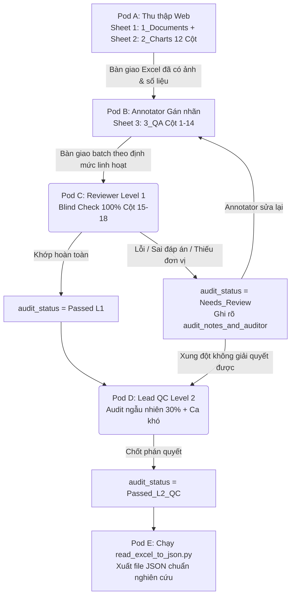

# Tài liệu Hướng dẫn Vận hành Quy trình ViChartQA (SOP: Thu thập — Gán nhãn — Audit — Xuất JSON)

> **Phiên bản:** v2.2 (SOP Chi tiết hóa kèm Ví dụ Thực tế Chuẩn ACL/EMNLP cho Excel 35 Cột)
> **Áp dụng cho:** Toàn bộ thành viên Pod A (Thu thập), Pod B (Annotator), Pod C/D (Reviewer & Adjudicator), và Pod E (Engineering).
> **Tài liệu tham chiếu:** `02-dataset-design.md`, `03-annotation-guidelines.md`, `Anotator_ViChartQA.docx` và `Review_01.docx`.

---

## 🌟 1. Tổng quan Quy trình Phối hợp (Workflow Architecture)

Dự án **ViChartQA** hướng tới xây dựng tập dữ liệu đa phương thức (VLM) quy mô 1,200–2,000 bài viết web (chứa ~3,500 biểu đồ và ~14,000 câu hỏi) đáp ứng tiêu chuẩn nghiên cứu ACL/EMNLP. Để tối ưu hóa tốc độ nhập liệu mà vẫn đảm bảo độ chính xác tuyệt đối, toàn bộ quy trình làm việc được chia thành 5 giai đoạn liên hoàn:



---

## 🛠️ 2. Hướng dẫn Chi tiết cho Pod A — Thu thập & Nhập liệu (`1_Documents` + `2_Charts`)

Pod A chịu trách nhiệm tìm kiếm bài báo, tải ảnh biểu đồ và trích xuất số liệu thô vào 2 sheet đầu tiên của tệp `ViChartQA_Template.xlsx`.

### Bước 1: Tiêu chuẩn Chọn Bài viết & Pháp lý Bản quyền (`ethics_status`)

* **✅ Nguồn Ưu tiên Cao (Rủi ro bản quyền bằng 0 — Chọn `Public_OpenData`):** Cổng thông tin Tổng cục Thống kê (`gso.gov.vn`, `consosukien.vn`), Ngân hàng Nhà nước, Bộ Tài chính, World Bank tiếng Việt.
* **✅ Nguồn Báo chí Chính thống (Cho phép trích dẫn học thuật — Chọn `News_AcademicAllowed`):** CafeF, VnEconomy, Vietnam Report, VnExpress Kinh doanh/Khoa học.
* **❌ Tuyệt đối KHÔNG thu thập:**
  * Sách giáo khoa, báo cáo thương mại trả phí (Nielsen, McKinsey) có dấu bản quyền cấm sao chép $\rightarrow$ Rủi ro vi phạm đạo đức nghiên cứu (Ethics Review ARR).
  * Ảnh chụp màn hình dashboard mờ nhạt, độ phân giải thấp dưới 400x300px, chữ bị vỡ.
  * Infographic chắp vá không có trục tọa độ hoặc không rõ bảng số liệu gốc để trích xuất.

### Bước 2: Nhập liệu cụ thể vào Sheet `1_Documents` (8 Cột)

> 📌 **Quy tắc:** Mỗi bài viết (bất kể bên trong có 1, 2 hay 3 biểu đồ) chỉ được nhập vào **ĐÚNG 1 DÒNG** trong Sheet `1_Documents`.
> 🏷️ **Các cột CHỈ ĐƯỢC CHỌN TỪ DROPDOWN LIST:** Cột F (`domain`), Cột G (`ethics_status`).

| Cột | Tên trường     | Loại dữ liệu / Dropdown 🔽 | Ví dụ ĐÚNG ✅                                                                                                                                                                                          | Ví dụ SAI ❌                                                                             | Giải thích chi tiết & Lỗi thường gặp                                                                                                                                                                     |
| :--- | :---------------- | :---------------------------: | :--------------------------------------------------------------------------------------------------------------------------------------------------------------------------------------------------------- | :----------------------------------------------------------------------------------------- | :-------------------------------------------------------------------------------------------------------------------------------------------------------------------------------------------------------------- |
| A    | `document_id`   |             Text             | `DOC_ECON_001`                                                                                                                                                                                           | `vi_001`, `bài báo gso`                                                              | Viết hoa, theo cú pháp`DOC_[DOMAIN]_[STT 3 chữ số]`. Đây là khóa chính (Primary Key) để phân chia tập Train/Test không bị rò rỉ.                                                            |
| B    | `title`         |             Text             | `GDP Việt Nam năm 2024 tăng trưởng ấn tượng 7,09%, quy mô kinh tế vượt 430 tỷ USD`                                                                                                          | `GDP tăng 7%`                                                                           | Copy nguyên văn tiêu đề gốc của bài báo. Không tự ý viết tắt hoặc cắt xén.                                                                                                                     |
| C    | `body_text`     |          Text (Long)          | `Theo Tổng cục Thống kê, tăng trưởng GDP năm 2024 ước đạt 7,09%. Trong đó, khu vực nông lâm thủy sản tăng 3,27%; công nghiệp và xây dựng tăng 8,24%; dịch vụ tăng 7,06%...` | `(Copy toàn bộ cả quảng cáo, menu bài viết bên lề, lời cảm ơn tác giả...)` | **Chỉ copy các đoạn văn bản có chứa nhận định, số liệu liên quan đến chủ đề của biểu đồ.** Văn bản này là "cầu nối" để Pod B tạo câu hỏi multi-hop (`text_to_chart`). |
| D    | `source_name`   |             Text             | `Tổng cục Thống kê (GSO)`                                                                                                                                                                            | `gso.gov.vn`                                                                             | Ghi rõ tên tổ chức/cơ quan phát hành, không ghi trọc tên miền.                                                                                                                                       |
| E    | `source_url`    |             Text             | `https://consosukien.vn/gdp-2024.htm`                                                                                                                                                                    | `google.com`                                                                             | Bắt buộc phải có URL bài báo gốc để phục vụ tái kiểm định (Audit).                                                                                                                               |
| F    | `domain`        |     **Dropdown 🔽**     | `economy`                                                                                                                                                                                                | `Kinh tế`                                                                               | Chọn đúng 1 trong 7 từ khóa tiếng Anh trong Dropdown:`economy`, `science`, `health`, `education`, `environment`, `society`, `other`.                                                        |
| G    | `ethics_status` |     **Dropdown 🔽**     | `Public_OpenData`                                                                                                                                                                                        | `Open`                                                                                   | Chọn từ Dropdown:`Public_OpenData`, `News_AcademicAllowed`, hoặc `Restricted_NeedsCheck`.                                                                                                              |
| H    | `collector`     |             Text             | `Nguyễn Văn A`                                                                                                                                                                                         | `A`                                                                                      | Ghi đầy đủ họ và tên người thu thập để tính KPI.                                                                                                                                                   |

---

### Bước 3: Nhập liệu cụ thể vào Sheet `2_Charts` (12 Cột)

> 📌 **Quy tắc:** Mỗi biểu đồ trong bài báo được nhập thành **1 DÒNG RIÊNG** trong Sheet `2_Charts`. Khóa ngoại `document_id` phải khớp 100% với Sheet 1.
> 🏷️ **Các cột CHỈ ĐƯỢC CHỌN TỪ DROPDOWN LIST:** Cột E (`chart_type`).

| Cột | Tên trường                                |  Loại dữ liệu / Dropdown 🔽  | Ví dụ ĐÚNG ✅                                                                                                                                     | Ví dụ SAI ❌                                             | Giải thích chi tiết & Quy tắc gõ phẳng                                                                                                                                                                                                                                         |
| :--- | :------------------------------------------- | :------------------------------: | :---------------------------------------------------------------------------------------------------------------------------------------------------- | :--------------------------------------------------------- | :----------------------------------------------------------------------------------------------------------------------------------------------------------------------------------------------------------------------------------------------------------------------------------- |
| A    | `chart_unique_id`                          |               Text               | `DOC_ECON_001_FIG1`                                                                                                                                 | `DOC_ECON_001`                                           | Cú pháp`[document_id]_FIG[STT]`. Nếu bài có 2 ảnh thì dòng 1 là `..._FIG1`, dòng 2 là `..._FIG2`.                                                                                                                                                                   |
| B    | `document_id`                              |               Text               | `DOC_ECON_001`                                                                                                                                      | `DOC_001`                                                | Copy chính xác ID từ Sheet`1_Documents`.                                                                                                                                                                                                                                        |
| C    | `chart_position`                           |               Text               | `Figure 1`                                                                                                                                          | `hình đầu tiên`                                      | Ghi`Figure 1`, `Figure 2`, hoặc `Hình 1`, `Hình 2` hiển thị dưới caption ảnh.                                                                                                                                                                                        |
| D    | `chart_title`                              |               Text               | `Tốc độ tăng trưởng GDP Việt Nam giai đoạn 2015-2024 (%)`                                                                                  | `Biểu đồ GDP`                                         | Tiêu đề riêng của hình vẽ (nếu trên ảnh không có thì lấy caption ngay bên dưới ảnh).                                                                                                                                                                               |
| E    | `chart_type`                               |      **Dropdown 🔽**      | `Bar`                                                                                                                                               | `biểu đồ cột`                                        | Chọn chuẩn từ Dropdown:`Bar`, `Line`, `Pie`, `Grouped bar`, `Stacked bar`, `Multi-line`, `Scatter`, `Other`.                                                                                                                                                      |
| F    | `unit`                                     |               Text               | `%` *(hoặc `Trục X: USD \| Trục Y: Năm` / `Trục trái: tỷ đồng \| Trục phải: %`)*                                                     | `phần trăm`                                            | Ghi ký hiệu ngắn gọn thể hiện trên trục.**Nếu 2 trục có đơn vị khác nhau hoặc biểu đồ Trục Kép (Dual Axis), phải ghi rõ cả 2 đơn vị phân cách bằng dấu `\|`**.                                                                                 |
| G    | `num_series`                               |           Số nguyên           | `1` (hoặc `2`, `3`...)                                                                                                                         | `Đơn`                                                  | Ghi số nguyên thể hiện số lượng chuỗi dữ liệu.**Lưu ý:** Độ phức tạp `chart_complexity` tự động phái sinh từ số này (`1` = `simple`, $\ge 2$ = `complex`).                                                                                    |
| H    | `image_path`                               |               Text               | `images/econ/doc_econ_001_fig1.png`                                                                                                                 | `C:\Users\Admin\Desktop\fig1.png`                        | **Bắt buộc dùng đường dẫn tương đối** từ thư mục gốc của dự án. File ảnh lưu format `.png` hoặc `.jpg`.                                                                                                                                               |
| I    | `x_axis_labels` *(Nhãn trục X)*        |               Text               | `2015, 2016, 2017, 2018, 2019, 2020` *(Hoặc `100, 200, 300 (USD)`)*                                                                            | `[2015, 2016, ...]` *(Gõ ngoặc vuông kiểu JSON)*   | **Quy tắc phẳng:** Gõ danh sách nhãn trên trục hoành theo thứ tự từ trái sang phải, ngăn cách bằng dấu phẩy `,`. Nếu trục X là biến số có đơn vị riêng (VD trong Scatter plot), ghi kèm đơn vị ở cuối.                                     |
| J    | `y_axis_labels` *(Nhãn trục Y - MỚI)* | Text (Multiline nếu Trục Kép) | `0, 2, 4, 6, 8, 10 (%)` *(Hoặc nhấn Alt+Enter cho Trục kép: `Trục Y trái (tỷ đồng): 0, 500, 1000` \n `Trục Y phải (%): 0, 5, 10`)* | `10% max`                                                | **Quy tắc phẳng:** Gõ danh sách các mốc chia trên trục tung từ dưới lên trên, ngăn cách bằng dấu phẩy `,`. Nếu biểu đồ Pie hoặc không có trục Y $\rightarrow$ Ghi `Không có (Pie chart)`.                                                    |
| K    | `series_data` *(Số liệu chuỗi)*       |         Text (Multiline)         | `Tăng trưởng GDP (%): 6.68, 6.21, 6.81, 7.08, 7.02, 2.91, 2.58, 8.02, 5.05, 7.09`                                                                | `{"GDP": [6.68, ...]}` *(Gõ JSON dễ lỗi cú pháp)* | **Quy tắc phẳng nhiều dòng:** Cú pháp `[Tên chuỗi (Đơn vị)]: [Số liệu 1], [Số liệu 2]...`. Nếu có 2 chuỗi trở lên, nhấn `Alt + Enter` xuống dòng để gõ chuỗi tiếp theo. **Số lượng giá trị BẮT BUỘC bằng số nhãn ở trục X.** |
| L    | `notes`                                    |               Text               | `Trục kép bên trái %, bên phải tỷ đồng`                                                                                                    | `OK`                                                     | Ghi chú các điểm đặc biệt giúp Annotator/Auditor chú ý khi làm việc.                                                                                                                                                                                                     |

#### 💡 Ví dụ Minh họa Nhập liệu `series_data` & Trục X/Y khác Đơn vị (`Alt + Enter`):

##### 1. Biểu đồ Tiêu chuẩn Đa chuỗi (Grouped Bar - Cùng đơn vị):

Giả sử biểu đồ so sánh Doanh thu và Lợi nhuận 3 năm `2022, 2023, 2024` (Cùng đơn vị tỷ đồng).

* Cột F (`unit`) nhập: `tỷ đồng`
* Cột I (`x_axis_labels`) nhập: `2022, 2023, 2024`
* Cột J (`y_axis_labels`) nhập: `0, 500, 1000, 1500, 2000 (tỷ đồng)`
* Cột K (`series_data`) nhập (nhấn `Alt + Enter` ở giữa 2 dòng):
  ```text
  Doanh thu (tỷ đồng): 1200, 1450, 1800
  Lợi nhuận (tỷ đồng): 150, 210, 320
  ```

##### 2. Biểu đồ Trục Kép / Khác Đơn vị Trục X & Y (Dual Axis / Scatter Plot):

Giả sử biểu đồ **Trục Kép (Dual Y-Axis)** thể hiện **Doanh thu (tỷ đồng - Trục Y trái)** và **Tăng trưởng (% - Trục Y phải)** qua 3 năm `2022, 2023, 2024`.

* Cột F (`unit`) nhập: `Trục trái: tỷ đồng | Trục phải: %`
* Cột I (`x_axis_labels`) nhập: `2022, 2023, 2024`
* Cột J (`y_axis_labels`) nhập (nhấn `Alt + Enter` để gõ 2 trục Y):
  ```text
  Trục Y trái (tỷ đồng): 0, 500, 1000, 1500, 2000
  Trục Y phải (%): 0, 5, 10, 15
  ```
* Cột K (`series_data`) nhập (ghi rõ đơn vị của từng chuỗi ngay trong tên chuỗi):
  ```text
  Doanh thu (tỷ đồng): 1200, 1450, 1800
  Tốc độ tăng trưởng (%): 5.2, 8.1, 10.5
  ```
* Cột L (`notes`) nhập: `Biểu đồ trục kép (Dual Y-axis chart): Trục Y bên trái là tỷ đồng cho Doanh thu, Trục Y bên phải là % cho Tăng trưởng.`

---

## ✍️ 3. Hướng dẫn Chi tiết cho Pod B / Annotator — Tạo Câu hỏi & Gán nhãn (`3_QA`)

Pod B tiếp nhận Excel đã có `1_Documents` và `2_Charts`. Nhiệm vụ là tạo câu hỏi vào Sheet `3_QA` (Cột A đến Cột N - Cột 1 đến 14).

### Bước 1: Chiến lược Định mức & Số lượng Câu hỏi Linh hoạt (Flexible Quota Strategy)

> 🔴 **NGUYÊN TẮC LINH HOẠT SỐ LƯỢNG:** Thay vì áp đặt máy móc số lượng cố định, Annotator phải **phân bổ số lượng câu hỏi một cách linh hoạt tùy thuộc vào độ phong phú của dữ liệu và độ khó của biểu đồ/bài viết**:

| Nhóm Phân loại Biểu đồ / Bài viết                                                    | Đặc điểm & Độ phức tạp                                                                                                                                                                                |                   Định mức Câu hỏi Khuyến nghị                   | Mô tả Chiến lược Đặt câu hỏi                                                                                                                                                                                                                                                                                                                                                                                  |
| :------------------------------------------------------------------------------------------- | :------------------------------------------------------------------------------------------------------------------------------------------------------------------------------------------------------------ | :----------------------------------------------------------------------: | :--------------------------------------------------------------------------------------------------------------------------------------------------------------------------------------------------------------------------------------------------------------------------------------------------------------------------------------------------------------------------------------------------------------------- |
| **Nhóm 1: Biểu đồ / Bài viết Đơn giản (Simple)**                              | Biểu đồ đơn (`num_series = 1`), ít nhãn trục X ($\le 5$ mốc), bài báo ngắn gọn ít nhận định số liệu.                                                                                   |                        **1 – 2 câu hỏi**                        | Chỉ hỏi 1 câu`data_retrieval` hoặc 1 câu so sánh đơn giản (`comparison`). **Tuyệt đối không cố nhồi nhét tạo câu hỏi gượng ép, lặp ý.**                                                                                                                                                                                                                                              |
| **Nhóm 2: Biểu đồ / Bài viết Tiêu chuẩn (Standard)**                           | Biểu đồ có lượng thông tin trung bình (6-12 mốc trục X), hoặc 2 chuỗi dữ liệu (`num_series = 2`), bài báo có đủ ngữ cảnh.                                                              |                        **3 – 4 câu hỏi**                        | Phân bổ rải đều: 1 câu`data_retrieval/ranking` + 1 câu `visual/comparison` + 1 câu `compositional` + 1 câu `text_to_chart/unanswerable`.                                                                                                                                                                                                                                                              |
| **Nhóm 3: Bài viết Đa Biểu đồ & Thông tin Phong phú (Complex / 2–3 Charts)** | Bài báo dài có**2 đến 3 biểu đồ phức tạp** (`Grouped bar`, `Stacked bar`, `Dual axis`, nhiều chuỗi), chứa phong phú số liệu, claim kinh tế đa chiều.                          |                        **7 – 8 câu hỏi**                        | Tận dụng tối đa sự phong phú để tạo bộ câu hỏi đa chiều chất lượng cao: 2 câu hỏi kết hợp chéo biểu đồ (`chart_to_chart`), 2 câu hỏi kiểm chứng văn bản (`text_to_chart`, `fact_check_dual`), 2 câu suy luận nhiều bước (`compositional`), và 1-2 câu trắc nghiệm `mcq` / giả định `hypothetical`.                                                              |
| **Nhóm 4: Bài viết Siêu Đa Biểu đồ (Ultra Multi-chart / > 3 Biểu đồ)**      | Bài viết/báo cáo phân tích chuyên sâu có**từ 4 biểu đồ trở lên (VD: 4, 5, 6... biểu đồ)**, chứa khối lượng dữ liệu lớn, nhiều chuỗi và đa chỉ tiêu liên kết với nhau. | **9 – 12+ câu hỏi** *(Trung bình ~2.5 – 3 câu/biểu đồ)* | **Tập trung tối đa vào suy luận liên kết (`chart_to_chart` & `text_to_chart`):** Phân bổ 3–4 câu hỏi đối chiếu chéo giữa các biểu đồ (`FIG1` vs `FIG3`, `FIG2` vs `FIG4`), 3–4 câu kết hợp văn bản (`text_to_chart`), 3–4 câu tính toán sâu (`compositional/visual_reasoning`), và 1–2 câu `mcq/unanswerable`. *(Xem chi tiết hướng dẫn bên dưới)* |

> 📌 **LƯU Ý ĐẶC BIỆT CHO ANNOTATOR KHI BÀI VIẾT CÓ NHIỀU HƠN 3 BIỂU ĐỒ (> 3 CHARTS):**
> Khi gặp các bài báo cáo hoặc chuyên đề lớn có từ 4, 5, 6... hình biểu đồ trở lên, Annotator cần tuân thủ 4 quy định đặc thù sau đây để tối ưu hóa chất lượng và tránh nhầm lẫn:
>
> 1. **Khắc phục "Cạm bẫy rập khuôn" (Quality over Quantity):** Khi đối mặt với nhiều biểu đồ, Annotator rất dễ mắc tâm lý mệt mỏi và tạo ra 12–15 câu hỏi đơn giản (`data_retrieval`) giống hệt nhau chỉ thay mã hình/năm. **Quy tắc bắt buộc:** Thà tạo **9–10 câu hỏi chất lượng cao, suy luận sâu nhiều bước (`compositional`, `chart_to_chart`)** còn hơn tạo ra 15 câu rập khuôn, dễ dãi.
> 2. **Phân bổ không cào bằng từng biểu đồ:** Không bắt buộc mỗi biểu đồ trong bài phải chia đều số lượng câu hỏi. Nếu `FIG1`, `FIG3` cực kỳ phức tạp và giàu chỉ số, hãy đặt 3–4 câu cho mỗi hình này. Nếu `FIG2` hoặc `FIG5` quá đơn giản (chỉ có 2-3 cột đơn), chỉ cần đặt 1 câu hoặc dùng làm dữ liệu phụ để đối chiếu chéo.
> 3. **Đòn bẩy tối đa cho `chart_to_chart` (Đối chiếu chéo liên biểu đồ):** Đây là điểm giá trị nhất của bài viết có > 3 biểu đồ! Hãy tạo các câu hỏi yêu cầu đọc số liệu từ **2 hoặc 3 hình khác nhau** để suy luận đáp án.
>    * *Ví dụ:* *"Tốc độ tăng trưởng GDP năm 2024 trên `FIG1` cao gấp bao nhiêu lần tỷ lệ lạm phát bình quân thể hiện trên `FIG4`?"*
>    * *Ví dụ:* *"So với cơ cấu lao động ngành công nghiệp trên `FIG2`, giá trị xuất khẩu công nghiệp trên `FIG5` có xu hướng đồng biến hay nghịch biến trong giai đoạn 2020-2023?"*
> 4. **Ghi rõ và chuẩn xác ID Hình (`evidence_hops` & Khóa `chart_unique_id`):** Vì bài có rất nhiều hình (`FIG1`, `FIG2`, `FIG3`, `FIG4`...), tại Cột K (`evidence_hops`) BẮT BUỘC phải ghi chính xác tiền tố mã hình cho từng dòng bằng chứng (VD: `DOC_ECON_005_FIG1: ...` xuống dòng `DOC_ECON_005_FIG4: ...`). Nếu phát hiện Pod A chưa nhập đủ các hình vào Sheet `2_Charts`, Pod B cần yêu cầu Pod A bổ sung hoặc tự nhập đủ hình trước khi đặt câu hỏi.

#### 🎯 Quy định Tỷ lệ Cân bằng Toàn tập dữ liệu (Macro Quota Requirements):

Nhóm Annotator và Reviewer đảm bảo tính đa dạng chung trên toàn dataset theo tỷ lệ mục tiêu:

* **~20% `data_retrieval` & `ranking`:** Đọc và tìm đỉnh/đáy.
* **~20% `visual` & `comparison`:** Nhận diện màu, độ cao, so sánh tương quan.
* **~25% `compositional` & `arithmetic`:** Tính toán hiệu số, tỷ lệ, trung bình $\ge 2$ bước.
* **~25% Multi-hop (`text_to_chart`, `chart_to_chart`, `fact_check_dual`):** Đọc chéo đa phương thức.
* **~10% Nhóm đặc biệt (`mcq`, `hypothetical`, `unanswerable`, `multi_turn`):** Bẫy chống hallucination và suy luận giả định.

---

### Bước 2: Tổng hợp Danh sách Cột & Các Trường bắt buộc chọn từ Dropdown List (`3_QA`)

> 📌 **LƯU Ý VỀ KHỐI MÀU (`BLOCK BADGES` & `SHEET 0`):**
> Để tránh lỗi gõ sai chính tả và tăng tốc thao tác, **7 CỘT ĐỊNH TÍNH DƯỚI ĐÂY BẮT BUỘC CHỌN TỪ DROPDOWN LIST 🔽**.
> Toàn bộ các giá trị Dropdown này trong `ViChartQA_Template.xlsx` đều được tích hợp **Conditional Formatting hiển thị dạng Khối Màu (`Khối / Block Badges`)** chuyên biệt.
> Bạn có thể tra cứu nhanh ý nghĩa & bảng màu của từng Khối nhãn ngay tại Sheet đầu tiên **`0_Dropdown_Blocks`** bên trong tệp Excel!

| Cột | Tên trường                          |           Loại nhập liệu           | Danh sách Giá trị Dropdown Chuẩn 🔽                                                                                                                                                                                                           | Giải thích & Quy định chọn                                                   |
| :--: | :------------------------------------- | :-----------------------------------: | :------------------------------------------------------------------------------------------------------------------------------------------------------------------------------------------------------------------------------------------------ | :-------------------------------------------------------------------------------- |
|  F  | `question_type`                      |         **Dropdown 🔽**         | `data_retrieval`, `visual`, `compositional`, `visual_reasoning`, `mcq`, `hypothetical`, `fact_check`, `multi_turn`, `unanswerable`                                                                                              | Xem Bảng giải thích chi tiết mục 3.1 bên dưới.                            |
|  G  | `hop_type`                           |         **Dropdown 🔽**         | `single_chart`, `text_to_chart`, `chart_to_chart`, `fact_check_dual`                                                                                                                                                                      | Tuân thủ tuyệt đối "Phép thử Bỏ Text" (Mục 3.2).                         |
|  H  | `math_operation`                     | **Dropdown / Nhập nối tiếp** | `None`, `Max_value`, `Argmax`, `Min_value`, `Argmin`, `Subtract`, `Add`, `Compare`, `Average`, `Count`, `Divide`, `Multiply`, `Percentage change`, `Ratio`, `Difference`, `Sum`, `Median`, `Sort`, `Filter` | Gán**đúng thứ tự thời gian của các bước tính toán** (Mục 3.3). |
|  I  | `visual_reference`                   |         **Dropdown 🔽**         | `None`, `Color`, `Position`, `Legend`, `Shape`, `Height/Length`, `Axis`, `Marker`, `Explicit textual reference`                                                                                                                 | Chọn đặc tính thị giác chính được dùng để giải câu hỏi.           |
|  L  | `difficulty`                         |         **Dropdown 🔽**         | `Easy`, `Medium`, `Hard`, `Very Hard`                                                                                                                                                                                                     | Gán dựa trên số bước và độ khó lập luận.                              |
|  M  | `options`                            |            Text / Dropdown            | `None` *(Nếu câu hỏi tự luận)* hoặc gõ `A. ... \| B. ... \| C. ... \| D. ...` *(Nếu là `mcq`)*                                                                                                                                    | Bắt buộc gõ 4 lựa chọn nếu`question_type = mcq`.                          |
|  Q  | `audit_status` *(Dành cho L1/L2)* |         **Dropdown 🔽**         | `Passed (L1)`, `Passed_L2_QC`, `Needs_Review`, `Rejected`                                                                                                                                                                                 | Reviewer chọn sau khi Blind Check.                                               |

---

### Bước 3: Bảng Định nghĩa & Hướng dẫn Chọn Chi tiết cho Từng Nhãn Dropdown

#### 3.1. Bảng Giải thích Chi tiết 9 Giá trị Dropdown `question_type` (Khi nào thì chọn nhãn nào?):

| Nhãn`question_type` | Khi nào thì CHỌN nhãn này? (Tiêu chuẩn định nghĩa)                                                                                                                       | Ví dụ Câu hỏi ĐÚNG ✅                                                                                                             | Khi nào KHÔNG ĐƯỢC chọn? (Lỗi nhầm lẫn ❌)                                                                          |
| :--------------------- | :--------------------------------------------------------------------------------------------------------------------------------------------------------------------------------- | :-------------------------------------------------------------------------------------------------------------------------------------- | :--------------------------------------------------------------------------------------------------------------------------- |
| `data_retrieval`     | Khi câu hỏi chỉ yêu cầu**đọc trực tiếp 1 giá trị số hoặc 1 nhãn** có sẵn trên biểu đồ mà **không cần bất kỳ phép cộng trừ/so sánh nào**. | *"Tỷ lệ lạm phát năm 2023 là bao nhiêu %?"* $\rightarrow$ Đáp án: `3.25%`                                               | Không chọn nếu có phép tính hiệu số, cộng tổng, hoặc tìm đỉnh/đáy qua so sánh nhiều cột.                  |
| `visual`             | Khi việc tìm ra đối tượng hoàn toàn phụ thuộc vào **màu sắc, vị trí trái/phải, hình dáng marker, hoặc chú giải (legend)** trên ảnh.                 | *"Cột màu xanh dương đồi sâu bên phải cùng tương ứng với năm nào trên trục hoành?"*                                | Không chọn nếu bỏ từ "màu xanh" đi mà vẫn đọc được trực tiếp từ tên nhãn trên trục X.                   |
| `compositional`      | Khi cần**từ 2 bước tính toán hoặc logic suy luận trở lên** (Cộng tổng nhiều năm, trừ hiệu số 2 mốc, tính tỷ lệ %, trung bình cộng).                   | *"Tổng quy mô xuất khẩu của 3 năm gần nhất (2022-2024) là bao nhiêu tỷ USD?"* *(Cần đọc 3 số rồi cộng lại)*       | Không chọn nếu chỉ là hỏi 1 con số có sẵn trên đỉnh cột.                                                        |
| `visual_reasoning`   | Khi câu hỏi kết hợp**cả nhận diện thị giác phức tạp (độ dốc, chiều cao tương quan) VÀ phép toán số học**.                                              | *"Đường màu đỏ có độ dốc tăng mạnh nhất giữa 2 năm liền kề nào, và mức tăng giai đoạn đó là bao nhiêu %?"* | Không chọn nếu chỉ nhìn màu sắc đơn thuần mà không tính toán độ dốc/chênh lệch.                           |
| `mcq`                | Khi câu hỏi được thiết kế dưới dạng**Trắc nghiệm 4 lựa chọn (Multiple Choice)** A, B, C, D.                                                                    | *"Năm nào đạt thặng dư thương mại cao nhất? A. 2021 B. 2022 C. 2023 D. 2024"*                                               | **Bắt buộc** phải điền các phương án A, B, C, D vào Cột M (`options`). Không được để trống Cột M! |
| `hypothetical`       | Khi câu hỏi đặt ra**một tình huống giả định** (nếu tăng/giảm, nếu duy trì xu hướng) nằm ngoài quan sát thực tế trên biểu đồ.                       | *"Nếu tốc độ tăng trưởng năm 2025 cao gấp đôi mức tăng của năm 2024, thì năm 2025 sẽ đạt bao nhiêu %?"*          | Không đặt các câu giả định viển vông, không có cơ sở số liệu trên chart để tính ra đáp án.            |
| `fact_check`         | Khi câu hỏi đưa ra 1 mệnh đề/nhận định và yêu cầu kiểm chứng**Đúng hay Sai (`True/False`)**.                                                              | *"Đúng hay sai: Tốc độ tăng trưởng GDP năm 2022 là mức cao nhất trong toàn bộ giai đoạn 10 năm?"*                    | Đáp án tại Cột E**BẮT BUỘC** chỉ được ghi `Đúng` hoặc `Sai` (hoặc `True`/`False`).              |
| `multi_turn`         | Khi tạo 2 câu hỏi liên tiếp cùng mã ảnh mà**câu sau phụ thuộc vào ngữ cảnh/đối tượng vừa tìm được ở câu trước**.                                 | *(Câu 2): "Vậy chênh lệch giữa năm đạt đỉnh vừa tìm được với năm thấp nhất là bao nhiêu?"*                       | Chỉ dùng cho chuỗi hội thoại nhiều lượt liền kề nhau.                                                              |
| `unanswerable`       | Khi cố ý hỏi thông tin**không tồn tại trên biểu đồ/văn bản** để bẫy, kiểm tra khả năng chống ảo giác (hallucination) của AI.                          | *"Tỷ lệ thất nghiệp của nam giới năm 2024 là bao nhiêu theo biểu đồ?"* *(Trong khi chart chỉ thể hiện lạm phát)*   | Đáp án tại Cột E**BẮT BUỘC** phải ghi rõ là **`Không thể trả lời`** (hoặc `unanswerable`).    |

---

#### 3.2. Bảng Giải thích Chi tiết 4 Giá trị Dropdown `hop_type` & Phép thử Bỏ Text:

> 🔴 **PHÉP THỬ BỎ TEXT (THE NO-TEXT TEST):**Trước khi chọn `text_to_chart` hoặc `chart_to_chart`, hãy che toàn bộ Cột C (`body_text`) đi, chỉ nhìn duy nhất vào hình ảnh biểu đồ:
>
> * Nếu **vẫn trả lời được 100% từ ảnh** $\rightarrow$ Bạn **BẮT BUỘC chọn `single_chart`**. (Cho dù trong bài viết tác giả có nhắc lại con số đó thì vẫn tính là `single_chart` vì ảnh đã có đủ thông tin!).
> * Nếu **không thể trả lời nếu thiếu văn bản** (vì có 1 con số, chỉ tiêu, nhận định chỉ nằm trong chữ) $\rightarrow$ Bạn mới được chọn `text_to_chart` hoặc `fact_check_dual`.

| Nhãn`hop_type`   | Định nghĩa chuẩn                                                                                                                                                            | Ví dụ ĐÚNG ✅                                                                                                                                                                              | Ví dụ BỊ LOẠI (Lỗi thường gặp) ❌                                                                                                                                 |
| :------------------ | :------------------------------------------------------------------------------------------------------------------------------------------------------------------------------ | :--------------------------------------------------------------------------------------------------------------------------------------------------------------------------------------------- | :------------------------------------------------------------------------------------------------------------------------------------------------------------------------ |
| `single_chart`    | Toàn bộ bằng chứng và số liệu cần thiết**chỉ cần nhìn 1 ảnh biểu đồ là đủ**.                                                                           | *"Tốc độ tăng trưởng GDP năm 2024 thể hiện trên biểu đồ là bao nhiêu %?"*                                                                                                     | Gán`text_to_chart` chỉ vì trong văn bản bài báo cũng viết câu *"GDP 2024 đạt 7.09%"* $\rightarrow$ **SAI**, phải về `single_chart`.           |
| `text_to_chart`   | **Hop 1:** Lấy 1 số liệu/claim **chỉ có trong văn bản `body_text`**. **Hop 2:** Lấy số liệu trên biểu đồ và tính toán/so sánh với Hop 1. | *"Theo bài viết, mục tiêu GDP năm 2025 là 6.5% (chỉ có trong text). So với thực hiện năm 2024 trên biểu đồ (7.09%), mục tiêu này thấp hơn bao nhiêu điểm %?"*        | *"Theo đoạn văn, ngành nào tăng mạnh nhất?"* $\rightarrow$ **SAI**, đây chỉ là câu đọc hiểu văn bản, không hề đụng đến ảnh biểu đồ! |
| `chart_to_chart`  | Câu hỏi yêu cầu kết hợp số liệu từ**2 biểu đồ trở lên** trong cùng 1 bài viết (`FIG1` + `FIG2`).                                                     | *"Tỷ lệ lạm phát năm 2024 (trên Hình 2) chiếm bao nhiêu % so với tốc độ tăng trưởng GDP cùng năm (trên Hình 1)?"*                                                        | Ghép 2 biểu đồ của 2 bài viết (`DOC_001` và `DOC_002`) khác nhau $\rightarrow$ **SAI**, phải cùng `document_id`.                                 |
| `fact_check_dual` | Kiểm chứng một mệnh đề đòi hỏi phải**đối chiếu sự mâu thuẫn/khớp nhau giữa lời văn `body_text` và số liệu trên ảnh**.                          | *"Đúng hay sai: Bài báo khẳng định xuất khẩu nông nghiệp dẫn đầu năm 2024, nhưng biểu đồ Hình 2 lại cho thấy công nghiệp chế biến mới có tỷ trọng cao nhất?"* | Mệnh đề chỉ cần nhìn trên ảnh biểu đồ là biết ngay Đúng hay Sai$\rightarrow$ Phải gán về `single_chart`.                                            |

---

#### 3.3. Quy định Nghiêm ngặt về THỨ TỰ GÁN PHÉP TOÁN (`math_operation` Sequence Rule):

> 🔴 **QUY TẮC THỨ TỰ THỜI GIAN (CHRONOLOGICAL ORDER RULE):**
> Khi câu hỏi đòi hỏi nhiều bước tính toán, các phép toán gán trong Cột H (`math_operation`) **BẮT BUỘC PHẢI KHỚP ĐÚNG THỨ TỰ THỰC HIỆN TRONG CỘT J (`reasoning_steps`)**. Các nhãn nối nhau bằng dấu phẩy `,`.

* 💡 **Ví dụ 1 (Bài toán Hiệu số rồi So sánh với ngưỡng):**

  * **Câu hỏi:** *"Tăng trưởng GDP năm 2024 tăng thêm bao nhiêu điểm % so với 2023, và mức tăng thêm này có vượt quá 1.5 điểm % hay không?"*
  * **Các bước (`reasoning_steps`):**`Bước 1:` Đọc GDP 2024 (7.09%) và GDP 2023 (5.05%).`Bước 2:` Thực hiện phép trừ hiệu số: $7.09\% - 5.05\% = 2.04$ điểm % (**Phép trừ — `Subtract`**).`Bước 3:` So sánh kết quả $2.04$ với ngưỡng $1.5 \rightarrow 2.04 > 1.5$ (**Phép so sánh — `Compare`**).
  * 👉 **Cột H (`math_operation`) gõ chuẩn:** `Subtract, Compare` (Gõ đúng thứ tự, tuyệt đối không gõ ngược là `Compare, Subtract`).
* 💡 **Ví dụ 2 (Bài toán Tìm đỉnh rồi Tính tỷ lệ):**

  * **Câu hỏi:** *"Năm đạt tốc độ tăng trưởng cao nhất trong giai đoạn có giá trị gấp bao nhiêu lần năm có tốc độ tăng trưởng thấp nhất năm 2021?"*
  * **Các bước (`reasoning_steps`):**`Bước 1:` Tìm năm có đỉnh cao nhất là 2022 đạt 8.02% (**Tìm lớn nhất — `Max_value` / `Argmax`**).`Bước 2:` Đọc giá trị năm 2021 là 2.58%.`Bước 3:` Thực hiện phép chia lấy tỷ lệ gấp bao nhiêu lần: $8.02 / 2.58 = 3.11$ lần (**Phép chia tỷ lệ — `Divide` hoặc `Ratio`**).
  * 👉 **Cột H (`math_operation`) gõ chuẩn:** `Argmax, Divide` (Hoặc `Max_value, Ratio`).
* ⚠️ **SỰ KHÁC BIỆT SỐNG CÒN GIỮA `MAX_VALUE` vs `ARGMAX` (Và `MIN` vs `ARGMIN`):**

  * Chọn `Max_value` / `Min_value`: Khi câu hỏi hỏi **CON SỐ GIÁ TRỊ LỚN NHẤT/NHỎ NHẤT là bao nhiêu**. (VD: *"Tốc độ tăng cao nhất là **bao nhiêu %**?"* $\rightarrow$ Đáp án: `8.02%`).
  * Chọn `Argmax` / `Argmin`: Khi câu hỏi hỏi **NHÃN / NĂM / ĐỐI TƯỢNG NÀO đạt đỉnh/đáy**. (VD: *"**Năm nào** có tốc độ tăng cao nhất?"* $\rightarrow$ Đáp án: `2022`).

---

### Bước 4: Cách viết `reasoning_steps` & `evidence_hops` (Cột J & K - Alt+Enter)

Mỗi bước hoặc mỗi hop phải nhấn **`Alt + Enter`** xuống dòng trong ô Excel để đảm bảo script Python đọc đúng.

#### 💡 Ví dụ Chuẩn cho Câu hỏi `compositional` (Tính hiệu số GDP 2024 - 2023):

* **Cột J (`reasoning_steps`):**
  ```text
  1. Đọc giá trị tăng trưởng GDP năm 2023 từ biểu đồ Hình 1 (5.05%).
  2. Đọc giá trị tăng trưởng GDP năm 2024 từ biểu đồ Hình 1 (7.09%).
  3. Thực hiện phép trừ: 7.09% - 5.05% = 2.04 điểm %.
  ```
* **Cột K (`evidence_hops`):**
  ```text
  DOC_ECON_001_FIG1: Tăng trưởng GDP năm 2023 = 5.05%
  DOC_ECON_001_FIG1: Tăng trưởng GDP năm 2024 = 7.09%
  ```

#### 💡 Ví dụ Chuẩn cho Câu hỏi `text_to_chart` (Multi-hop qua văn bản):

* **Cột J (`reasoning_steps`):**
  ```text
  1. Đọc văn bản bài viết để lấy chỉ tiêu tăng trưởng khu vực nông nghiệp năm 2024 (3.27%).
  2. Đọc biểu đồ Hình 1 để lấy chỉ tiêu tăng trưởng GDP chung năm 2024 (7.09%).
  3. Tính hiệu số: 7.09% - 3.27% = 3.82 điểm %.
  ```
* **Cột K (`evidence_hops`):** *(Chú ý gõ `text:` cho nguồn văn bản và Mã ảnh cho nguồn biểu đồ)*
  ```text
  text: Khu vực nông, lâm nghiệp và thủy sản năm 2024 tăng 3.27%
  DOC_ECON_001_FIG1: Tăng trưởng GDP năm 2024 = 7.09%
  ```

---

## 🔍 4. Hướng dẫn Chi tiết cho Pod C & D — Audit 2 Tầng (`Blind Review` & `Adjudication`)

Để đảm bảo bộ dữ liệu đạt chỉ số đồng thuận giữa các chuyên gia (**Inter-Annotator Agreement - IAA ≥ 85%**), quy trình kiểm duyệt được thực hiện nghiêm ngặt qua 2 tầng.

### Tầng 1: Pod C — Reviewer Kiểm định 100% Độc lập (`Blind-Check`)

Reviewer thao tác **CHỈ TẠI CÁC CỘT TỪ O ĐẾN R (Cột 15 đến 18)** của Sheet `3_QA`.

#### Thao tác Mở khóa & Khóa che (Masking Process):

1. **Trước khi giải:** Reviewer bôi đen Cột E (`answer`) và Cột K (`evidence_hops`) của Annotator $\rightarrow$ Nhấn chuột phải chọn **Hide Columns (Ẩn cột)** để hoàn toàn không bị ảnh hưởng bởi đáp án của người làm trước.
2. **Tự giải độc lập:** Reviewer tự điền kết quả của chính mình vào:
   * **Cột O (`verified_answer`):** Ghi đáp án mà Reviewer tính ra.
   * **Cột P (`verified_evidence_hops`):** Ghi chứng cứ (`[Nguồn]: [Số liệu]`) mà Reviewer tìm thấy.
3. **Mở ẩn & Đối chiếu:** Nhấn **Unhide Columns** để so sánh `answer` (Cột E) vs `verified_answer` (Cột O). Ra quyết định tại Cột Q (`audit_status`) và ghi nhận xét vào Cột R (`audit_notes_and_auditor`):

| Trường hợp Đối chiếu                                                       | Quyết định`audit_status` (Cột Q) | Cách ghi log`audit_notes_and_auditor` (Cột R)                                                                                                                                     | Hành động tiếp theo                                        |
| :------------------------------------------------------------------------------- | :------------------------------------- | :------------------------------------------------------------------------------------------------------------------------------------------------------------------------------------ | :------------------------------------------------------------- |
| **Khớp 100% (Exact Match)** hoặc sai số làm tròn $\le 5\%$          | `Passed (L1)`                        | `[Tên bạn - L1]: Khớp hoàn toàn đáp án và evidence.`                                                                                                                       | Đủ điều kiện chuyển tiếp lên Tầng 2 hoặc xuất JSON. |
| **Sai đáp án số hoặc tính sai phép toán**                          | `Needs_Review`                       | `[Tên bạn - L1]: Lỗi tính hiệu số ở bước 3. 7.09 - 5.05 = 2.04 điểm %, Annotator tính nhầm thành 2.1%.`                                                               | Trả file về cho Annotator sửa lại.                         |
| **Thiếu đơn vị đo lường**                                           | `Needs_Review`                       | `[Tên bạn - L1]: Đáp án đúng là '430 tỷ USD', Annotator chỉ ghi '430' là sai định dạng.`                                                                              | Trả file về cho Annotator bổ sung đơn vị.                |
| **Gán nhãn `hop_type` sai (Vi phạm Phép thử bỏ text)**             | `Needs_Review`                       | `[Tên bạn - L1]: Câu này bỏ body_text vẫn trả lời được 100% từ ảnh Hình 1, phải hạ nhãn từ text_to_chart về single_chart.`                                       | Trả về Yêu cầu Annotator đổi nhãn`hop_type`.          |
| **Câu hỏi mơ hồ, có 2 cách hiểu dẫn đến 2 đáp án khác nhau** | `Needs_Review`                       | `[Tên bạn - L1]: Câu hỏi 'Năm nào tăng trưởng cao?' không rõ là hỏi GDP hay FDI vì biểu đồ có 2 đường. Yêu cầu sửa lại lời văn câu hỏi cho rõ ràng.` | Trả về Annotator cô đọng lại lời văn câu hỏi.        |

---

### Tầng 2: Pod D — Lead QC Kiểm định Ngẫu nhiên 30% & Phân xử (`Adjudication`)

Lead Audit (Phú Triệu / Cao Anh) chịu trách nhiệm khoa học cuối cùng cho bộ dữ liệu.

#### 1. Phân xử Xung đột (`Adjudication for Disagreements`):

Khi Annotator và Reviewer L1 không đồng thuận, Lead QC sẽ can thiệp đối chiếu bảng số liệu gốc (`series_data` ở Sheet 2) để ra phán quyết cuối cùng (`Passed_L2_QC` hoặc `Rejected`).

#### 2. Kiểm định Mẫu Chiến lược (`Strategic 100% + Random 30% Audit`):

Lead QC bắt buộc **Audit 100%** đối với 4 nhóm rủi ro cao:

1. Toàn bộ các câu hỏi gán độ khó **`Very Hard`** hoặc **`compositional` ($\ge 3$ bước tính toán)**.
2. Toàn bộ các câu hỏi gán nhãn **`unanswerable`** (Đảm bảo không vượt quá 7% tổng dataset).
3. Toàn bộ các câu hỏi multi-hop (`text_to_chart`, `chart_to_chart`, `fact_check_dual`).
4. Toàn bộ các biểu đồ dạng `Stacked bar` hoặc trục kép `Dual axis`.

---

## ⚙️ 5. Hướng dẫn cho Pod E — Xuất JSON Chuẩn Nghiên cứu

Sau khi toàn bộ batch đạt trạng thái `Passed (L1)` hoặc `Passed_L2_QC`, Pod E chạy script Python tự động:

```bash
python scratch/read_excel_to_json.py
```

Script sẽ tự động trích xuất đầy đủ 12 cột ở `2_Charts` (bao gồm `x_axis`, `y_axis`, và `series`), phái sinh `chart_complexity`, phân rã chuỗi nhiều dòng và xuất ra file chuẩn `ViChartQA_Dataset_Sample.json`.

---

## 📋 6. Bảng Kiểm tra Nhanh (Checklist) Trước Khi Nộp Batch

- [ ] **1. Kiểm tra Trục & Số liệu:** Tất cả biểu đồ trong Sheet `2_Charts` có `x_axis_labels`, `y_axis_labels` và `series_data` đầy đủ, số phần tử khớp nhau 100%.
- [ ] **2. Phép thử Bỏ Text:** Toàn bộ câu hỏi `text_to_chart` hoặc `chart_to_chart` đều **không thể** trả lời được nếu xóa `body_text`.
- [ ] **3. Chứng cứ (`evidence_hops`):** Mọi câu hỏi có `hop_type != single_chart` đều đã gõ đầy đủ các dòng evidence.
- [ ] **4. Thứ tự Phép toán & Phân biệt Max vs Argmax:** Các phép toán trong `math_operation` gán đúng thứ tự trong `reasoning_steps`. Đáp án số có đủ đơn vị (VD: `8.02%`). Câu hỏi tìm năm/nhãn đã chọn `Argmax/Argmin`.
- [ ] **5. Câu hỏi Không trả lời được:** Câu thuộc nhóm `unanswerable` có đáp án là `Không thể trả lời`.
- [ ] **6. Audit Blind-Check:** Reviewer (L1) đã tự giải độc lập vào `verified_answer` trước khi chọn `Passed (L1)`.
