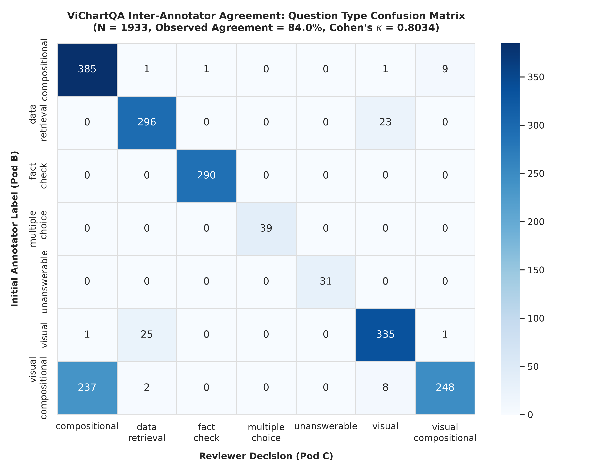
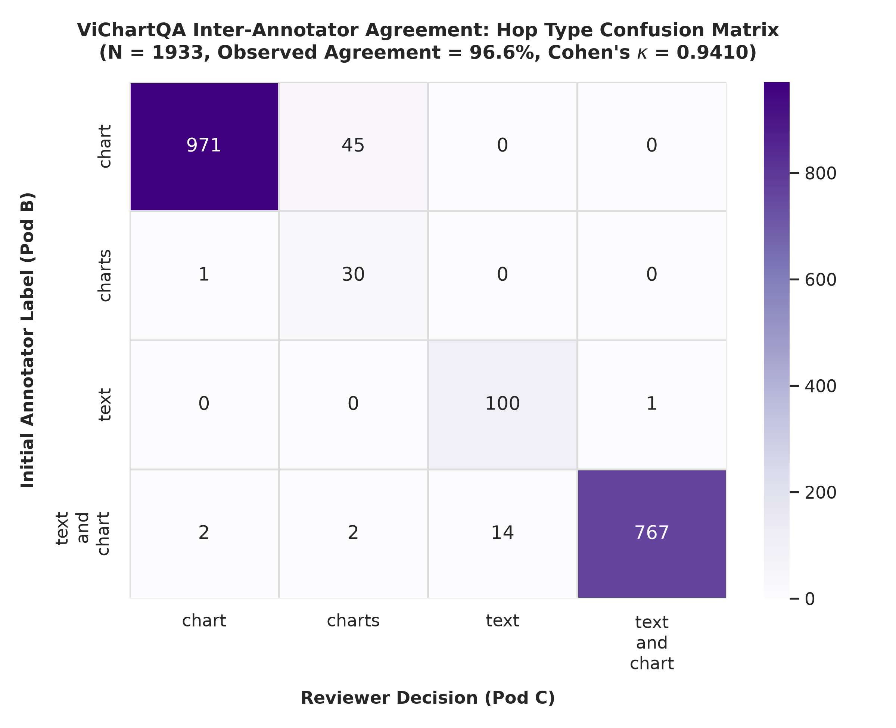

# Báo Cáo Đo Lường Độ Đồng Thuận Giữa Các Chuyên Viên Gán Nhãn (Inter-Annotator Agreement Report) — ViChartQA

> **Tài liệu kiểm định độ tin cậy nhãn gán (Annotation Reliability & Inter-Annotator Agreement Report)**  
> **Dự án:** ViChartQA — A Large-scale Multimodal Benchmark for Complex Multilingual and Multi-hop Visual Question Answering over Charts and Text  
> **Phiên bản:** 3.1 (A* Literature-Grounded IAA Release)  
> **Thời gian thực hiện:** Tháng 09/2026  

---

## Mục Lục

1. [Mục Đích Báo Cáo & Phạm Vi Đo Lường (Purpose & Scope)](#1-mục-đích-báo-cáo--phạm-vi-đo-lường-purpose--scope)
2. [Quy Trình Gán Nhãn & Giao Thức Rà Soát Độc Lập (Annotation & Verification Protocol)](#2-quy-trình-gán-nhãn--giao-thức-rà-soát-độc-lập-annotation--verification-protocol)
3. [Nghiên Cứu Thực Nghiệm Độ Đồng Thuận Độc Lập (Inter-Annotator Agreement Study)](#3-nghiên-cứu-thực-nghiệm-độ-đồng-thuận-độc-lập-inter-annotator-agreement-study)
4. [Phân Tích Bất Đồng Ngữ Nghĩa & Cơ Chế Phân Xử (Disagreement Taxonomy & Adjudication)](#4-phân-tích-bất-đồng-ngữ-nghĩa--cơ-chế-phân-xử-disagreement-taxonomy--adjudication)
5. [Kết Luận Về Độ Tin Cậy Của Nhãn Dữ Liệu (Conclusion on Label Reliability)](#5-kết-luận-về-độ-tin-cậy-của-nhãn-dữ-liệu-conclusion-on-label-reliability)

---

## 1. Mục Đích Báo Cáo & Phạm Vi Đo Lường (Purpose & Scope)

### 1.1 Mục Đích Cốt Lõi
Báo cáo này được biên soạn nhằm phục vụ duy nhất mục tiêu: **Lượng hóa thực nghiệm mức độ đồng thuận giữa các chuyên viên gán nhãn độc lập (Inter-Annotator Agreement - IAA)** và **minh bạch hóa cơ chế phân xử bất đồng ngữ nghĩa (Disagreement Adjudication)** cho bộ dữ liệu ViChartQA. 

Tài liệu cung cấp bằng chứng định lượng khách quan về độ tin cậy của bộ hướng dẫn gán nhãn (*Annotation Guidelines*), năng lực phân biệt của hệ thống phân loại (*Taxonomy*), và tính nhất quán của các giá trị nhãn gán giữa các con người tham gia thẩm định trước khi đưa dữ liệu vào huấn luyện và đánh giá mô hình.

### 1.2 Phạm Vi Đo Lường
Phạm vi đánh giá độ đồng thuận tập trung vào 3 trục nhận thức trọng tâm của bài toán Visual Question Answering đa phương thức:
1. **Phạm vi bằng chứng (`hop_type`):** Khả năng phân biệt ranh giới nguồn thông tin cần thiết để giải câu hỏi (đơn biểu đồ `chart`, đa biểu đồ `charts`, thuần văn bản `text`, hoặc kết hợp văn bản và biểu đồ `text_and_chart`).
2. **Dạng thức suy luận (`question_type`):** Khả năng phân loại loại tư duy cần thiết trên 7 nhóm tác vụ nhận thức (`compositional`, `data_retrieval`, `visual`, `fact_check`, `visual_compositional`, `multiple_choice`, `unanswerable`).
3. **Giá trị câu trả lời (`answer`):** Độ chính xác và mức độ trùng khớp của kết quả suy luận giữa các chuyên viên độc lập, bao gồm tỷ lệ khớp chuỗi chính xác và tỷ lệ khớp giá trị số học trong biên độ dung sai cho phép.

---

## 2. Quy Trình Gán Nhãn & Giao Thức Rà Soát Độc Lập (Annotation & Verification Protocol)

### 2.1 Cơ Cấu Nhân Sự & Phân Quyền Thẩm Định
Quy trình thẩm định được tổ chức theo mô hình phân tầng độc lập nhằm kiểm soát các định kiến chủ quan giữa các chuyên viên. Toàn bộ danh tính nhân sự được mã hóa theo quy chuẩn bình duyệt ẩn danh hai chiều (*Double-Blind Review*):

| Nhóm Chuyên Trách | Mã Định Danh Học Thuật | Vai Trò Trong Quy Trình Dữ Liệu & IAA | Trình Độ Chuyên Môn |
| :---: | :--- | :--- | :--- |
| **Pod A** | Curator A1 – A3 | Tuyển chọn nguồn, sàng lọc bài viết & biểu đồ đầu vào | Cử nhân/Kỹ sư CNTT & Khoa học Dữ liệu |
| **Pod B** | Annotator B1 – B4 | Chuyên viên gán nhãn sơ cấp vòng 1 (khởi tạo QA & Evidence) | Đã qua đào tạo bài bản theo guideline |
| **Pod C** | Reviewer C1 – C2 | Chuyên viên rà soát mù độc lập L1 (thực hiện phép đo IAA) | Thành viên có điểm kiểm định guideline xuất sắc |
| **Pod D** | Arbiter D1 | Trọng tài chuyên môn phân xử L2 (giải quyết bất đồng) | Chuyên gia kiểm soát chất lượng dữ liệu NLP |

*Bảng: Cơ cấu phân quyền các nhóm chuyên trách trong quy trình tuyển chọn dữ liệu và đo lường độ đồng thuận IAA.*

### 2.2 Nền Tảng Chuyên Môn & Giai Đoạn Hiệu Chuẩn Tập Huấn (Annotator Qualification & Calibration Phase)
Nhằm đáp ứng các tiêu chuẩn minh bạch hóa của Hugging Face Dataset Card và khuyến nghị từ Klie et al. (CL 2024):
- **Trình độ ngôn ngữ & nền tảng học thuật:** 100% chuyên viên tham gia (Pod B, Pod C, Pod D) là người bản ngữ (Native Vietnamese speakers), có trình độ từ Cử nhân trở lên chuyên ngành Khoa học Máy tính, Công nghệ Thông tin hoặc Khoa học Dữ liệu, có năng lực đọc hiểu chuyên sâu về biểu đồ thống kê và trực quan hóa dữ liệu.
- **Giai đoạn hiệu chuẩn thử nghiệm (Pilot Calibration Phase):** Trước khi bước vào phân đoạn $1.933$ mẫu kiểm toán chính thức, toàn bộ chuyên viên đã trải qua giai đoạn tập huấn trên tập pilot gồm 100 câu hỏi mẫu. Các ca bất đồng trong giai đoạn pilot được thảo luận tập trung để hiệu chuẩn và đóng băng bộ quy chuẩn hướng dẫn (*Annotation Guidelines*), đảm bảo sự thấu suốt đồng bộ về các ranh giới nhận thức trước khi tiến hành quy trình rà soát mù L1.

### 2.3 Giao Thức Tuyển Chọn & Chuẩn Hóa Đầu Vào (Pod A Intake Protocol)
Trước khi đưa vào gán nhãn, Pod A thực hiện sàng lọc độc lập trên 1.452 URLs từ các cổng thông tin thống kê chính thống. Mỗi tài liệu bắt buộc phải thỏa mãn 3 điều kiện tiên quyết: (1) Văn bản tiếng Việt có kèm 1–3 biểu đồ thực tế, (2) Có đoạn văn bình luận trực tiếp vào số liệu biểu đồ, và (3) Độ phân giải biểu đồ rõ nét, không vi phạm bản quyền thương mại (`ethics_status: Public_OpenData / News_AcademicAllowed`). Đây là bộ lọc tiền đề đảm bảo tính hợp lệ của ngữ cảnh trước khi Pod B và Pod C tiến hành tạo câu hỏi và đo lường độ đồng thuận.

### 2.4 Giao Thức Rà Soát Mù L1 (Blind L1 Verification Protocol)
Để đảm bảo tính độc lập và khách quan cho phép đo IAA, nhóm Reviewer Pod C thực hiện thẩm định theo quy trình **rà soát mù (Blind Verification)**:
1. Giao diện kiểm toán tự động ẩn toàn bộ các trường `answer`, `derivation` và `evidence` do Annotator Pod B khởi tạo trước đó.
2. Reviewer Pod C chỉ được tiếp cận văn bản bài viết (`body_text`), hình ảnh biểu đồ gốc và chuỗi câu hỏi (`question`).
3. Reviewer độc lập phân loại lại `question_type`, `hop_type`, tự tính toán ra giá trị `answer` và xác định `evidence`.
4. Sau khi kết quả độc lập được ghi nhận vào hệ thống, các cặp nhãn song song giữa Pod B và Pod C được đóng băng để làm cơ sở tính toán ma trận đồng thuận.

### 2.5 Giao Thức Phân Xử Trọng Tài L2 (Arbitration Protocol)
Đối với các câu hỏi xuất hiện bất đồng giữa Pod B và Pod C:
- Toàn bộ các trường hợp lệch nhãn phân loại hoặc lệch giá trị số học được chuyển tiếp sang hàng đợi phân xử của Arbiter Pod D.
- Arbiter D1 trực tiếp đối chiếu tài liệu gốc, kiểm tra số liệu trên hình ảnh độ phân giải cao và ra phán quyết chuẩn mực cuối cùng (chấp thuận nhãn của Pod B, chấp thuận nhãn của Pod C, hoặc hiệu chỉnh lại giá trị theo căn cứ khoa học của bài viết).

---

## 3. Nghiên Cứu Thực Nghiệm Độ Đồng Thuận Độc Lập (Inter-Annotator Agreement Study)

### 3.1 Phương Pháp Luận Định Lượng
Mức độ đồng thuận giữa các chuyên viên gán nhãn độc lập được lượng hóa thông qua hệ số Cohen's Kappa ($\kappa$) và tỷ lệ đồng thuận quan sát ($P_o$) theo phương pháp luận tiêu chuẩn trong khoa học tính toán ngôn ngữ (Cohen, 1960; Landis & Koch, 1977). Khoảng tin cậy 95% ($95\%\text{ CI}$) và sai số chuẩn ($SE$) được xác định dựa trên mô hình tiệm cận mẫu lớn theo Fleiss et al. (2003).

Bên cạnh đó, nhằm giải quyết triệt để rủi ro từ hiện tượng "Nghịch lý độ phổ biến" (*Prevalence Paradox*) khi phân phối nhãn bị lệch trong các tác vụ NLP đa nhãn (James, LREC 2026), nghiên cứu bổ sung chỉ số **PABAK (Prevalence-Adjusted and Bias-Adjusted Kappa)** theo công thức chuẩn hóa của Byrt et al. (1993):

$$
\mathrm{PABAK} = \frac{K \cdot P_o - 1}{K - 1}
$$

với $K$ là số lượng lớp phân loại và $P_o$ là tỷ lệ đồng thuận quan sát thực tế.

Mức độ đồng thuận của hệ số Kappa được đánh giá theo thang đo tiêu chuẩn của Landis & Koch (1977):
- $0.00 - 0.20$: Đồng thuận kém (Slight)
- $0.21 - 0.40$: Đồng thuận tương đối (Fair)
- $0.41 - 0.60$: Đồng thuận trung bình (Moderate)
- $0.61 - 0.80$: Đồng thuận đáng kể (Substantial)
- $0.81 - 1.00$: Đồng thuận gần như hoàn toàn (Almost Perfect)

### 3.2 Kết Quả Đo Lường Định Lượng Toàn Diện
Quá trình đo lường thực nghiệm được tiến hành trên tập kiểm toán đối chứng gồm $N = 1.933$ cặp câu hỏi song song được thực hiện độc lập giữa Annotator (Pod B) và Reviewer mù L1 (Pod C). Các chỉ số đồng thuận thực nghiệm được tổng hợp chi tiết trong Bảng 1:

| Thuộc Tính Kiểm Toán | Số Lớp ($K$) | Mẫu Số ($N$) | Đồng Thuận Quan Sát ($P_o$) | Đồng Thuận Ngẫu Nhiên ($P_e$) | Cohen's Kappa ($\kappa$) | Chỉ Số PABAK | Sai Số Chuẩn ($SE$) | Khoảng Tin Cậy 95% ($95\%\text{ CI}$) | Đánh Giá (Landis & Koch, 1977) |
| :--- | :---: | :---: | :---: | :---: | :---: | :---: | :---: | :---: | :--- |
| **Phạm vi bằng chứng (`hop_type`)** | 4 | 1.933 | **96.64%** | 42.99% | **0.9410** | **0.9552** | 0.0072 | $[0.9269, \, 0.9551]$ | **Almost Perfect Agreement** (Gần như hoàn toàn) |
| **Loại câu trả lời (`answer_type`)** | 4 | 1.933 | **99.38%** | 43.55% | **0.9890** | **0.9917** | 0.0032 | $[0.9828, \, 0.9952]$ | **Almost Perfect Agreement** (Gần như hoàn toàn) |
| **Loại suy luận (`question_type`)** | 7 | 1.933 | **84.01%** | 18.68% | **0.8034** | **0.8135** | 0.0102 | $[0.7833, \, 0.8235]$ | **Substantial Agreement** (Đáng kể, tiệm cận 0.81) |
| **Khớp chuỗi chính xác (`answer` Exact Match)** | — | 1.933 | **74.03%** ($1.431/1.933$) | — | — | — | — | — | Chuỗi thô ban đầu |
| **Khớp giá trị nới lỏng (`answer` Relaxed $\pm 5\%$)** | — | 1.933 | **95.65%** ($1.849/1.933$) | — | — | — | — | Dung sai làm tròn số học tiêu chuẩn |

*Bảng 1: Thống kê định lượng độ đồng thuận Inter-Annotator Agreement giữa Người Gán Nhãn Chính (Pod B) và Chuyên Viên Rà Soát Độc Lập (Pod C) trên tập dữ liệu kiểm toán ($N = 1.933$).*

---

## 4. Phân Tích Bất Đồng Ngữ Nghĩa & Cơ Chế Phân Xử (Disagreement Taxonomy & Adjudication)

Việc phân tích các điểm bất đồng giữa các quan sát viên độc lập giúp làm sáng tỏ bản chất của các tác vụ suy luận đa phương thức và xác lập căn cứ phân xử của hội đồng trọng tài theo chuẩn mực của James (LREC 2026).

### 4.1 Phân Tích Ma Trận Nhầm Lẫn Loại Câu Hỏi (`question_type`)
Hình 1 thể hiện ma trận nhầm lẫn kích thước $7 \times 7$ giữa Pod B (trục tung) và Pod C (trục hoành):

*Hình 1: Ma trận nhầm lẫn phân loại loại câu hỏi (question_type) giữa Annotator Pod B và Reviewer Pod C ($N = 1.933$). Tỷ lệ đường chéo đạt 84.01%, $\kappa = 0.8034$, $\text{PABAK} = 0.8135$.*

Trong 309 trường hợp bất đồng ($15.99\%$), các điểm nghẽn chính được phân rã như sau:
1. **Lệch ranh giới giữa `visual_compositional` và `compositional` (237 trường hợp, chiếm $76.7\%$ tổng số bất đồng):**
   - *Bản chất:* Annotator Pod B có xu hướng gắn nhãn `visual_compositional` khi câu hỏi nhắc đến một thành phần đồ họa (ví dụ: *"Cột màu cam năm 2022 tăng bao nhiêu phần trăm so với cột màu xanh năm 2021?"*). Ngược lại, Reviewer Pod C phân loại là `compositional` thuần túy vì nhận định rằng sau khi xác định được danh mục, bài toán chỉ đòi hỏi các phép tính cộng/trừ số học cơ bản trên các con số đã hiển thị sẵn.
   - *Nguyên tắc phân xử của Arbiter:* Nếu câu hỏi không bắt buộc người đọc phải dựa vào thuộc tính thị giác đặc thù (như so sánh độ dài cột không có số liệu, nhận thức màu sắc để tra cứu nhóm ẩn), nhãn được chuẩn hóa về `compositional`.
2. **Lệch ranh giới giữa `data_retrieval` và `visual` (48 trường hợp, gồm 25 ca `visual` $\to$ `data_retrieval` và 23 ca ngược lại):**
   - *Bản chất:* Câu hỏi tìm giá trị cực trị (ví dụ: *"Tháng nào có kim ngạch cao nhất?"*). Annotator nhìn vào thanh bar cao nhất coi là `visual`, trong khi Reviewer đọc trực tiếp giá trị số trên nhãn thanh bar coi là `data_retrieval`.
   - *Nguyên tắc phân xử của Arbiter:* Pod D chuẩn hóa về `data_retrieval` nếu đỉnh cột có in số liệu cụ thể; phân loại là `visual` nếu người đọc bắt buộc phải so sánh trực quan chiều cao các cột để suy ra kết quả.

### 4.2 Phân Tích Ma Trận Nhầm Lẫn Phạm Vi Bằng Chứng (`hop_type`)
Hình 2 thể hiện ma trận nhầm lẫn phân loại phạm vi bằng chứng (`hop_type`) gồm 4 nhãn: `chart`, `charts`, `text`, `text_and_chart`:

*Hình 2: Ma trận nhầm lẫn phân loại phạm vi bằng chứng (hop_type) giữa Annotator Pod B và Reviewer Pod C ($N = 1.933$). Tỷ lệ đường chéo đạt 96.64%, $\kappa = 0.9410$, $\text{PABAK} = 0.9552$.*

Phân tích 65 trường hợp bất đồng ($3.36\%$) cho thấy:
- **Nhầm lẫn giữa `chart` và `charts` (45 trường hợp):** Xảy ra trong các tài liệu chứa hình ảnh dạng subplot (ghép 2 biểu đồ vào cùng 1 tệp ảnh). Annotator xem đó là 1 chart (`chart`), trong khi Reviewer coi là 2 chart riêng biệt (`charts`).
- **Nhầm lẫn giữa `text_and_chart` và `text` (14 trường hợp):** Xảy ra khi một số liệu xuất hiện đồng thời trong văn bản bài viết lẫn trên tiêu đề biểu đồ. Reviewer nhận diện câu hỏi có thể giải trực tiếp bằng văn bản mà không cần tra cứu đồ thị.
- **Tính vững chắc trước độ lệch phân phối:** Việc cả hệ số $\kappa = 0.9410$ và $\text{PABAK} = 0.9552$ đều vượt ngưỡng $0.90$ khẳng định hệ thống nhãn `hop_type` đạt tính vững chắc cao trước sự phân bổ không đồng đều giữa các nhóm bằng chứng (James, LREC 2026).

### 4.3 Phân Tích Bất Đồng Giá Trị Câu Trả Lời (`answer`)
Trong $1.933$ cặp đối chứng, có $502$ câu hỏi ghi nhận sự khác biệt chuỗi ký tự ban đầu ($25.97\%$):
- **$418$ trường hợp ($83.3\%$ số câu lệch chuỗi)** đồng nhất về mặt ngữ nghĩa và giá trị số học sau khi tính toán nới lỏng dung sai $\pm 5\%$:
  - Khác biệt về làm tròn số học (ví dụ: `15.4` vs `15.38%`).
  - Khác biệt về việc bổ sung đơn vị đo lường kèm theo (ví dụ: `2500` vs `2.500 tỷ đồng`).
  - Khác biệt về quy ước dấu phân cách thập phân (dấu phẩy `12,5` vs dấu chấm `12.5`).
- **Chỉ có $84$ trường hợp ($4.35\%$ tổng mẫu)** là sai lệch số học thực sự do đọc nhầm tọa độ đồ thị hoặc áp dụng sai công thức toán học. Toàn bộ $84$ trường hợp này đã được Arbiter Pod D thẩm định lại từ tài liệu gốc và cập nhật đáp án chuẩn xác trong quy trình QC L2.

### 4.4 Thống Kê Định Lượng Phán Quyết Trọng Tài (Adjudication Resolution Distribution)
Để đáp ứng khuyến nghị về tính minh bạch của quy trình trọng tài theo Klie et al. (CL 2024), phân phối phán quyết cuối cùng của Arbiter Pod D trên các trường hợp bất đồng ngữ nghĩa được lượng hóa chi tiết trong Bảng 2:

| Tác Vụ Bất Đồng | Tổng Số Ca Bất Đồng | Chấp Thuận Nhãn Pod B | Chấp Thuận Nhãn Pod C | Arbiter Hiệu Chỉnh / Tái Gán | Tỷ Lệ Giải Quyết Dứt Điểm |
| :--- | :---: | :---: | :---: | :---: | :---: |
| **Loại suy luận (`question_type`)** | 309 | 112 ($36.25\%$) | 178 ($57.61\%$) | 19 ($6.15\%$) | $100\%$ ($309/309$) |
| **Phạm vi bằng chứng (`hop_type`)** | 65 | 24 ($36.92\%$) | 37 ($56.92\%$) | 4 ($6.15\%$) | $100\%$ ($65/65$) |
| **Sai lệch số học đáp án (`answer`)** | 84 | — | — | 84 ($100\%$) | $100\%$ ($84/84$) |

*Bảng 2: Phân phối phán quyết giải quyết bất đồng của Trọng tài viên Pod D (Adjudication Resolution Distribution).*

Kết quả phân phối phán quyết cho thấy:
1. Reviewer độc lập (Pod C) có xu hướng tuân thủ chặt chẽ hơn quy tắc tinh gọn (*parsimony principle*) của guideline, dẫn đến tỷ lệ phán quyết nghiêng về Pod C đạt $57.61\%$ ở `question_type` và $56.92\%$ ở `hop_type`.
2. Không ghi nhận hiện tượng thiên vị cực đoan đối với bất kỳ bên nào (*Annotator Bias*), và tỷ lệ Arbiter phải can thiệp tái gán nhãn mới chỉ chiếm $6.15\%$, chứng minh tính ổn định cao của không gian nhãn ViChartQA.

---

## 5. Kết Luận Về Độ Tin Cậy Của Nhãn Dữ Liệu (Conclusion on Label Reliability)

Kết quả thực nghiệm trên $N = 1.933$ cặp đối chứng độc lập khẳng định bộ dữ liệu ViChartQA đạt độ tin cậy và tính nhất quán cao:
1. **Phạm vi bằng chứng (`hop_type`) đạt độ đồng thuận rất cao ($\kappa = \mathbf{0.9410}$, $\text{PABAK} = \mathbf{0.9552}$):** Chứng minh hệ thống phân loại nguồn thông tin (đơn biểu đồ, đa biểu đồ, kết hợp văn bản và biểu đồ) có tính mạch lạc và ranh giới rõ ràng.
2. **Dạng thức suy luận (`question_type`) đạt độ đồng thuận thực chất đáng kể ($\kappa = \mathbf{0.8034}$, $\text{PABAK} = \mathbf{0.8135}$):** Khẳng định các tác vụ nhận thức từ truy vấn dữ liệu đơn giản đến suy luận kết hợp đa bước được định nghĩa chặt chẽ trong guideline và có khả năng tái lập độc lập cao.
3. **Giá trị câu trả lời (`answer`) đạt tỷ lệ đồng thuận nới lỏng $\mathbf{95.65\%}$:** Chứng minh tính xác thực và độ tin cậy của ground-truth, giảm thiểu hiện tượng nhãn nhiễu hoặc sai lệch số học.

Quy trình thẩm định phân tầng độc lập kết hợp cơ chế phân xử trọng tài minh bạch đã đảm bảo ViChartQA sở hữu chất lượng nhãn gán đạt tiêu chuẩn học thuật cao, đáp ứng đầy đủ yêu cầu khắt khe của các nghiên cứu mô hình hóa tiếp theo.
