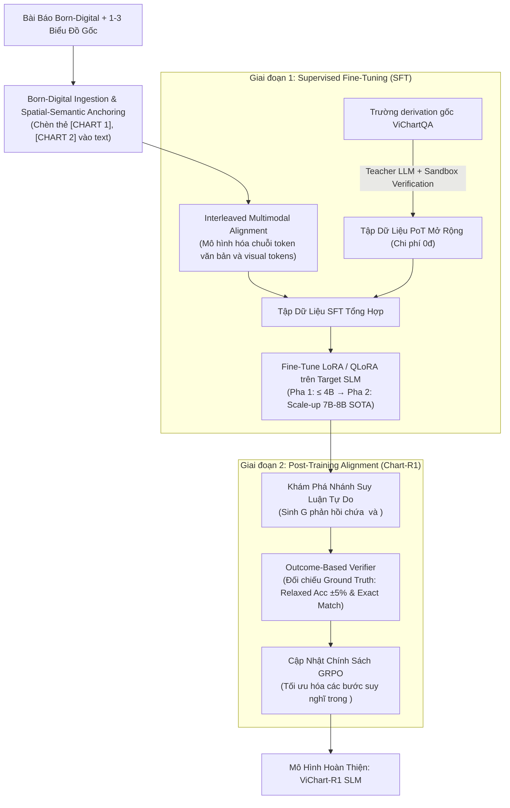
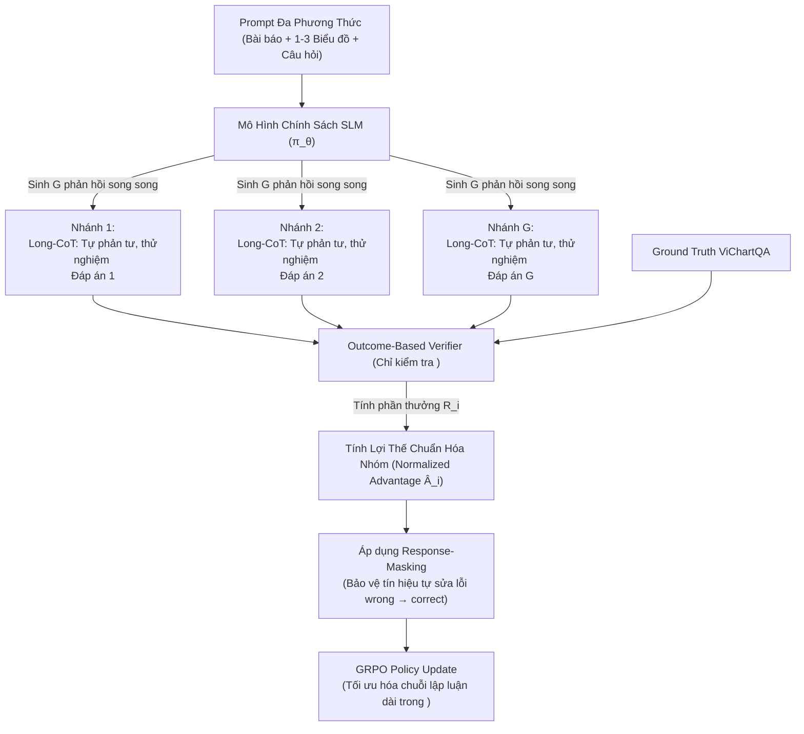

# Kế Hoạch Thực Nghiệm: Đo Lường Baseline & Pipeline Fine-Tuning SLM Cho ViChartQA

Tài liệu này tổng hợp và chuẩn hóa toàn bộ chiến lược thực nghiệm cho bài toán Hỏi đáp Tài liệu Đa Biểu đồ Song ngữ (**ViChartQA**), bao gồm quy trình đo lường mô hình cơ sở (**Zero-shot Baseline**), thiết kế đường ống tinh chỉnh (**Fine-tuning Pipeline**), cơ chế căn chỉnh sau huấn luyện hướng suy luận sâu (**GRPO / Test-time Scaling — Chart-R1**), hệ thống tiêu chí đánh giá (**Ablation Matrix**) và quy chuẩn kỹ thuật triển khai mã nguồn (**Engineering Protocols**).

---

## 1. Đo Lường Hiệu Năng Baseline Zero-Shot

Để thiết lập cột mốc so sánh chuẩn xác trước khi tiến hành fine-tuning, hệ thống tiến hành đánh giá zero-shot trên tập kiểm thử (test set) của ViChartQA với hai nhóm mô hình: mô hình thương mại qua API OpenRouter và mô hình mã nguồn mở chạy trên hạ tầng GPU thuê chuyên dụng.

### 1.1. Danh mục Mô hình Đánh giá

| Nhóm Mô hình                        | Tên Mô hình                        | Phương thức Triển khai                         | Đặc trưng & Mục tiêu Đánh giá                                                                      |
| -------------------------------------- | ------------------------------------- | -------------------------------------------------- | ---------------------------------------------------------------------------------------------------------- |
| **Thương mại (Proprietary)**  | **`GPT-4o`**                  | API OpenRouter (`openai/gpt-4o`)                 | Đo lường trần năng lực (upper-bound) của mô hình thị giác thương mại hàng đầu thế giới. |
|                                        | **`Gemini 2.5 Pro`**          | API OpenRouter (`google/gemini-2.5-pro`)         | Đánh giá năng lực hiểu ngữ cảnh cực dài và phân tích biểu đồ phức tạp.                   |
|                                        | **`Gemini 2.5 Flash`**        | API OpenRouter (`google/gemini-2.5-flash`)       | Đánh giá tỷ lệ hiệu năng / chi phí và tốc độ phản hồi trên tác vụ đa phương thức.     |
|                                        | **`Qwen2.5-VL-72B-Instruct`** | API OpenRouter (`qwen/qwen-2.5-vl-72b-instruct`) | Đại diện cho mô hình mã nguồn mở kích thước lớn (Large VLM) mạnh nhất hiện nay.             |
|                                        | **`Qwen2.5-VL-7B-Instruct`**  | API OpenRouter (`qwen/qwen-2.5-vl-7b-instruct`)  | Baseline so sánh trực tiếp cho phân khúc 7B tham số.                                                 |
| **Mã nguồn mở (Open-Source)** | **`InternVL3-8B`**            | Thuê GPU RTX 5090 (32GB VRAM)                     | Đánh giá năng lực VLM mã nguồn mở SOTA hỗ trợ xử lý đa ảnh (multi-image).                    |
|                                        | **`Vintern-3B`**              | Thuê GPU RTX 5090 (32GB VRAM)                     | **Baseline quan trọng nhất**: VLM tiếng Việt (InternViT-300M + Qwen2-2.7B) chưa fine-tune.      |
|                                        | **`Vintern-1B-v2`**           | Thuê GPU RTX 5090 (32GB VRAM)                     | Baseline cho phân khúc mô hình siêu nhẹ phục vụ edge computing.                                    |

---

### 1.2. Cấu hình Prompt & Định dạng Đầu vào Chuẩn (Zero-Shot Direct Baseline)

Trong giai đoạn đo baseline zero-shot, hệ thống **không sử dụng chuỗi suy luận** (không yêu cầu reasoning steps hay chain-of-thought), chỉ cung cấp toàn bộ tài liệu (văn bản + ảnh biểu đồ) và câu hỏi, sau đó yêu cầu mô hình trích xuất đáp án trực tiếp vào thẻ `<answer>...</answer>`.

#### Cấu trúc Prompt Template:

```markdown
[SYSTEM PROMPT]
Bạn là một chuyên gia phân tích tài liệu và biểu đồ song ngữ (Anh - Việt). 
Nhiệm vụ của bạn là đọc hiểu toàn bộ ngữ cảnh bài báo cùng các biểu đồ kèm theo để trả lời câu hỏi một cách trực tiếp và chính xác nhất.

Quy tắc định dạng kết quả:
1. Đưa ra câu trả lời trực tiếp, không sử dụng chuỗi suy luận hay giải thích dài dòng.
2. Đưa ra câu trả lời cuối cùng súc tích, ngắn gọn nhất trong thẻ <answer>...</answer>.
3. Đối với câu hỏi số học, chỉ ghi giá trị số (hoặc kèm đơn vị nếu câu hỏi yêu cầu cụ thể).
4. Đối với câu hỏi trắc nghiệm, ghi rõ chữ cái đáp án hoặc nội dung phương án chọn.
5. Nếu tài liệu và biểu đồ không chứa đủ thông tin để trả lời, ghi "unanswerable" vào trong thẻ <answer>.

[USER PROMPT]
=== TIÊU ĐỀ BÀI VIẾT ===
{title}

=== NỘI DUNG BÀI BÁO (BORN-DIGITAL TEXT) ===
{body_text_with_chart_anchors}

=== DANH SÁCH BIỂU ĐỒ ===
[CHART 1]: <Image_1>
[CHART 2]: <Image_2> (nếu có)
[CHART 3]: <Image_3> (nếu có)

=== CÂU HỎI ===
{question}
```

---

## 2. Pipeline Fine-Tuning Đề Xuất Cho ViChartQA

Hệ thống được thiết kế tối ưu cho định dạng tài liệu số hóa trực tiếp (**born-digital documents**) của ViChartQA, kết hợp năng lực hiểu ngôn ngữ tiếng Việt bản địa với khả năng suy luận logic số học đa bước.



---

### 2.1. Tiếp Nhận Dữ Liệu Số Hóa & Căn Chỉnh Đa Phương Thức Xen Kẽ

- **Loại bỏ OCR dư thừa:** Toàn bộ văn bản `body_text` được giữ nguyên vẹn ở định dạng Unicode sạch, bảo toàn 100% ngữ nghĩa và dấu thanh tiếng Việt.
- **Spatial-Semantic Anchoring:** Chèn các thẻ định danh `[CHART 1]`, `[CHART 2]`, `[CHART 3]` trực tiếp vào vị trí biểu đồ xuất hiện trong bài viết nhằm thiết lập mỏ neo ngữ nghĩa giữa luận điểm văn bản và dữ liệu trực quan.
- **Biểu diễn chuỗi xen kẽ (Interleaved Representation):**

  $$
  \mathbf{T}_{\text{input}} = [t_{\text{title}}, \dots, t_{\text{para1}}, \mathbf{V}_{\text{chart1}}, \dots, t_{\text{para2}}, \mathbf{V}_{\text{chart2}}, \dots, t_{\text{question}}]
  $$

  Trong đó $\mathbf{V}_{\text{chart}N}$ là chuỗi visual tokens được trích xuất từ Vision Encoder của mô hình và chiếu qua tầng Projection Layer vào cùng không gian embedding với Language Decoder.

---

### 2.2. Mở Rộng Dữ Liệu Suy Luận Số Học (Program-of-Thought) Với Chi Phí 0đ

Đối với các câu hỏi phức tạp đòi hỏi tính toán số học (Arithmetic, Comparison, Trend), pipeline tận dụng trường `derivation` (chứa công thức tính toán gốc, ví dụ: `"14740 - 1910"`) có sẵn trong ViChartQA để tự động mở rộng tập dữ liệu huấn luyện:

1. **VLM/LLM-Assisted Expansion:** Sử dụng Teacher LLM chuyển đổi công thức `derivation` cùng câu hỏi và ngữ cảnh thành một khối suy luận có cấu trúc hoàn chỉnh (bao gồm các bước lập luận logic và mã Python tính toán).
2. **Automated Sandbox Verification:** Đoạn mã Python sinh ra được thực thi tự động trong môi trường sandbox độc lập:
   - Nếu kết quả đầu ra của chương trình khớp chính xác với trường `answer` của ViChartQA $\rightarrow$ Cặp mẫu `(Ngữ cảnh đa phương thức, Chuỗi suy luận + Mã PoT + Đáp án)` được tự động đưa vào tập SFT.
   - Nếu kết quả không khớp hoặc mã lỗi $\rightarrow$ Loại bỏ mẫu hoặc tự động tinh chỉnh lại.
3. **Chi phí gán nhãn:** Hoàn toàn bằng $0$, không cần con người can thiệp thủ công.

---

### 2.3. Định Hướng Lựa Chọn Backbone SLM & Chiến Lược Mở Rộng Quy Mô (Scaling Strategy)

Để tối ưu hóa chi phí điện toán và đẩy nhanh chu kỳ thử nghiệm (rapid experimentation loop), hệ thống áp dụng chiến lược mở rộng quy mô $2$ giai đoạn:

#### 1. Giai đoạn Thử nghiệm & Tối ưu Phương pháp (Ưu tiên phân khúc $\le 4\text{B}$ tham số)

*Mục tiêu:* Tiết kiệm tối đa tài nguyên GPU, chạy lặp nhanh các bài thử nghiệm để tìm ra công thức huấn luyện tối ưu nhất (SFT + GRPO/RLVR recipe).

- **`Vintern-3B` (3.1B)**: Lựa chọn hạt nhân cho bài toán tiếng Việt nhờ chi phí huấn luyện LoRA rất thấp và nền tảng ngôn ngữ bản địa hóa vững chắc.
- **`InternVL3.5-2B` & `InternVL3.5-4B`**: Dòng VLM thế hệ mới siêu nhỏ gọn, hỗ trợ xử lý đa ảnh (multi-image) độ phân giải động mạnh mẽ, tối ưu hóa tốc độ huấn luyện trên GPU RTX 5090 (32GB VRAM).
- **`Qwen3-VL-4B` / `Qwen2.5-VL-3B`**: Khảo sát năng lực suy luận và khả năng tiếp nhận chuỗi ngữ cảnh dài ở quy mô nhỏ.

#### 2. Giai đoạn Mở Rộng Quy Mô Đạt Đỉnh Hiệu Năng (Scale-Up lên phân khúc $7\text{B} - 8\text{B}$ để lập SOTA)

*Mục tiêu:* Sau khi đã xác định được công thức huấn luyện tối ưu từ phân khúc $\le 4\text{B}$, tiến hành áp dụng toàn bộ pipeline lên các backbone $7\text{B} - 8\text{B}$ để tối đa hóa điểm số benchmark và thiết lập mô hình SOTA cho ViChartQA.

- **`InternVL3.5-8B`**: Mô hình VLM mã nguồn mở SOTA ở phân khúc 8B, thừa hưởng trọn vẹn kiến trúc tiên tiến và năng lực xử lý đa biểu đồ vượt trội.
- **`Qwen2.5-VL-7B-Instruct`**: Backbone đối chuẩn mạnh mẽ ở phân khúc 7B với năng lực định vị trực quan và lập luận toán học đa phương thức hàng đầu.

---

## 3. Cơ Chế Post-Training GRPO / Test-Time Scaling (Hướng Chart-R1)

Sau giai đoạn huấn luyện giám sát (SFT), mô hình được chuyển sang giai đoạn tối ưu hóa nâng cao bằng thuật toán **Group Relative Policy Optimization (GRPO)** và **Reinforcement Learning with Verifiable Rewards (RLVR)** theo tư tưởng của DeepSeek-R1 áp dụng cho tác vụ biểu đồ (**Chart-R1 Paradigm**).



---

### 3.1. Hậu Huấn Luyện RLVR và Kỷ Nguyên Tối Ưu Hóa Chuỗi Lập Luận Dài

#### 1. Sự Bổ Trợ Giữa Giám Sát Hành Vi (Cold-Start SFT) và Học Tăng Cường (RLVR)

- **Vai trò không thể thay thế của Cold-Start SFT:** Việc áp dụng trực tiếp thuật toán GRPO lên một mô hình nền tảng chưa qua căn chỉnh thường dẫn đến hiện tượng sụp đổ chính sách (policy collapse) hoặc hiệu suất kém. Do đó, pha SFT đóng vai trò khởi động nguội bắt buộc nhằm xây dựng năng lực phân rã tác vụ cơ bản, hiểu cấu trúc biểu đồ và định hình cú pháp đầu ra.
- **Vai trò của GRPO/RLVR:** Đóng vai trò là pha tinh chỉnh hiệu năng cao cấp, rèn luyện khả năng bám sát định dạng, tính chính xác số học tuyệt đối và kích hoạt các hành vi nhận thức nâng cao.

#### 2. Kỷ Nguyên Chuỗi Lập Luận Dài (Long-CoT Exploration & Zero-Length Penalty)

- **Loại bỏ hình phạt độ dài:** Hệ thống chấp nhận và khuyến khích việc mô hình tạo ra các quỹ đạo lập luận dài gấp nhiều lần trong thẻ `<think>` (từ hàng trăm đến hàng nghìn tokens) bằng cách loại bỏ hoàn toàn hình phạt tiêu tốn token.
- **Kích hoạt hành vi nhận thức nâng cao:** Chuỗi suy luận kéo dài đóng vai trò như một không gian nháp trực quan (visual scratchpad), chuyển dịch gánh nặng tính toán từ bộ mã hóa thị giác (Vision Encoder) sang bộ giải mã ngôn ngữ (Language Decoder), kích hoạt các hành vi:
  - **Tự đặt câu hỏi phụ (Self-Questioning):** Tự chất vấn để làm rõ các điểm dữ liệu mập mờ hoặc xu hướng giao nhau trên biểu đồ.
  - **Phản tư và phát hiện mâu thuẫn (Self-Reflection):** Tự đối chiếu chéo số liệu giữa bài báo và biểu đồ để phát hiện sai lệch.
  - **Thử nghiệm tính toán nháp (Trial Calculation / Backtracking):** Tự tính toán nháp và sửa lại nếu phát hiện bước trước đó không hợp lý trước khi chốt đáp án cuối cùng.

---

### 3.2. Hệ Thống Đánh Giá Phần Thưởng Đa Tầng Cho Miền Biểu Đồ (Chart Reward Formulation)

Phần thưởng được tính toán **hoàn toàn tự động** dựa trên hàm mục tiêu đa thành phần:

$$
\mathbf{R}_{\text{chart}} = \lambda_{\text{fmt}} \mathbf{R}_{\text{format}} + \lambda_{\text{num}} \mathbf{R}_{\text{numerical}} + \lambda_{\text{str}} \mathbf{R}_{\text{string}}
$$

#### 1. Phần thưởng Khớp mềm Số học ($\mathbf{R}_{\text{numerical}}$):

Để tránh việc phạt nhị phân cứng nhắc đối với các sai số làm tròn hoặc ước lượng thị giác nhỏ, hệ thống áp dụng cơ chế khớp mềm tuyến tính trong khoảng dung sai $\pm 5\%$:

$$
\mathbf{R}_{\text{numerical}}(y, y^*) = 
\begin{cases}
\max\left(0, 1 - 20 \times \frac{|y - y^*|}{y^*}\right) & \text{nếu } \frac{|y - y^*|}{y^*} \le 0.05 \\
0.0 & \text{ngược lại}
\end{cases}
$$

#### 2. Phần thưởng Chuỗi Ký tự & Thực thể ($\mathbf{R}_{\text{string}}$):

Đối với câu hỏi trắc nghiệm hoặc trích xuất nhãn trục, tiêu đề, thực thể văn bản:

$$
\mathbf{R}_{\text{string}} = 
\begin{cases} 
1.0 & \text{nếu } \text{Normalize}(y_{\text{pred}}) == \text{Normalize}(y_{\text{gt}}) \\
0.0 & \text{ngược lại}
\end{cases}
$$

#### 3. Phần thưởng Định dạng Cấu trúc ($\mathbf{R}_{\text{format}}$):

Kiểm tra tính toàn vẹn cấu trúc thông qua bộ phân tích biểu thức chính quy (Regex Parser):

$$
\mathbf{R}_{\text{format}} = 
\begin{cases} 
1.0 & \text{nếu chứa đầy đủ và hợp lệ cặp thẻ } \text{<think>...</think>} \text{ và } \text{<answer>...</answer>} \\
-0.5 & \text{nếu thiếu thẻ hoặc xuất sai định dạng}
\end{cases}
$$

---

### 3.3. Cập Nhật Chính Sách GRPO & Chiến Lược Che Giấu Phản Hồi (Response-Masking)

1. **Cập nhật chính sách theo nhóm:**
   Thuật toán GRPO tính toán lợi thế chuẩn hóa (normalized advantage) của từng nhánh phản hồi trong nhóm $G$ mẫu mà không cần mô hình Critic:

   $$
   \hat{A}_i = \frac{R_i - \text{mean}(\{R_1, \dots, R_G\})}{\text{std}(\{R_1, \dots, R_G\}) + \epsilon}
   $$
2. **Chiến lược Che giấu Phản hồi (Response-Masking Strategy):**
   Trong quá trình khám phá của RLVR, mô hình thường xuyên tạo ra các quỹ đạo chứa hành vi tự sửa lỗi ($\text{wrong} \rightarrow \text{correct}$ trong `<think>`). Để tránh xung đột tín hiệu gradient (mô hình bị bối rối giữa việc trả lời đúng ngay hay cố tình sai rồi mới sửa để nhận thưởng), hệ thống áp dụng mặt nạ nhị phân loại bỏ phần lập luận sai lầm ban đầu ra khỏi quá trình tính toán policy loss, chỉ tối ưu hóa các bước sửa lỗi chính xác phía sau. Cơ chế này giúp tăng tốc độ hội tụ và rèn luyện năng lực tự sửa lỗi bền vững.

---

## 4. Hệ Thống Tiêu Chí Đánh Giá & Ma Trận Phân Tách (Ablation Matrix)

### 4.1. Các Thước Đo Hiệu Năng Chính (Primary Metrics)

1. **Relaxed Accuracy ($\pm 5\%$):** Thước đo chính cho các câu hỏi tính toán số học, cho phép dung sai sai số thị giác tối đa $5\%$ so với nhãn chuẩn.
2. **Exact Match (EM):** Đo lường độ chính xác tuyệt đối sau khi chuẩn hóa văn bản (loại bỏ ký tự đặc biệt, viết hoa/thường, khoảng trắng thừa) cho câu hỏi dạng chữ/thực thể.
3. **Multiple-Choice Accuracy:** Tỷ lệ chọn đúng đáp án trên các câu hỏi trắc nghiệm 4 lựa chọn.
4. **Unanswerable Detection F1:** Đo lường khả năng từ chối trả lời và nhận diện chính xác các câu hỏi không đủ thông tin trong tài liệu.
5. **Báo cáo Phân rã Theo Nguồn Dữ Liệu:** Tách riêng điểm số của nhóm câu hỏi đơn nguồn (`chart`) để đối sánh trực tiếp với các benchmark quốc tế (ChartQA, ChartQAPro) và nhóm câu hỏi đa chặng (`text_and_chart`, `charts`).

---

### 4.2. Ma Trận Phân Tách Thực Nghiệm Đa Trục (Ablation Matrix)

Quá trình đánh giá hiệu năng của các mô hình baseline và proposal model được phân rã chi tiết theo $4$ trục độc lập:

| Trục Phân Tách                                 | Các Phân Nhóm Cụ Thể                                                                                                                                                                                                                                           | Mục Tiêu & Câu Hỏi Nghiên Cứu Cần Trả Lời                                                                                                                           |
| ------------------------------------------------- | ------------------------------------------------------------------------------------------------------------------------------------------------------------------------------------------------------------------------------------------------------------------- | ---------------------------------------------------------------------------------------------------------------------------------------------------------------------------- |
| **1. Theo Lĩnh vực (Domain)**             | - Kinh tế & Tài chính- Xã hội & Đời sống- Y tế & Giáo dục- Khoa học & Môi trường                                                                                                                                                                     | Đánh giá độ nhạy của mô hình trước các thuật ngữ chuyên ngành và cách biểu diễn số liệu đặc thù của từng lĩnh vực báo chí.                    |
| **2. Theo Số chặng Suy luận (Hop Type)** | -`text` (Chỉ văn bản bài báo)- `chart` (Chỉ 1 ảnh biểu đồ)- `text_and_chart` (Kết hợp bài báo + biểu đồ)- `charts` (Đối chiếu giữa $2-3$ biểu đồ)                                                                                 | Cung cấp bằng chứng thực nghiệm kiểm chứng giả thuyết:*Suy luận đa chặng đa phương thức (multi-hop) khó hơn đáng kể so với truy xuất nguồn đơn*. |
| **3. Theo Nhóm Câu hỏi (Question Type)** | - Factoid (Trích xuất sự thật)- Comparison (So sánh)- Arithmetic (Tính toán số học)- Trend (Nhận diện xu hướng)- Visual (Đặc trưng thị giác: màu sắc, vị trí)- Multi-span (Tổng hợp nhiều điểm)- Non-extractive (Lập luận tổng quát) | Xác định chính xác nhóm câu hỏi nào là điểm nghẽn (bottleneck) lớn nhất của từng backbone mô hình.                                                        |
| **4. Theo Dạng Biểu đồ (Chart Type)**   | - Đơn giản: Bar, Line, Pie- Phức tạp: Stacked Bar, Combo Chart, Multi-panel Subplots                                                                                                                                                                           | Đánh giá độ bền vững của mô hình khi biểu đồ có mật độ thông tin dày đặc hoặc nhiều đường đồ thị giao nhau.                                     |

---

## 5. Quy Chuẩn Kỹ Thuật Triển Khai Thực Nghiệm (Engineering & Execution Protocols)

Để đảm bảo tính nhất quán, minh bạch, khả năng tái lập và an toàn dữ liệu trong suốt quá trình chạy thực nghiệm (cả Zero-shot Baseline và Fine-tuned Inference), toàn bộ mã nguồn thực thi bắt buộc tuân thủ 4 nguyên tắc kỹ thuật sau:

### 5.1. Thống Nhất Giao Diện CLI Với `argparse` & Khả Năng Khôi Phục (Resume)

Mọi script đánh giá mô hình phải được đóng gói chuẩn thông qua module `argparse` của Python, cung cấp đầy đủ các cờ cấu hình và tích hợp sẵn cơ chế **Resume**:

```python
import argparse

def parse_args():
    parser = argparse.ArgumentParser(description="ViChartQA Evaluation Runner")
    parser.add_argument("--model", type=str, required=True, help="Tên model (vd: openai/gpt-4o, vintern-3b)")
    parser.add_argument("--provider", type=str, choices=["openrouter", "local_gpu"], default="openrouter")
    parser.add_argument("--data_path", type=str, required=True, help="Đường dẫn file dataset JSON/JSONL")
    parser.add_argument("--image_dir", type=str, required=True, help="Thư mục chứa ảnh biểu đồ")
    parser.add_argument("--output_file", type=str, required=True, help="File JSONL lưu log kết quả")
    parser.add_argument("--subset", type=int, default=None, help="Số lượng mẫu chạy thử nghiệm (None = toàn bộ)")
    parser.add_argument("--temperature", type=float, default=0.0, help="Nhiệt độ sinh (mặc định 0.0 cho benchmark)")
    parser.add_argument("--resume", action="store_true", default=True, help="Tự động chạy tiếp từ mẫu chưa hoàn thành")
    return parser.parse_args()
```

- **Cơ chế Resume:** Khi cờ `--resume` được bật, script sẽ đọc file `output_file` hiện có, thu thập toàn bộ danh sách `sample_id` đã hoàn thành. Trong quá trình lặp qua dataset, các mẫu đã có trong cache/log sẽ được bỏ qua ngay lập tức, giúp tiếp tục tiến trình mượt mà nếu gặp sự cố mạng hoặc crash.

---

### 5.2. Ghi Log Tức Thời Sau Từng Mẫu (Immediate / Per-Sample Atomic Logging)

**Tuyệt đối không gom toàn bộ kết quả vào bộ nhớ để ghi một lần khi kết thúc chương trình.** Thay vào đó, áp dụng cơ chế ghi tức thời sau mỗi mẫu:

```python
import json

def log_sample_result(output_file_path: str, record: dict):
    """Ghi ngay lập tức kết quả của từng sample vào file JSONL với flush=True."""
    with open(output_file_path, mode="a", encoding="utf-8") as f:
        f.write(json.dumps(record, ensure_ascii=False) + "\n")
        f.flush()  # Đẩy ngay dữ liệu xuống đĩa cứng, chống mất mát khi crash
```

Mỗi bản ghi log bắt buộc chứa đầy đủ các trường minh chứng:

- `sample_id`: Định danh duy nhất của mẫu trong ViChartQA.
- `question`, `hop_type`, `question_type`, `chart_type`, `domain`.
- `prompt_sent`: Toàn bộ nội dung prompt đã gửi đi (bao gồm text và danh sách đường dẫn ảnh).
- `raw_response`: Toàn văn chuỗi phản hồi thô từ model.
- `extracted_answer`: Chuỗi đáp án đã trích xuất từ thẻ `<answer>`.
- `ground_truth`: Đáp án chuẩn trong dataset.
- `is_correct`: Kết quả đánh giá tự động (True/False theo metric tương ứng).
- `latency_seconds`, `timestamp`.

---

### 5.3. Quy Trình Thử Nghiệm Trên Tập Con (Sanity Check / Dry-Run on Subset)

Trước khi tiến hành chạy benchmark hàng loạt trên toàn bộ dataset:

1. **Chạy Dry-run trên Subset ($10 \text{ đến } 20$ mẫu):** Sử dụng cờ `--subset 20` để kiểm tra:
   - Tính thông suốt của kết nối API OpenRouter / Driver GPU RTX 5090.
   - Cơ chế nạp ảnh đa biểu đồ và chèn thẻ neo `[CHART N]`.
   - Khả năng trích xuất chính xác thẻ `<answer>` từ phản hồi của model.
   - Tính toán metric tự động trên output mẫu.
2. **Kích hoạt Chạy Toàn Bộ (Full Benchmark Run):** Sau khi xác nhận script dry-run hoạt động chính xác $100\%$ không phát sinh lỗi ngoại lệ, tiến hành chạy trên toàn bộ tập dữ liệu.
