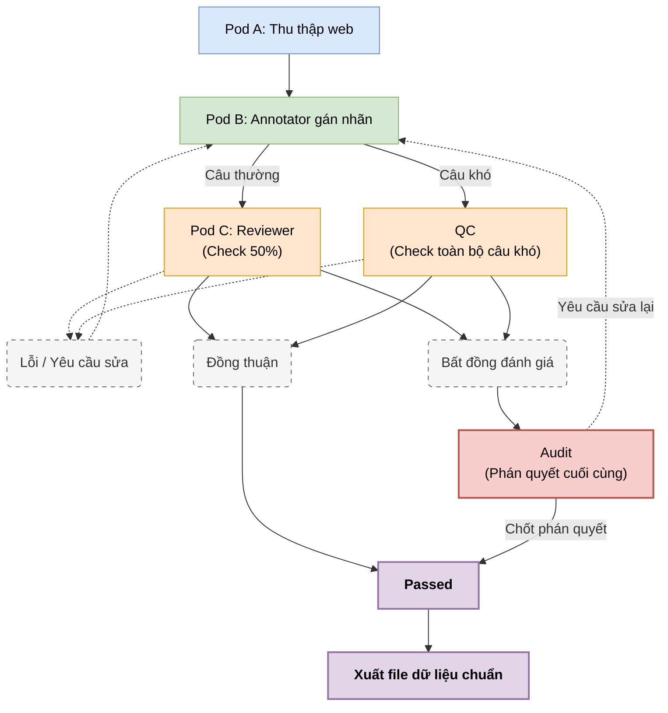

# Proposal: ViChartQA - A Benchmark for Vietnamese Multi-modal Chart and Document Question Answering

## 1. Tên dự án (Title)

**ViChartQA: Benchmarking Multi-hop Reasoning over Vietnamese Documents and Charts**

## 2. Tóm tắt (Abstract)

Biểu đồ (charts) là thành phần không thể thiếu trong các tài liệu kinh tế, khoa học và báo cáo phân tích, đóng vai trò trực quan hóa dữ liệu để con người dễ dàng trích xuất thông tin và suy luận. Mặc dù các mô hình ngôn ngữ thị giác lớn (Vision-Language Models - VLMs) đã đạt hiệu suất ấn tượng trên các bộ dữ liệu tiếng Anh, năng lực của chúng đối với ngôn ngữ tiếng Việt – đặc biệt trong các tác vụ suy luận đa phương thức phức tạp (multi-hop reasoning) trên tài liệu chứa biểu đồ – vẫn chưa được đánh giá toàn diện.

**ViChartQA** là bộ dữ liệu tiếng Việt đầu tiên tập trung vào bài toán hỏi đáp kết hợp văn bản (text) và biểu đồ (chart) ở cấp độ tài liệu (document-level). Khác với các nghiên cứu trước đây thường cô lập biểu đồ, ViChartQA đặt biểu đồ vào ngữ cảnh tài liệu gốc, đòi hỏi mô hình phải đọc hiểu văn bản, trích xuất dữ liệu từ hình ảnh biểu đồ và thực hiện suy luận chéo (cross-modal reasoning) để tìm ra câu trả lời.

Nghiên cứu mang đến hai đóng góp cốt lõi:

1. **Xây dựng bộ dữ liệu ViChartQA**: Đóng góp bộ dữ liệu tiếng Việt chất lượng cao, lấy từ các tài liệu kinh tế/khoa học thực tế, được gán nhãn thủ công với quy trình kiểm định chất lượng nghiêm ngặt.
2. **Đánh giá năng lực của SoTA VLMs**: Thiết lập benchmark đầu tiên để đo lường và so sánh khả năng hiểu biểu đồ tiếng Việt của các mô hình VLM tiên tiến, đồng thời phát triển các mô hình fine-tuned (dựa trên Vintern-3B và Qwen2.5-VL) chuyên biệt cho tác vụ này.

---

## 3. Bối cảnh và Rà soát công trình liên quan (Motivation & Related Work)

Sự ra đời của ViChartQA xuất phát từ 5 khoảng trống lớn trong các nghiên cứu hiện tại: thiếu vắng dữ liệu tiếng Việt, thiếu bối cảnh tài liệu thực tế (document-level), các benchmark cũ đã bão hòa, thiếu tính chuyên môn (kinh tế/khoa học), và cơ hội để các mô hình mã nguồn mở cạnh tranh trong một miền hẹp.

### 3.1. Dòng nghiên cứu ChartQA tiếng Anh

Các bộ dữ liệu tiếng Anh đã phát triển mạnh từ việc dùng dữ liệu sinh tự động (synthetic) sang dữ liệu thực tế (in-the-wild), nhưng các mô hình VLM như Claude 3.5 Sonnet hay GPT-4o hiện đã đạt điểm số bão hòa (>90% trên ChartQA gốc). Điều này thúc đẩy sự ra đời của các benchmark khó hơn vào năm 2024-2025:

| Bộ dữ liệu               | Nguồn ảnh                        | Quy mô                             | Kiểu câu hỏi                                              | Năm |
| :-------------------------- | :--------------------------------- | :---------------------------------- | :----------------------------------------------------------- | :--- |
| **FigureQA**          | Vẽ tự động (Matplotlib)        | 180K chart / 2.3M QA                | Template, từ vựng cố định                               | 2017 |
| **DVQA**              | Vẽ tự động                     | 300K chart / 3.4M QA                | Template, từ vựng cố định                               | 2018 |
| **PlotQA**            | Vẽ tự động                     | 224K chart / 28M QA                 | Template, từ vựng mở                                      | 2020 |
| **ChartQA**           | Statista, Pew, OWID... (Thực tế) | 20.9K chart / 32.7K QA              | Người viết + sinh bằng T5 (compositional + visual)       | 2022 |
| **ChartX / ChartVLM** | GPT-4 sinh code vẽ hàng loạt    | Đa dạng loại chart, quy mô lớn | QA + caption + trích xuất, đa tác vụ                    | 2024 |
| **CharXiv**           | Bài báo khoa học trên arXiv    | 2.3K chart / ~5K QA                 | Mô tả + suy luận xu hướng                               | 2024 |
| **ChartBench**        | Tổng hợp                         | 2.1K chart / 18.9K QA               | Số liệu + Đúng/Sai                                       | 2024 |
| **ChartQAPro**        | 157 nền tảng web (Thực tế)     | 1.34K chart / 1.95K QA              | Factoid, trắc nghiệm, hội thoại, giả định, fact-check | 2025 |
| **FinChart-Bench**    | Biểu đồ tài chính thực tế   | Quy mô vừa, chuyên tài chính   | Đa dạng, thiên về suy luận tài chính                  | 2025 |

### 3.2. Dòng nghiên cứu Document-level Multimodal QA

Gần đây, các benchmark đa phương thức cấp độ tài liệu (Document-level) như **DCQA**, **MMDocIR**, **RealDocBench** hay **MultiHiertt** đã xuất hiện nhằm đo lường khả năng lý luận kết hợp trên văn bản và bảng biểu. Tuy nhiên, các bộ Document QA hiện tại thường xử lý biểu đồ rất nông; ngược lại, các bộ Chart QA truyền thống lại hoàn toàn cắt bỏ văn bản ngữ cảnh xung quanh. ViChartQA lấp đầy khoảng trống này bằng cách yêu cầu mô hình thực hiện các bước lý luận đa bước (multi-hop) xuyên suốt giữa văn bản và biểu đồ phức tạp.

### 3.3. Dòng nghiên cứu VQA đa phương thức tiếng Việt

Đối với tiếng Việt, các tác vụ VQA chủ yếu tập trung vào ảnh tổng quát (general images) hoặc đọc hiểu văn bản trong ảnh (OCR), hoàn toàn vắng bóng các bộ dữ liệu hỏi đáp biểu đồ đòi hỏi suy luận logic và toán học:

| Bộ dữ liệu                    | Miền ảnh                                          | Quy mô                                     | Đặc điểm                                               | Năm           |
| :------------------------------- | :-------------------------------------------------- | :------------------------------------------ | :--------------------------------------------------------- | :------------- |
| **ViVQA**                  | Ảnh tổng quát (MS COCO)                          | 10.3K ảnh / 15K QA                         | Câu hỏi ít đa dạng ngôn ngữ                         | 2021           |
| **EVJVQA**                 | Ảnh chụp tại Việt Nam                           | 5K ảnh / 33K QA                            | 3 ngôn ngữ VI/EN/JA                                      | 2022           |
| **OpenViVQA**              | Ảnh tổng quát                                    | 11K ảnh / 37K QA                           | Câu trả lời mở, viết tay hoàn toàn                  | 2023           |
| **ViOCRVQA**               | Ảnh có chữ (biển hiệu, tài liệu)             | Quy mô vừa-lớn                           | Đọc hiểu văn bản trong ảnh (OCR)                     | 2024           |
| **VMMU**                   | Đa nhiệm (STEM, biểu diễn dữ liệu)            | 2.5K QA / 7 tác vụ                        | Mô hình mạnh nhất chỉ đạt ~66%, nghẽn ở suy luận | 2025           |
| **ViInfographicVQA**       | Infographic (Kinh tế, Y tế, Xã hội)             | 6.7K ảnh / 20.4K QA                        | Nhấn mạnh trích xuất trên infographic hỗn hợp       | 2025           |
| **ViChartQA (Đề xuất)** | **Biểu đồ Kinh tế & Khoa học thực tế** | **1.2K - 2K documents / 6K - 12K QA** | **Suy luận Compositional + Thị giác, Multi-hop**  | **2026** |

### 3.4. Các mô hình Chart-VLM chuyên biệt

Sự phát triển của dữ liệu kéo theo các mô hình được tinh chỉnh đặc thù cho chart:

| Mô hình                     | Backbone                   | Ý tưởng chính                                                              |
| :---------------------------- | :------------------------- | :----------------------------------------------------------------------------- |
| **ChartLlama**          | LLaVA                      | Instruction-tuning trên dữ liệu chart tổng hợp đa dạng loại            |
| **ChartGemma**          | PaliGemma (nhỏ)           | Sinh dữ liệu instruction trực tiếp từ ảnh chart; nhỏ nhưng cạnh tranh |
| **TinyChart**           | -                          | Token-merging cho ảnh phân giải cao + suy luận Program-of-Thought          |
| **ChartMoE**            | InternLM-XComposer + MoE   | Vượt TinyChart+PoT trên hầu hết chỉ số (SOTA 2024)                      |
| **Chart-R1 / RVR / RL** | Nhiều backbone khác nhau | RL với phần thưởng kiểm chứng được (RLVR) cho suy luận chart         |
| **Vintern-1B / 3B**     | InternViT-300M + Qwen2     | VLM tiếng Việt, huấn luyện trên 3M+ cặp ảnh-hỏi-đáp                  |

*(ViChartQA sẽ tận dụng các mô hình nguồn mở như Vintern-3B để fine-tune, kiểm chứng khả năng áp dụng RLVR nhờ vào việc lưu trữ metadata gốc của biểu đồ).*

---

## 4. Thiết kế Bộ dữ liệu (Dataset Design)

### 4.1. Nguồn, Miền Dữ liệu & Quy mô Mục tiêu

**Nguồn Dữ liệu Thực tế (100% In-the-wild):** ViChartQA thu thập hoàn toàn từ các báo cáo và bài viết thực tế có chứa biểu đồ tự nhiên. Dự án tuyệt đối **không sử dụng dữ liệu sinh tự động (synthetic)** hay các công cụ vẽ biểu đồ như Kaggle/UCI, nhằm giữ nguyên tính thực tế và các yếu tố nhiễu (noise) tự nhiên.

**Miền Dữ liệu (Domain):** Trọng tâm ưu tiên là lĩnh vực **Kinh tế/Tài chính** và **Khoa học**. Để tăng tính bao quát và thách thức năng lực khái quát hóa (generalization), bộ dữ liệu mở rộng thu thập sang các lĩnh vực Y tế, Giáo dục, Môi trường. Mọi biểu đồ thu thập đều đi kèm quy trình rà soát bản quyền (Copyright/License) nghiêm ngặt để đảm bảo đạo đức nghiên cứu.

Bộ dữ liệu được thiết kế với đơn vị là **Document** (Tài liệu), bao gồm toàn văn bài viết (body text) và 1-3 biểu đồ. Mức quy mô được đặt ra so sánh sòng phẳng với các bộ dữ liệu multi-hop text+table trên thế giới (như TAT-QA, MultiHiertt, SlideVQA).

| Giai đoạn                 |    Document    | Chart (ước tính 1-3/doc) | Câu hỏi (QA) |
| :-------------------------- | :-------------: | :-------------------------: | :-------------: |
| **MVP (Tối thiểu)** | **1.200** |  **~1.800 – 3.000**  | **6.000** |
| **Mở rộng**         |      2.000      |           ~3.000           |     ~15.000     |

### 4.2. Taxonomy Câu hỏi & Tỷ trọng mục tiêu

Để tránh việc mô hình học vẹt (overfitting) các mẫu câu hỏi đơn giản, câu hỏi trong ViChartQA được phân bố một cách chiến lược thành 7 nhóm (Question Type) theo độ khó:

| Nhóm                  | `question_type`        | Mô tả                                        | Ví dụ                                                                          |      Tỷ trọng mục tiêu      |
| :--------------------- | :----------------------- | :--------------------------------------------- | :------------------------------------------------------------------------------- | :------------------------------: |
| Truy vấn dữ liệu    | `data_retrieval`       | Đọc trực tiếp một giá trị/nhãn         | "Tỷ lệ lạm phát năm 2024 là bao nhiêu?"                                   |          **~15%**          |
| Thị giác             | `visual`               | Tham chiếu màu sắc, vị trí, kích thước | "Cột màu xanh lam cao nhất nằm ở năm nào?"                                |          **~15%**          |
| Suy luận kết hợp    | `compositional`        | ≥ 2 phép toán số học/logic                | "Chênh lệch tăng trưởng GDP giữa quý 1 và 3 là bao nhiêu?"             |          **~30%**          |
| Thị giác + Suy luận | `visual_compositional` | Kết hợp cả hai                              | "Năm nào có cột màu xanh lá chênh lệch lớn nhất so với năm trước?" |          **~20%**          |
| Mở rộng              | `multiple_choice`      | Trắc nghiệm 4 đáp án                      | "Năm nào tăng trưởng cao nhất? A. 2021 B. 2022..."                         | **~20%***(gộp 3 loại)* |
| Mở rộng              | `fact_check`           | Kiểm tra đúng/sai                           | "Đúng hay sai: doanh thu quý 4 luôn cao nhất năm?"                         | **~20%***(gộp 3 loại)* |
| Mở rộng              | `unanswerable`         | Không trả lời được từ document          | "Nguyên nhân lạm phát tăng đột biến là gì?"                            | **~20%***(gộp 3 loại)* |

### 4.3. Phân bổ theo Phạm vi Bằng chứng (Hop-type)

Đây là tiêu chí cốt lõi để khẳng định năng lực **Multi-hop reasoning** của ViChartQA. Chúng tôi yêu cầu kiểm soát chặt chẽ "Phép thử Bỏ Text" (nếu che đoạn văn bản đi mà vẫn trả lời được từ biểu đồ thì bắt buộc phải là `single_chart`). Mục tiêu tối thượng là đảm bảo **≥ 50%** câu hỏi trong tập dữ liệu thuộc nhóm multi-hop (cần sự kết hợp đa phương thức).

| Hop-type            | Định nghĩa                                                                                                                             | Ví dụ minh họa                                                                                                                        |
| :------------------ | :---------------------------------------------------------------------------------------------------------------------------------------- | :--------------------------------------------------------------------------------------------------------------------------------------- |
| `single_chart`    | Toàn bộ bằng chứng và số liệu để trả lời chỉ nằm trên 1 hình ảnh biểu đồ.                                              | *"Tốc độ tăng trưởng GDP năm 2024 trên biểu đồ là bao nhiêu %?"*                                                          |
| `text_to_chart`   | Lấy một thông tin/ngữ cảnh chỉ có trong văn bản (text), sau đó đối chiếu hoặc tính toán với số liệu trên biểu đồ. | *"So với mục tiêu 6.5% nêu trong bài viết, thực hiện năm 2024 trên biểu đồ cao hơn bao nhiêu?"*                         |
| `chart_to_chart`  | Kết hợp, đối chiếu số liệu từ**2 biểu đồ trở lên** trong cùng một bài viết (ví dụ Hình 1 và Hình 2).          | *"Tỷ lệ lạm phát năm 2024 (trên Hình 2) chiếm bao nhiêu % so với GDP cùng năm (trên Hình 1)?"*                           |
| `fact_check_dual` | Cần đối chiếu sự khớp nhau/mâu thuẫn giữa lời văn trong bài viết và số liệu thực tế trên hình ảnh.                   | *"Đúng hay sai: Bài báo cho rằng xuất khẩu nông nghiệp dẫn đầu, nhưng biểu đồ lại cho thấy công nghiệp cao hơn?"* |

---

## 5. Phương pháp Xây dựng & Quy trình Quản lý Chất lượng (SOP)

Nhằm đảm bảo bộ dữ liệu đạt tiêu chuẩn nộp các hội nghị hạng A* (như ACL/EMNLP), dự án tổ chức nhóm nghiên cứu với **10 thành viên** vận hành theo quy trình dây chuyền (Pod-based) gồm 5 bước nghiêm ngặt.

**Sơ đồ luồng công việc (Workflow Architecture):**

**Phân bổ nhân sự & Nhiệm vụ chi tiết (10 thành viên):**

1. **Pod A - Thu thập Dữ liệu (3 thành viên)**: Chịu trách nhiệm tìm kiếm, crawl các bài báo từ nguồn chính thống (GSO, CafeF). Trích xuất `body_text`, tải ảnh biểu đồ và phân loại sơ bộ. Bắt buộc kiểm tra, lưu trữ thông tin bản quyền (Copyright/License) và tuân thủ định hướng 100% biểu đồ thực tế (in-the-wild).
2. **Pod B - Gán nhãn/Annotation (4 thành viên)**: Lực lượng nòng cốt đọc Document để thiết kế 4-12 câu hỏi mỗi bài. Bắt buộc ghi nhận bằng chứng (`evidence`) và công thức tính toán (`derivation`) để loại trừ ảo giác (hallucination).
3. **Pod C - Reviewer Level 1 (2 thành viên)**: Thực hiện đánh giá mù (Blind Check) độc lập. Đặc biệt, thực hiện **gán nhãn kép (Double Annotation) cho ít nhất 70% - 80% dữ liệu** nhằm đo lường độ tin cậy giữa các người gán nhãn (Inter-Annotator Agreement - IAA), đáp ứng tiêu chuẩn khắt khe của các hội nghị hàng đầu
4. **Pod D - Lead QC Level 2 (1 thành viên)**: Xử lý các xung đột không giải quyết được giữa Pod B và C. Tiến hành Audit ngẫu nhiên 50% và kiểm tra 100% các câu hỏi thuộc nhóm độ khó cao (quest dạng Mở rộng, Multi-hop, Compositional, Chart loại Combo/`subplot,...`).
5. **Pod E - Audit data (2 thành viên):** kiểm tra ngẫu nhiên quest -> convert data và tiến hành tiền xử lý.

---

## 6. Huấn luyện Mô hình & Benchmarking (Experiments & Evaluation)

Giai đoạn đánh giá và phát triển mô hình sẽ do **Cao Anh** và **Phú Triệu** trực tiếp phụ trách. Việc thiết lập Baseline và Benchmarking được thiết kế dựa trên các tiêu chuẩn đo lường của các hội nghị hàng đầu (lấy cảm hứng từ phương pháp luận của ChartQA [ACL 2022] và các nghiên cứu VLM tiên tiến năm 2024-2025).

### 6.1. Thiết lập Baseline & Benchmarking (SoTA VLMs)

Đánh giá năng lực Zero-shot và Few-shot của các mô hình đa phương thức hàng đầu hiện nay trên tập Test của ViChartQA:

- **Mô hình Thương mại (Closed-source SoTA):** Đánh giá hiệu năng của GPT-4o, Claude 3.5 Sonnet, và Gemini 1.5 Pro. Mục tiêu là đo lường mức độ "chạm trần" của các mô hình này khi đối mặt với dữ liệu tài liệu tiếng Việt có tính phức tạp cao (multi-hop).
- **Mô hình Nguồn mở (Open-source VLMs):** Thử nghiệm với các dòng mô hình mạnh về tiếng Việt và thị giác như Vintern-3B, Qwen2.5-VL (7B/72B), và LLaVA-1.5/LLaVA-NeXT để thiết lập mốc cơ sở (baseline) có thể tái tạo (reproducible).

### 6.2. Chiến lược Fine-Tuning

Do ViChartQA có lưu trữ luồng tư duy (`reasoning_steps`) và bằng chứng chi tiết (`evidence_hops`), đây là nguồn dữ liệu hoàn hảo để thực hiện tinh chỉnh (Fine-tuning) nâng cao:

- **Supervised Fine-Tuning (SFT) với Chain-of-Thought (CoT):** Huấn luyện các mô hình nguồn mở (Vintern-3B, Qwen2.5-VL-7B) học cách sinh ra từng bước lập luận trước khi đưa ra kết quả cuối cùng, giảm thiểu ảo giác (hallucination).
- **Ứng dụng Program-of-Thoughts (PoT) & RLVR:** Tích hợp kỹ thuật PoT (mô hình sinh ra mã Python để tính toán thay vì tự nhẩm) nhằm xử lý mảng tính toán số học (`compositional`), đồng thời kết hợp RLVR (Reinforcement Learning with Verifiable Reward) nhằm nâng cao triệt để độ chính xác ở nhóm suy luận phức tạp.

### 6.3. Chiến lược Chia tập Dữ liệu (Train/Test Split Strategy)

Để đánh giá chính xác khả năng khái quát hóa (generalization), ViChartQA không chia tập ngẫu nhiên mà tuân thủ hai chiến lược chia cắt (disjoint):

- **Standard Split:** Tách biệt biểu đồ (Chart-disjoint), đảm bảo cùng một biểu đồ không xuất hiện ở cả tập Train và Test.
- **Hard Generalization Split:** Tách biệt nguồn và template (Source/Template-disjoint), thử thách khả năng lý luận của mô hình đối với các định dạng biểu đồ và nguồn báo cáo hoàn toàn chưa từng gặp trong quá trình huấn luyện.

### 6.4. Tiêu chí Đánh giá (Evaluation Metrics)

Chúng tôi áp dụng các tiêu chí đánh giá nghiêm ngặt, kế thừa từ chuẩn mực của cộng đồng ChartQA:

- **Độ chính xác tuyệt đối (Exact Match - EM):** Áp dụng cho các câu hỏi trắc nghiệm (MCQ), trích xuất văn bản đơn thuần, câu hỏi đúng/sai (Fact-check) và truy vấn nhãn trục.
- **Độ chính xác nới lỏng (Relaxed Accuracy):** Áp dụng cho các câu hỏi toán học hoặc trích xuất giá trị liên tục từ biểu đồ. Một câu trả lời số học được coi là đúng nếu nằm trong phạm vi sai số **$\pm 5\%$** so với đáp án gốc (nhằm bù trừ cho sai số tự nhiên khi đọc tọa độ biểu đồ).
- **Đánh giá Phân tách (Granular Evaluation):** Hiệu suất của các mô hình sẽ được mổ xẻ chi tiết theo 7 nhóm `question_type` và 4 nhóm `hop_type`. Điểm nhấn đặc biệt nằm ở mức độ suy giảm hiệu suất (performance degradation) khi mô hình chuyển từ bài toán `single_chart` sang các bài toán multi-hop (`text_to_chart`, `chart_to_chart`).

---

## 7. Dự kiến Đóng góp (Expected Contributions)

1. Phát hành **ViChartQA**, bộ benchmark Hỏi-Đáp Tài liệu và Biểu đồ tiếng Việt đầu tiên với bối cảnh tài liệu thực tế (in-the-wild document-level).
2. Xây dựng quy trình đánh giá khắt khe tập trung vào **Multi-hop reasoning** (suy luận chéo giữa văn bản và biểu đồ), nâng tầm độ khó so với các benchmark truyền thống.
3. Cung cấp báo cáo đánh giá toàn diện về năng lực đa phương thức của các SoTA VLMs hiện hành đối với ngôn ngữ tiếng Việt, cùng với các mô hình Fine-tuned mã nguồn mở làm baseline cho các nghiên cứu trong tương lai.
